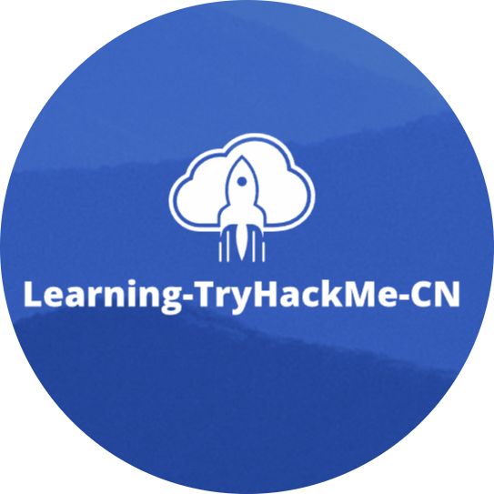

# Welcome(欢迎)

<figure><picture><source srcset=".gitbook/assets/Snipaste_2025-01-05_22-29-34-modified.png" media="(prefers-color-scheme: dark)"></picture><figcaption></figcaption></figure>

本项目GitHub链接：[https://github.com/Hekeatsll/Learning-TryHackMe-CN](https://github.com/Hekeatsll/Learning-TryHackMe-CN)

<figure><figcaption></figcaption></figure>

TryHackMe官网链接：[https://tryhackme.com](https://tryhackme.com/room/defensivesecurity)

"TryHackMe" 是一个在线平台，它为学习和教育网络安全提供了一种互动且实用的方法，该平台主要面向所有知识水平的个人或组织，从网络安全初学者到高级安全从业人员，THM为用户提供了一个安全的在线环境，以便他们学习各种网络安全技能和概念并进行知识点实践。

下面是对 "TryHackMe" 的一些主要特点的简要介绍：

1. 虚拟房间（Rooms）: TryHackMe 的核心特征之一就是其“房间”概念，这些房间是围绕特定主题或挑战而设计的虚拟环境；这些房间覆盖了从基本的网络安全知识到高级渗透测试技巧的广泛主题。
2. 实践导向的学习: 该平台鼓励通过实际操作来学习，用户可以在安全的虚拟环境中实践攻击技术和防御策略，而无需担心法律后果或损害真实系统。
3. 学习路径（Learning Paths）: 对于希望系统学习某一领域知识的用户，TryHackMe 提供了结构化的学习路径；这些路径涵盖了从初级到高级的各种主题，如渗透测试、Web应用程序安全、恶意软件分析等。
4. 社区和竞赛: TryHackMe 拥有一个活跃的在线社区，用户可以在其中分享经验、解决方案和挑战。此外，平台会定期举办竞赛和活动，让用户在实际情景中测试和提高他们的技能。
5. 适合所有水平的用户: 不论你是刚开始接触网络安全的新手，还是经验丰富的专业人士，TryHackMe 都提供了相应的资源和挑战来满足不同水平的学习需求。
6. 教育资源: 该平台还提供教育资源，包括详细的指南和教程，帮助用户理解和完成挑战。

总的来说，TryHackMe 是一个非常适合任何对网络安全感兴趣的人的学习平台，无论用户的技能水平如何，他们都可以在线进行实践操作和各种挑战，TryHackMe 为用户提供了一个有趣且富有成效的网络安全在线学习环境。
