# ☑ Introductory Networking(网络基础介绍)

TryHackMe实验房间链接：[https://tryhackme.com/room/introtonetworking](https://tryhackme.com/room/introtonetworking)

## 简介

本文将向初学者介绍关于网络的基本原理，网络是一个庞大的话题，所以此处只做一些简短的概述，仅提供一些有关Networking的基础知识介绍。

我们将讨论的主题是：

* OSI模型
* TCP/IP 模型
* 关于OSI模型、TCP/IP模型的实际表现形式(此部分可参考以下WP的第五小节-用Wireshark分析捕获的数据包：[https://gitlab.com/dhiksec/tryhackme/-/tree/master/Introductory%20Networking](https://gitlab.com/dhiksec/tryhackme/-/tree/master/Introductory%20Networking))
* 介绍一些基本的网络工具

## OSI模型：概述

OSI（开放系统互连）模型是一种标准化模型，我们一般用它来演示计算机网络背后的理论--所以该模型也被称为OSI参考模型。

OSI模型在现实网络中是一种比TCP/IP 模型更紧凑的分层体系结构模型，从许多方面来说，OSI 模型相比于TCP/IP 模型更容易理解。

OSI 模型由七层组成：

<figure>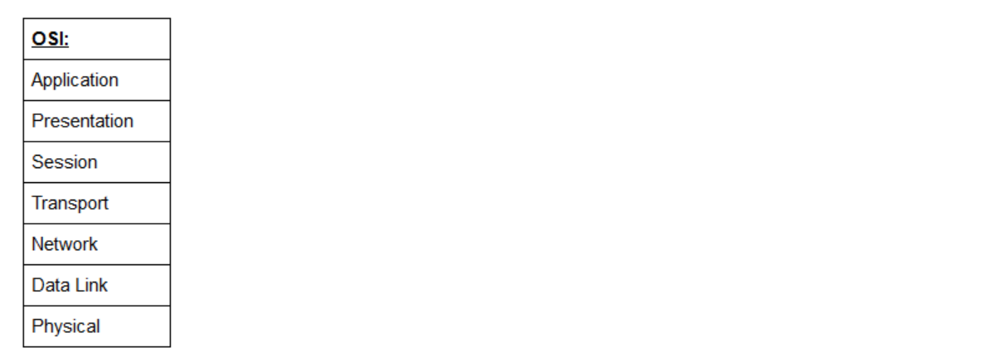<figcaption></figcaption></figure>

让我们简单了解一下OSI模型的每一层：

**第 7 层——应用层（Application）：**

OSI 模型的应用层本质上是为计算机上运行的程序提供网络选项，应用层几乎只与应用程序一起工作，为它们提供一个接口来传输数据；当数据被提供给应用层后，这些数据接下来就会向下传递给表示层。

**第 6 层——表示层（Presentation）：**

表示层从应用层接收数据，这些数据往往会采用本机中的应用程序可以理解的格式，但不一定采用接收方计算机中的应用层可以理解的标准化格式；表示层会将数据转换为标准化格式，并处理对数据的任何加密、压缩或其他转换过程，当表示层完成数据处理后，这些数据将向下传递到会话层。

**第 5 层——会话层（Session）：**

当会话层从表示层接收到格式正确的数据时，它会查看是否可以通过网络与另一台计算机建立连接，如果不能，则它会发回一个错误，并且该过程不会继续进行；如果可以建立会话，那么会话层的工作就是维护所建立的会话，并与远程计算机的会话层合作以同步通信。

会话层特别重要，因为它创建的会话对于所讨论的通信是唯一的，这就能够允许你同时向不同端点发出多个请求而不会混淆所有数据(例子：同时在 Web 浏览器中打开两个选项卡而不会出现网页响应错误)，当会话层成功建立主机和远程计算机之间的连接后，数据将向下传递到第 4 层--传输层。

**第 4 层——传输层（Transport）：**

传输层是一个非常有趣的层，它提供了许多重要的功能，它的第一个目的是选择传输数据的协议，传输层最常见的两种协议是TCP（传输控制协议）和UDP（用户数据报协议）； 使用 TCP协议时，传输是基于连接的，这意味着在请求期间要建立并维护计算机之间的连接，这允许进行可靠的传输，因为成功建立的连接可用于确保数据包全部到达正确的位置，TCP 连接允许两台计算机保持持续通信，以确保以可接受的速度发送数据，并能重新发送任何丢失的数据；而使用UDP传输，情况则正好相反，数据包基本上会被直接扔到接收方计算机上——如果接收方不能及时接收数据，那就是接收方的问题（这就是为什么如果网络连接不佳，进行类似 Skype 的视频传输时 可能会导致画面像素化）。

总而言之：TCP 通常会被选择用于传输精度高于速度的情况（例如文件传输或加载网页），而 UDP 将用于速度需求更重要的情况（例如视频流）。

选择了所使用的传输协议后，传输层会将数据传输分成小块进行（在 TCP 上称为数据段，在 UDP 上称为数据报），这使得成功传输消息变得更加容易。

**第 3 层——网络层（Network）：**

网络层负责定位关于你的请求的目的地，互联网是一个巨大的网络，当你想从某个网页请求信息时，网络层则会获取相关页面的 IP 地址并找出最佳路由（进行逻辑寻址）；在这个阶段，我们正在使用的仍然是由软件控制的所谓逻辑地址（即 IP 地址），逻辑地址可用于为网络提供秩序，它能对网络进行分类从而允许我们对它们进行适当的排序，目前最常见的逻辑地址形式是 IPV4 格式，你对此可能比较熟悉（如 192.168.1.1 是家用路由器的常用地址，192.168.1.1就是典型的IPV4格式）。

**第 2 层——数据链路层（Data Link）：**

数据链路层侧重于传输过程中的物理寻址，它从网络层接收数据包（包括远程计算机的 IP 地址）并添加接收端点的物理 (MAC) 地址；每台启用网络的计算机内部都有一个网络接口卡 (NIC)，它带有一个唯一的 MAC（媒体访问控制）地址以供识别；MAC 地址由制造商设置并直接烧入卡中，它们无法被更改——尽管它们可以被欺骗，当通过网络发送信息时，实际上是根据物理地址来确定将信息发送到哪里。

此外，以适合传输的格式呈现数据也是数据链路层的工作。

数据链路层在接收数据时也起着重要的作用，因为它会检查接收到的信息以确保它在传输过程中没有被破坏，这很可能发生在数据向第 1 层（物理层）传输时。

**第 1 层——物理层（Physical）：**

物理层直接涉及到计算机的硬件，这一层是 在网络中传输的构成数据的电脉冲信号 被发送和接收的地方。

物理层的工作是将传输过程中的二进制数据转换为电信号并通过网络进行传输，以及接收传入的电信号并将其转换回二进制数据。

### **答题**

_tips：对于下面问题中涉及OSI层级的部分，请使用层数 (1-7) 回答。_

<figure>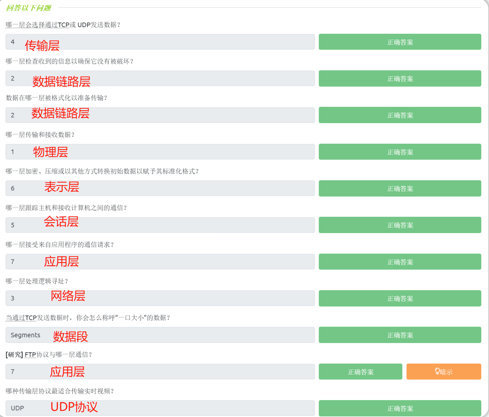<figcaption></figcaption></figure>

## 数据封装

随着数据向下传递到模型的每一层，包含特定于相关层的详细信息的header会被添加到所传输的数据的开头部分。

例如，网络层添加的header将包括源和目标 IP 地址之类的内容，而传输层添加的header将包括（除其他事项外）特定于所使用的协议的信息。

数据链路层还会在所传输的数据末尾添加一部分内容（trailer），用于验证数据在传输时没有被破坏，这有增加安全性的额外好处，因为如果不破坏trailer就无法拦截和篡改数据。

以上整个过程被称为封装，在这个过程中：数据可以从一台计算机发送到另一台计算机。

<figure>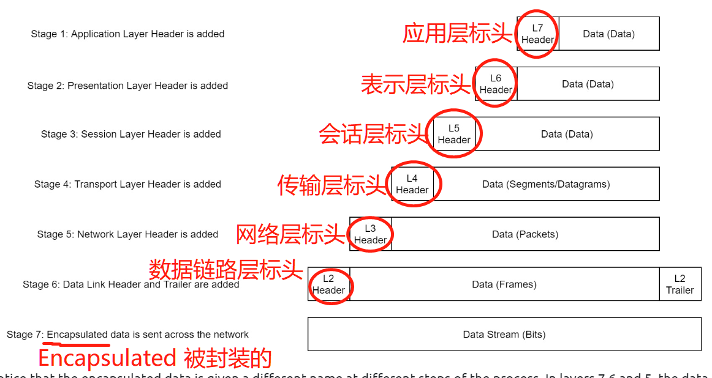<figcaption></figcaption></figure>

请注意，封装的数据在以上流程的不同步骤中被赋予了不同的名称：在第 7,6 和 5 层中，数据被简称为data，在传输层中，封装的数据被称为数据段或数据报（取决于选择TCP 还是 UDP 作为传输协议），在网络层，数据被称为数据包，接着当数据包向下传递到数据链路层时，它就变成了一个数据帧，而当它通过网络传输时，数据帧会被分解成比特（bites）。

当第二台计算机接收到消息时，它会反转刚才的传输过程——从物理层开始，一直向上直到数据到达应用层，在传递过程中会剥离之前添加的信息，这个过程被称为解封装；因此，我们可以将 OSI 模型中的分层（Layers） 视为存在于每台具有网络功能的计算机中，虽然实际上这种说法并没有那么明确，但计算机都会遵循相同的封装过程来发送数据并将在接收数据时进行解封装。

数据的封装和解封装过程非常重要——这不仅因为它们的实际用途，还因为它们为我们提供了一种发送数据的标准化方法。所有数据传输将始终遵循相同的方法，允许任何启用网络的设备向任何其他可访问网络的设备 发送请求并确保请求会被理解——无论这些设备是否来自于同一制造商、是否使用相同的操作系统......

### **答题**

阅读本小节内容，并回答以下问题。

<figure>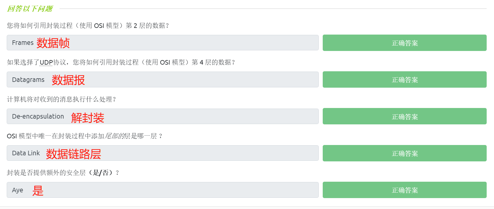<figcaption></figcaption></figure>

## TCP/IP模型

TCP/IP 模型在许多方面与 OSI 模型非常相似，是现实世界网络的基础。

TCP/IP 模型由四层组成——应用层(Application)、传输层(Transport)、网际层(Internet )和网络接口层(Network Interface)，它们涵盖了与 OSI 七层模型相同的功能范围。

<figure>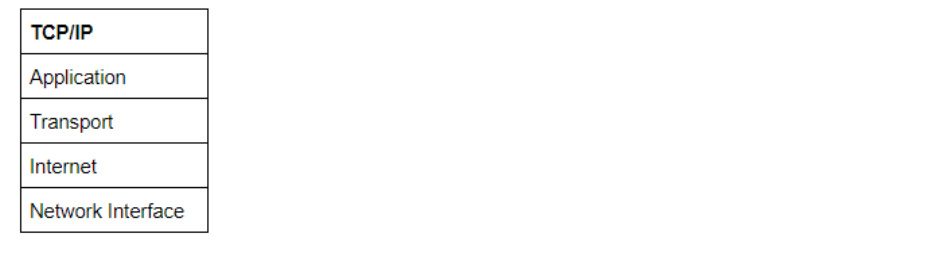<figcaption></figcaption></figure>

**注意**：一些资料会将 TCP/IP 模型分为五层——将上图中的网络接口层再分为数据链路层和物理层（与 OSI 模型中的数据链路层和物理层一样）；TCP/IP五层模型也是公认的、众所周知的，但是，它没有被正式定义（与 RFC1122 中定义的原始四层模型不同）；TCP/IP模型具体有几层，主要取决于你选择使用哪个版本——无论是四层TCP/IP模型 还是 五层TCP/IP模型，通常都被认为是有效的。

如果 OSI 模型实际上并未用于现实世界中的任何事物，那么你就有理由问我们为什么要费心使用 OSI 模型？这个问题的答案很简单：OSI 模型（由于比 TCP/IP 模型更精简和更严格）往往更容易让学习者学习网络的初始理论。

OSI模型与TCP/IP模型的匹配情况如下：

<figure>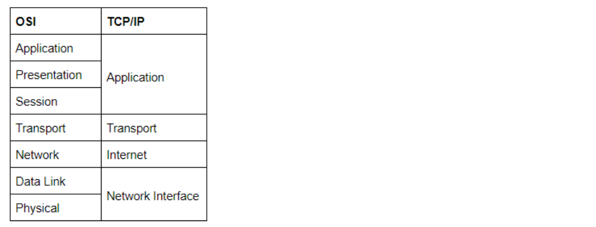<figcaption></figcaption></figure>

数据的封装和解封装过程在 TCP/IP 模型中的工作方式与在 OSI 模型中的工作方式完全相同，在 TCP/IP 模型的每一层，都会有一个报头在封装期间被添加，并在解封装期间被移除。

分层模型非常适合辅助教学，它向我们展示了如何封装数据并通过网络发送数据的一般过程，但这个过程实际上是如何发生的呢？

当我们谈论 TCP/IP 时，也许会想到一个包含四层的分层模型，但TCP/IP实际上也是一套协议——协议是定义如何执行操作的规则集。TCP/IP 的名称来源于两个重要的协议：一个是传输控制协议（我们之前在 OSI 模型中提到过），英文缩写为TCP，它用于控制两个端点之间的数据流；另外一个是 Internet 协议，英文缩写为IP，它控制数据包的寻址方式和发送方式。 构成 TCP/IP 套件的协议还有很多，我们将在后面继续介绍其中的一些内容。

接下来我们将介绍TCP，如前所述，TCP 是一种基于连接的协议，换句话说，在通过 TCP 发送任何数据之前，必须先在两台计算机之间建立稳定的连接，而形成这种连接的过程被称为TCP三次握手。

当你尝试建立连接时，你的计算机会首先向远程服务器发送一个特殊请求，表明它想要初始化一个连接，此请求包含了被称为 SYN位（SYN是“synchronise”的缩写，含义是：同步）的东西，这实际上是在开始建立连接过程时 所进行的第一次接触；然后服务器将响应一个包含 SYN 位的数据包，同时还包含了一个称为 ACK 的“acknowledgement(确认)”位；最后，你的计算机将继续发送一个包含 ACK 位的数据包，以确认连接已成功建立。随着TCP三次握手的成功完成，两台计算机之间就可以可靠地传输数据了，而且任何在传输过程中丢失或损坏的数据都会被重新发送，从而导致TCP连接看起来是无损的。

<figure>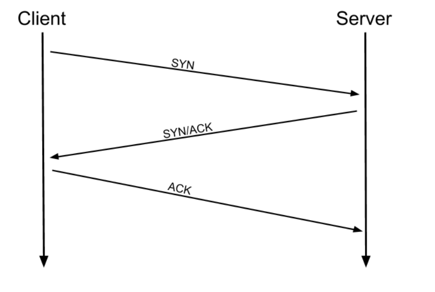<figcaption></figcaption></figure>

**注意**：本文不打算逐步深入探讨TCP是如何工作的，在本文中——我们知道在使用 TCP 建立连接之前必须执行三次握手就足够了。

**关于两种分层模型的历史**：准确理解最初创建 TCP/IP 模型 和 OSI 模型的原因很重要。一开始计算机界没有标准化模型——不同的制造商都遵循他们自己的方法来规划网络，因此不同制造商制造的系统在网络方面完全不兼容；为了解决网络不兼容的问题，美国国防部于 1982 年引入了TCP/IP 模型，以提供一个统一标准——供所有不同制造商共同遵循的标准；后来国际标准化组织（ISO）引入了OSI模型，但是，OSI模型主要用作一个更全面的学习指南，因此 TCP/IP 模型仍然是现代网络理论所基于的标准。

### **答题**

阅读本小节内容，并回答以下问题。

<figure>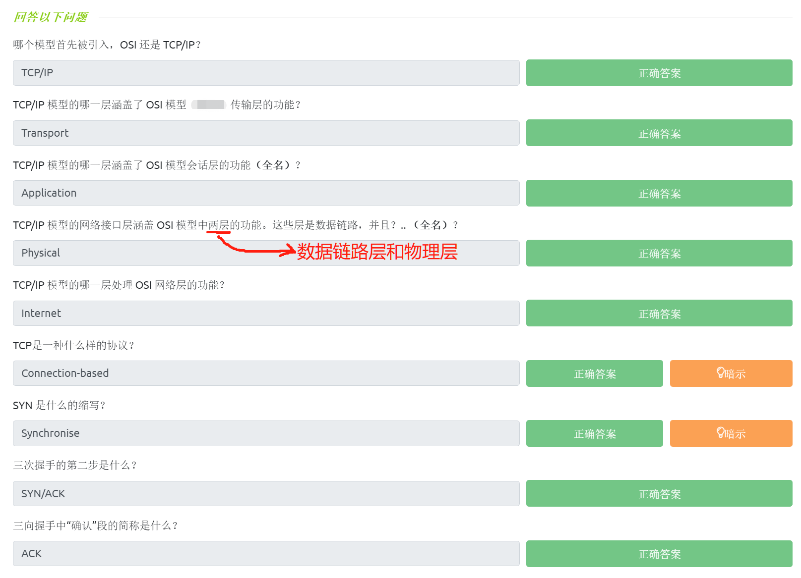<figcaption></figcaption></figure>

## 网络工具-Ping

接下来我们将了解一些可以在实际应用中使用的命令行网络工具，这些工具也可以在其他操作系统上运行，但为了简单起见，此处以Linux操作系统环境为例。

我们要了解的第一个命令行工具是 `ping` 。

当我们想要测试是否可以连接到远程资源时，可以使用 `ping` 命令，这里的远程资源通常说的是 Internet 上的网站，但如果你想检查某些计算机是否配置正确，`ping`命令的目标也可以是你的家庭网络上的计算机。

`ping`命令将使用 ICMP 协议进行工作，这是前面提到的不太为人所知的 TCP/IP 协议之一，ICMP 协议在 OSI 模型的网络层中工作，也就是在 TCP/IP 模型的网际层工作。

`ping` 的基本语法是 `ping <target>`，在以下示例中，我们使用 `ping` 来测试是否可以连接到Google网站：

<figure><figcaption></figcaption></figure>

请注意，`ping`命令实际上返回了它所连接的 Google 服务器的 IP 地址，而不是所请求的 URL；`ping`命令是一个方便的辅助应用程序，因为它可以用于确定托管网站的服务器的 IP 地址，`ping`的另一优势是它对于任何支持网络的设备来说几乎都有效，所有操作系统开箱即用地支持它，甚至大多数嵌入式设备也可以使用 `ping` 。

### **答题**

_tips：任何关于语法的问题都可以使用 `ping` 的手册页来回答（在Linux 上输入 `man ping`）。_

<figure>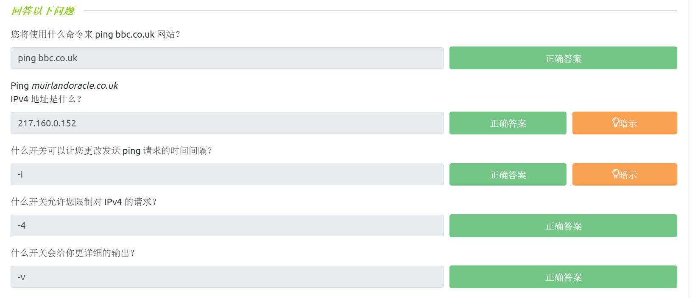<figcaption></figcaption></figure>

相关操作截图（在Linux 上输入 `man ping`）：

<figure>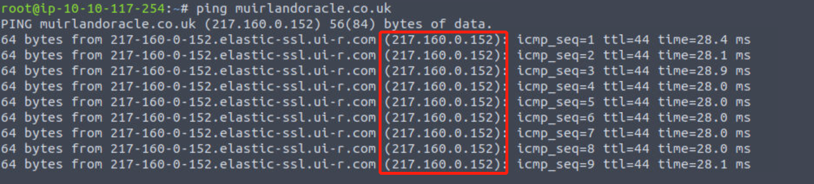<figcaption></figcaption></figure>

<figure>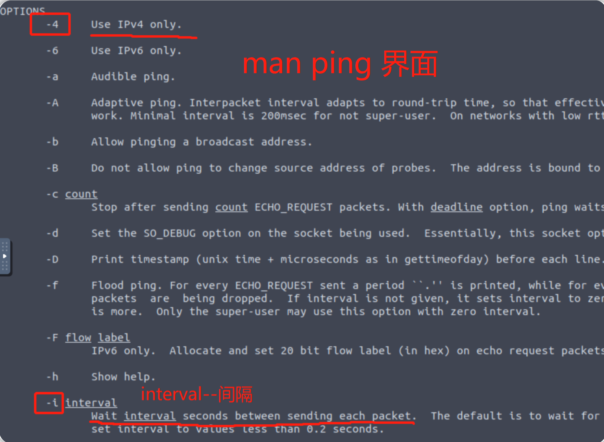<figcaption></figcaption></figure>

<figure>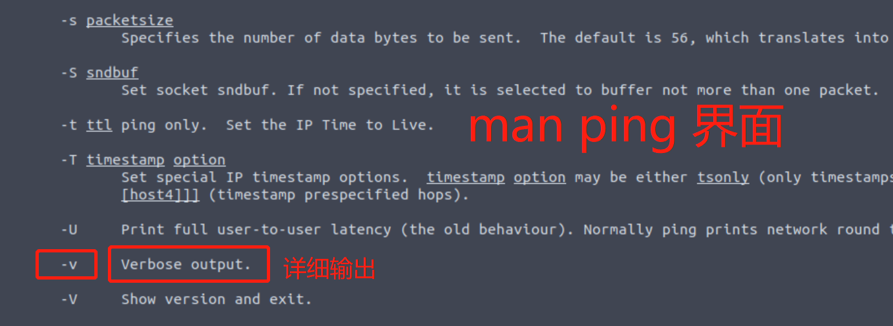<figcaption></figcaption></figure>

## 网络工具-Traceroute

`ping` 命令的逻辑后续是“**traceroute**”，**traceroute**可用于映射 你的请求在前往目标机器时所采用的路径。

互联网由许许多多不同的服务器和端点组成，它们都相互联网，这意味着，为了获得你真正想要的内容，你首先需要通过一堆其他服务器；而**traceroute**将允许你查看你所经过的网络连接中的每一个点——它允许你查看你的计算机和你所请求的资源之间的每个中间连接步骤。

Linux 上 **traceroute** 的基本语法是：`traceroute <destination>`

在默认情况下，Windows系统上的 **traceroute** 实用程序 (在cmd中使用`tracert`) 与 `ping`命令都基于ICMP协议运行，而Unix系统上的**traceroute**等效程序则通过UDP协议运行；在两种情况下都可以使用参数开关修饰**traceroute**。(Linux是类Unix系统，在终端中使用 `traceroute`)

<figure>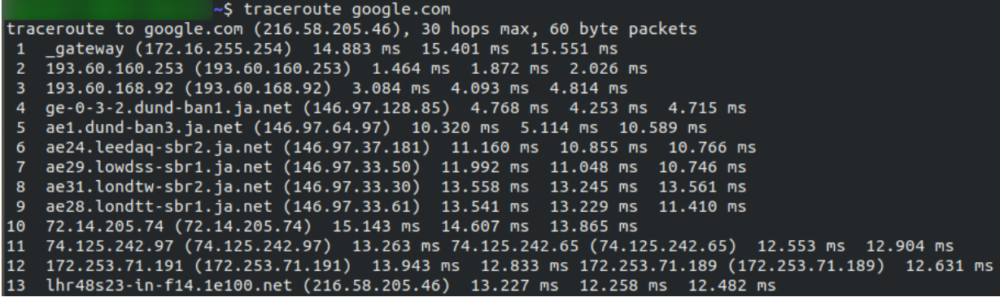<figcaption></figcaption></figure>

由上图可以看到：从本地的路由器 (\_gateway) 到达位于 216.58.205.46 的 Google 服务器需要 13 跳(hops)。

### **答题**

_tips：所有关于参数开关的问题都可以在 traceroute 的手册页中找到答案（在Linux 上输入`man traceroute`）_

<figure>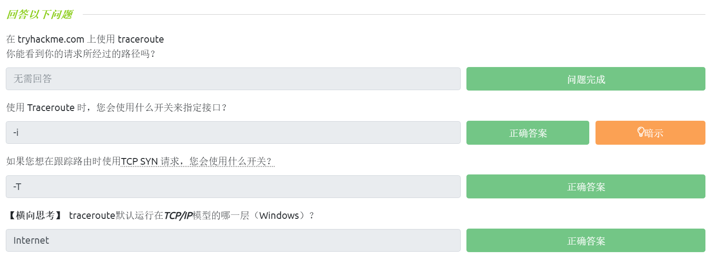<figcaption></figcaption></figure>

相关操作截图（在Linux 上输入`man traceroute`）：

<figure>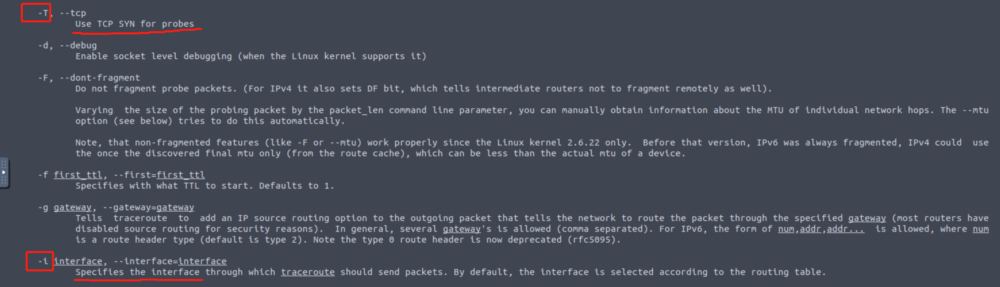<figcaption></figcaption></figure>

## 网络工具-WHOIS

域名(Domain Names)——互联网的无名救世主，你能想象记住要访问的每个网站的 IP 地址是什么感觉吗？ 这是一个可怕的想法，好在我们可以使用域名。

我们将在下一小节中更多地讨论域名是如何工作的，但在本节中我们知道域名能够转换为IP地址就足够了（例如，我们可以在浏览器中输入tryhackme.com去访问和此域名相关的网站，而不需要输入TryHackMe的具体IP地址）；域名由被称为域名注册商的公司所出租，如果你想要得到一个域名，你可以去注册商处进行注册，然后就能租用该域名一段时间了。

我们可以使用whois 查询域名由谁注册，你可能会从whois查询中获得大量信息（由于个人信息可能会被隐藏处理，因此whois查询也可能会提供很少有效信息）。

如果你不喜欢使用命令行工具(`whois`)，也可以选择使用在线whois工具：[https://www.whois.com/whois/](https://www.whois.com/whois/)

**注意**：在使用whois前，我们可能需要先进行工具安装操作，在基于Debian的系统上，这可以通过 `sudo apt update && sudo apt-get install whois` 命令来完成。

Whois 查询非常容易执行，只需使用命令`whois <domain>`即可获取有关域名注册的可用信息列表：

<figure>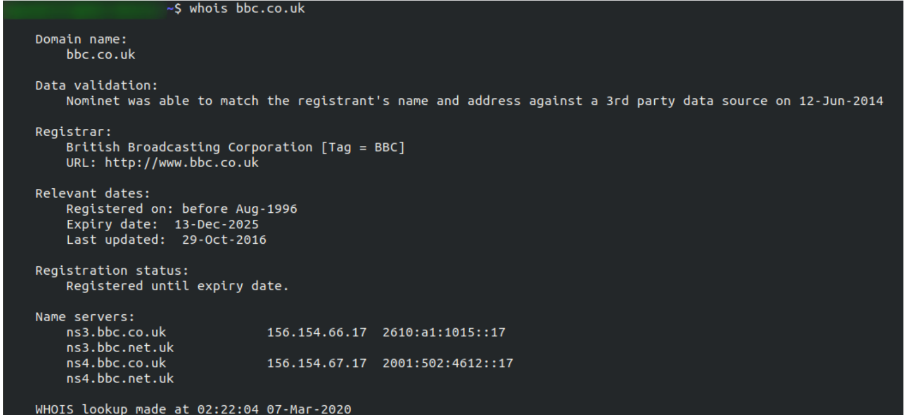<figcaption></figcaption></figure>

观察上图：这是经常可以找到的相对非常少量的信息，我们已经获得了目标的域名、注册该域名的公司、上次续订时间、下一次到期时间，以及有关名称服务器的一些信息。

### **答题**

阅读本小节内容，并回答以下问题。

<figure>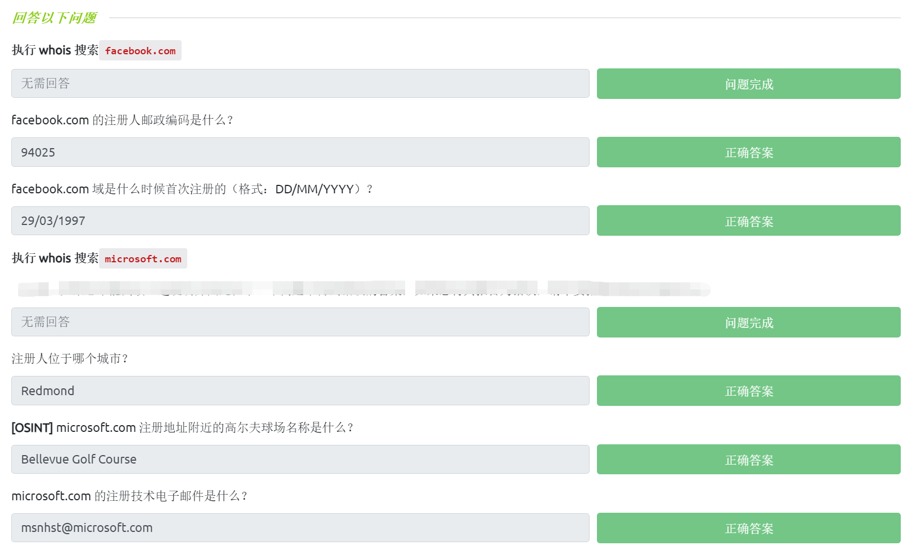<figcaption></figcaption></figure>

操作截图（使用在线查询：[https://www.whois.com/whois/ ](https://www.whois.com/whois/)）

<figure>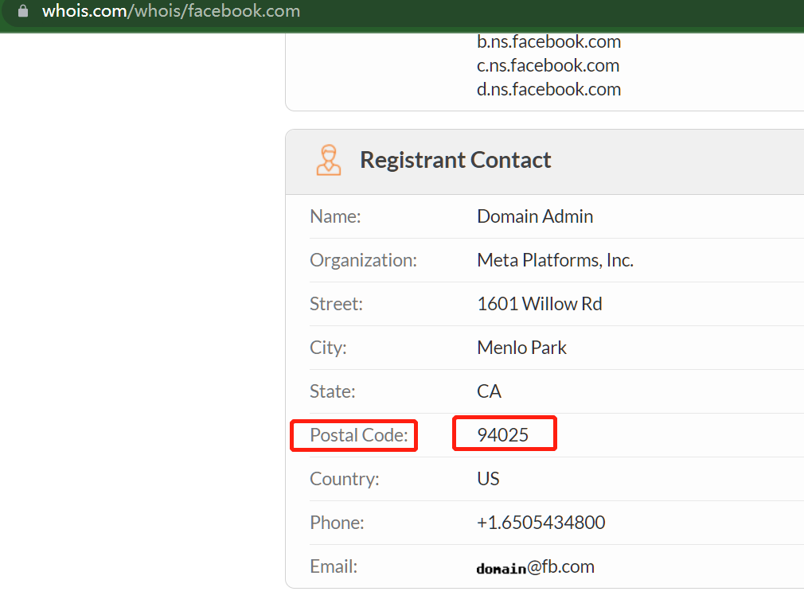<figcaption></figcaption></figure>

<figure>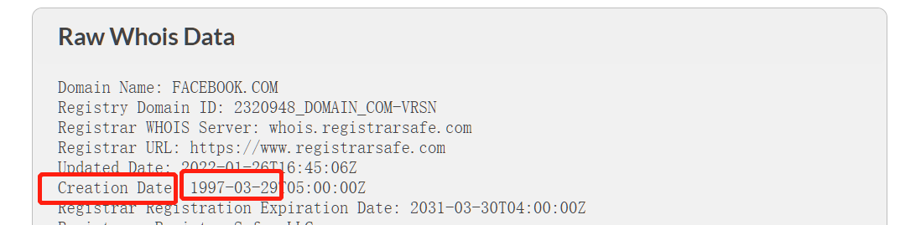<figcaption></figcaption></figure>

<figure>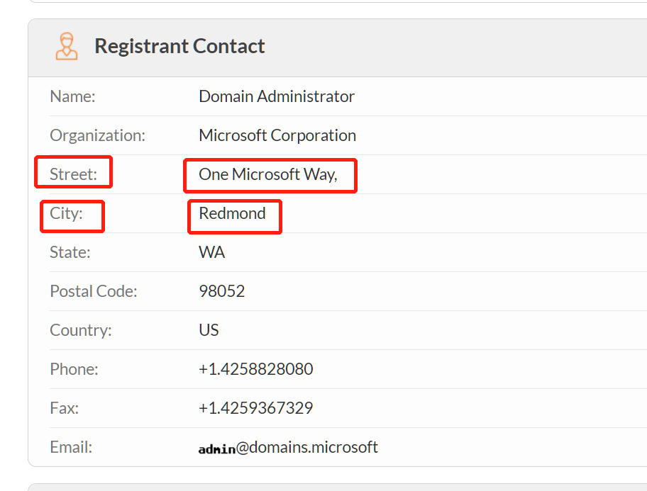<figcaption></figcaption></figure>

<figure><figcaption></figcaption></figure>

<figure>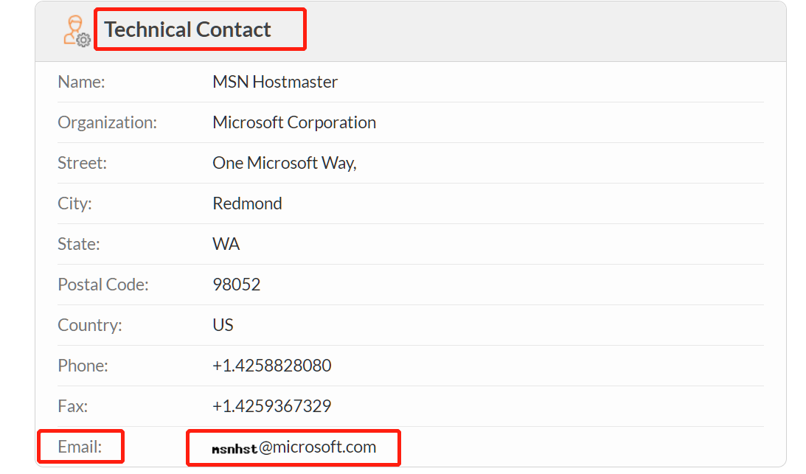<figcaption></figcaption></figure>

## 网络工具-Dig

我们在上一小节中谈到了域——现在让我们谈谈它们是如何工作的。

有没有想过如何将 URL 转换为你的计算机可以理解的 IP 地址？ 答案是使用被称为 DNS（域名系统-Domain Name System）的TCP/IP协议。

简言之，DNS允许我们请求一个特殊的服务器，以此为我们提供 我们试图访问的网站的IP地址。例如，如果我们向 [www.google.com](https://www.google.com) 发出请求，我们的计算机会首先向一个特殊的DNS服务器发送请求(你的计算机知道如何找到它)，然后DNS服务器会寻找到Google的IP地址并将其发回给我们，然后我们的计算机就可以将请求发送到Google服务器的IP。

让我们对以上过程进行分解。

我们向目标网站发出请求，本地计算机所做的第一件事情是检查本地缓存，查看缓存中是否已经为目标网站存储了一个相关的 IP 地址；如果本地缓存中有目标IP，则可以直接将请求发送到目标ip，如果本地缓存中没有目标ip，则将进入流程的下一阶段。

假设在本地缓存中尚未找到目标ip地址，本地计算机将向所谓的递归(**recursive**) DNS 服务器发送请求，这些服务器自动为我们网络上的路由器所知，许多 Internet 服务提供商 (ISP) 都会维护自己的递归服务器，Google 和 OpenDNS 等公司也控制了一些递归服务器。本地计算机能够知道向何处发送信息请求：因为递归 DNS 服务器的详细信息已经存储在我们的路由器中。递归DNS服务器将维护流行域的结果缓存，但是，如果我们所请求的网站并没有存储在递归DNS服务器的缓存中，那么递归DNS服务器会将请求再传递给根名称DNS服务器。

2004 年之前，世界上正好有 13 个根名称 DNS 服务器，现在还有更多，但是，它们仍然可以使用 与分配给原始服务器相同的 13 个 IP 地址进行访问（为了保持平衡以便我们在发出请求时获得最近的服务器）。 根名称服务器会跟踪下一级的 DNS 服务器，然后选择一个合适的服务器并将我们的请求重定向到该服务器，这些相比于根名称服务器的较低级别的服务器被称为顶级域服务器。

顶级域 (TLD-Top-Level Domain) 服务器被拆分为多个扩展。例如，如果我们正在搜索 tryhackme.com，我们的请求将被重定向到处理`.com`域的 TLD 服务器；如果我们正在搜索 bbc.co.uk，我们的请求将被重定向到处理 `.co.uk`域的 TLD 服务器。与根名称服务器一样，TLD 服务器也会继续跟踪下一级：权威名称服务器(Authoritative name servers)，当 TLD 服务器收到我们的信息请求时，服务器会将其传递给适当的权威名称服务器。

权威名称服务器用于直接存储域的 DNS 记录。换句话说，世界上的每个域都将其 DNS 记录存储在某个地方的权威名称服务器上，它们是信息的来源。当我们的请求到达我们正在查询的域的权威名称服务器时，它就会将相关信息发回给我们，从而允许我们的计算机连接到我们所请求的域对应的 IP 地址。

当我们在web浏览器中访问网站时，以上一切过程都会自动发生，但我们也可以使用名为`dig` 的工具来手动完成，与`ping`和`traceroute`一样，`dig`也可以在 Linux 系统上进行安装。

`dig`允许我们手动查询我们所选择的递归 DNS 服务器以获取有关域的信息：`dig <domain> @<dns-server-ip>`

这是一个非常有用的网络故障排除工具。

<figure>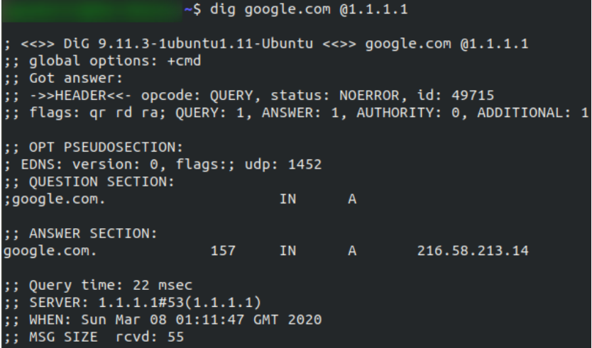<figcaption></figcaption></figure>

执行dig命令之后，我们得到了很多信息，我们发送了一个查询并成功（即无错误）收到了一个完整的答复——正如预期的那样，返回结果中会包含我们所查询的域名所对应的 IP 地址。

dig 能够提供给我们的另一个有趣信息是 查询到的 DNS 记录的 TTL（生存时间）。如前所述，当我们的计算机完成域名查询时，会将结果存储在本地缓存中，而DNS记录的 TTL 将告诉本地计算机何时停止将此DNS记录视为有效——即何时应该再次请求数据，而不是一直依赖于本地缓存的副本记录。

TTL 可以在dig返回结果中的“ANSWER section” 的第二列找到：

<figure>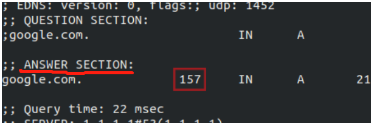<figcaption></figcaption></figure>

tips：重要的是要记住 TTL（在 DNS 缓存的上下文中）以秒为单位，因此上图示例中的DNS记录将在 2 分 37 秒后过期。

### **答题**

阅读本小节内容，并回答以下问题。

<figure>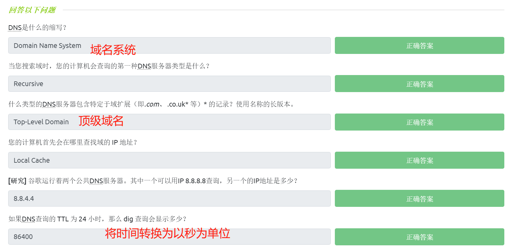<figcaption></figcaption></figure>

相关操作截图：

<figure>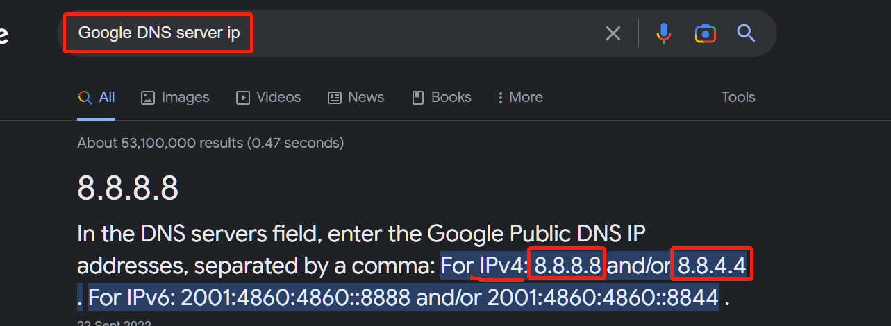<figcaption></figcaption></figure>
