# ☑ Introductory Researching(信息检索技巧介绍)

TryHackMe实验房间链接：[https://tryhackme.com/room/introtoresearch](https://tryhackme.com/room/introtoresearch)

## 简介

毫无疑问，有效的信息检索能力是网络安全人员最重要的素质之一，就其本质而言，网络安全攻击需要庞大的知识库——因为如果你不知道目标是如何工作的，你怎么能尝试破解它呢？ 问题是：没有人能够知道一切知识，每个人（专业或者业余，有经验或者纯萌新）都会遇到他们不知道如何去解决的问题，这就让信息检索技巧有了用武之地，因为在现实世界中，你永远不能指望能够很简单地就得到一些问题的答案，所以我们就需要进行一些信息检索操作。

随着经验水平的提高，你会发现你正在研究的东西的难度也会相应增加； 但是，请记住：在信息安全领域，永远不会出现 长期不需要进行任何信息检索的情况，你总会在某个时间点不得不使用你的信息检索能力。

在本文中我们将研究以下主题：

• 一个需要使用信息检索技巧的问题案例 • 关于漏洞搜索工具的简介 • Linux 手册页(Manual Pages)简介

**注意：建议手动完成本文所涉及的所有问题--以便能够对信息检索方法有一个初步的了解。**

## 一个信息检索示例

假设我们从远程目标服务器中下载了一个JPEG 图像，我们现在怀疑图像里面藏着一些数据，但我们怎么才能把这些可能存在的嵌入数据弄出来呢？

我们可以先在 Google搜索引擎 中搜索“hiding things inside images”：

<figure><figcaption></figcaption></figure>

上图查询结果中的第二个链接为我们提供了一项技术的名称：“隐写术”(Steganography)；我们可以单击该链接并阅读相关文档，它将教我们如何将数据隐藏在图像或者音频中。

我们已经大概了解了“隐写术”(Steganography)的概念，接下来让我们继续尝试寻找一种 能够从使用了隐写术的图像文件中提取嵌入数据的方法。

<figure><figcaption></figcaption></figure>

我们得到上图中的搜索结果，实际上在结果中的每个链接都能指向一些有用的东西：比如上图中的第一个链接包含了一系列关于隐写术的有用工具，而第二个链接是关于如何执行隐写术的更多说明......

让我们看一下上图查询结果中的第一个链接：[https://0xrick.github.io/lists/stego/](https://0xrick.github.io/lists/stego/)

<figure>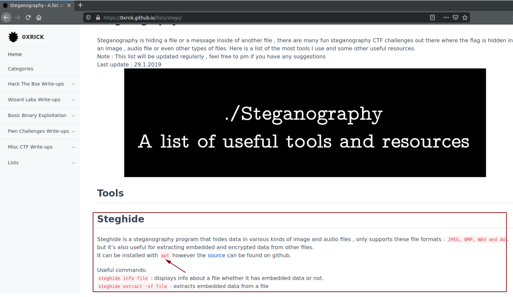<figcaption></figcaption></figure>

我们可以从上图中看到一个有用的工具-steghide-它可用于从JPEG等图像文件中提取嵌入数据；另外，以上页面还告诉我们可以使用“apt”命令来安装steghide 。

让我们继续搜索关于“apt”命令的信息：

<figure><figcaption></figcaption></figure>

由上图的查询结果可知：apt 是一个包管理器，它可以让我们在Ubuntu（或 Kali）等Linux发行版操作系统上安装工具。

那么我们应该如何使用 apt 来安装软件包？让我们继续进行信息检索：

<figure><figcaption></figcaption></figure>

由上图中的查询结果可知：我们可以使用 `sudo apt-get install <package name>`来安装工具。

我们之前已经知道要安装的包名为 steghide，现在让我们使用apt命令来安装steghide工具（在Linux系统中）：

<figure>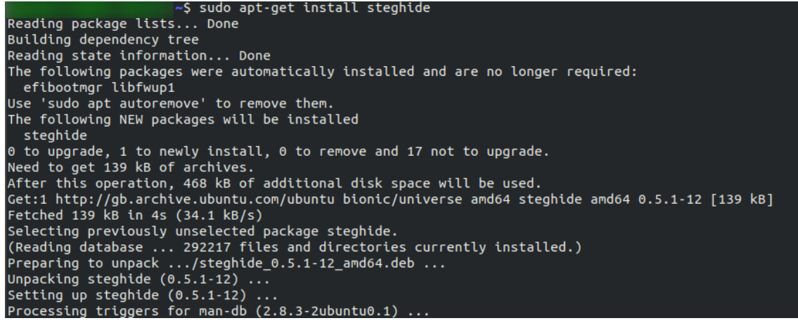<figcaption></figcaption></figure>

回到我们之前看到隐写术工具steghide的相关页面- https://0xrick.github.io/lists/stego/ ；我们可以看到一些关于如何使用steghide工具的说明。

<figure>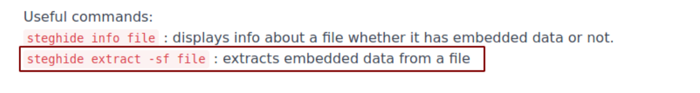<figcaption></figcaption></figure>

很好，现在整个信息检索流程已经结束了--我们已经知道如何从图像文件中提取嵌入数据。

注意：我们刚才是从零开始逐渐建立起我们完成整个信息检索过程的蓝图--我们首先有一个问题（如何从一张图片中提取数据），然后我们去搜索引擎中查找问题的答案，然后基于已经获取到的信息再次进行检索，直到我们完成所有需要的检索步骤并且最终找到解决问题的方案为止；这是一个很好的信息检索方法：从一个问题开始，再初步了解问题相关的信息，然后根据问题的进一步需要去检索更多的信息，直至找到问题的解决方案。

### 答题

现在让我们尝试使用信息检索技巧回答以下问题。

问题：在 Kali Linux 附带的 Burp Suite 程序中，你将使用什么模式手动发送请求（通常会多次重复捕获的请求）？

利用谷歌搜索引擎搜索 "manually send request burp suite"：

<figure>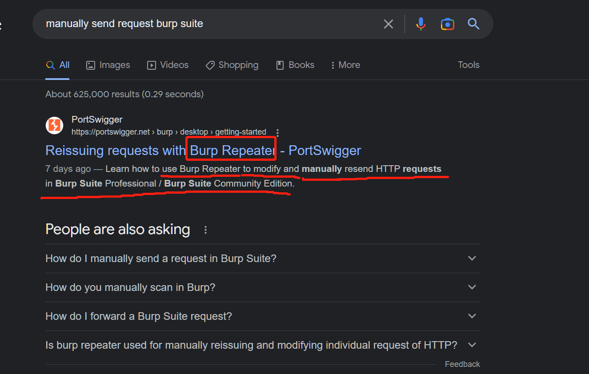<figcaption></figcaption></figure>

<figure>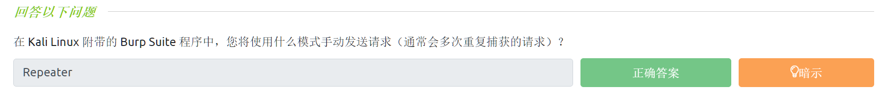<figcaption></figcaption></figure>

问题：现代 Windows 登录密码存储在什么哈希格式中？

利用谷歌搜索引擎搜索"hashing algorithm for windows"（下图结果用了翻译）：

<figure>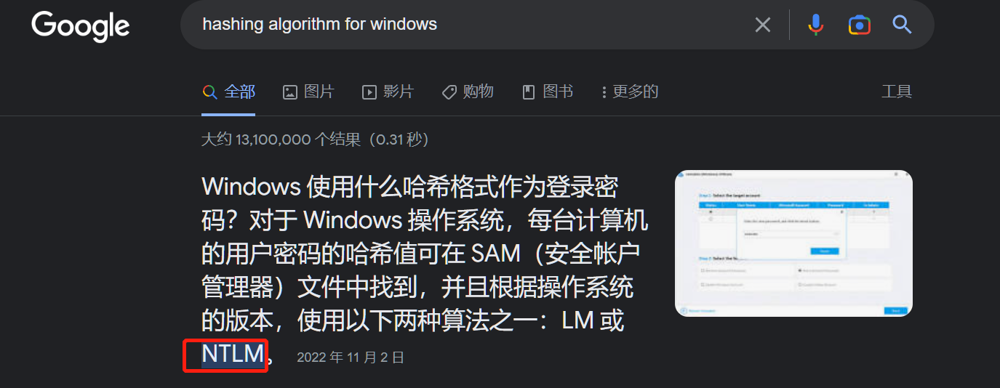<figcaption></figcaption></figure>

<figure><figcaption></figcaption></figure>

问题：Linux 中的自动化任务被称为什么？

利用谷歌搜索引擎搜索"automated tasks called in Linux"：

<figure><figcaption></figcaption></figure>

<figure><figcaption></figcaption></figure>

问题：你可以使用什么基数作为基数 2（二进制）的简写？

利用谷歌搜索引擎搜索" a shorthand for base 2 "：

<figure>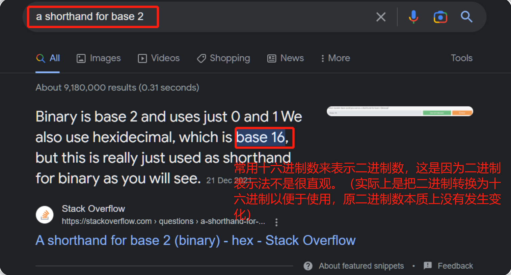<figcaption></figcaption></figure>

<figure>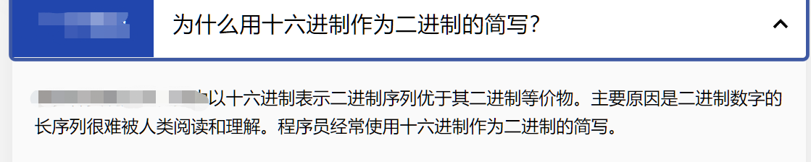<figcaption></figcaption></figure>

<figure>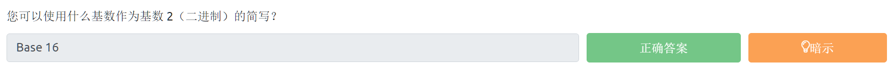<figcaption></figcaption></figure>

问题：如果密码哈希以 $6$ 开头，它是什么格式（Unix 变体）？

利用谷歌搜索引擎搜索" hash starts with $6$ "：

<figure>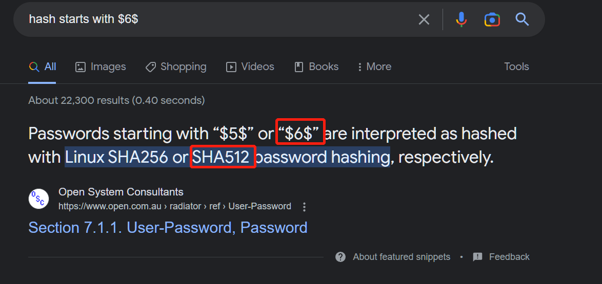<figcaption></figcaption></figure>

<figure>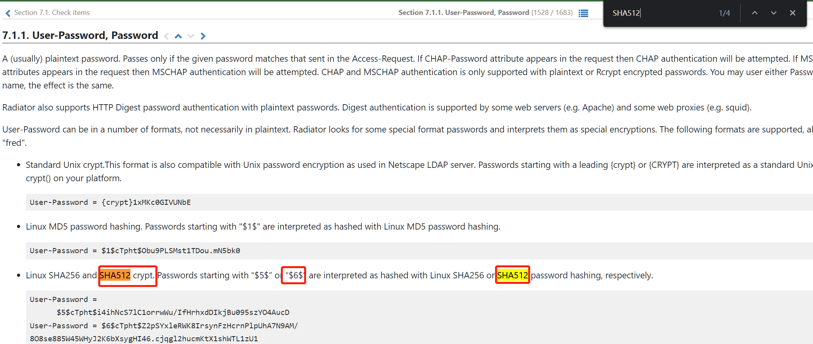<figcaption></figcaption></figure>

<figure>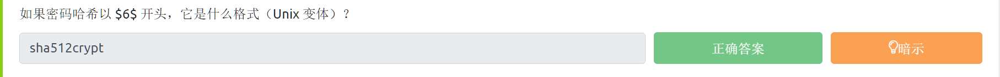<figcaption></figcaption></figure>

## 漏洞搜索工具介绍(检索漏洞信息)

在hack攻击中，你经常会遇到一些可能容易被利用（存在已知漏洞）的软件，例如，在现实环境下，网站开发者会经常使用 内容管理系统- Content Management Systems-CMS-（如 Wordpress、FuelCMS、Ghost 等CMS）来简化网站的设置，其中许多CMS系统都容易受到各种攻击（意思就是很多CMS系统都有相关的版本漏洞）；那么如果我们想利用特定软件的相关漏洞，我们应该去哪里寻找这些漏洞呢？

我们可以使用以下网站搜索漏洞信息：

* [ExploitDB](https://www.exploit-db.com/)
* [NVD](https://nvd.nist.gov/vuln/search)
* [CVE Mitre](https://cve.mitre.org/)

NVD会跟踪CVEs(**C**ommon **V**ulnerabilities and **E**xposures)--是否有公开可用的漏洞--因此，如果你正在研究特定软件中的漏洞，NVD会是一个非常好的能够用于信息检索的地方。

CVE 编号会采用以下形式表示：CVE-YEAR-IDNUMBER。

ExploitDB（漏洞利用数据库）往往也非常有用，因为它实际上包含了很多可以直接下载和使用的漏洞exp程序；当你在 CTF 或渗透测试中遇到目标软件时，这个数据库-ExploitDB-往往会是你进行漏洞相关的信息检索的第一站。

如果你倾向于使用 Linux 上的 CLI（命令行界面），你可以选择kali Linux，因为在 Kali 上往往会预装一个名为“searchsploit”的工具，这个工具允许你在自己的本地kali机器上 直接通过命令行界面搜索ExploitDB中的内容，searchsploit所使用的其实是一个离线版本的ExploitDB，也就是说：该工具是基于ExploitDB的离线版本来进行工作的而并非是使用在线的ExploitDB（漏洞利用数据库）。

让我们举个例子，假设我们正在进行CTF练习，我们遇到了一个网站有如下页面：

<figure>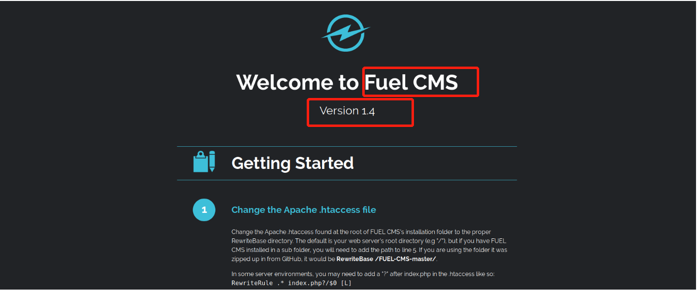<figcaption></figcaption></figure>

这个网站显然使用了FuelCMS（注意：通常情况下目标不会这么明显地让我们知道网站所使用的是哪种CMS）。

现在我们已经知道了目标组件，让我们在 ExploitDB 中搜索它。

_注意：我们可以在 Kali 中使用 CLI 工具-searchsploit，因为从工作流程的角度来看它往往更快——但是，你也可以使用ExploitDB 网站进行漏洞exp检索。_

在kali机的终端中输入`searchsploit fuel cms`命令 以搜索漏洞信息：

<figure>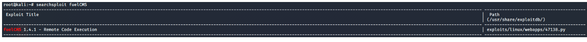<figcaption></figcaption></figure>

或者通过ExploitDB在线网站搜索fuelCMS的漏洞信息：

<figure>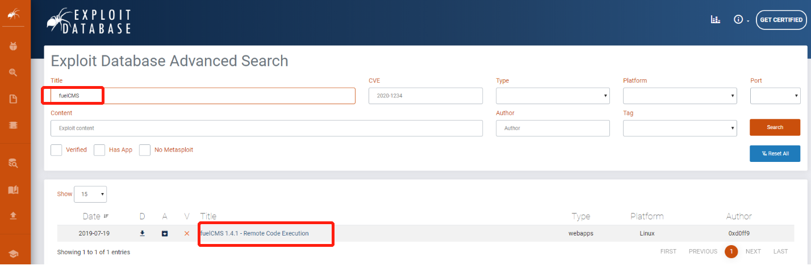<figcaption></figcaption></figure>

很好，我们已经得到了一个可以用来攻击目标网站的漏洞exp。

点击上图中的fuelCMS漏洞exp标题，我们会得到更多关于该漏洞exp的解释：

<figure><figcaption></figcaption></figure>

我们能够得知该漏洞exp对应的CVE编号：CVE-2018-16763 （注意格式-CVE-YEAR-NUMBER）

_tips： CVE 编号是在发现漏洞时分配的，而不是在公开漏洞时分配；请记住，如果是在年底发现漏洞，或者如果确认和修复漏洞的过程需要很长时间，那么CVE的正式发布日期可能会是被分配的CVE编号中日期的后一年(比如CVE-2019-18634的正式发布日期是在2020年)......_

### 答题

_tips:在线漏洞exp数据库-ExploitDB：_[_https://www.exploit-db.com/_](https://www.exploit-db.com/)

**问题：在WPForms 中发现的 2020 跨站点脚本 (XSS) 漏洞的CVE是什么？**

<figure>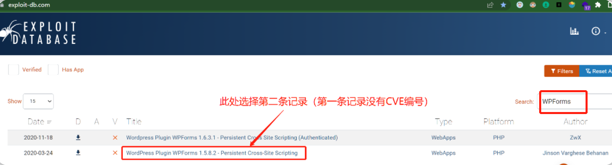<figcaption></figcaption></figure>

<figure>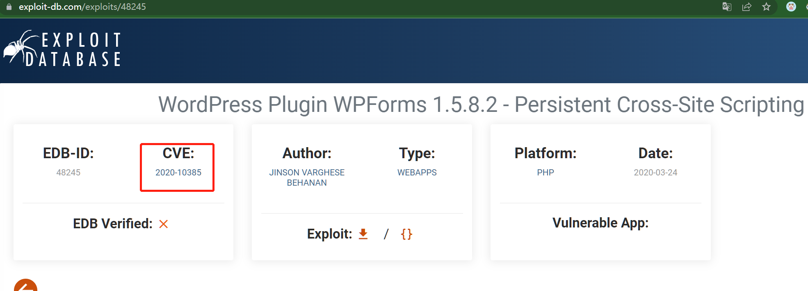<figcaption></figcaption></figure>

<figure><figcaption></figcaption></figure>

**问题：早在 2016 年，在Debian版本的Apache Tomcat中就发现了本地提权漏洞，此漏洞的CVE编号是什么？**

<figure>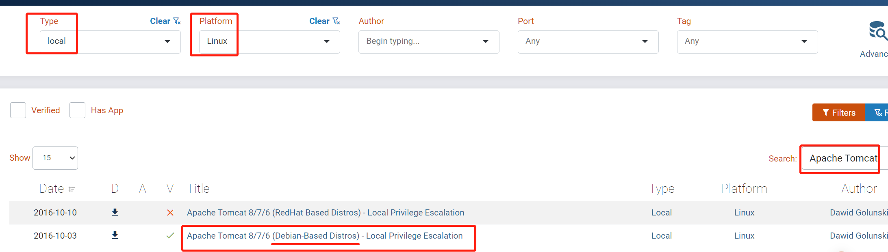<figcaption></figcaption></figure>

<figure>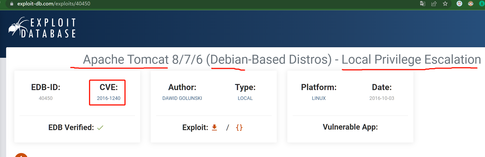<figcaption></figcaption></figure>

<figure><figcaption></figcaption></figure>

**问题：在 VLC 媒体播放器（VLC media player）中发现的第一个CVE是什么？**

<figure>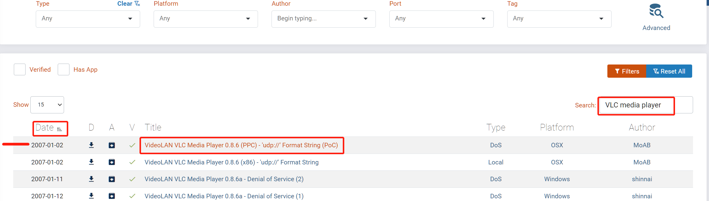<figcaption></figcaption></figure>

<figure>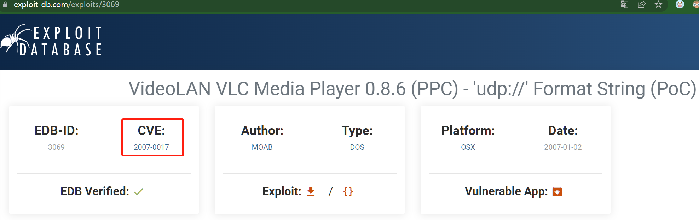<figcaption></figcaption></figure>

<figure><figcaption></figcaption></figure>

**问题：如果你想利用关于 sudo 程序的2020年公布的缓冲区溢出(Buffer Overflow)漏洞，你会使用哪个CVE ？**

<figure>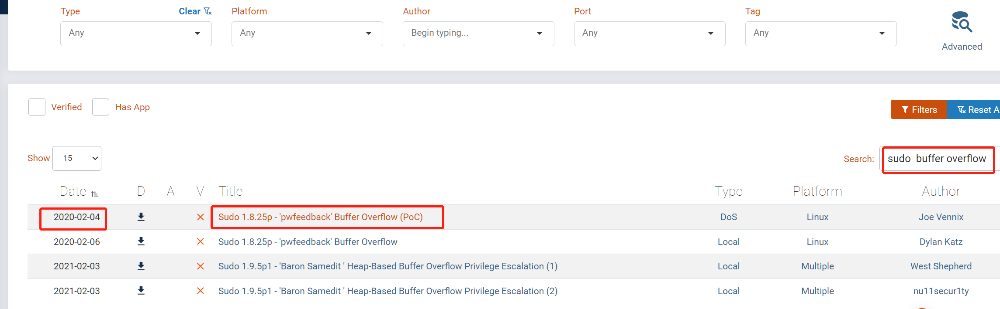<figcaption></figcaption></figure>

<figure>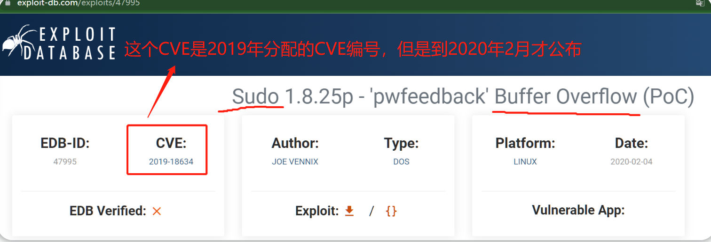<figcaption></figcaption></figure>

<figure><figcaption></figcaption></figure>

## Linux手册页介绍(检索CLI工具使用方法)

Linux（通常是 Kali Linux）无疑是hack攻击中使用最普遍的操作系统。

Linux中有一个内置的`man`命令，它可以让你直接在终端内访问大多数工具的手册页，当然，有时候你也会发现一些工具没有manual（手册）--这种情况比较少见；一般来说，当你不知道如何使用某个工具时， `man`命令往往会是你 用来检索某个工具的使用方法 的第一站。

假设我们想使用SSH工具连接远程计算机，但我们不知道ssh的相关语法，那么我们就可以尝试输入`man ssh`命令 来获取SSH的使用手册页：

<figure>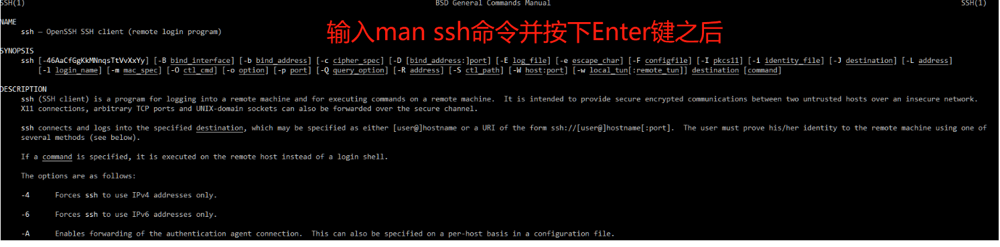<figcaption></figcaption></figure>

我们可以在描述中看到使用SSH的语法需要@符号：

<figure>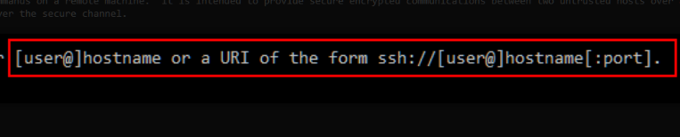<figcaption></figcaption></figure>

我们可以通过使用`man`命令 调出手册页来查找某个CLI工具能够用于执行特定操作的参数（关于参数的作用：比如当我们使用之前提到的steghide工具时，我们可以指定使用一些参数，然后steghide就会根据我们所提供的参数 来决定是从图像中提取数据 还是嵌入数据到图像中）。

如果你想显示SSH的版本号，你可以在ssh的`man` 手册中选择向下滚动页面 ，直到找到合适的参数：`-V`

<figure><figcaption></figcaption></figure>

然后我们使用上图中的参数：`ssh -V`

<figure>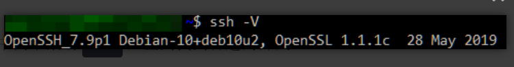<figcaption></figcaption></figure>

找到该参数的另一种方法是在 `man`命令中使用`grep`-这能让我们在ssh手册页面中搜索我们所需要的参数：`man ssh | grep -e "version number"`

<figure>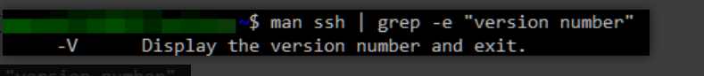<figcaption></figcaption></figure>

### 答题

问题：SCP 是一种用于将文件从一台计算机复制到另一台计算机的CLI工具，你将使用什么参数开关来复制整个目录？

在kali机终端界面中输入命令 `man scp | grep -e "copy"`

<figure>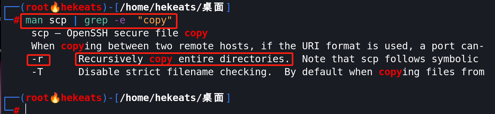<figcaption></figcaption></figure>

<figure>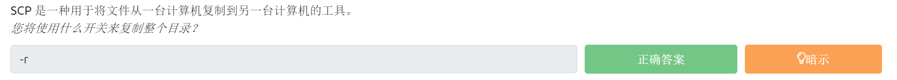<figcaption></figcaption></figure>

问题：fdisk 是一个用于查看和更改硬盘驱动器上使用的分区方案的命令，你将使用什么参数开关来列出当前分区？

在kali机终端界面中输入命令 `man fdisk | grep -e "list"`

<figure>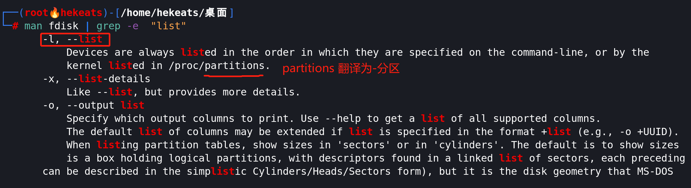<figcaption></figcaption></figure>

<figure>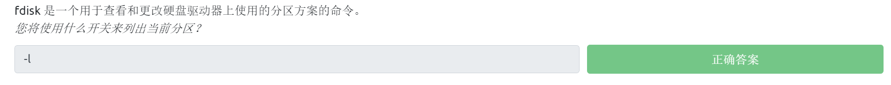<figcaption></figcaption></figure>

问题：nano 是一个易于使用的Linux文本编辑器，使用 nano 打开文件时，你会使用什么参数开关来进行备份？

在kali机终端界面中输入命令 `man nano | grep -e "backup"`

<figure>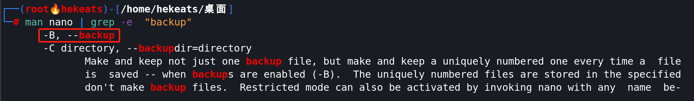<figcaption></figcaption></figure>

<figure><figcaption></figcaption></figure>

问题：netcat 是用于手动发送和接收网络请求的基本工具，你将使用什么命令以侦听模式启动 netcat，并侦听端口 12345？

在kali机终端界面中输入命令 `man netcat | grep -e "listen" -e "port"`

<figure>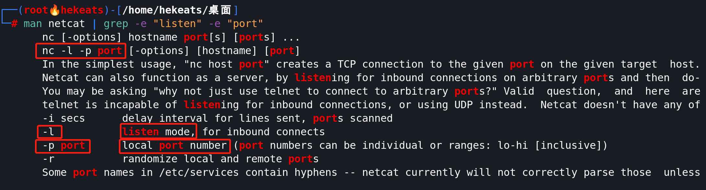<figcaption></figcaption></figure>

<figure><figcaption></figcaption></figure>
