# Nmap(Nmap工具使用简介)

TryHackMe实验房间链接：[https://tryhackme.com/room/furthernmap](https://tryhackme.com/room/furthernmap)

## 简介

在渗透测试中，知识就是力量，当我们对目标系统或网络了解越多，我们可用的方法就越多；因此，在尝试任何漏洞利用企图之前，必须进行适当的信息收集。

假设现在给了我们一个IP地址(或多个IP地址)来让我们执行安全审计，在我们做其他事情之前，我们需要先了解我们正在攻击的目标所处的环境；这意味着我们需要确定有哪些服务正在目标上运行，例如，某个目标机器可能正在运行web服务器，另一个目标机器可能正在充当Windows Active Directory域控制器等等。

我们建立一个关于目标环境的“地图”的第一个阶段就是所谓的端口扫描，当目标计算机正在运行web服务时，它就会打开一个称为“端口”的网络结构来接收数据连接。

端口是计算机设备发出多个网络请求或者提供多个可用服务所必需的。例如，当你希望在浏览器中同时加载几个网页时，web应用程序就必须要有某种方法来确定哪个选项卡正在加载哪个网页，这是通过使用本地机器上的不同端口来建立到远程web服务器的数据传输连接来实现的；同样，如果你希望服务器能够运行多个服务(例如，你希望web服务器同时运行网站的HTTP版本和HTTPS版本)，那么你就需要通过某种方法将流量定向到适当的服务中，而使用端口就是是解决这个问题的方法。

网络连接是在两个端口之间进行的——其中一个是服务器上正在监听的开放端口，另一个是你的本地计算机上随机选择的端口；例如，当你使用本地机中的浏览器访问网站的web页面时，你的计算机就可能会打开一个随机端口 62534 以连接到web服务器上的端口 443 。

<figure>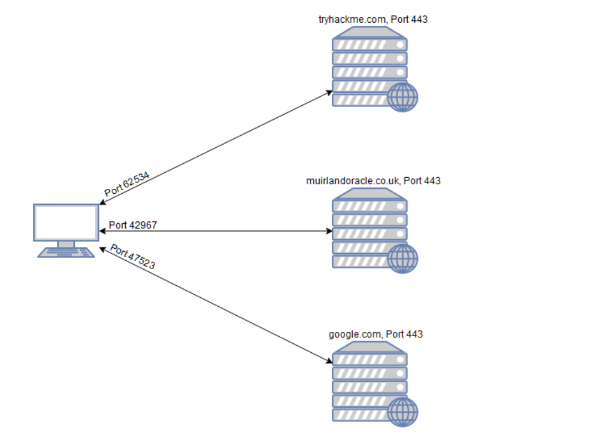<figcaption></figcaption></figure>

上图显示了当你使用本地机器同时访问多个网站时会发生什么，你的计算机会打开不同的高编号端口(随机)，以便用于与远程服务器进行通信。

每台计算机设备上总共有65535个可用端口，然而，其中许多都已经被注册为标准端口。例如，基于HTTP协议的Web服务几乎总是会使用远程服务器上的80端口，而基于HTTPS的Web服务通常会在远程服务器上使用443端口，类似的情况还有很多，如在服务器的139端口上可以找到Windows NETBIOS服务，在服务器的445端口上可以找到SMB服务等等。值得注意的是：标准端口的使用并不总是会与相应的服务进行绑定，这就使得我们对目标IP执行适当的枚举变得更加必要。

如果我们不知道服务器打开了这些端口中的哪一个，那么我们就没有成功攻击目标的希望；因此，从端口扫描开始枚举信息对于任何网络攻击都可能是至关重要的。

端口扫描可以通过多种方式来实现——我们通常可以使用一种被称为nmap的工具来进行端口扫描，这也是本文的重点；Nmap扫描工具可以用于执行多种不同类型的端口扫描——其中最常见的扫描类型，我们将在下文中进行介绍。

使用Nmap扫描端口的基本原理是这样的：nmap工具将依次连接到目标的每个端口，然后根据端口的响应方式，我们可以将端口状态确定为打开、关闭或过滤(该状态通常是由生效的防火墙规则导致的)，一旦我们知道哪些端口是开放的，我们就可以查看在开放的端口上运行了哪些服务。

Nmap是一个非常强大的工具，除了普通的端口扫描功能之外，它还具有强大的脚本引擎；基于脚本引擎，Nmap也可用于扫描目标的漏洞信息，并且在某些情况下能够执行漏洞利用。

Nmap官方文档：[https://nmap.org/book/](https://nmap.org/book/)

### **答题**

阅读本小节内容，并回答以下问题。

<figure>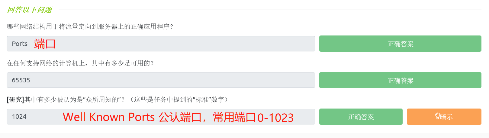<figcaption></figcaption></figure>

## Nmap参数开关

与大多数渗透工具一样，nmap是通过终端运行的，它既有Windows版本也有Linux版本（不同操作系统版本的nmap所使用的参数开关一致），本文主要介绍的是Linux版本的nmap工具（Kali Linux会默认安装nmap）。

我们可以在终端输入命令`nmap`来启动Nmap 工具，一般我们还会为此命令提供一些参数开关；关于Nmap的所有参数开关列表，我们可以使用nmap帮助菜单进行查看（`nmap -h`）或者通过访问nmap手册页进行查看（`man nmap`）。

### **答题**

在Kali Linux终端上使用`nmap -h`命令 或者 `man nmap`命令，并回答以下问题。

<figure><figcaption></figcaption></figure>

<figure><figcaption></figcaption></figure>

## 扫描类型-概述

当我们使用 Nmap 进行端口扫描时，共有三种基本扫描类型：

* TCP 连接扫描 (`-sT` )
* TCP SYN "半开"扫描 ( `-sS`)
* UDP 扫描 (`-sU` )

此外，还有几种不太常见的端口扫描类型（我们在下文中也会简单介绍一下）：

* TCP Null扫描 (`-sN` )
* TCP FIN扫描 (`-sF` )
* TCP Xmas扫描 (`-sX` )

在网络扫描方面，我们还将简要介绍 ICMP(或ping)扫描（`-sn`）。

虽然以上大多数端口扫描类型（UDP扫描除外）都将用于达到类似的目的，但是实际上这些扫描的工作方式并不相同。

## 扫描类型-TCP连接扫描

要了解Nmap中的TCP连接扫描（`-sT`），我们就必须先熟悉TCP三次握手过程。

我们简单描述一下TCP三次握手（共包括三个阶段）：

首先，客户端将发送一个设置了SYN标志位的TCP请求消息到目标服务器；然后，服务器端会用一个包含SYN标志位和ACK标志位的TCP响应消息来确认客户端所发送的请求数据包；最后，客户端将再次发送一个设置了ACK标志位的TCP请求消息来完成整个TCP握手过程。

<figure>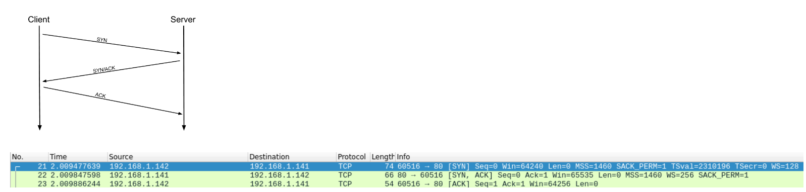<figcaption></figcaption></figure>

TCP三次握手是TCP/IP网络的基本原则之一，但它与Nmap有什么关系呢?

顾名思义，Nmap中的TCP连接扫描的工作原理就是：通过依次与每个目标端口进行TCP三次握手来确认端口状态。也就是说，在TCP连接扫描中，Nmap将会尝试连接到每个指定的TCP端口，然后通过本地机所接收到的响应消息来确定目标端口是否打开。

如果一个TCP端口是关闭的，那么按照 [RFC 793](https://tools.ietf.org/html/rfc793) 协议文档的规定：

_“如果连接不存在（CLOSED），那么任何到达的数据段（除了reset）都会触发reset，特别地，这种方式可以拒绝到达一个不存在的连接的SYN。”_

换句话说，如果Nmap发送一个设置了SYN标志的TCP请求消息到一个关闭端口，那么目标服务器将响应一个设置了RST (Reset)标志的TCP数据包，通过此响应消息，Nmap就可以确定目标端口已关闭。

<figure>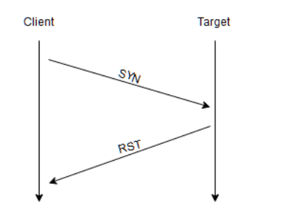<figcaption></figcaption></figure>

但是，如果TCP请求消息被发送到一个开放端口，目标服务器将会响应一个设置了SYN/ACK标志位的TCP数据包，然后Nmap会将此端口标记为打开状态(并会通过发送一个带有ACK标志位的TCP数据包来完成握手)。

然而，在TCP连接扫描中还有第三种可能结果：如果目标端口是开放的，但此端口隐藏在防火墙后面。

有很多防火墙可能会被配置为简单地丢弃传入数据包，如果Nmap发送一个TCP SYN请求，但没有收到任何回复消息，这表示目标端口正在受到防火墙的保护，因此该端口会被Nmap认为是过滤的（`filtered`）。

配置防火墙以一个设置了RST标志的TCP数据包作为响应是非常容易的，例如，在Linux&#x7684;_**IPtables**_&#x4E2D;，我们可以使用如下命令配置防火墙（此配置会让Nmap难以探测目标端口的实际状态）：

`iptables -I INPUT -p tcp --dport <port> -j REJECT --reject-with tcp-reset`

tips：TCP连接扫描一般不推荐使用，因为会留下TCP连接日志。

### **答题**

阅读本小节内容，并回答以下问题。

<figure>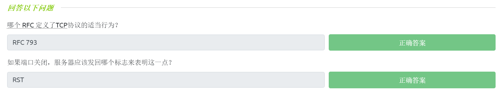<figcaption></figcaption></figure>

## 扫描类型-SYN扫描

与TCP扫描一样，SYN扫描(`-sS`)可用于扫描一个或多个目标的TCP端口范围；然而，这两种扫描类型的工作方式略有不同。

SYN扫描也被称为“半开-_Half-open_”扫描或“隐形-_Stealth_”扫描。

SYN扫描执行的是不完整的TCP三次握手过程，在SYN扫描中，客户端在接收到来自服务器的一个设置了SYN/ACK标志位的数据包之后，将直接发送一个设置了RST标志位的TCP数据包(这可以防止服务器端重复尝试发出TCP数据包)。

SYN扫描对开放的目标端口的探测过程如下所示：

<figure>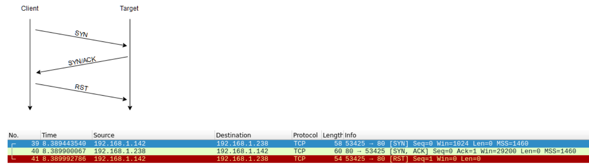<figcaption></figcaption></figure>

SYN扫描有很多好处：

* SYN扫描可以用来绕过一些旧的入侵检测系统（IDS），因为那些使用旧技术的IDS所检测的是完整的TCP三次握手，而现代IDS解决方案通常不再只是检测完整的TCP三次握手；正是基于前述原因，SYN扫描现在仍然会被称为“隐形-Stealth”扫描。
* 侦听开放端口的web应用程序通常不会记录SYN扫描行为，因为一个标准的web日志是在TCP连接完全建立后才开始记录，这再次说明了SYN扫描是隐秘的。
* 使用SYN扫描时，本地计算机无需针对每个目标端口完成TCP三次握手（以及最后断开连接）的全过程，因此，SYN扫描比标准的TCP连接扫描要快得多。

SYN扫描也有一些缺点：

* SYN扫描需要使用sudo权限才能在Linux中正常工作，这是因为SYN扫描需要创建原始数据包，在默认情况下，这是root用户才能拥有的特权。
* 不稳定的服务有时会因SYN扫描而宕机，如果客户提供给渗透测试人员的是处于生产环境下的目标机器，则可能会出现一些重大问题。

总而言之，使用Nmap中的SYN扫描是利大于弊的。

因此，如果用户具有sudo权限，则SYN扫描会是Nmap所使用的默认扫描；如果运行Nmap时没有sudo权限，那么Nmap的默认扫描类型为TCP连接扫描。

当使用SYN扫描来识别关闭状态和过滤状态的目标端口时，会应用与TCP连接扫描完全相同的规则（见上一小节内容）。

如果目标端口是关闭状态，则服务器会响应一个设置了RST标志位的TCP数据包；如果目标端口被防火墙过滤，那么客户端所发送的包含了SYN标志位的TCP数据包要么被直接丢弃，要么被TCP重置（reset）消息所欺骗。

SYN扫描与TCP连接扫描的最大不同在于：如何处理开放的目标端口。

### **答题**

阅读本小节内容，并回答以下问题。

<figure>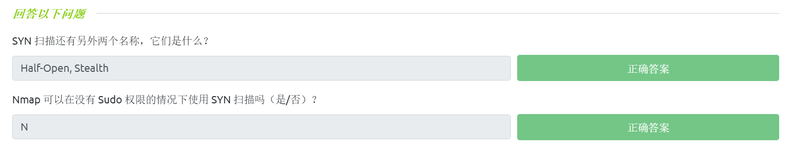<figcaption></figcaption></figure>

## 扫描类型-UDP扫描

与TCP连接不同，UDP连接是无状态的。UDP连接只是简单地将数据包发往目标端口，并希望数据包能够成功到达，即：UDP并非是通过“握手”来启动连接的。

UDP适用于追求传输速度而不是数据传输质量的网络连接(例如视频共享过程)，但是，缺乏数据包确认响应也使得UDP扫描更加困难(而且更慢)；在Nmap中，UDP扫描的参数开关为`-sU`。

当一个数据包被发送到一个开放的UDP端口时：理论上应该不会有响应消息，此时Nmap会将该端口识别为`open|filtered`状态（UDP扫描会猜测目标UDP端口是开放的，但该目标端口也可能是被防火墙过滤的）；如果客户端得到一个UDP响应消息(这是非常不寻常的)，那么Nmap会将目标UDP端口识别为开放状态；常见的情况是客户端不会得到任何响应消息，在此情况下，数据包请求将会被第二次发送给目标UDP端口以进行双重检查，如果第二次发送数据包仍然没有得到响应，那么目标UDP端口就会被识别为`open|filtered`状态，然后Nmap将继续扫描下一个目标UDP端口。

当一个数据包被发送到一个关闭的UDP端口时：目标服务器应该响应一个ICMP (ping)数据包，其中会包含一个"端口不可达"的消息，Nmap会清楚地识别到这个UDP端口是关闭状态，然后Nmap将继续扫描下一个目标UDP端口。

由于很难识别UDP端口是否实际开放，所以与其他各种基于TCP的扫描相比，UDP扫描往往非常慢(在连接良好的情况下，仍可能要20分钟才能扫描完前1000个端口)；基于前述原因，在运行UDP扫描时，通常可以启用`--top-ports <number>`，例如，我们可以使用`nmap -sU ——top-ports 20 <target>`扫描前20个最常用的UDP端口，这样就能够获得一个更可接受的扫描时间。

当扫描不常用的UDP端口时，Nmap通常会发送完全空的请求——发送原始UDP数据包；对于通常由知名服务所占用的UDP端口（常用UDP端口），Nmap将转而发送特定于协议的数据包（比如53端口是运行dns服务的标准UDP端口，在对53端口进行探测时，Nmap会发送dns数据包），这更有可能得到目标的响应，从而能得出更准确的结果。

### **答题**

阅读本小节内容，并回答以下问题。

<figure><figcaption></figcaption></figure>

## 扫描类型-NULL, FIN和Xmas扫描

NULL, FIN和Xmas扫描并不是很常用的扫描类型（这三种扫描类型都是基于TCP的），所以我们在此仅作简单介绍；这三种扫描是相互关联的，它们往往比SYN隐形扫描更加隐蔽。

**TCP Null扫描**

顾名思义，NULL扫描（`-sN`）在发送TCP请求时不会设置任何标志位，根据RFC文档的说法，如果此时目标端口是关闭的，那么目标主机应该响应一个设置了RST标志的数据包。

<figure>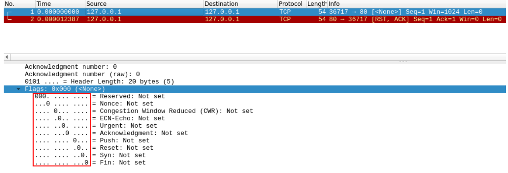<figcaption></figcaption></figure>

**TCP FIN扫描**

FIN扫描(`-sF`)的工作方式与NULL扫描几乎相同，但是，FIN扫描不会发送一个完全空的数据包，而是发送一个带有FIN标志的数据包(FIN标志可用于关闭正在活动的TCP连接)；同样，如果此时目标端口是关闭状态，Nmap会期望得到一个设置了RST标志的数据包响应。

<figure>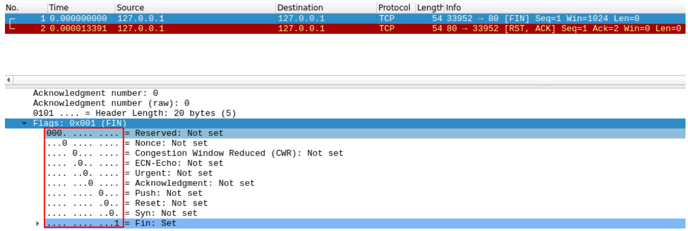<figcaption></figcaption></figure>

**TCP Xmas扫描**

与NULL扫描、FIN扫描类似，Xmas扫描(`-sX`)会发送一个格式错误的TCP数据包，如果此时目标端口是关闭状态，Nmap会期望得到一个设置了RST标志的响应数据包。

Xmas扫描被称为圣诞（xmas的含义为圣诞）扫描，因为Xmas扫描所发送的TCP数据包设置了PSH标志、URG标志和FIN标志，当我们使用Wireshark进行数据包捕获时——相关的捕获结果看起来就像一棵闪烁的圣诞树。

<figure>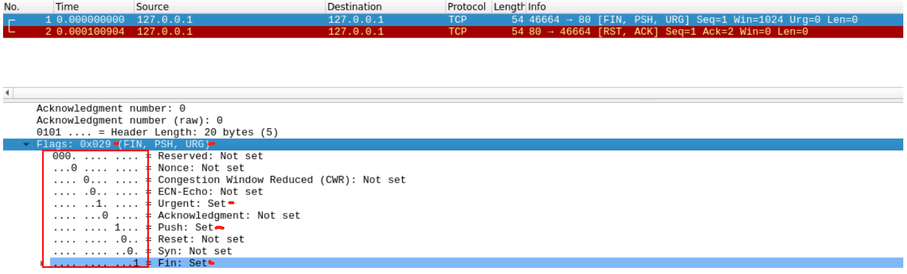<figcaption></figcaption></figure>

使用以上三种扫描方式来探测一个开放端口，那么预期可得到的响应情况是相同的——如果目标端口是开放的，则目标端口不会对以上三种扫描所发送的畸形数据包进行响应；不幸的是(就像开放的UDP端口一样)，目标端口还可能正被防火墙所保护(这也是一种预期的情况)，因此，NULL, FIN和Xmas扫描往往会将目标端口识别为`open|filtered`(开放|过滤)状态、`closed`(关闭)状态或者`filtered`(过滤)状态；如果一个端口被以上三种扫描之一识别为`filtered`(过滤)状态，那么通常是因为目标已经响应了一个ICMP不可达数据包。

值得注意的是，虽然[RFC 793](https://tools.ietf.org/html/rfc793)要求目标主机对发送到"关闭的目标端口"的畸形数据包 以一个设置了RST标志的数据包作为响应，而对发送到"开放的目标端口"的畸形数据包，目标主机将完全不作出响应；但是实际情况并非总是如此，特别是Microsoft Windows以及许多Cisco网络设备，它们可能会对接收到的任何畸形数据包 都以一个设置了RST标志的数据包作为响应（而不管端口是否实际打开），这将导致所有目标端口都会被Nmap识别为关闭状态。

使用Nmap中的NULL, FIN和Xmas扫描，还可以实现“防火墙规避”操作。许多防火墙会被配置为：将设置了SYN标志的传入TCP数据包丢弃，并阻塞目标端口(从而阻塞新的连接启动请求)；但是，我们可以通过发送不包含SYN标志的请求数据包来尝试绕过防火墙规则。虽然以上三个Nmap扫描类型 在理论上都能够实现绕过防火墙，但大多数现代IDS解决方案能够识别出NULL, FIN和Xmas扫描，因此在使用Nmap对现代目标系统进行探测时，我们不要希望端口扫描的结果会是100%有效。

### **答题**

阅读本小节内容，并回答以下问题。

<figure>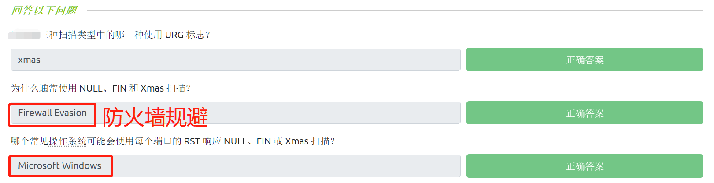<figcaption></figcaption></figure>

## 扫描类型-ICMP网络扫描

当我们在黑盒渗透测试任务中第一次连接到目标网络时，我们首先应该尝试获得当前网络结构的“map”——换句话说，我们希望看到哪些IP地址范围包含了活动主机，哪些IP地址范围不包含活动主机。

为了探测目标主机存活情况，我们可以使用Nmap执行 ICMP 网络扫描（也就是ping扫描），在ping扫描中，Nmap会向指定网络范围内的每个IP地址发送 ICMP 报文，当接收到响应时，Nmap则会将发出响应的IP地址标记为活动主机。执行ping扫描得到的结果并不总是准确的，但是它仍然可以提供一些参考信息。

如果我们要执行ping扫描，则需要将Nmap的`-sn`参数开关与IP地址范围结合使用，IP地址范围可以使用连字符(-)或CIDR表示法指定。

CIDR格式

* 组成：网络地址/子网掩码
* 使用格式：IP/掩码长度（192.168.1.0/24），主机名/掩码长度(baidu.com/24)

例如，当我们扫描`192.168.0.x`网络时，可以使用：

* `nmap -sn 192.168.0.1-254`
* `nmap -sn 192.168.0.0/24`

`-sn`参数开关会告诉Nmap不要扫描任何端口，迫使Nmap主要依靠发送ICMP echo 请求数据包来识别存活的主机；此外，如果使用sudo或作为root用户运行ping扫描，则将主要依赖于本地网络上的ARP请求来识别（本地以太网上的）存活主机。

除了ICMP echo 请求外：`-sn`参数开关还会让Nmap发送一个TCP SYN数据包到目标机的443端口；以及让Nmap发送一个TCP ACK数据包(如果是非root用户执行扫描，则此处是发送TCP SYN数据包)到目标机的80端口；还有让Nmap发送一个ICMP时间戳请求到目标机。

在Ping扫描中，如何确认目标主机在线：

* 当ping扫描发送TCP ACK报文到目标机80端口时，存活主机可能会以TCP RST报文作为响应；
* 当ping扫描发送ICMP echo 请求到目标机时，存活主机可能会作出一个正常的Ping应答（CMP Echo reply）；
* 当ping扫描发送ICMP时间戳请求到目标机时，存活主机可能会返回当前系统时间；(ICMP时间戳请求允许一个系统向另一个系统查询当前的时间，如果目标主机返回了时间，则说明目标主机是活动的)
* 当ping扫描发送TCP SYN报文到目标机的443端口时，存活主机可能会以TCP SYN+ACK报文或者RST报文作为响应。

tips：使用`-sn`参数开关的ping扫描会默认发送四种不同类型的数据包来探测目标主机是否在线，只要收到其中一个数据包的回复，那就证明目标机是开启的；使用四种不同类型的数据包可以避免因防火墙阻塞或丢包造成的探测错误。

### **答题**

阅读本小节内容，并回答以下问题。

<figure>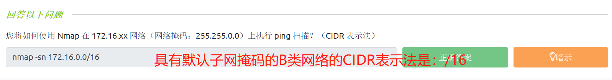<figcaption></figcaption></figure>

## NSE脚本概述

Nmap脚本引擎 (NSE-**N**map **S**cripting **E**ngine)是对Nmap工具的一个非常强大的补充，它极大地扩展了Nmap的功能。NSE脚本是用Lua编程语言编写的，这些脚本可以用来做各种各样的事情：NSE可以用来扫描目标是否存在漏洞，并能自动利用这些可能存在的漏洞，NSE还有助于更好地进行信息收集，不管怎样，我们很有必要意识到Nmap脚本库的用途是多么广泛。

有很多NSE脚本种类可供我们选择，其中一些有用的NSE脚本分类包括：

* `safe`：安全性好的nmap脚本，使用时不会影响目标；
* `intrusive`：不够安全的nmap脚本，使用时可能影响目标；
* `vuln`：用于扫描漏洞的nmap脚本；
* `exploit`：能够试图进行漏洞利用的nmap脚本；
* `auth`：此类nmap脚本，会试图绕过正在运行的服务的身份验证(例如，匿名登录到FTP服务器)；
* `brute`：此类nmap脚本，将试图强行验证正在运行的服务的凭据；
* `discovery`：此类nmap脚本，将尝试查询正在运行的服务以获得有关目标网络的进一步信息(例如查询SNMP服务器，SNMP即"简单网络管理协议")。

访问以下链接，可以找到一个更详尽的NSE脚本列表：[ https://nmap.org/book/nse-usage.html](https://nmap.org/book/nse-usage.html)

在下一个小节中，我们将研究如何与NSE交互，并使用以上这些类别中的NSE脚本。

### **答题**

阅读本小节内容，并回答以下问题。

<figure>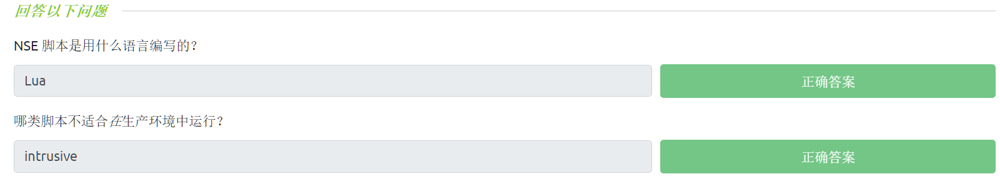<figcaption></figcaption></figure>

## NSE脚本-使用NSE脚本

我们可以在Nmap中使用`--script`参数开关来激活`vuln`分类的NSE脚本：`--script=vuln`。其他类别的NSE脚本也是通过一样的语法激活，例如，我们可以使用 `--script=safe`激活安全类型的脚本并使其针对目标运行（注意：只有当脚本的目标为一个活动着的服务，脚本才能实际生效）。

如果我们想要执行特定的NSE脚本，可以使用`--script=<script-name>`格式的命令，例如`--script=http-fileupload-exploiter`；如果想同时执行多个脚本，则需要使用逗号隔开，例如`--script=smb-enum-users,smb-enum-shares`。

有些NSE脚本还需要我们提供参数(例如，使用需要经过身份验证的漏洞利用脚本，需要我们提供凭据)，这些参数可以通过`--script-args`参数开关来指定；一个例子是`http-put`脚本（尝试通过使用PUT方法上传文件），它需要我们提供两个参数——文件的目的地URL以及文件在磁盘上的位置，实际的命令可能如下所示：

```shell
nmap -p 80 --script http-put --script-args http-put.url='/dav/shell.php',http-put.file='./shell.php'
```

注意：以上示例命令中的脚本参数将以逗号分隔，并需要使用英文句点符号来连接到相应的脚本（即 `<script-name>.<argument>`，如“http-put.url”）。

通过以下链接，我们可以看到关于NSE脚本及其相应参数的完整列表：[https://nmap.org/nsedoc/](https://nmap.org/book/nse-usage.html)

Nmap脚本还带有内置的帮助菜单，我们可以通过使用`nmap --script-help <script-name>`来访问。

### **答题**

访问 https://nmap.org/search/ ，并在线搜索脚本名称，我们可以找到NSE脚本相关的可用参数：

<figure>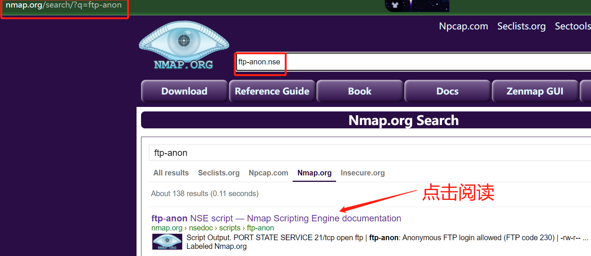<figcaption></figcaption></figure>

<figure>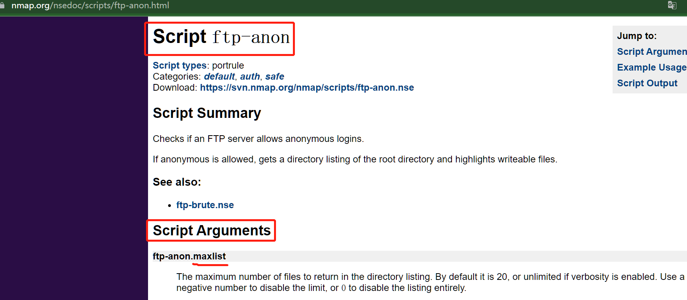<figcaption></figcaption></figure>

ftp-anon.nse脚本可用于检测是否允许FTP 匿名登录，该脚本有一个可设置的参数`maxlist`，用于列出扫到开放ftp端口时最多列出的文件列表的数量。

<figure>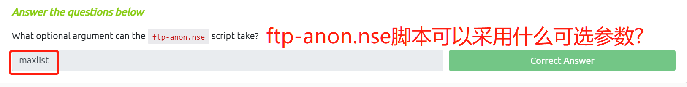<figcaption></figcaption></figure>

## NSE脚本-搜索脚本

我们已经了解了如何使用Nmap中的脚本，但我们现在还不知道如何找到这些NSE脚本。

我们有两种选择(理想情况下应该结合使用)可以找到NSE脚本：第一个选择是使用[Nmap官方网站](https://nmap.org/nsedoc/)上的页面，其中包含了所有Nmap脚本的列表；第二个选择是Kali Linux机器上的Nmap本地存储信息。Nmap会将其脚本存储在Linux上的`/usr/share/nmap/scripts`目录下（在默认情况下），所有NSE脚本都会存储在这个目录中——当你使用Nmap命令指定脚本时，Nmap就会在NSE脚本存储目录中进行查找。

在安装了Nmap的本地机器上，我们可以使用`/usr/share/nmap/scripts/script.db`文件来搜索已经安装的NSE脚本，尽管有`.db`扩展名，但`script.db`实际上并不是一个数据库文件，而是一个包含每个可用脚本的文件名和类别的格式化文本文件。

<figure>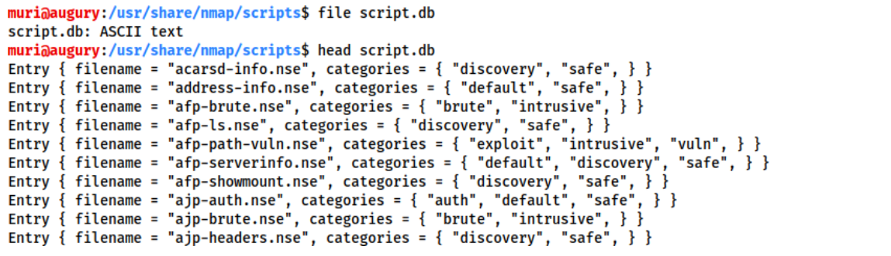<figcaption></figcaption></figure>

Nmap可以使用`script.db`文件来跟踪(并利用)其脚本引擎中的脚本，但是，我们也可以通过`grep`来查找NSE脚本，例如：

```shell
grep "ftp" /usr/share/nmap/scripts/script.db
```

<figure>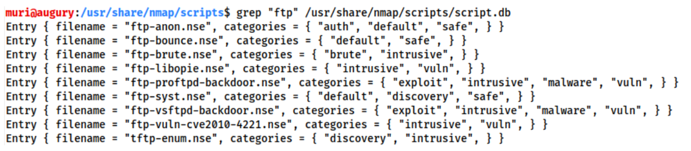<figcaption></figcaption></figure>

我们还可以使用`ls`命令来搜索脚本，例如：

```shell
ls -l /usr/share/nmap/scripts/*ftp*
#注意在搜索词的两边使用星号(*)通配符
```

<figure>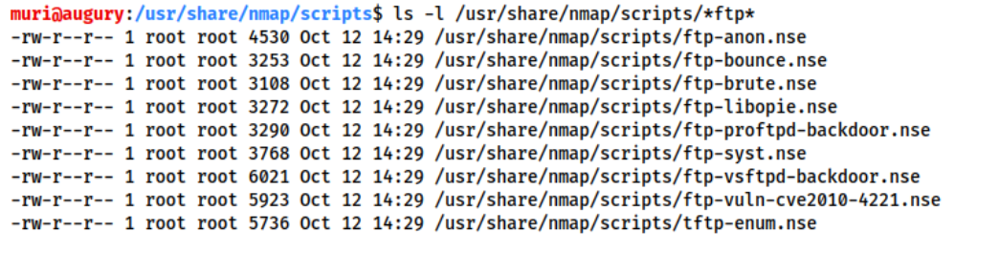<figcaption></figcaption></figure>

同样的方法也可以用于搜索Nmap的脚本类别，例如：

```shell
grep "safe" /usr/share/nmap/scripts/script.db
```

<figure>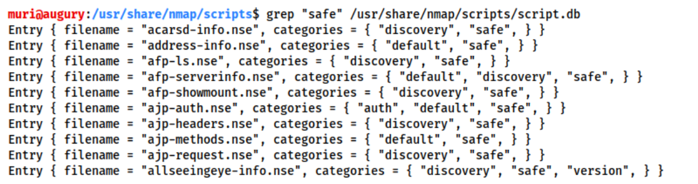<figcaption></figcaption></figure>

**安装新脚本**

我们之前提到过，Nmap官方网站中有一个包含所有NSE脚本的列表，那么，如果在本地机器的Nmap脚本目录中缺少了其中一个NSE脚本应该怎么办？

我们使用标准的更新和安装命令`sudo apt update && sudo apt install nmap`应该能修复本地机的NSE脚本缺失问题，但是，我们也可以通过从Nmap官网中下载NSE文件并手动安装NSE脚本：

```shell
sudo wget -O /usr/share/nmap/scripts/<script-name>.nse https://svn.nmap.org/nmap/scripts/<script-name>.nse
```

在成功下载并安装缺失的NSE脚本之后，我们必须接着执行`nmap --script-updatedb`命令，这可以更新本地机中的`script.db`文件 以包含新下载的NSE脚本。

值得注意的是，如果你要制作自己的NSE脚本并将其添加到Nmap中，你最终也需要使用“updatedb”命令——并且你还需要具有Lua基础知识，以完成自制NSE脚本的编写。

### **答题**

_tips：使用本地Kali机进行操作并回答以下问题。_

_**问题1：在/usr/share/nmap/scripts/目录中搜索“smb”脚本，用于确定SMB服务器的相关操作系统的脚本的文件名称为?**_

我们使用`/usr/share/nmap/scripts/script.db`文件来搜索和“smb”相关的脚本（并根据脚本文件的名称来猜测其作用）：

```bash
grep "smb" /usr/share/nmap/scripts/script.db
```

<figure>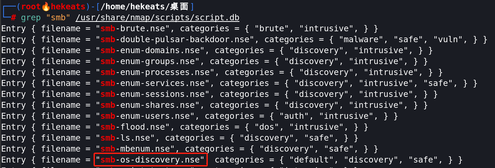<figcaption></figcaption></figure>

_**问题2：通读问题1中的对应脚本内容，此脚本是基于什么?**_

我们在刚才的Lua脚本（`smb-os-discovery.nse`）的内容中查找`dependencies = {}`：

```bash
grep "dependencies" /usr/share/nmap/scripts/smb-os-discovery.nse

#可以直接使用"cat smb-os-discovery.nse"命令来通读脚本内容并寻找关键字
```

<figure>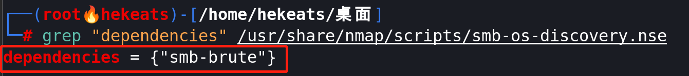<figcaption></figcaption></figure>

<figure>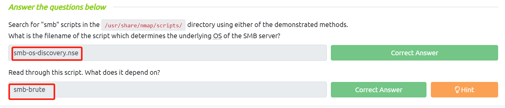<figcaption></figcaption></figure>

## 防火墙规避

我们已经知道了一些可应用于绕过防火墙的扫描方法(比如SYN扫描，以及NULL、FIN和Xmas扫描)，然而，还有一种非常常见的防火墙配置——阻止所有ICMP数据包，我们必须知道如何绕过这种防火墙规则。

典型的Windows主机会使用其默认防火墙阻止所有ICMP数据包，这就产生了一些问题：我们经常会使用ping命令(通过发送ICMP数据包)来手动探测目标是否存活，Nmap在执行某些扫描时，也会默认发送ICMP数据包。这就意味着，Nmap会将使用了“阻塞所有ICMP数据包”的防火墙配置的机器 识别为不活动的主机，并且根本不会扫描它。

所以我们需要一种方法来绕过这种防火墙配置（指阻止所有ICMP数据包），幸运的是，Nmap为此提供了一个参数开关：`-Pn`，此参数开关会告诉Nmap在扫描主机之前不要执行ping检测；使用`-Pn`意味着Nmap将始终将目标主机视为存活的，这样能够有效地绕过ICMP阻塞，然而代价是可能需要很长时间来完成扫描(即使目标主机真的不活动，Nmap仍然会检查和重复检查每个指定的端口)。

值得注意的是，如果你已经处于目标所在的本地网络上，Nmap还会使用ARP请求来确定目标主机是否存活。

Nmap中还有许多其他参数开关对防火墙规避很有用，我们在此不作详细讨论，你可以访问以下链接地址：

[https://nmap.org/book/man-bypass-firewalls-ids.html](https://nmap.org/book/man-bypass-firewalls-ids.html)

以下Nmap参数开关是值得注意的：

* `-f`：用于分割数据包(将它们分成更小的数据片段)，从而使数据包不太可能被防火墙或IDS(入侵检测系统)检测到。
* `--mtu <number>`：是`-f`的替代选项，但是能更好地控制数据包的大小，它可以设置用于发送的数据包的最大传输单元大小，这一定是8的倍数。
* `--scan-delay <time>ms`：用于增加数据包发送之间的延迟时间；在网络不稳定的时候，这非常有用，而且还可以规避"基于时间进行检测"的防火墙/IDS触发器。
* `--badsum`：用于为数据包生成无效的校验和；任何真正的TCP/IP堆栈都会丢弃这个数据包，然而，防火墙可能会对其自动响应(而不检查数据包的校验和是否有效)；因此，该参数开关可用于确定防火墙/IDS是否存在。

### **答题**

阅读本小节内容，并回答以下问题。

查看Nmap官网文档：[ https://nmap.org/book/man-bypass-firewalls-ids.html](https://nmap.org/book/man-bypass-firewalls-ids.html)

<figure>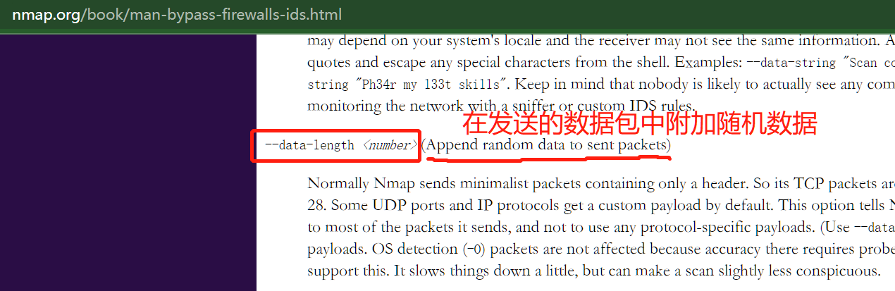<figcaption></figcaption></figure>

<figure>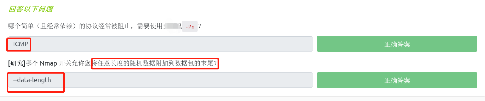<figcaption></figcaption></figure>

## 实例练习

使用Kali Linux作为本地攻击机，在本文相关的TryHackMe实验房间中启动目标机器。

### **答题**

对目标机进行Ping检测：

```bash
ping 10.10.223.98

#或者使用"sudo nmap -PE 10.10.223.98"命令；使用Nmap的“-PE”参数开关,可以执行ICMP扫描。
```

<figure>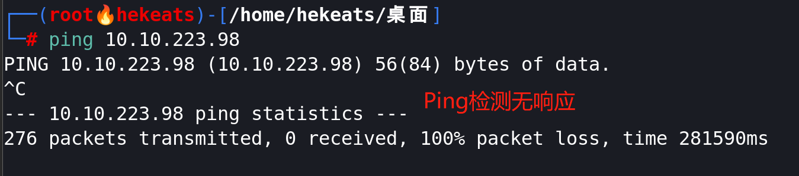<figcaption></figcaption></figure>

对目标的前 999 个端口执行 Xmas 扫描：

```bash
sudo nmap -vv -sX -Pn 10.10.223.98
#默认会扫描前1000个端口
#-vv：设置此选项，会显示扫描结果的详细信息
#-Pn：不进行ping检测，默认目标主机存活
```

<figure>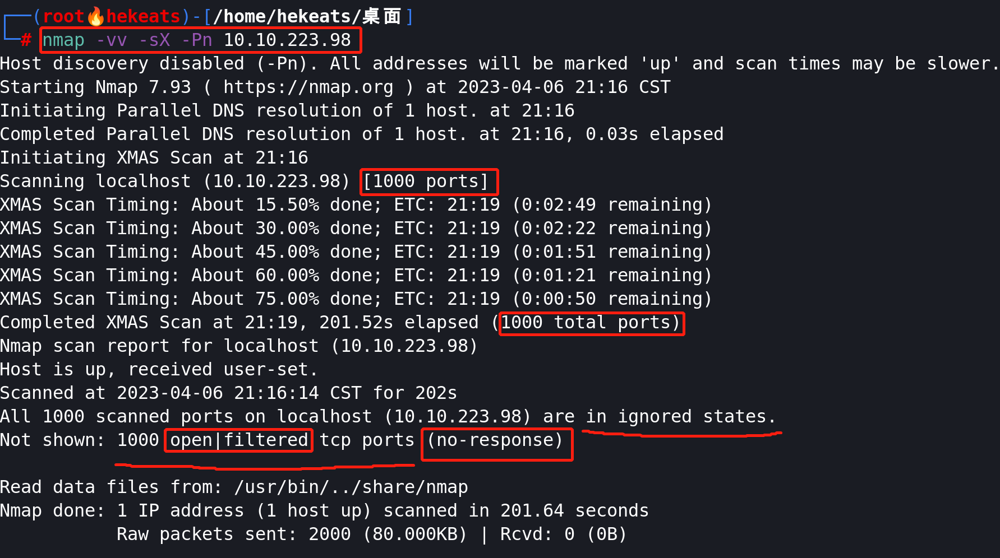<figcaption></figcaption></figure>

对目标的前5000个端口执行SYN扫描：

```bash
sudo nmap -p1-5000 -sS -vv -Pn 10.10.223.98
#-vv：设置此选项，会显示扫描结果的详细信息
#-Pn：不进行ping检测，默认目标主机存活
```

<figure>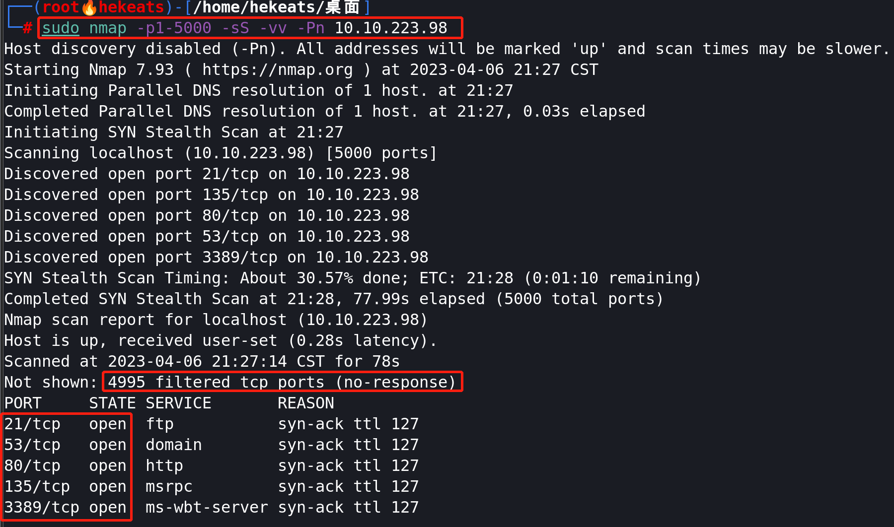<figcaption></figcaption></figure>

检测是否允许匿名(Anonymous)登录到目标机的21端口上的FTP服务器：

```bash
sudo nmap --script=ftp-anon -p 21 -vv -Pn 10.10.223.98
#-vv：设置此选项，会显示扫描结果的详细信息
#-Pn：不进行ping检测，默认目标主机存活
```

<figure>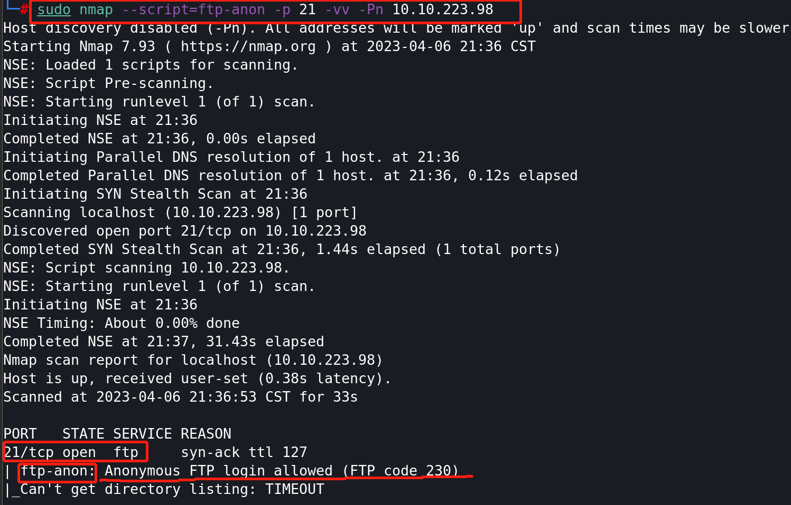<figcaption></figcaption></figure>

<figure>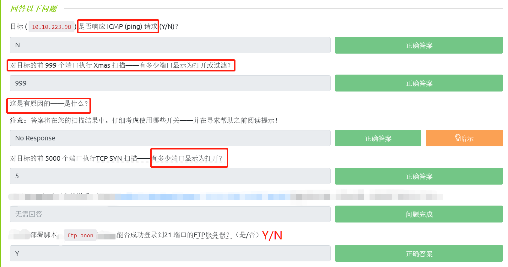<figcaption></figcaption></figure>
