# ☑ Intro to Defensive Security(防御性安全介绍)

TryHackMe实验房间链接：[https://tryhackme.com/room/defensivesecurity](https://tryhackme.com/room/defensivesecurity)

## 防御性安全简介

进攻性安全专注于一件事：闯入系统。 进攻性安全领域的职业人员可以通过利用现有错误、滥用不安全的设置以及利用未强制执行的访问控制策略等方式侵入目标系统。 红队和渗透测试人员专注于进攻性安全。

防御性安全在某种程度上与进攻性安全相反，它涉及两个主要任务：

* 防止入侵发生
* 在入侵发生时检测入侵并做出正确响应

蓝队是防御性安全领域的一部分。

<figure>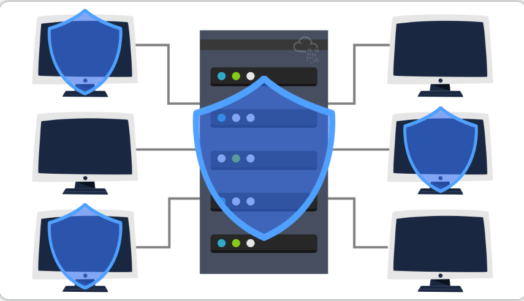<figcaption></figcaption></figure>

一些与防御性安全相关的任务：

* 培养用户网络安全意识：对用户进行网络安全培训有助于防止针对系统的各种攻击。
* 记录和管理资产：我们需要知道我们必须妥善管理和保护的系统和设备的类型。
* 更新和修补系统：确保计算机、服务器和网络设备针对任何已知漏洞（弱点）进行正确的版本更新和补丁修补。
* 设置预防性安全设备：防火墙和入侵防御系统 (IPS) 是预防性安全的重要组成部分。 防火墙可以控制哪些网络流量可以进入系统或网络，以及哪些流量可以离开系统或网络。 IPS 会阻止任何符合当前规则和攻击特征的网络流量。
* 设置日志记录和监控设备：如果没有进行适当的网络日志记录和网络监控，就不可能检测到恶意活动和入侵行为。 如果我们管理的网络中出现了新的未经授权的可疑设备，我们应该能够及时知道。

防御性安全还有很多要求，上面的列表只涵盖了几个常见的安全任务。

以下是防御性安全的常见相关主题

* 安全运营中心 (SOC)
* 威胁情报
* 数字取证和事件响应 (DFIR)
* 恶意软件分析

**答题**

<figure>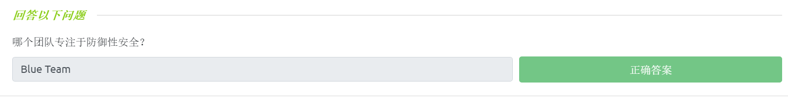<figcaption></figcaption></figure>

## 防御性安全相关领域介绍

在本小节中，我们将涵盖与防御性安全相关的两个主要主题：

* 安全运营中心 (SOC)，涵盖了威胁情报处理。
* 数字取证和事件响应 (DFIR)，涵盖了恶意软件分析。

### 安全运营中心(SOC)

安全运营中心(SOC-Security Operations Center) 是一个由网络安全专业人员所组成的团队，主要负责监控网络及其系统以检测恶意网络安全事件。

SOC 的一些主要兴趣领域是：

* 漏洞：每当发现系统漏洞（弱点）时，必须通过安装适当的更新包或者补丁来修复漏洞，当修复方案不可用时，则应采取必要的措施来防止攻击者利用漏洞。 尽管修复漏洞对 SOC 至关重要，但这项任务实际上不一定会分配给他们来完成。
* 策略违规：我们可以将安全策略视为保护网络和系统所需的一组规则；例如，如果用户将公司机密数据上传到公开的在线存储服务，则可能违反了安全策略。
* 未经授权的活动：如果用户的登录名和密码被盗取，那么攻击者就可以使用盗取到的凭据进行登录行为；SOC 需要检测此类事件 并在攻击者造成进一步损坏之前尽快进行阻止。
* 网络入侵：无论你的安全性有多好，攻击者进行入侵的机会总是存在。当用户单击恶意链接或攻击者利用公共服务器时，也可能会发生网络入侵事件；不管怎样，当网络入侵发生时，我们就必须尽快检测到它，以防止进一步的破坏。

SOC的安全操作涵盖了各种任务以保护公司网络及系统，其中也包含了威胁情报处理。

<figure><figcaption></figcaption></figure>

#### 威胁情报(Threat Intelligence)

在网络安全中：情报指的是你收集到的关于实际和潜在敌人的信息，威胁指的是任何可能破坏系统或对系统产生不利影响的行为。

威胁情报旨在收集信息，以帮助公司更好地应对潜在的攻击者，了解威胁情报的目的是实现威胁知情防御；不同的公司会吸引不同类型的网络攻击者，一些攻击者可能会试图从移动运营商处窃取客户数据，另外一些攻击者可能会有兴趣破坏炼油厂的网络以使其停止生产。

典型的网络攻击者包括出于政治原因工作的国家网络军队以及出于财务目的行事的勒索软件组织，基于公司（目标）的性质，我们就可以知道预期的攻击者类型。

<figure>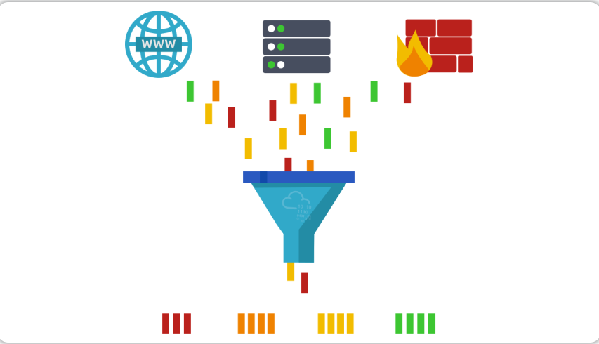<figcaption></figcaption></figure>

情报需要数据，我们必须收集、处理和分析数据：我们首先需要进行数据收集，具体的数据收集来源分为本地来源（例如网络日志）和公共来源（例如网络论坛）；得到数据之后，我们还需要对数据进行处理，数据处理旨在将数据排列成适合分析的格式；最后是数据分析阶段，此阶段旨在找到有关攻击者及其动机的更多信息，另外，数据分析还旨在创建建议列表和可操作步骤列表。

威胁情报可以让我们了解潜在攻击者的战术、技术和程序，妥善处理威胁情报的好处是：我们可以识别威胁参与者（对手），预测他们的攻击活动，最终能够减轻他们的攻击危害并能及时准备响应策略。

### 数字取证和事件响应(DFIR)

接下来我们将介绍数字取证和事件响应 (DFIR-Digital Forensics and Incident Response)，主要将涵盖以下内容：

* 数字取证
* 事件响应
* 恶意软件分析

#### 数字取证(Digital Forensics)

取证是指应用科学技术来调查犯罪情况和确定事实。随着计算机和智能手机等数字系统的使用和普及，为了调查和数字系统相关的犯罪情况，一个新的取证学分支得以诞生：计算机取证——后来逐渐演变为数字取证。

在防御性安全方面，数字取证的重点转移到了分析攻击证据、分析攻击者以及分析其他领域：如知识产权盗窃、网络间谍活动、拥有未经授权的内容等。

数字取证将侧重于不同的区域，例如：

* 文件系统：分析来自于系统存储的数字取证图像（低级副本）可以揭示很多信息，例如分析已安装的程序、已创建的文件、部分被覆盖的文件和已删除的文件等。
* 系统内存：如果攻击者在内存中运行他们的恶意程序而不将其保存到磁盘中，那么获取系统内存的取证图像（低级副本）是分析恶意程序内容和了解恶意攻击的最佳方式。
* 系统日志：每台客户端和服务器计算机都维护着不同的日志文件来记录正在发生的事情。因此，日志文件能够提供大量关于系统上发生的事情的信息，即使攻击者试图清除他们的行为痕迹，也可能会留下一些线索。
* 网络日志：遍历网络中的网络数据包日志将有助于回答是否正在发生攻击、是否已经被攻击以及攻击行为所造成的后果是什么。

#### 事件响应(Incident Response)

事件，在网络安全中通常是指发生数据泄露或发生网络攻击；但是，在某些情况下，有些事件可能不是那么重要，例如配置错误、入侵企图或违反安全策略的行为。

网络攻击的常见示例包括：攻击者使我们的网络或系统无法访问、攻击者破坏（更改）公共网站和发生数据泄露（攻击者窃取公司数据）等。 那么我们将如何应对网络攻击？事件响应指定了出现网络攻击情况时应遵循的方法，事件响应的目的是在网络攻击事件中减少损坏并在尽可能短的时间内恢复正常。在理想情况下，公司的相关安全部门应该制定一个准备好进行事件响应的计划。

事件响应过程的四个主要阶段是：

* 准备阶段：这需要一支训练有素并且已经准备好处理安全事件的团队，在理想情况下，要尽量采取各种安全措施来防止事故发生。
* 检测和分析阶段：事件响应团队要拥有必要的资源来检测安全事件是否发生；此外，事件响应团队还必须进一步分析任何已经检测到的事件以了解其严重性。
* 遏制、根除和恢复阶段：一旦检测到事件发生，最重要的是要阻止事件影响其他系统、消除恶意事件并恢复受影响的系统。例如，当我们发现一个系统感染了计算机病毒，我们要及时阻止（遏制）病毒传播到其他系统，清除（根除）病毒程序，并使系统恢复正常工作状态。
* 事后活动阶段：成功恢复系统工作后，要生成一份相关的报告，分享以及吸取教训，以防止未来发生类似事件。

<figure>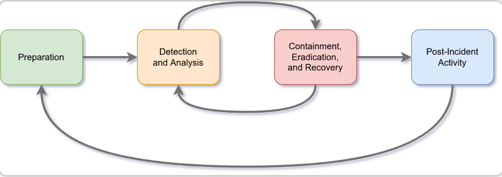<figcaption></figcaption></figure>

<figure>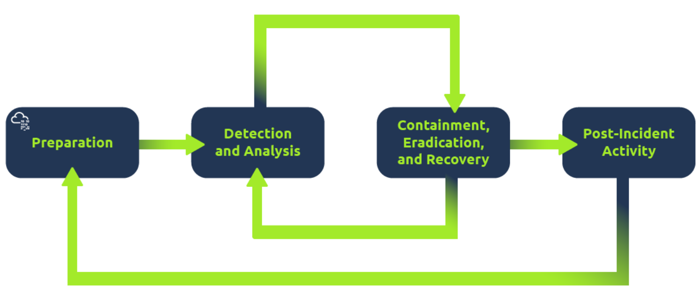<figcaption></figcaption></figure>

#### 恶意软件分析(Malware Analysis)

Malware 代表恶意软件，软件是指可以保存在磁盘上或通过网络发送的程序、文档和文件。

恶意软件包括多种类型，例如：

* 病毒(Virus)是将自身附加到程序中的一段代码（是程序的一部分），它旨在从一台计算机传播到另一台计算机； 此外，一旦病毒感染了计算机，它就会通过更改、覆盖和删除文件来发挥危害作用，最终导致的结果是让计算机运行速度变慢直至计算机无法正常使用。
* 特洛伊木马(Trojan Horse)是一种程序，它会显示自己具有一个理想的正常功能，但实际上程序中还隐藏了一些恶意功能；例如，受害者可能会从可疑网站下载视频播放器，而这个视频播放器可能实际上是一个木马程序，从而攻击者可以完全控制受害者的系统。
* 勒索软件(Ransomware)是一种加密用户文件的恶意程序，加密会使文件在不知道加密密码的情况下变为不可读状态；用户只有选择支付“赎金”，攻击者才可能会向用户提供加密密码来对用户文件进行解密。

<figure>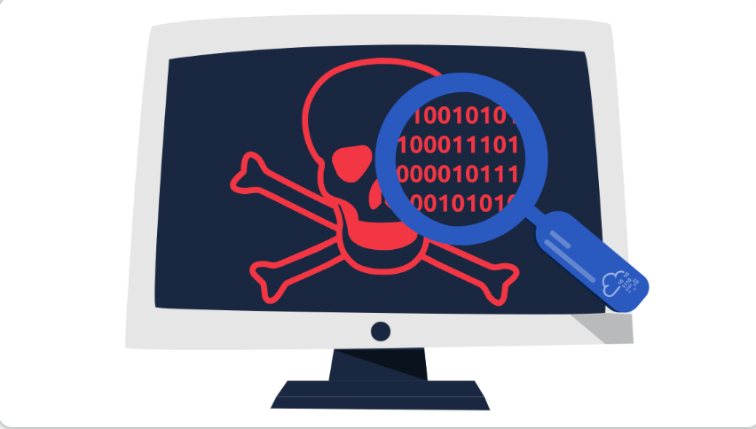<figcaption></figcaption></figure>

恶意软件分析旨在使用各种方式了解恶意程序，从而保护网络和系统的安全环境：

* 静态分析：在不运行恶意程序的前提下对恶意程序进行检查。通常，这需要扎实的汇编语言知识（处理器的指令集，即计算机的基本指令）。
* 动态分析：在受控环境中运行恶意软件并监控其活动以进行分析，动态分析可以让你观察恶意软件在运行时的具体行为。

**答题**

<figure>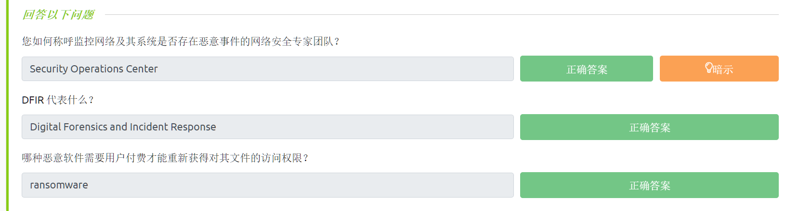<figcaption></figcaption></figure>

## 关于防御性安全的简单实例

**模拟场景介绍**

作为安全分析师，你接下来将要执行一个典型任务：

你是负责保护银行的安全运营中心 (SOC-Security Operations Center) 的成员，该银行的SOC使用了安全信息和事件管理 (SIEM-Security Information and Event Management) 系统，SIEM 会通过各种来源收集与安全相关的信息和事件，并通过一个系统呈现它们；例如，如果用户多次尝试登录失败或者有来自意外地理位置的登录尝试行为，你将收到相关的消息通知；此外，随着机器学习的出现，SIEM 还会自动检测某些异常行为，例如某个用户在凌晨 3 点登录，而通常情况下用户应该只在工作时间进行登录。

在本小节的实例中，我们将与 SIEM 交互以实时监控网络和系统上的不同事件。有些事件是典型的、无害的，而有些特殊事件可能需要我们进一步干预，我们将在实例中找到被标记为红色的事件，记下相关信息，然后单击相关记录以开始进一步检查。

在对可疑事件的进一步检查中，我们需要尝试了解有关可疑活动或事件的更多信息，可疑事件警告可能是由某个具体事件触发的，这可能会关联到本地用户、本地计算机或远程 IP 地址。在现实世界中，如果要发送和接收邮件，你需要知道一个实际地址；同样，在网络环境中，你需要一个 IP 地址才能通过 Internet 发送和接收数据，IP 地址是允许你通过 Internet 进行通信的逻辑地址。我们需要检查事件警告触发的原因以确认相关的事件是否确实是恶意的，如果确定是恶意事件，我们就需要采取相应的措施，比如向 SOC 中的其他成员进行报告并屏蔽恶意事件相关的 IP 地址。

<figure><figcaption></figcaption></figure>

**答题**

_在本文相关的Tryhackme实验房间页面 部署虚拟实验环境，并完成本小节对应的实例_

part1：检查 SIEM 仪表面板中的警报消息，从警报中找到可疑 IP 地址(143.110.250.149)，记下它，然后单击警报消息继续。

<figure>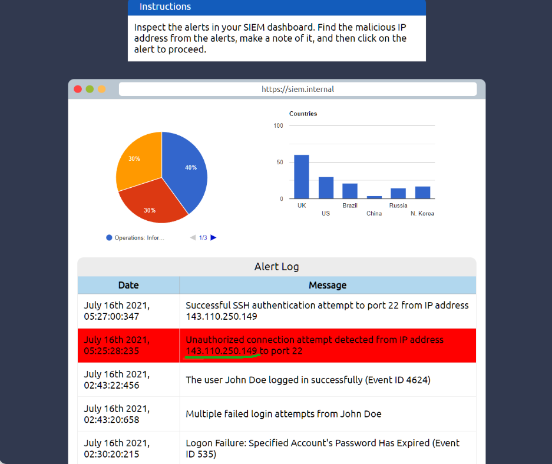<figcaption></figcaption></figure>

part2：Internet 上有一些网站允许你检查某个 IP 地址的信誉以查看它是否是恶意的或可疑的；让我们对在part1中发现的可疑 IP 地址进行检查。

_tips：有许多开源数据库，例如_ [_AbuseIPDB_](https://www.abuseipdb.com/) _和_ [_Cisco Talos Intelligence_](https://talosintelligence.com/)_，你可以在其中对 IP 地址执行信誉和位置检查，大多数安全分析师使用这些工具来帮助他们进行警报调查；你还可以通过报告恶意 IP（例如，在 AbuseIPDB 上）来使 Internet 更安全。_

<figure>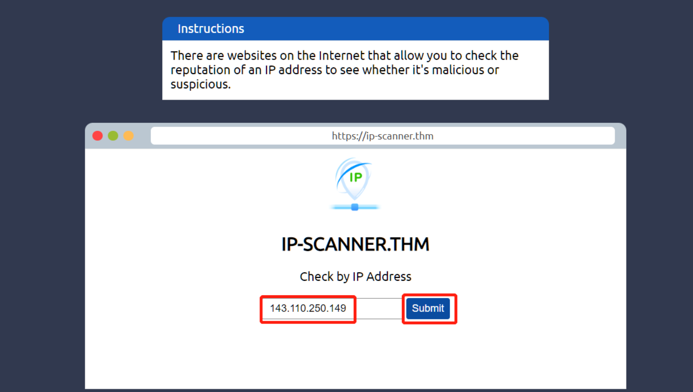<figcaption></figcaption></figure>

part3：查看检查结果，现在我们知道 IP 地址143.110.250.149是恶意的，我们需要将其上报给相关的工作人员。

<figure>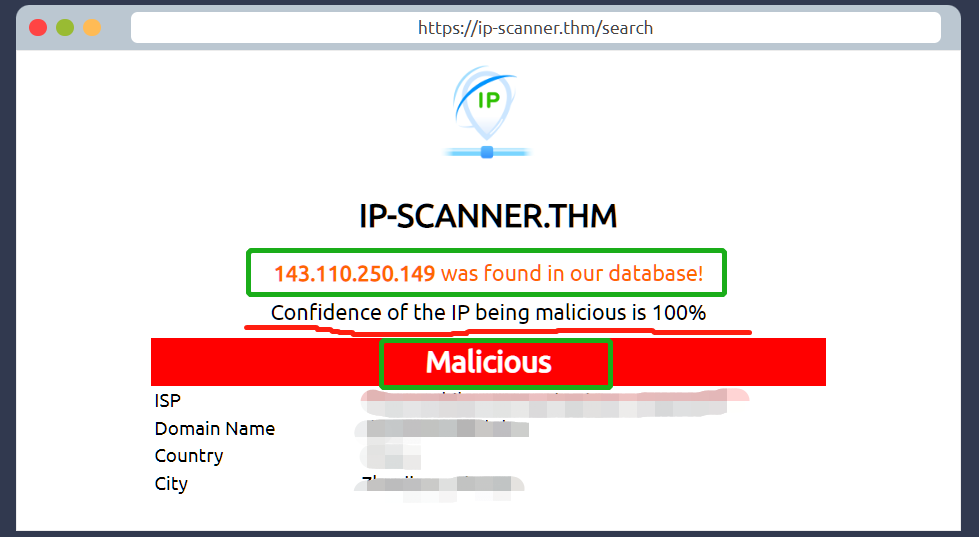<figcaption></figcaption></figure>

part4：如果这只是失败的身份验证尝试，我们不必太担心，但是我们还注意到此恶意 IP 地址有成功的登录尝试记录，所以我们有必要将这一事件上报；我们要将此事件上报给负责相关工作的公司人员。（我们将事件上报给 SOC Team Lead——安全运营中心团队负责人）

<figure>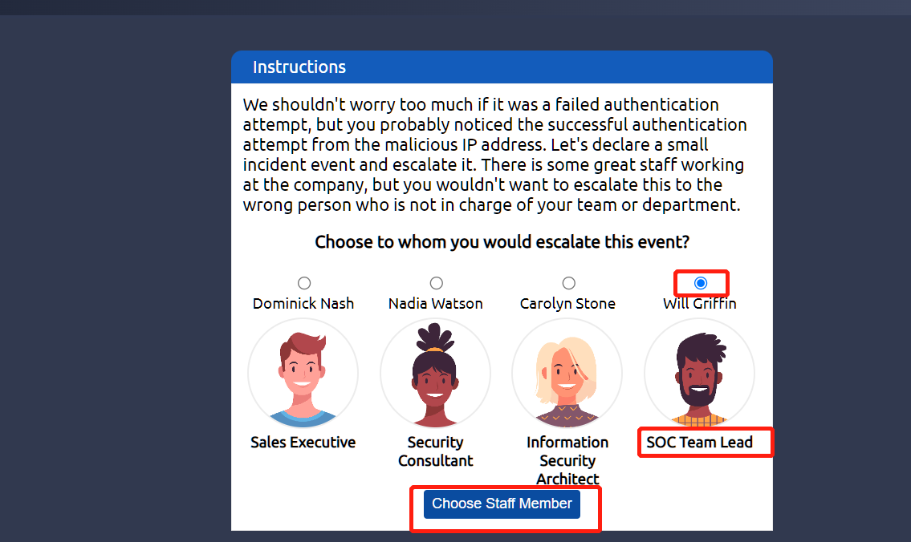<figcaption></figcaption></figure>

part5：经过事件上报后，我们已获得阻止恶意 IP 地址(143.110.250.149)访问目标公司的权限，我们可以执行阻止规则，通过防火墙阻止恶意 IP 地址访问目标公司。

<figure>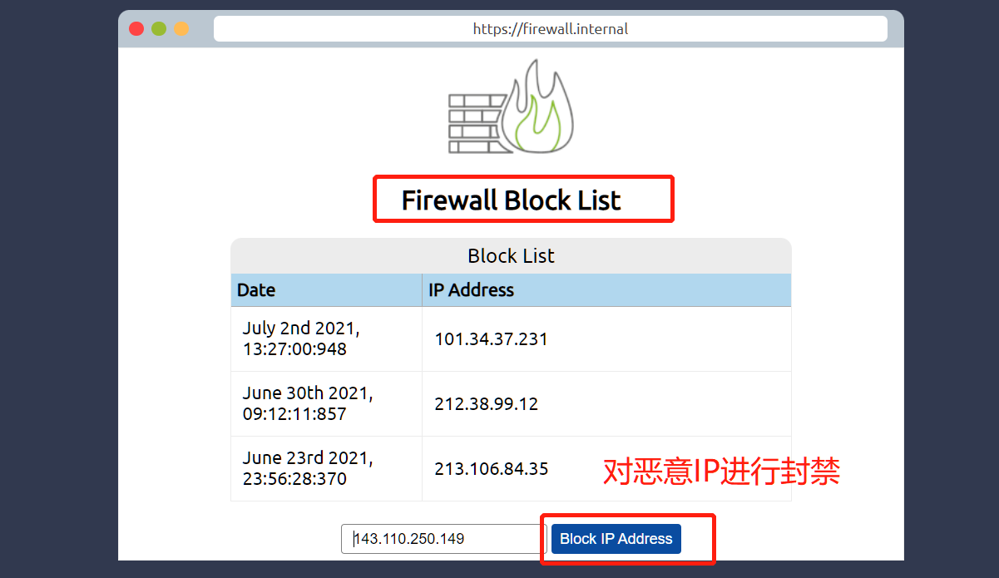<figcaption></figcaption></figure>

part6：我们成功完成了这个简单实例，最后我们获取到以下flag内容。

<figure><figcaption></figcaption></figure>

> 最后获取到的flag内容是：THM{THREAT-BLOCKED} 。

<figure>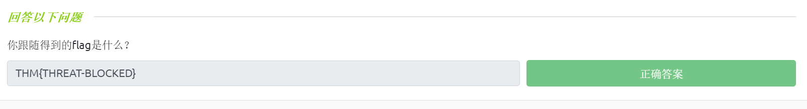<figcaption></figcaption></figure>
