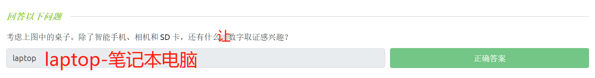
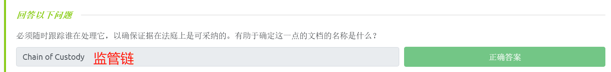
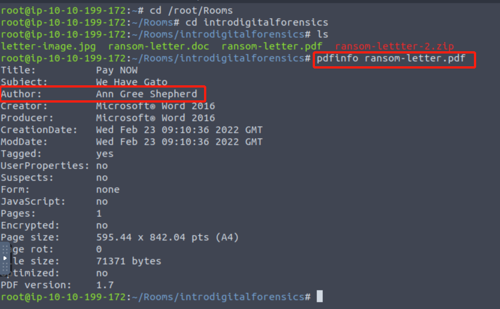
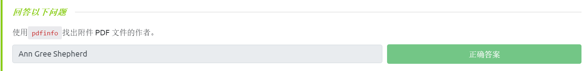
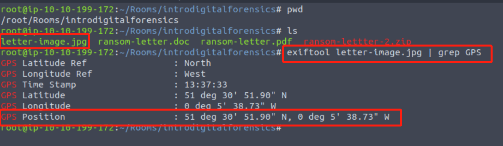
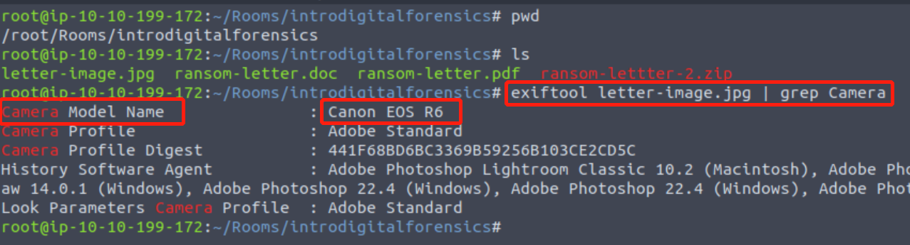
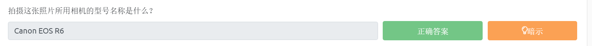

# Intro to Digital Forensics(数字取证介绍)

TryHackMe实验房间链接：[https://tryhackme.com/room/introdigitalforensics](https://tryhackme.com/room/introdigitalforensics)

## 简介

取证是指应用科学技术来调查犯罪情况和确定事实。随着计算机和智能手机等数字系统的使用和普及，为了调查和数字系统相关的犯罪情况，一个新的取证学分支得以诞生：计算机取证——后来逐渐演变为数字取证。

<figure><figcaption></figcaption></figure>

考虑以下场景——执法人员到达了犯罪现场，然而，这个犯罪现场的一部分包括了数字设备和数字媒体；数字设备包括台式电脑、笔记本电脑、数码相机、音乐播放器和智能手机等，而数字媒体则包括 CD、DVD、USB 闪存驱动器和外部存储设备。这就引出了以下几个问题：

* 警方应如何收集智能手机和笔记本电脑等设备中的数字证据？ 如果计算机和智能手机正在运行，应遵循哪些工作程序进行处理？
* 如何传输数字证据？例如，在移动计算机时是否有某些最佳实践方案可以遵循？
* 如何分析收集到的数字证据？个人设备的数据存储量可能在数十 GB 到数 TB 之间，应该如何进行分析？

<figure><figcaption></figcaption></figure>

假设嫌疑人拥有如上图所示的可疑数字设备和可疑数字媒体，我们可以进行快速查看并调查一些可能存有关键证据的数字设备、媒体；除了台式电脑之外，我们还注意到嫌疑人桌面上有平板电脑、智能手机、数码相机和 USB 闪存驱动器，这些设备及媒体中的任何一个都可能包含有助于案件调查的大量信息，执法者为了将这些设备作为证据进行处理 就需要用到数字取证技术。

更正式地说，数字取证就是应用计算机科学为达到法律目的而对数字证据展开调查。数字取证可用于进行以下两种类型的调查：

1. 公共部门调查，是指由政府和执法机构开展的调查，他们将参与犯罪调查或者民事调查。
2. 私营部门调查，是指公司机构通过指派私人调查员进行的调查，无论是内部调查还是外包调查，它们都是由违反公司政策的行为而引发的调查。

无论是调查犯罪行为还是调查违反公司政策的行为，部分证据都可能会与数字设备和数字媒体有关，这就是数字取证技术发挥作用并试图确定到底发生了什么的地方，没有训练有素的数字取证调查员的辛勤工作，就不可能正确地处理任何数字证据。

### **答题**

阅读本小节内容，并回答以下问题。

<figure><figcaption></figcaption></figure>

<figure><figcaption></figcaption></figure>

## 数字取证流程

<figure><figcaption></figcaption></figure>

假如你是一名数字取证调查员，你可能会看到与上图所示场景相类似的现场情况，为了扮演好数字取证调查员的角色，你接下来应该做什么？在获得适当的合法授权后，进行数字取证的基本计划如下：

1. 获取证据：收集可疑的笔记本电脑、存储设备、数码相机等数字设备。（注意：当笔记本电脑和计算机在打开状态时 需要进行特殊处理，但本文在此不做深入介绍）
2. 建立监管链(Establish a chain of custody)：适当填写相关表格（可基于[表格样本](https://www.nist.gov/document/sample-chain-custody-formdocx)），这一步的目的是要确保只有经过授权的调查人员才能访问数字证据，以保证没有其他人可以篡改证据。
3. 将证据放在安全的容器中：你要确保数字证据不被损坏，对于智能手机而言，你需要确保它们无法访问网络，以免被其他人远程擦除数据。
4. 将证据传送到你的数字取证实验室。

在数字取证实验室中，相关的操作过程如下：

1. 从安全容器中检索数字证据。
2. 创建证据的取证副本：取证副本需要使用高级软件进行创建 以避免修改原始数据。
3. 将数字证据返回到安全容器：之后你将处理取证副本，如果你不小心损坏了取证副本，你可以随时再创建一个新副本。
4. 在取证工作站上处理取证副本。

以上步骤改编自[《计算机取证和调查指南》第 6 版](https://www.cengageasia.com/TitleDetails/isbn/9781337568944)。

简而言之，进行数字取证时要注意以下几点：

* 适当的搜查权限：调查人员不能在没有适当的法律权限的情况下 开始进行数字取证操作。
* 监管链：这对于随时跟踪谁在持有数字证据是必要的。
* 数学验证：通过使用一种特殊的数学函数，该函数称为散列（hash-哈希）函数，我们可以确认原数字文件未被修改。
* 使用经过验证的工具：应对数字取证中使用的工具进行验证，以确保它们能够正常工作；例如，如果你正在创建磁盘映像，你希望能够确保 最终得到的取证映像与磁盘上的原数据相同。
* 可重复性：只要具备适当的技能和工具，就可以复制数字取证的结果。
* 报告：数字取证调查以一份报告结束，该报告将显示与所发现案件相关的证据。

### **答题**

阅读本小节内容，并回答以下问题。

<figure><figcaption></figcaption></figure>

## 数字取证的简单实例

我们在数字设备上所做的一切，从智能手机到电脑，都会留下痕迹，让我们看看我们如何在后续调查中使用它。

本小节实例场景介绍：我们的猫Gado被绑架了，绑架者向我们发送了一份包含他们要求的 MS Word 文档格式的文档；为了方便起见，我们已将相关文档转换为了 PDF 格式并从 MS Word 文件中提取出了图像；我们接下来要对 目标pdf文件 以及 目标jpg文件 进行简单的数字取证分析。

你可以通过使用TryHackMe中和本文相关的实验房间页面--下载附件到你的本地机器上进行检查；或者直接打开 在对应实验房间页面所部署的 AttackBox 上的终端，然后转到目录 /root/Rooms/introdigitalforensics 进行文件检查。

```shell
#使用TryHackMe所提供的AttackBox上的终端
root# cd /root/Rooms
root# cd introdigitalforensics
root# ls
letter-image.jpg  ransom-letter.doc  ransom-letter.pdf  ransom-lettter-2.zip
```

### **文档元数据**

当你创建简单的文本文件 TXT 时，操作系统会自动保存一些元数据，例如文件创建日期和上次修改日期；而当你使用更高级的编辑器（例如 MS Word）进行文件创建时，会有更多的信息被保留在文件的元数据中。 有多种读取文件元数据的方法，你可以使用一些官方查看器/编辑器打开文件读取元数据 或者 选择使用合适的取证工具对文件进行元数据读取，请注意，如果你将原始文件导出为其他格式如 PDF 格式，则将保留原始文档的大部分元数据，这具体取决于你所使用的 PDF 编辑器。

如果我们要从PDF 文件中获取信息，我们可以尝试使用 _**pdfinfo**_&#x5DE5;具 来读取pdf文件的元数据。使用 _**pdfinfo**_ 会显示与 PDF 文件相关的各种元数据，例如标题、主题、作者、创建者和创建日期。 （如果你使用的是 Kali Linux 并且没有安装 _**pdfinfo**_，则可用 `sudo apt install poppler-utils` 命令来进行安装）

以下为使用`pdfinfo DOCUMENT.pdf`命令的示例。

```shell
user@TryHackMe$ pdfinfo DOCUMENT.pdf 
Creator:        Microsoft® Word for Office 365
Producer:       Microsoft® Word for Office 365
CreationDate:   Wed Oct 10 21:47:53 2018 EEST
ModDate:        Wed Oct 10 21:47:53 2018 EEST
Tagged:         yes
UserProperties: no
Suspects:       no
Form:           none
JavaScript:     no
Pages:          20
Encrypted:      no
Page size:      595.32 x 841.92 pts (A4)
Page rot:       0
File size:      560362 bytes
Optimized:      no
PDF version:    1.7
```

以上 PDF 元数据清楚地表明它是在 2018 年 10 月 10 日使用 MS Word for Office 365 创建的。

### **答题**

_问题：使用 pdfinfo，找出和本实验房间页面所提供的pdf附件相关的作者信息。(我们使用和本文相关的 TryHackMe实验房间页面所提供的 AttackBox 进行分析)_

```shell
cd /root/Rooms
cd introdigitalforensics
ls
pdfinfo ransom-letter.pdf
```

<figure><figcaption></figcaption></figure>

> 目标pdf文件作者是：Ann Gree Shepherd

<figure><figcaption></figcaption></figure>

### **照片 EXIF 数据**

EXIF 代表 可交换图像文件格式(Exchangeable Image File Format)，它是将元数据保存到图像文件的标准。每当你使用智能手机或数码相机拍照时，图像中都会嵌入大量信息，以下是可以在原始数字图像中找到的元数据示例：

* 相机型号/智能手机型号
* 拍摄图像的日期和时间
* 照片设置，例如焦距、光圈、快门速度和 ISO 设置等

由于智能手机可能配备了 GPS 传感器，因此也很有可能通过照片找到嵌入在图像中的 GPS 坐标(GPS 坐标，即纬度和经度)，这通常会暴露出照片的拍摄地点。

有许多在线和离线工具可以从图像中读取 EXIF 数据，比如命令行工具 `exiftool` ，`exiftool` 可用于读取和写入各种文件类型（例如 JPEG 图像）中的元数据。 （如果你使用的攻击机是Kali Linux 并且没有安装 `exiftool`，则可以输入 `sudo apt install libimage-exiftool-perl` 命令安装`exiftool`）

只要执行简单的 `exiftool IMAGE`命令，就能读取嵌入到图像文件中的所有 EXIF 数据：

```shell
user@TryHackMe$ exiftool IMAGE.jpg
[...]
GPS Position : 51 deg 31' 4.00" N, 0 deg 5' 48.30" W
[...]
```

如果我们通过在线地图搜索上述得到的坐标位置，则将了解有关照片拍摄位置的更多信息。我们可以在 [Microsoft Bing 地图](https://www.bing.com/maps) 或者 [谷歌地图](https://www.google.com/maps) 上搜索 51° 31' 4.00" N，0° 5' 48.30" W ，我们会发现这些坐标将表明 目标照片是在一个非常靠近伦敦博物馆的地方拍摄的（我们用 ° 替换 deg，以便我们使用地图搜索），同时，我们还能注意到 以上坐标在搜索页面上会被转换为十进制表示——51.517776,-0.09675 。

### **答题**

_问题：使用 exiftool 或任何类似工具，尝试找到 和本实验房间页面所提供的图像附件相关的街道名称。(我们使用和本文相关的 TryHackMe实验房间页面 所提供的 AttackBox 进行分析)_

```shell
exiftool letter-image.jpg | grep GPS
```

<figure><figcaption></figcaption></figure>

<figure><figcaption></figcaption></figure>

> 从 exiftool 获得的 GPS 坐标是 51 deg 30' 51.90" N，0 deg 5' 38.73" W （在使用地图检索时，请用 ° 替换 deg 并在搜索前 删除数字和 ° 符号之间的空格）。
>
> 最终我们将使用在线地图搜索以下坐标：51°30'51.9"N 0°05'38.7"W

<figure><figcaption></figcaption></figure>

_问题：继续分析以上图像附件，拍摄目标照片所用的相机型号名称是什么？(我们使用和本文相关的 TryHackMe实验房间页面 所提供的 AttackBox 进行分析)_

```shell
#要仅显示带有单词“Camera”的行，可以使用 exiftool PHOTO.jpg | grep Camera 命令
exiftool letter-image.jpg | grep Camera
```

<figure><figcaption></figcaption></figure>

> 拍摄目标照片所用的相机型号名称为：Canon EOS R6

<figure><figcaption></figcaption></figure>
