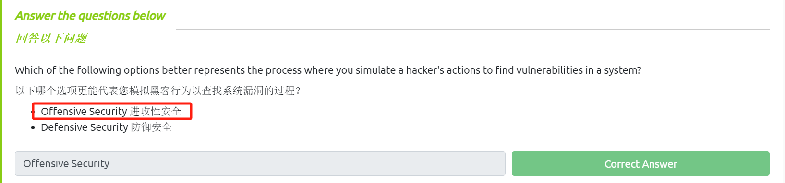
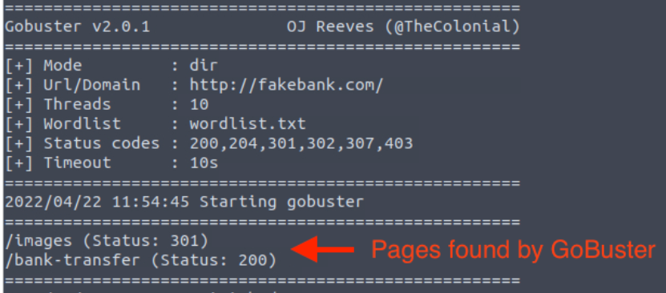
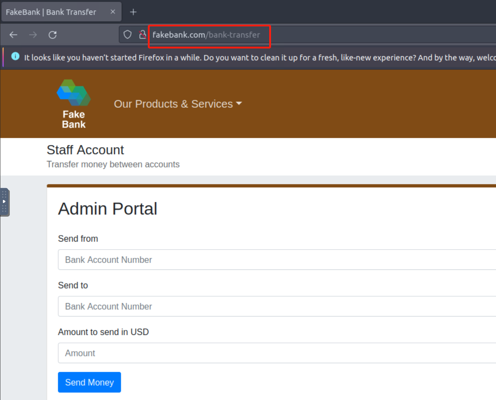
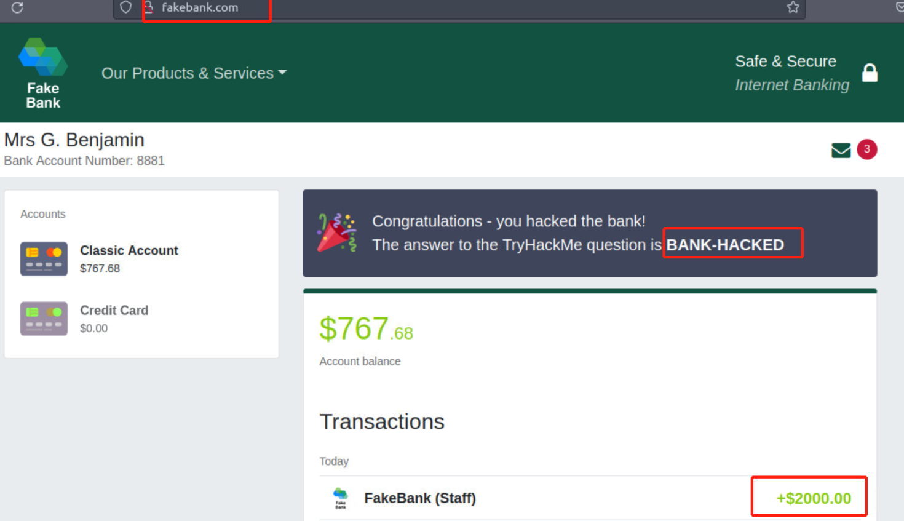
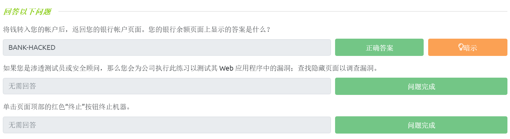

# ☑ Intro to Offensive Security(进攻性安全介绍)

TryHackMe实验房间链接：[https://tryhackme.com/room/introtooffensivesecurity](https://tryhackme.com/room/introtooffensivesecurity)

### 什么是进攻性安全？

<figure><figcaption></figcaption></figure>

简而言之，进攻性安全就是尝试闯入目标计算机系统、利用软件本身的错误并找到应用程序中的漏洞以获得对目标的未授权访问的过程。

要打败黑客，你就需要像黑客一样行事，作为合法的网络安全人员，你需要在网络犯罪分子发动攻击之前发现目标系统的漏洞并推荐安装漏洞补丁。

<figure><figcaption></figcaption></figure>

另一方面，还有防御性安全，即通过分析和巩固任何潜在的数字威胁来保护企业、组织的网络和计算机系统的过程。

在防御性网络角色中，你可以调查受感染的计算机或设备，以了解它是如何被黑客攻击的，还可以跟踪网络犯罪分子的网络行为或者监控可能发生恶意活动的网络基础设施。

#### 答题

阅读本小节内容，并回答以下问题。

<figure><figcaption></figcaption></figure>

### 攻击模拟示例

在本文相关的Tryhackme实验房间页面 部署虚拟实验环境，我们需要完成的操作是：攻击一个名为 FakeBank 的web应用程序（一个虚拟的银行web应用程序）。

我们将使用一个名为“GoBuster”的命令行工具来暴力破解 FakeBank 网站以查找隐藏目录或者页面，GoBuster 将使用一个包含潜在的页面名称或目录名称的字典，并尝试将该字典中的每一条记录和初始目标网站的url进行拼接，然后会逐个访问拼接之后的url，如果某个拼接之后的url所对应的网站页面真实存在，我们就能在GoBuster 的输出中得到对应的有效结果。

**步骤1）打开终端**

终端，也称为命令行，允许我们在不使用图形用户界面的情况下与计算机交互。

**步骤2）查找隐藏的网站页面**

大多数公司的网站都会有一个管理门户页面，此页面让公司员工能够访问基本的管理控制功能以进行一些日常操作。对于银行而言，员工可能需要将资金转入或者转出客户账户，如果网站页面不设为私有，那么攻击者就可能会找到显示敏感数据的隐藏页面或者允许访问网站管理控件的隐藏页面。

我们将在终端中键入以下命令，以使用 GoBuster（命令行安全工具）查找 FakeBank 网站上可能隐藏的页面。

```
gobuster -u http://fakebank.com -w wordlist.txt dir
```

在上面的命令中，`-u`选项 将指定我们需要进行扫描的目标网站，`-w`选项 将指定用于进行遍历的字典以帮助我们查找隐藏页面。

GoBuster 会使用字典中的每条记录来扫描目标网站，从而查找目标网站上可能存在的隐藏页面；最终我们在GoBuster的输出结果中 可以看到目标网站上确实存在的隐藏目录（Status: 200表示相关页面确实存在）。

<figure><figcaption></figcaption></figure>

**步骤3）攻击目标应用程序**

你应该已经找到了一个秘密的银行转账页面，这个页面(/bank-transfer)允许你在银行账户之间进行转账。

攻击者可以利用隐藏的银行转账页面从任何银行账户中窃取资金，这对银行来说是一个严重的安全风险；作为一名有道德的黑客，你应该（在获得许可的情况下）从目标公司的应用程序中尝试发现此漏洞，并在黑客利用这个漏洞之前将其报告给银行以便进行及时修复。

**答题**

_尝试在虚拟实验环境中对目标进行攻击，从银行账户号2276向你的账户（账户号8881）转账 2000美元。_

在终端界面输入以下命令：

```
gobuster -u http://fakebank.com -w wordlist.txt dir
```

<figure><figcaption></figcaption></figure>

访问找到的隐藏目录：

<figure><figcaption></figcaption></figure>

进行转账操作：

<figure><figcaption></figcaption></figure>

<figure><figcaption></figcaption></figure>

返回初始的银行账户页面--查看最终答案：

<figure><figcaption></figcaption></figure>

> 最终显示的答案为：BANK-HACKED

<figure><figcaption></figcaption></figure>

### 进攻性安全职业

以下是关于进攻性安全职业角色的简短描述：

* 渗透测试员 - 负责测试技术产品以发现可利用的安全漏洞。
* 红队 - 扮演对抗者的角色，攻击目标组织并从敌人的角度提供网络安全防护措施反馈。
* 安全工程师 - 设计、监控和维护安全控制、网络和系统，以帮助防止网络攻击。
