# Network Security(网络安全介绍)

TryHackMe实验房间链接：[https://tryhackme.com/room/intronetworksecurity](https://tryhackme.com/room/intronetworksecurity)

## 简介

计算机网络是一组相互连接的计算机和设备，而网络安全则侧重于保护这些设备以及连接它们的链路的安全。（更准确地说，网络安全包括了保护计算机网络及其数据的机密性、完整性和可用性的一切安全设备、安全技术和过程）

网络安全由不同的硬件和软件解决方案组成，以实现既定的安全目标。网络安全的硬件解决方案是指 你在网络中设置的用于保护网络安全的设备，这些设备是硬件，所以你可以在现实中接触到它们。硬件设备可能类似于下图：

<figure>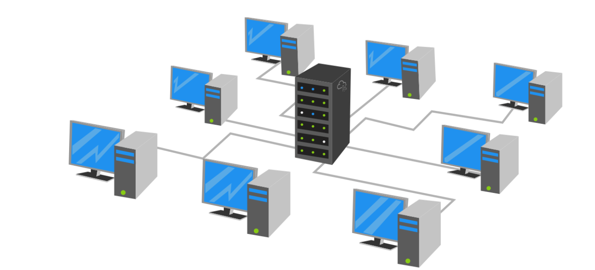<figcaption></figcaption></figure>

网络安全硬件设备的示例包括：

* 防火墙设备：防火墙将根据一组预定义的规则来允许和阻止连接，它将限制什么可以进入网络 和 什么可以离开网络。
* 入侵检测系统 (IDS) 设备：IDS 会检测系统入侵、网络入侵以及入侵企图，它会尝试检测攻击者侵入你的网络的企图。
* 入侵防御系统 (IPS) 设备：IPS 可阻止检测到的入侵行为和入侵企图，它旨在防止攻击者闯入你的网络。
* 虚拟专用网络 (VPN) 集线器设备：VPN 可确保网络流量无法被第三方读取或更改，它保护发送的数据的机密性（secrecy）和完整性。

<figure>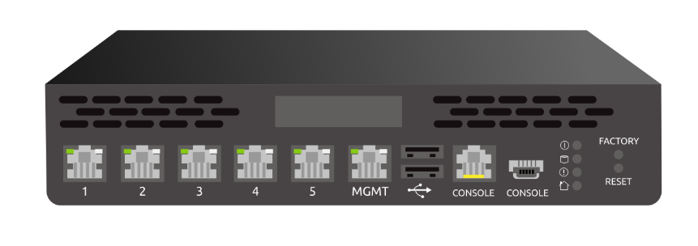<figcaption></figcaption></figure>

另一方面，网络安全也有软件解决方案，常见的例子有：

* 防病毒软件：你可以在计算机或者智能手机上安装防病毒软件以检测恶意文件并阻止它们的执行。
* 主机防火墙：与防火墙设备（硬件设备）不同，主机防火墙是作为操作系统的一部分而被提供的程序，或者是安装在操作系统上的程序。例如，MS Windows 操作系统中就包含了 Windows Defender 防火墙程序，Apple macOS 中也包含了应用防火墙(application firewal)，以上两者都是主机防火墙。

<figure>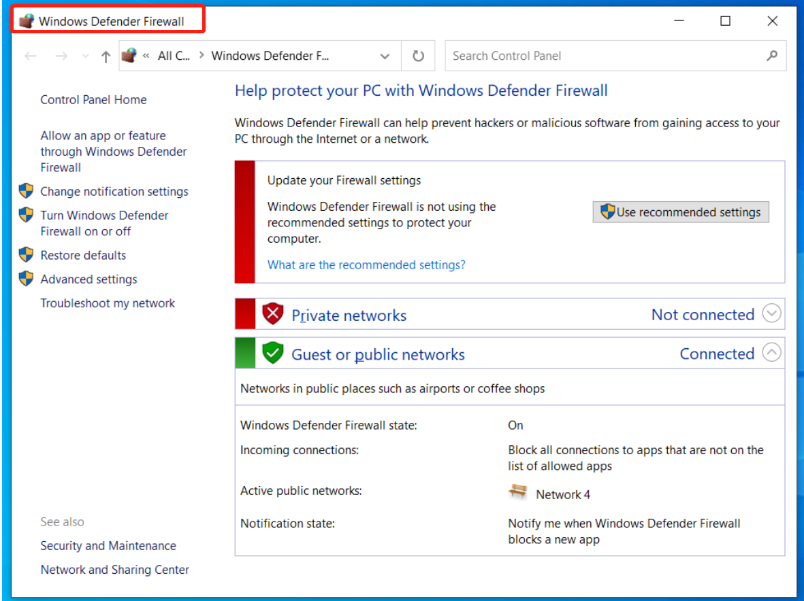<figcaption></figcaption></figure>

根据 IBM Security 发布的[《2021 年数据泄露成本报告》](https://newsroom.ibm.com/2021-07-28-IBM-Report-Cost-of-a-Data-Breach-Hits-Record-High-During-Pandemic)，2021 年数据泄露平均每起事件给公司造成 424 万美元的损失，而 2020 年为 386 万美元，平均成本因行业和国家/地区而异。 例如，医疗行业数据泄露的平均总成本为 923 万美元，而教育行业则为 379 万美元。

### **答题**

阅读本小节内容，并回答以下问题。

> Windows Defender 防火墙是什么类型的防火墙：Host Firewall

<figure>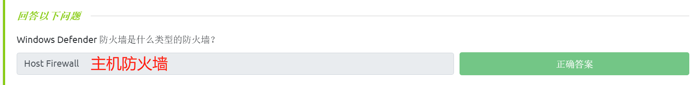<figcaption></figcaption></figure>

## 网络攻击步骤介绍

每个“操作”的执行 都需要拥有某种形式的计划才能最终取得成功。假如你对野生动物摄影感兴趣，除非你完全不在乎结果，否则你不能只是拿起相机就直接前往丛林进行摄影，为了安全、成功地进行野生动物摄影之旅，你往往需要更多地去了解你想要用相机拍摄的动物(这包括动物的习性和你要避免的危险)；以上例子同样适用于针对目标网络进行攻击的网络安全行动。

<figure>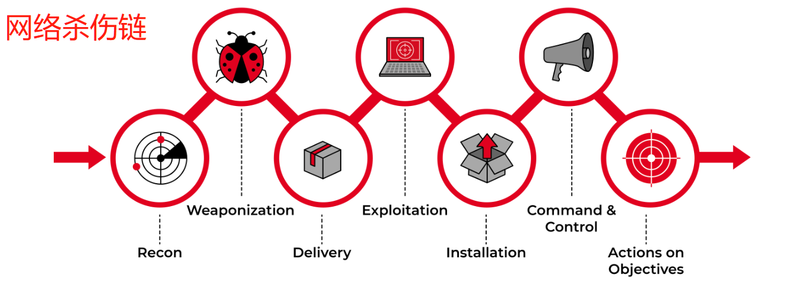<figcaption></figcaption></figure>

闯入目标网络通常包括多个步骤，根据[洛克希德·马丁公司](https://www.lockheedmartin.com/en-us/capabilities/cyber/cyber-kill-chain.html)的说法，网络杀伤链有七个步骤：

1. Recon(侦察)：Recon，是reconnaissance(侦察)的缩写，指的是攻击者将在此阶段 试图尽可能多地了解目标，主要包括——目标的服务器类型、操作系统、IP 地址、用户名和电子邮件地址等信息，获取到这些信息将有利于网络攻击成功。
2. Weaponization(武器化(：这一步是指准备一个带有恶意组件的文件，例如，相关恶意组件能够为攻击者提供远程访问。
3. Delivery(投递)：投递是指通过任何可行的方式将“武器化”的文件投递给目标，例如通过电子邮件或者U盘进行投递。
4. Exploitation(利用)：当用户打开（攻击者所投递的）恶意文件时，用户所使用的系统就会执行恶意组件。
5. Installation(安装)：经过上一步的恶意组件执行之后，目标系统就会被安装上恶意软件。
6. Command & Control(命令与控制-C2)：恶意软件的成功安装会为攻击者提供对目标系统的命令和控制能力。
7. Actions on Objectives(针对目标的行动)：在获得对一个目标系统的控制权后，攻击者就能够达到他们的行动目标，关于行动目标的示例：数据泄露（一旦成功窃取到了目标系统的数据，即代表攻击者达到了行动目标）。

<figure>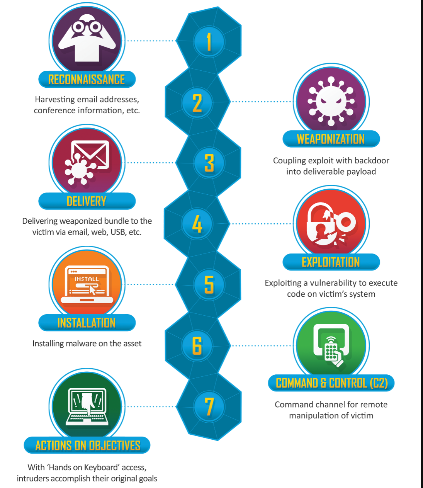<figcaption></figcaption></figure>

关于网络攻击步骤的另一个类比是：对目标房屋感兴趣的小偷。小偷在开始行动之前，往往会花一些时间了解目标房屋，谁住在那里，他们什么时候离开以及什么时候回家，小偷还会确定目标房屋是否有安装安全摄像头以及警报系统，一旦收集到足够的信息，小偷就会制定最佳的进入策略。关于物理盗窃的计划和执行在某种程度上也类似于旨在闯入网络并窃取数据的恶意攻击行为。

<figure><figcaption></figcaption></figure>

### **答题**

阅读本小节内容，并回答以下问题。

> 攻击者在网络杀伤链的哪一步收集有关目标的信息：Recon (侦察)

<figure>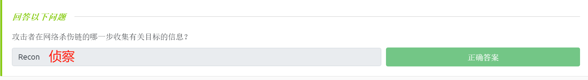<figcaption></figcaption></figure>

## 网络安全实例

在本小节的实例中，我们将尝试侵入目标 Linux 系统。

我们攻击的第一步是侦察；我们可以使用不同的工具来加快我们的侦察活动，这些工具将收集与目标相关的各个方面的信息。

为了简单起见，我们将在此使用Nmap工具，Nmap是 Network Mapper 的缩写，它是一个网络扫描器，可以帮助我们发现正在运行的机器（存活主机）以及在这些机器上运行的任何对外界可见的程序（计算机服务）。我们可以通过在终端提示符下运行 `nmap MACHINE_IP`命令来扫描目标IP：

```shell
#tips：在实际执行命令时，我们直接用目标ip地址代替下面命令中的MACHINE_IP。
root@AttackBox# nmap MACHINE_IP
Starting Nmap 7.92 ( https://nmap.org ) at 2022-04-06 17:38 EEST
Nmap scan report for MACHINE_IP
Host is up (0.00024s latency).
Not shown: 997 closed tcp ports (reset)
PORT   STATE SERVICE
21/tcp open  ftp
22/tcp open  ssh
80/tcp open  http

Nmap done: 1 IP address (1 host up) scanned in 0.33 seconds
```

我们发现了三个服务正在运行：

1. FTP 服务器：FTP 代表文件传输协议，用于在机器之间传输文件。
2. SSH 服务器：SSH 代表 Secure Shell，用于安全远程登录，换句话说，它允许你在远程系统上安全地执行命令。
3. HTTP 服务器：HTTP 代表超文本传输协议，用于web服务，每当你在网站上浏览网页时，你都在使用 HTTP协议 或 HTTPS协议，HTTPS 是 HTTP 的安全（加密）版本。

你还可以注意到 Nmap 会根据主机是否收到任何响应来报告主机是否已启动（存活），这有助于我们知道什么时候目标机器将显示没有端口打开或者显示没有端口可访问。

让我们尝试收集有关 FTP 服务器的更多信息：

1. 我们将在 AttackBox 的终端中输入 `ftp MACHINE_IP` 命令来连接到目标的 FTP 服务器。
2. 接下来我们尝试使用login anonymous登录，看看这个FTP服务器是否支持匿名登录。
3. 成功完成匿名登录之后，我们可以尝试使用命令 ls（list的缩写）来查看可用的文件，我们能得到文件名列表及文件的详细信息。
4. 如果你对所发现的任何文件感到好奇，可以使用 `get filename` 命令来进行下载，比如我想知道 secret.txt 文件包含什么，所以使用 `get secret.txt` 命令来进行文件下载。
5. 成功下载文件之后，键入 `exit` 或 `bye` 即可退出 FTP 客户端。

与目标FTP服务器的交互过程将如下所示：

```shell
root@AttackBox# ftp MACHINE_IP
Connected to MACHINE_IP (MACHINE_IP).
220 (vsFTPd 3.0.3)
Name (MACHINE_IP:root): anonymous
230 Login successful.
Remote system type is UNIX.
Using binary mode to transfer files.
ftp> ls
227 Entering Passive Mode (10,20,30,130,181,190).
150 Here comes the directory listing.
-rw-r--r--    1 ftp      ftp        425351 Apr 06 11:22 2680-0.txt
-rw-r--r--    1 ftp      ftp           356 Apr 06 11:22 2680.epub
-rw-r--r--    1 ftp      ftp        251857 Apr 06 11:22 55317-0.txt
-rw-r--r--    1 ftp      ftp           358 Apr 06 11:22 55317.epub
-rwxr-xr-x    1 ftp      ftp           214 Apr 06 11:22 backup.sh
-rw-r--r--    1 ftp      ftp            23 Apr 06 11:22 secret.txt
226 Directory send OK.
ftp> get secret.txt 
local: secret.txt remote: secret.txt
227 Entering Passive Mode (10,20,30,130,159,46).
150 Opening BINARY mode data connection for secret.txt (23 bytes).
226 Transfer complete.
23 bytes received in 0.00107 secs (21.48 Kbytes/sec)
ftp> exit
221 Goodbye.
```

我们注意到上述FTP服务器中一共有六个文件：三个 txt 文件、两个 epub 文件和一个 sh 文件。txt和epub扩展名分别用于文本文件和电子书文件，而 sh 扩展名则表示该文件是一个 shell 脚本，shell 脚本通常会包含一组需要重复执行的命令。

在我们使用 FTP 命令 `get secret.txt`下载文件secret.txt 并使用`exit`退出 FTP 客户端之后，我们就会返回到攻击机的终端界面；此时我们可以在攻击机的终端界面中使用`cat secret.txt`命令来显示 secret.txt 文件的文本内容。

```shell
root@AttackBox# cat secret.txt 
password: [redacted]   #实际上这行会显示密码信息，此处的redacted表示隐藏（相当于马赛克）的意思
```

我们得到了一个无意中复制到公共 FTP 服务器上的账户密码明文，让我们试试看它是否适用于 root 帐户（root账户在Linux系统上拥有完全的权限，可以读写任何文件，能够安装和删除任何程序）。在攻击机终端界面，我们可以输入 `ssh root@MACHINE_IP`来进行ssh登录，随后我们将被要求输入root账号的密码以进行身份验证，我们直接尝试输入我们在 FTP 服务器上发现的密码明文即可。

```shell
root@AttackBox# ssh root@MACHINE_IP
root@MACHINE_IP's password: 
Welcome to Ubuntu 20.04.4 LTS (GNU/Linux 5.4.0-107-generic x86_64)

 * Documentation:  https://help.ubuntu.com
 * Management:     https://landscape.canonical.com
 * Support:        https://ubuntu.com/advantage

  System information as of Thu  7 Apr 08:16:42 UTC 2022

  System load:  0.15              Processes:              225
  Usage of /:   64.6% of 6.53GB   Users logged in:        0
  Memory usage: 19%               IPv4 address for ens33: MACHINE_IP
  Swap usage:   0%

 * Super-optimized for small spaces - read how we shrank the memory
   footprint of MicroK8s to make it the smallest full K8s around.

   https://ubuntu.com/blog/microk8s-memory-optimisation

0 updates can be applied immediately.


Last login: Thu Apr  7 07:53:28 2022 from 10.10.10.1
```

以 root 身份完成ssh登录后，我们就可以完全控制目标服务器了，为了查找目标文件 我们可以使用以下 Linux 命令：

1. 使用`pwd`命令，pwd是print working directory 的缩写，此命令可用来查看我们在系统中的当前位置。
2. 使用`ls`命令来列出文件信息，查看文件列表中有无目标文件。
3. 使用`cat flag.txt`命令来查看文件内容。

```shell
root@AttackBox# pwd
/root
root@AttackBox# ls
flag.txt  snap
root@AttackBox# cat flag.txt 
[redacted]
```

因为我们以 root 身份完成了登录，所以我们可以完全访问所有文件，包括其他用户的文件，我们可以执行以下 Linux 命令进行探索：

1. 使用`cd /home` 命令转到包含所有用户主目录的目录吗，cd 是 change directory（更改目录）的缩写。
2. 我们在/home目录中运行`ls`命令，查看系统的所有用户名称，因为我们拥有系统管理员（root）权限，所以我们可以直接检查其他用户的主文件夹下的内容。
3. 使用`cd librarian`命令进入用户librarian的目录。
4. 使用 `pwd` 命令以查看我们在系统中的当前位置（ /home/librarian）。
5. 使用`ls`命令显示 librarian 目录下的文件信息，查看文件列表中有无目标文件。
6. 我们可以使用`cat flag.txt`命令打印文本文件内容到终端界面。

```shell
root@AttackBox# cd /home
root@AttackBox# ls
ftpsecure  librarian  strategos
root@AttackBox# cd librarian/
root@AttackBox# pwd
/home/librarian
root@AttackBox# ls
flag.txt
root@AttackBox# cat flag.txt 
[redacted]
```

<figure><figcaption></figcaption></figure>

让我们总结一下我们在本小节中的工作，我们的目标是获取IP地址为MACHINE\_IP的系统的root访问权限：

1. 我们使用 nmap 来了解目标机器正在运行的服务。
2. 我们连接到目标机的 FTP 服务器以了解有关其配置的更多信息。
3. 我们发现一个包含root密码的文件被错误地复制到了FTP服务器中的公共文件夹下。
4. 我们使用找到的密码，以root用户身份来进行ssh登录。
5. 最终，我们获得了所有用户文件的访问权限（因为此时的用户身份为root）。

### **答题**

_在本文相关的Tryhackme实验房间页面中部署虚拟实验环境，并完成本小节对应的实例。_

**问题**

1. secret.txt文件内容中的密码是什么？
2. /root目录中的flag.txt文件内容是什么？
3. /home/librarian目录中的flag.txt文件内容是什么？

**操作**

使用nmap进行端口扫描：

```shell
nmap -sV -sC -T4 10.10.98.42
```

<figure>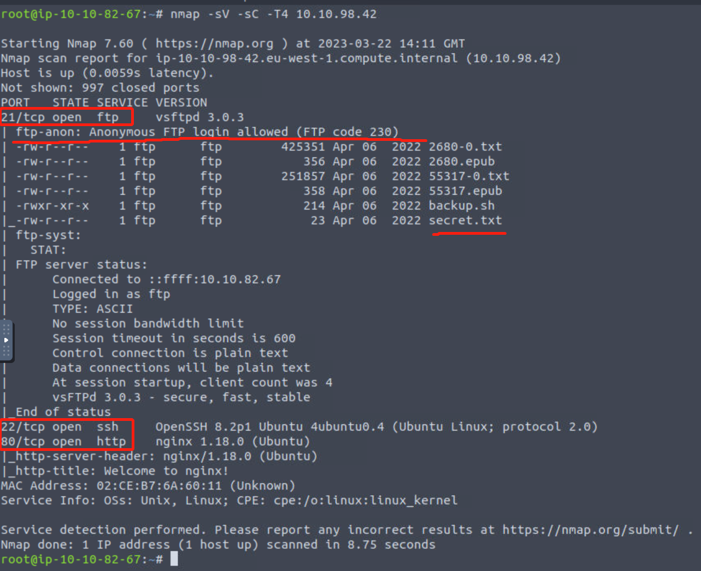<figcaption></figcaption></figure>

> 目标机器上存在FTP服务且允许进行匿名登录

针对目标机的ftp服务进行匿名登录尝试：

```shell
ftp 10.10.98.42
anonymous
ls
get secret.txt 
exit
```

<figure>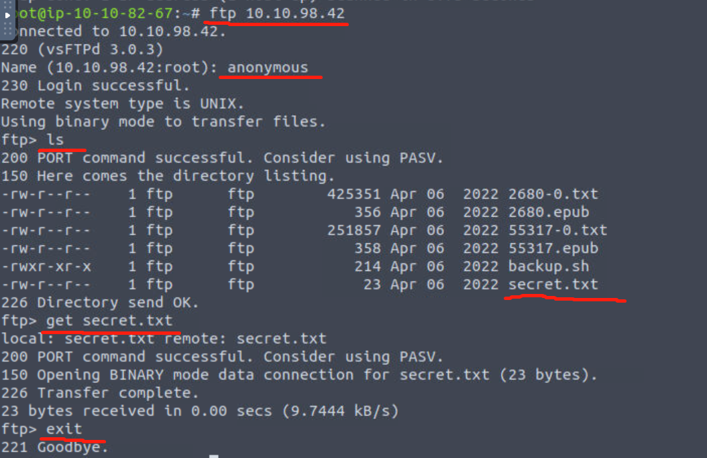<figcaption></figcaption></figure>

下载完敏感文件后，在攻击机终端查看到该文件内容为root用户的密码明文，所以我们基于已知密码 直接尝试以root用户身份进行ssh登录：

```shell
cat secret.txt #password: ABC789xyz123

ssh root@10.10.98.42
```

<figure>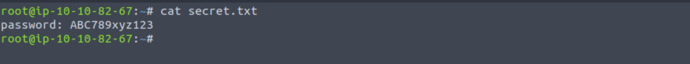<figcaption></figcaption></figure>

<figure><figcaption></figcaption></figure>

> secret.txt文件内容中的密码是：ABC789xyz123 。

成功完成ssh登录成功后，我们获得了root权限，接下来我们将查找目标系统上的目标文本文件并查看相关的文本内容：

```shell
cd /root
ls
cat flag.txt

cd /home
ls
cd /home/librarian/
ls
cat flag.txt
```

<figure>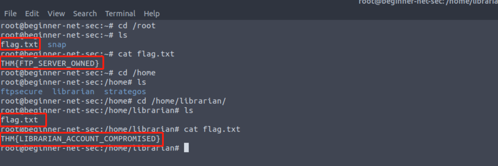<figcaption></figcaption></figure>

> /root目录中的flag.txt文件内容是：THM{FTP\_SERVER\_OWNED} 。
>
> /home/librarian目录中的flag.txt文件内容是：THM{LIBRARIAN\_ACCOUNT\_COMPROMISED} 。

<figure>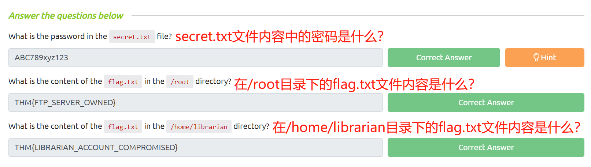<figcaption></figcaption></figure>
