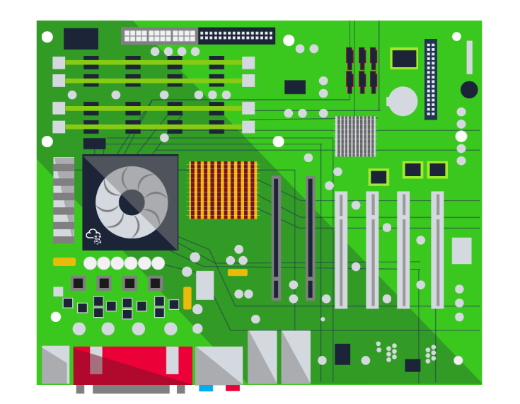
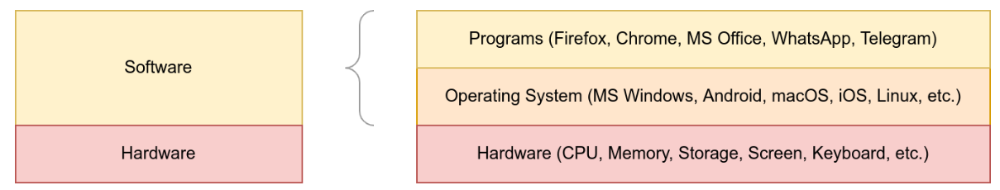
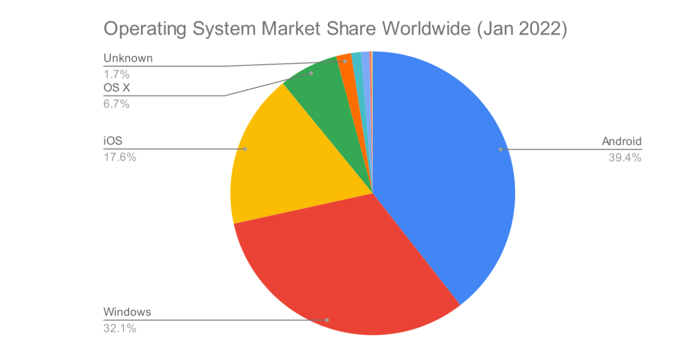
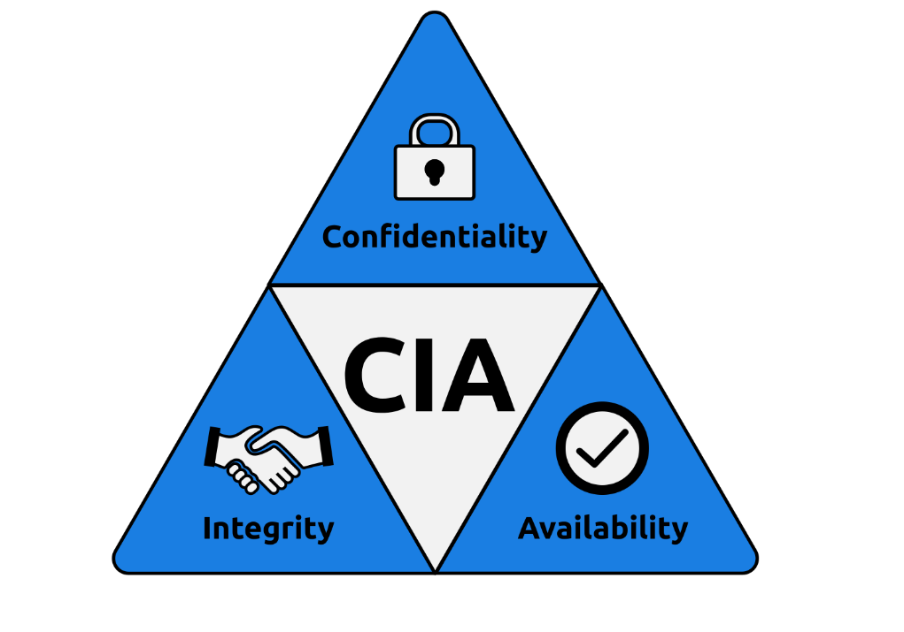
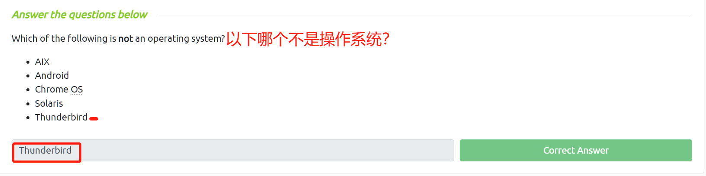
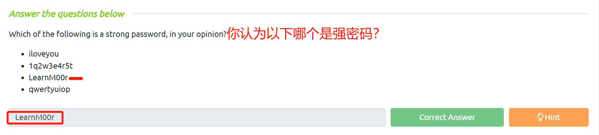
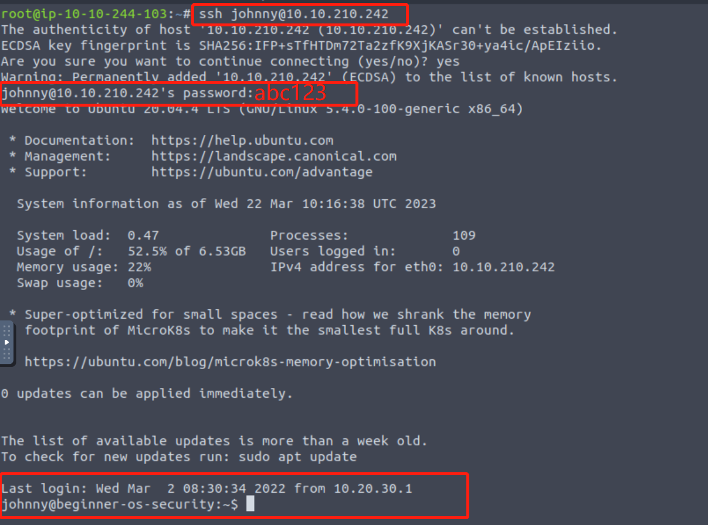
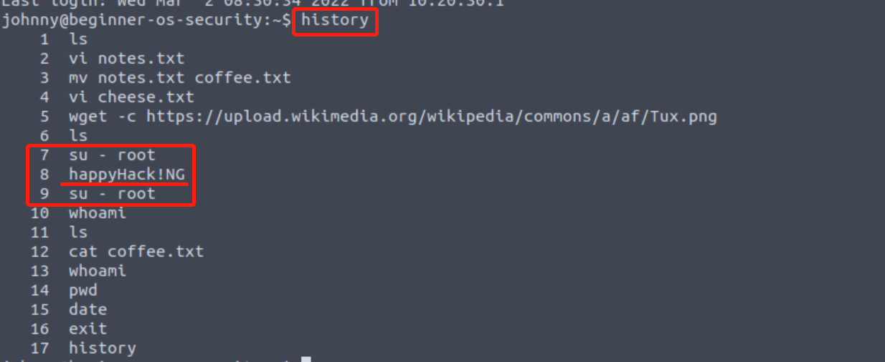
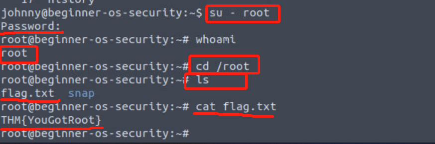
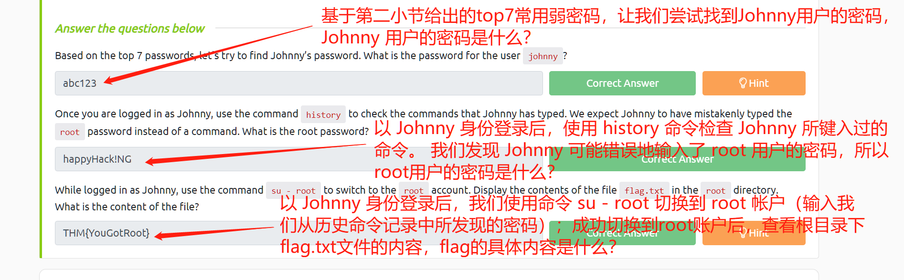

# Operating System Security(操作系统安全介绍)

TryHackMe实验房间链接：[https://tryhackme.com/room/operatingsystemsecurity](https://tryhackme.com/room/operatingsystemsecurity)

## 操作系统安全简介

每天当你使用智能手机或者笔记本电脑以及其他任何类型的计算机时，你都会直接或间接地与操作系统进行交互；常用的操作系统包括 MS Windows、macOS、iOS、Android、Chrome OS 和 Linux。


什么是操作系统？ 要定义操作系统，我们首先需要知道一个计算机术语：硬件。

计算机硬件是指所有可以用手触摸到的计算机部件和外围设备。硬件包括屏幕、键盘、打印机、U盘和主板；其中主板包含了许多组件，特别是中央处理器（CPU）和内存芯片（RAM），主板通常会连接存储设备（HDD-机械硬盘 或 SSD-固态硬盘）。

<figure><figcaption></figcaption></figure>

主板是计算机的关键部分，从键盘和鼠标到屏幕和打印机的所有其他硬件都将连接到计算机主板；但是，如果你想在计算机中运行自己喜欢的程序或者应用程序，硬件组件本身是没办法直接被使用的，所以我们需要一个操作系统来控制和“驱动”这些硬件组件。

<figure><figcaption></figcaption></figure>

操作系统 (OS) 是位于硬件与你正在运行的应用程序或者程序之间的层。

你日常使用的示例程序可能包括网络浏览器，例如 Firefox、Safari 和 Chrome，以及消息传递应用程序，例如 Signal、WhatsApp 和 Telegram。所有的程序和应用程序都不能直接在计算机硬件上运行，但是，它们能够运行在操作系统上，操作系统能够允许程序按照特定的规则去访问硬件。

某些操作系统专为在笔记本电脑和个人台式机上运行而设计，例如 MS Windows 11 和 macOS；还有某些操作系统专为智能手机而设计，例如 Android 和 iOS；另外还有用于服务器的操作系统，例如 [MS Windows Server 2022](https://www.microsoft.com/en-us/windows-server/)、[IBM AIX](https://www.ibm.com/products/aix) 和 [Oracle Solaris](https://www.oracle.com/solaris)；最后，还有一些在个人计算机上以及在服务器上都能被使用的操作系统，比如Linux。

下图是2022 年 1 月期间收集的数据，这些数据显示了当时 用于浏览互联网的不同操作系统的流行程度。

<figure><figcaption></figcaption></figure>

你的智能手机可能运行在 Android 或 iOS操作系统上，并且其中可能拥有关于你的大量私人数据，包括：

1. 与家人和朋友的私人谈话
2. 与家人和朋友的私人照片
3. 你用于个人和工作通信的电子邮件客户端
4. 保存在网络浏览器中密码（甚至保存在笔记中的密码）
5. 电子银行应用程序

关于机密和私人数据的清单可能还有更多内容，你应该不会希望你所不信任的人打开你的手机并浏览你的照片、对话和应用程序；因此，你需要保护好自己的手机及其操作系统的安全。

保护私人数据同样适用于 运行了 MS Windows、macOS、Linux 等操作系统的笔记本电脑或计算机，你的计算机中很可能包含了大量信息，例如：

1. 与你的工作或大学相关的机密文件
2. 你的私人个人文件，例如你的身份证或护照复印件
3. 你所使用的电子邮件程序，例如 MS Outlook、Mozilla Thunderbird等
4. 你保存在网络浏览器和其他应用程序中的密码
5. 你的数码相机和智能手机中的照片的复印件

这些关于私人信息的列表可能会很长，具体内容取决于用户类型。

考虑到所保存的数据的性质，你肯定会希望能够尽量确保个人信息安全，而当我们谈论到信息安全时，我们应该想到要保护好以下几点：

* 机密性(Confidentiality)：你希望确保 机密的和私人的文件、信息仅供指定人员使用。
* 完整性(Integrity)：任何人都不能篡改存储在你的系统上的文件 或者 篡改你在网络上传输的文件。
* 可用性(Availability)：你希望你的笔记本电脑或智能手机在你决定使用时能够随时处于可用状态。

tips：Confidentiality、Integrity、Availability——即CIA三合一模型。

<figure><figcaption></figcaption></figure>

### **答题**

阅读本小节内容，并回答以下问题。

<figure><figcaption></figcaption></figure>

## 关于操作系统安全的常见示例

正如我们在上一小节中所提到的，操作系统安全将涉及针对以下几个方面的攻击：

* Confidentiality-机密性
* Integrity-完整性
* Availability-可用性

在本小节，我们将重点关注恶意用户所针对的三个安全缺陷：

1. 身份验证中的弱密码
2. 弱文件权限
3. 恶意程序

### 身份验证中的弱密码

身份验证是验证你身份的行为，无论是本地系统还是远程系统，身份验证可以通过三种主要方式实现：

* 你知道的信息，例如密码或 PIN 码。
* 你是什么，例如指纹。
* 你拥有的东西，例如可以接收 SMS(短信服务) 消息的电话号码。

由于密码是最常见的身份验证形式，因此它们也是最容易受到攻击的。许多用户倾向于在网站上使用容易猜到的简单密码 或者 在多个网站上使用相同的密码；此外，一些用户是设置密码时 会依赖个人详细信息，例如出生日期和宠物的名字等，他们认为这很容易记忆并且不会被攻击者知道（事实上攻击者已经意识到了：用户在设置密码时，会倾向于依赖个人详细信息）。

2019 年 4 月 21 日 英国国家网络安全中心 (NCSC) 发布了 [100,000 个最常用密码](https://www.ncsc.gov.uk/blog-post/passwords-passwords-everywhere)的列表，让我们看看常用的前 20 个密码(Top20)。

```shell
Rank	          Password
1	              123456
2	              123456789
3	              qwerty
4	              password
5	              111111
6	              12345678
7	              abc123
8	              1234567
9	              password1
10	              12345
11	              1234567890
12	              123123
13	              000000
14	              iloveyou
15	              1234
16	              1q2w3e4r5t
17	              qwertyuiop
18	              123
19	              monkey
20	              dragon
```

阅读以上Top20密码列表：我们可以看到 123、1234、12345、...、123456789 和 1234567890 都在列表中，password、iloveyou、monkey、dragon等也是常用的英文，而在英文字典中没有的无含义词包括 qwerty、qwertyuiop 和 1q2w3e4r5t，这些看似复杂的(无含义词)密码 其实也非常容易预测，因为它们是遵循键盘布局进行输入的。


简而言之，如果攻击者可以猜出你的任何在线帐户（例如你的电子邮件或社交媒体帐户）的密码，他们将能够直接访问你的私人数据。 因此，选择复杂的密码，并且在不同的账户下使用不同的密码是至关重要的。

### 弱文件权限

适当的安全性决定了最小特权原则。在工作环境中，你希望任何文件都只有那些需要访问它才能完成工作的人 有权进行访问；在个人层面上，假设你计划与家人或朋友一起去旅行，你可能只希望与参加该旅行的人共享与旅行计划相关的所有文件，而不想直接公开让所有人共享此类文件——这就是最小特权原则。简而言之，最小特权原则是指：我们要确定“谁才可以访问什么？”。

弱文件权限会使攻击者很容易针对机密性和完整性进行攻击：攻击者可以攻击机密性，因为弱权限允许他们访问他们不应该访问的文件；攻击者也可以攻击完整性，因为他们能够修改他们不应该进行编辑的文件。

### 恶意程序

我们要举的最后一个例子是恶意程序，根据恶意程序的类型，它们可以针对机密性、完整性和可用性进行攻击。

<figure><figcaption></figcaption></figure>

某些类型的恶意程序（例如特洛伊木马）允许攻击者访问你的系统，因此，攻击者将能够读取你的文件甚至修改你的文件。

某些类型的恶意程序会针对可用性进行攻击，例如勒索软件(ransomware)。勒索软件是一种能够加密用户文件的恶意程序，加密能够使文件在不知道加密密码的情况下变得不可读，换句话说，文件在没有进行解密（逆向加密）的情况下会变成乱码。在勒索软件事件中，攻击者往往会为用户提供恢复文件可用性的方法，攻击者会让用户重新获得对其原始文件的访问权限：当用户愿意支付“赎金-ransom”时，攻击者则会向用户提供加密密码以进行解密。

### **答题**

阅读本小节内容，并回答以下问题。

<figure><figcaption></figcaption></figure>

## 关于操作系统安全的简单实例

在典型的网络攻击中，攻击者可能会试图获得对远程目标系统的访问权，我们可以通过诱使目标运行恶意文件或者通过直接获取用户名、密码来完成此类攻击。

在本小节我们将重点关注：通过获取用户名、密码来获得对远程目标系统的访问权。 在发现有效用户名后，我们往往可以尝试“猜测”对应的密码，此外，我们也将进一步尝试将权限提升到系统管理员。

系统管理员账号身份在安卓、苹果、Linux系统上被称为**root**，而在 MS Windows 系统上，管理员账号身份会被称为**administrator**，root 账户和administrator 账户对目标系统都具有完全不受限制的访问权限。

在本小节中，我们将使用Linux系统进行练习，我们将可能使用以下 Linux 命令：

* `whoami`
* `ssh USERNAME@MACHINE_IP`
* `ls`
* `cat FILENAME`
* `history`

**模拟场景**：

我们受雇检查某家公司的安全性，当我们查看客户的办公室环境时，我们注意到其中一张桌子上有留有便条，上面有两个词：sammie和dragon，让我们猜测一下dragon是不是Sammie用户在目标机器上所使用的密码。在AttackBox终端中，我们将尝试通过执行`ssh sammie@MACHINE_IP`命令来登录到Sammie的ssh帐户，远程目标系统会要求提供sammie的密码——我们输入dragon进行尝试。

<figure><figcaption></figcaption></figure>

AttackBox终端上的登录交互如下所示：

```shell
user@AttackBox# ssh sammie@MACHINE_IP
sammie@MACHINE_IP's password: 
Welcome to Ubuntu 20.04.4 LTS (GNU/Linux 5.4.0-100-generic x86_64)

 * Documentation:  https://help.ubuntu.com
 * Management:     https://landscape.canonical.com
 * Support:        https://ubuntu.com/advantage

  System information as of Tue  1 Mar 13:20:32 UTC 2022

  System load:  0.03              Processes:              216
  Usage of /:   51.8% of 6.53GB   Users logged in:        1
  Memory usage: 17%               IPv4 address for ens33: MACHINE_IP
  Swap usage:   0%

 * Super-optimized for small spaces - read how we shrank the memory
   footprint of MicroK8s to make it the smallest full K8s around.

   https://ubuntu.com/blog/microk8s-memory-optimisation

0 updates can be applied immediately.


Last login: Tue Mar  1 09:46:11 2022 from MACHINE_IP
```

成功通过ssh完成登录后，我们可以使用`whoami`命令 来验证当前用户身份是否为--sammie；我们可以使用 `ls`(list 的缩写)命令 来列出当前目录中的文件，此命令将显示出当前目录中的所有文件，但隐藏文件并不会显示；如果要显示任何文本文件的内容，我们可以使用命令 `cat FILENAME`，cat是concatenate 的缩写，此命令将在终端屏幕上打印出文本文件的内容。

在下面的终端交互中，我们看到了四个命令的使用情况：`ssh`、`whoami`、`ls` 和 `cat` 。

```shell
user@AttackBox# ssh sammie@10.20.30.130
sammie@10.20.30.130's password: 
Welcome to Ubuntu 20.04.4 LTS (GNU/Linux 5.4.0-100-generic x86_64)

[...]

Last login: Tue Mar  1 14:45:53 2022 from 10.20.30.1
sammie@beginner-os-security:~$ whoami
sammie
sammie@beginner-os-security:~$ ls
country.txt  draft.md  icon.png  password.txt  profile.jpg
sammie@beginner-os-security:~$ cat draft.md 
# Operating System Security

Reusing passwords means that your password for other sites becomes exposed if one service is hacked.
sammie@beginner-os-security:~$
```

接下来，我们将介绍的最后一个命令是 `history`，此命令将在终端界面打印出用户曾经使用的命令；当你使用`history`命令之后，也许能在终端输出结果中找到一些敏感信息。

假设我们已经知道了另外两个可以访问目标机器的用户名：

* _**johnny**_
* _**linda**_

如果以上两个用户都很少考虑安全性，我们可以使用多种方式来猜测这两个用户的密码，此处我们将列出以下两种情况：

* 如果你未以 sammie用户 或任何其他用户身份完成ssh登录操作，你可以直接使用 `ssh johnny@MACHINE_IP`命令并手动尝试输入多个密码进行猜测，以查看哪个密码对 johnny用户 有效。
* 如果你已经以 sammie用户 或任何其他用户身份完成了ssh登录操作，你可以使用 `su - johnny`命令 来切换用户身份，并手动尝试输入一个又一个密码，以查看哪个密码对 johnny用户 有效。

### **答题**

_在本文相关的Tryhackme实验房间页面中部署虚拟实验环境，并完成本小节对应的实例。_

_**问题：**_

1. 根据本文所介绍的Top 7 常用密码，让我们尝试找出 Johnny 的密码，用户 johnny 的密码是什么？
2. 以 Johnny 身份登录后，使用`history`命令检查 Johnny 曾经键入过的命令，我们发现Johnny错误地把 root 密码当成命令输入过，root密码的内容是什么？
3. 以 Johnny 身份登录后，使用命令 `su - root` 切换到 root 帐户(并输入root密码通过身份验证)，查看根目录下的flag.txt的内容，flag.txt的内容是什么？

_**操作：**_

我们可以使用以下命令针对目标机器进行ssh登录尝试：

```shell
ssh johnny@10.10.210.242
#经过登录尝试发现可用密码：abc123
```

<figure><figcaption></figcaption></figure>

> 用户 johnny 的密码是：abc123

成功完成ssh登录后，输入`history`命令：发现root用户的密码。

<figure><figcaption></figcaption></figure>

> root用户的密码为：happyHack!NG 。

切换用户身份到root（使用我们刚才找到的密码完成身份验证），以root用户身份查找flag.txt文件 并获取其文本内容：

<figure><figcaption></figcaption></figure>

> flag.txt的内容是：THM{YouGotRoot} 。

<figure><figcaption></figcaption></figure>
