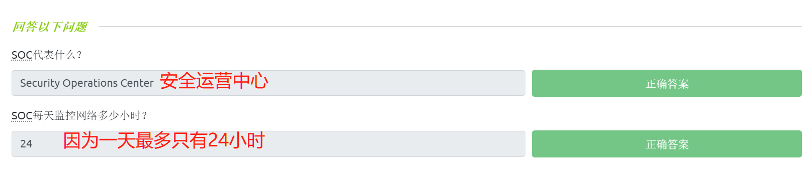
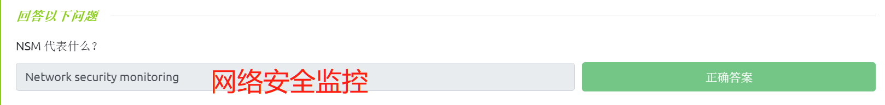
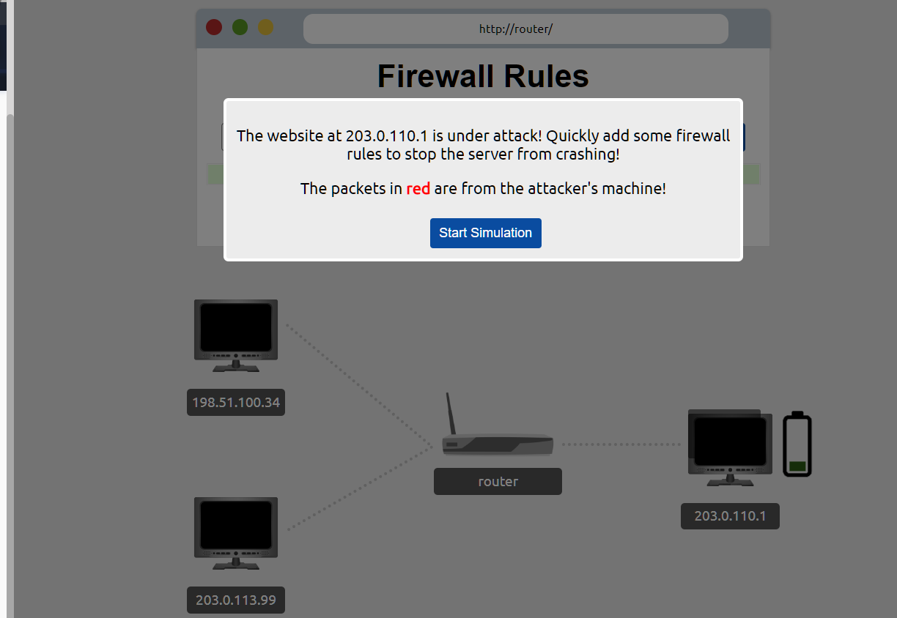
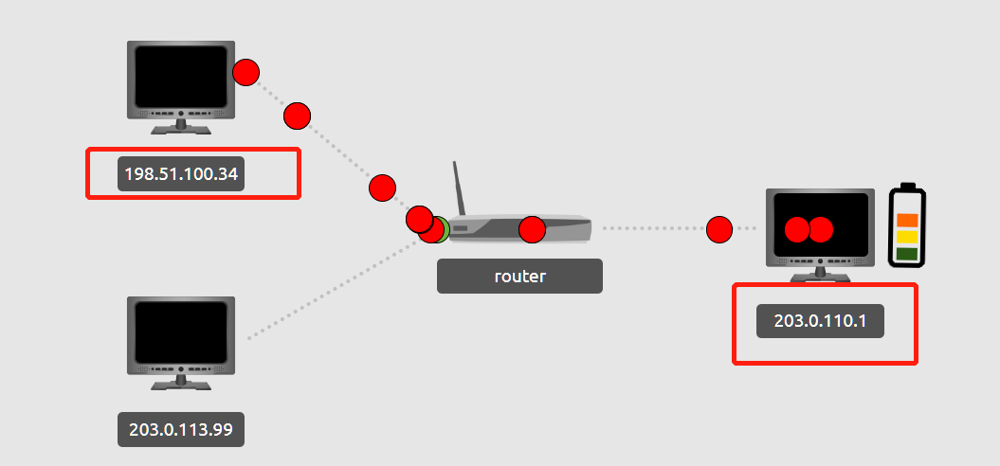
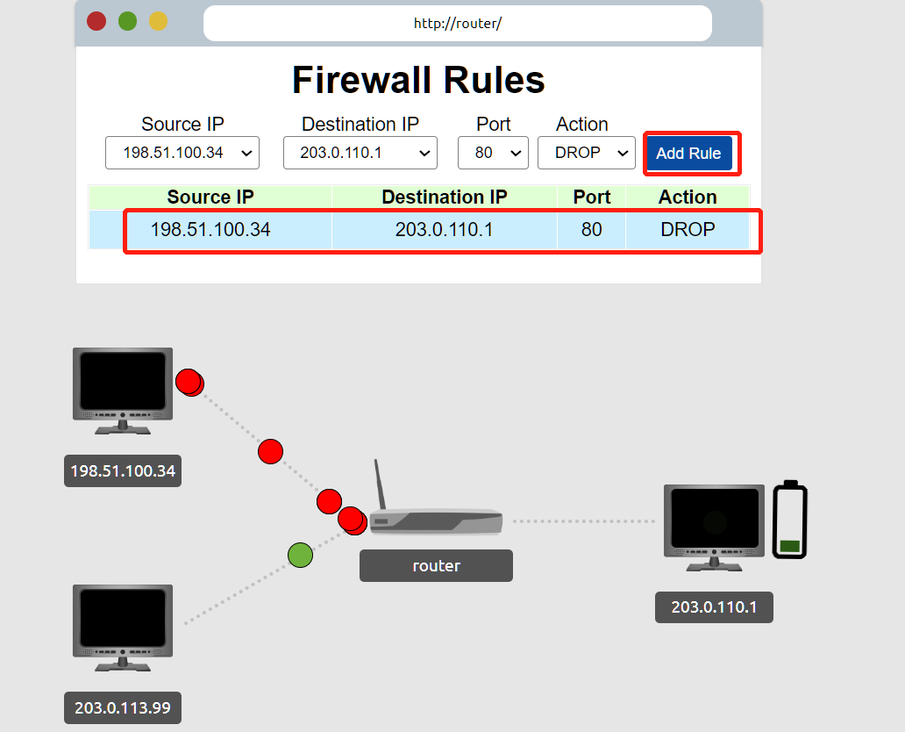
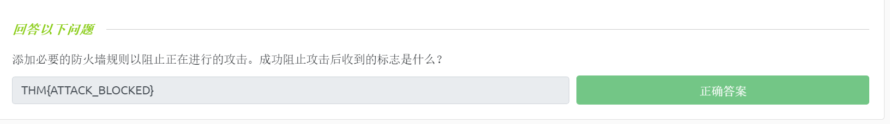

# ☑ Security Operations(安全运营介绍)

TryHackMe实验房间链接：[https://tryhackme.com/room/securityoperations](https://tryhackme.com/room/securityoperations)

## 安全运营简介

<figure><figcaption><p>An image showing a Security Operations Center: a team of IT security professionals tasked with monitoring a company's network and systems.</p></figcaption></figure>

安全运营中心 (SOC) 是一类 IT 安全专业人员团队，负责每周 7 天、每天 24 小时监控公司的网络和系统，他们监控的目的是：

* 查找网络上的漏洞（Find vulnerabilities on the network）：漏洞可以被攻击者利用，以执行超出许可级别的操作，在网络上的任何设备（操作系统和程序）中都可能发现漏洞，包括服务器设备或计算机设备等；在现实情况中，SOC 可能会发现一组必须针对已发布的特定漏洞进行修补的 MS Windows 计算机。严格来说，查找并发现漏洞不一定是 SOC 的责任范畴，但是，未修复的漏洞肯定会影响整个公司的安全级别。
* 检测未经授权的活动（Detect unauthorized activity）：例如，攻击者发现了某个员工的用户名和密码并使用这些凭据登录到公司系统——这就是一种未经过授权的活动，而在攻击者造成任何损害之前快速检测到未经授权的活动至关重要；有许多线索可以帮助我们检测到发生了未经授权的活动，例如登录ip所对应的地理位置异常等。
* 发现策略违规（Discover policy violations）：安全策略是一组规则和程序，旨在保护公司免受安全威胁并确保公司数据的合规性，什么行为被视为违规因公司而异，比如：下载盗版媒体文件、不安全地发送公司机密文件等行为。
* 检测入侵（Detect intrusions）：入侵是指针对系统和网络进行攻击或窃密的行为，例如攻击者对目标Web 应用程序进行漏洞利用，或者攻击者诱导用户访问恶意站点并感染用户计算机等。
* 支持事件响应（Support with the incident response）：此处的事件指的是安全事件，事件可以是策略违规、攻击入侵企图或者其他更具破坏性的网络攻击行为，例如发现了某个重大漏洞正在被攻击者利用；正确应对严重安全事件并非易事，而SOC 可以支持事件响应团队更好地处理安全事件。

### **答题**

> SOC代表：Security Operations Center（安全运营中心）
>
> SOC每天监控网络多少小时：24

<figure><figcaption></figcaption></figure>

## 安全运营的要素

在本小节中，我们将讨论：

* SOC 所依赖的示例数据源。
* SOC 所提供的服务。
* 一个示例场景。

### **数据源（Data Sources）**

SOC 将通过多种数据源来监控网络环境中是否存在入侵迹象并检测任何恶意行为，其中一些数据来源是：

* 服务器日志：网络上有多种类型的服务器，例如邮件服务器、Web 服务器和 MS Windows 网络上的域控制器等，日志会包含有关各种活动的信息，例如成功和失败的登录尝试等；在服务器日志中，我们可以找到大量和服务器相关的活动信息。
* DNS 活动：DNS 代表域名系统，它是负责将域名（例如 tryhackme.com）转换为 IP 地址（例如 10.3.13.37）的协议，同时也支持其他与域名相关的查询；DNS 查询的一个类比是 用户询问“我怎样才能到达 TryHackMe？” 然后就会有人回复一个对应的邮政地址。在实际情况中，如果有人试图浏览 tryhackme.com，DNS 服务器就会对这个域名进行解析，并会将相关的 DNS 查询记录到监控中；SOC 可以仅通过检查 DNS 查询记录来收集有关内部系统尝试与之进行通信的域名的信息。
* 防火墙日志：防火墙是一种控制网络数据包进出网络的设备，主要通过放行数据包或者阻断数据包来进行控制流量；因此，防火墙日志可以揭示 有关哪些数据包通过了或者试图通过防火墙的相关大量信息。
* DHCP 日志：DHCP 代表的是动态主机配置协议，它主要负责 为尝试连接到某个指定网络的计算机系统分配 IP 地址。DHCP 请求的一个类比是 当你进入一家高级餐厅时，服务员会说欢迎你并引导你到一张空桌子处；使用了DHCP协议后，你无需手动配置即可尝试让你的电脑加入某个网络，因为DHCP 会自动为你的设备提供 加入网络所需的网络设置。通过检查 DHCP 事务，SOC 就可以了解加入到某个指定网络的设备的信息。

以上只是一些最常见的数据源，另外还有许多其他资源可用于帮助完善网络安全监控 以及 有利于 SOC 完成其他工作任务；SOC 可能还会使用 安全信息和事件管理系统 (SIEM-Security Information and Event Management) 来开展工作， SIEM 会聚合来自于不同来源的数据信息，以便于 SOC 可以有效地关联数据并响应攻击事件。

<figure><figcaption></figcaption></figure>

### **SOC服务（SOC Services）**

SOC 服务可分为反应式服务和主动式服务。

反应式服务是指在检测到入侵或恶意事件后启动的任务，包括以下示例：

* 监控安全态势：这是 SOC 的主要职责，它包括监控网络和计算机的相关安全警报、安全通知，并根据需要做出及时响应。
* 漏洞管理：这是指发现公司系统中的漏洞并修补（修复）它们，SOC 可以协助完成这项任务，但不一定要亲自执行它。
* 恶意软件分析：SOC 可能需要获取网络中的恶意程序，SOC 可以通过在受控环境中执行恶意程序来进行基本的恶意软件分析，但是，更高级的分析需要由其他专门的安全团队来完成。
* 入侵检测：入侵检测系统 (IDS) 可用于检测和记录入侵行为和一些可疑数据包，而SOC 的工作就是维护这样一个系统，监控其警报，并根据需要检查其日志。
* 报告：报告安全事件和警报至关重要，及时进行报告 对于确保工作流程顺畅和支持合规性要求是必要的措施。

主动式服务是指在没有任何入侵迹象的情况下由 SOC 处理的任务，需要 SOC 执行的主动服务示例包括：

* 网络安全监控（NSM-Network security monitoring）：侧重于监控网络数据和分析流量以检测是否存在入侵迹象。
* 威胁搜寻：威胁搜寻指的是 SOC 先假定入侵行为已经发生 然后再进行验证，SOC会通过搜寻网络安全威胁 以明确某种入侵行为是否存在。
* 威胁情报：威胁情报侧重于了解潜在的攻击者及其攻击策略、攻击技术，从而提高公司的防御能力。收集威胁情报的目的是为了建立威胁知情防御。

除了以上服务外，SOC 提供的其他服务还包括网络安全培训，该服务将帮助提高用户的安全意识并为用户提供扎实的安全培训，这可以避免发生过多的数据泄露事件以及网络入侵行为。

### **示例场景（Example Scenario）**

SOC 中有一个角色是 SOC 分析师，SOC 分析师主要负责网络安全监控和日志管理。

让我们考虑以下场景：在监控网络流量时，SOC 分析师注意到 当前受监控的网络环境中 存在每分钟重复一次的特定 DNS 查询行为，这种行为并不像是用户在正常浏览网络。

SOC 分析师可能的应对流程如下：

1. SOC 分析师检查 DNS 查询的来源并将源头确定为网络上的一台笔记本电脑。
2. SOC 分析师将这台笔记本隔离并检查该机器是否有感染迹象，结果发现该机器上有一个进程（程序）正在使用 DNS 与恶意服务器通信。
3. SOC 分析师通过查看计算机日志发现该计算机是在访问恶意网站后被感染的，这种感染的结果是：受害计算机通过将消息隐藏在 DNS 查询中来与恶意服务器通信。
4. SOC 分析师将这台笔记本电脑清理干净，并开始进行威胁搜寻以确保没有其他计算机被感染。

### **答题**

阅读本小节内容，并回答以下问题。

> NSM代表：Network security monitoring（网络安全监控）

<figure><figcaption></figcaption></figure>

## 关于SOC的实例

<figure><figcaption></figcaption></figure>

防火墙是一种检查进入和离开网络或系统的网络数据包的设备，我们可以使用防火墙来阻止一些正在进行的网络攻击，最基本的防火墙检查类型包括：

* 源 IP 地址和目标 IP 地址：IP 地址是允许你通过 Internet 进行通信的逻辑地址。你可以把 IP 地址类比为邮政地址，例如，一家公司需要使用一个有效的邮政地址来发送和接收包裹，你可以进而将 IP 数据包想象成一个邮递包裹。
* 源端口号和目标端口号（在适用的情况下）：一台计算机有一个 IP 地址，此外，计算机上的每个程序还需要一个对应的端口号才能通过网络进行通信。你可以把端口号类比为一家公司内的房间号。

基本的防火墙规则可能类似于以下内容：

```shell
源IP地址     目标IP地址    源端口 目标端口  操作

172.16.4.1  10.10.10.41   ANY    80      PASS（通过）
172.16.8.1  10.10.10.81   ANY    23      DROP（丢弃）
```

以上两条规则规定了以下内容：

* 所有从源 IP 地址 172.16.4.1 到目标 IP 地址 10.10.10.41 并且到目标端口号 80 的 IP 数据包都会被防火墙允许，相关的数据包可以通过防火墙。
* 所有从源 IP 地址 172.16.8.1 到目标 IP 地址 10.10.10.81 并且到目标端口号 23 的 IP 数据包都会被防火墙阻塞，相关的数据包会被丢弃——无法通过防火墙。

### **答题**

_在本文相关的Tryhackme实验房间页面中使用虚拟实验环境，并完成本小节对应的实例。_

我们将模拟在防火墙级别拦截恶意IP地址所发出的数据包，这需要我们快速添加一些防火墙规则：

<figure><figcaption></figcaption></figure>

发现恶意ip及其数据包：

<figure><figcaption></figcaption></figure>

快速添加防火墙规则：

<figure><figcaption></figcaption></figure>

成功拦截并得到一个flag：

<figure><figcaption></figcaption></figure>

> 最后得到的flag内容为：THM{ATTACK\_BLOCKED} 。

<figure><figcaption></figcaption></figure>
