# ☑ Extending Your Network(网络扩展基础介绍)

TryHackMe实验房间链接：[https://tryhackme.com/room/extendingyournetwork](https://tryhackme.com/room/extendingyournetwork)

## 端口转发介绍

端口转发是应用程序和服务连接到 Internet(互联网公网) 所需的重要步骤，如果没有端口转发，应用程序和服务(如web服务)只能对同一直连网络中的设备可用。

以下面的网络为例：在以下网络中，IP地址为“192.168.1.10”的服务器在端口80上运行着web服务，但该网络上只有另外两台计算机能够访问此web服务。(这种网络被称为内部网络)

<figure>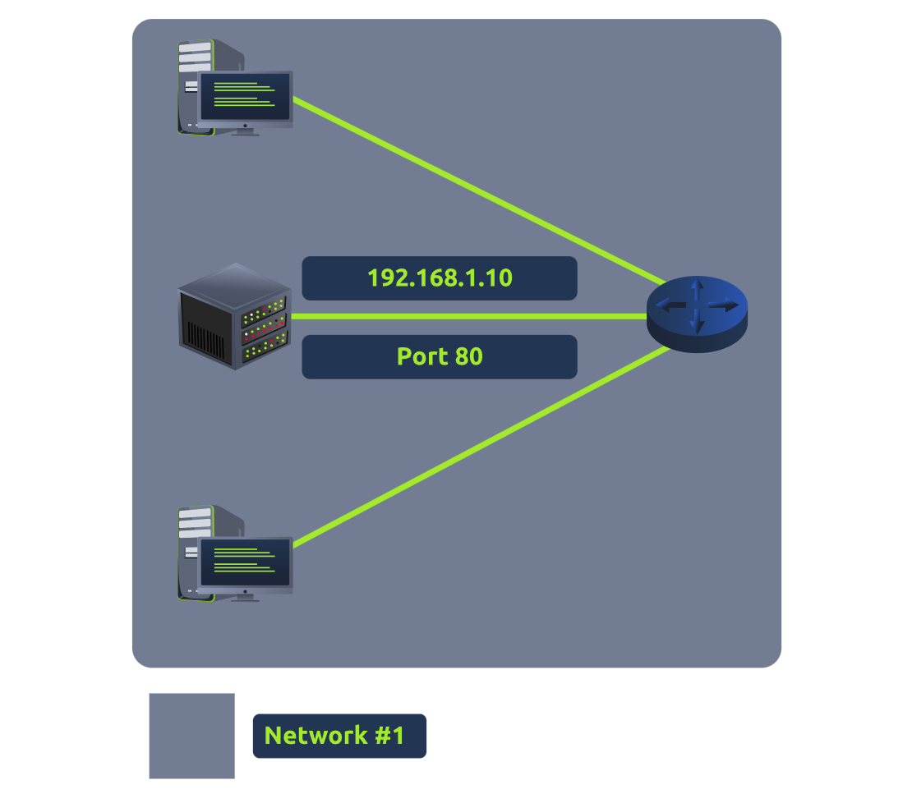<figcaption></figcaption></figure>

如果网络管理员想让公众(通过互联网)访问上图中的网站，管理员就必须实现端口转发，如下图所示：

<figure>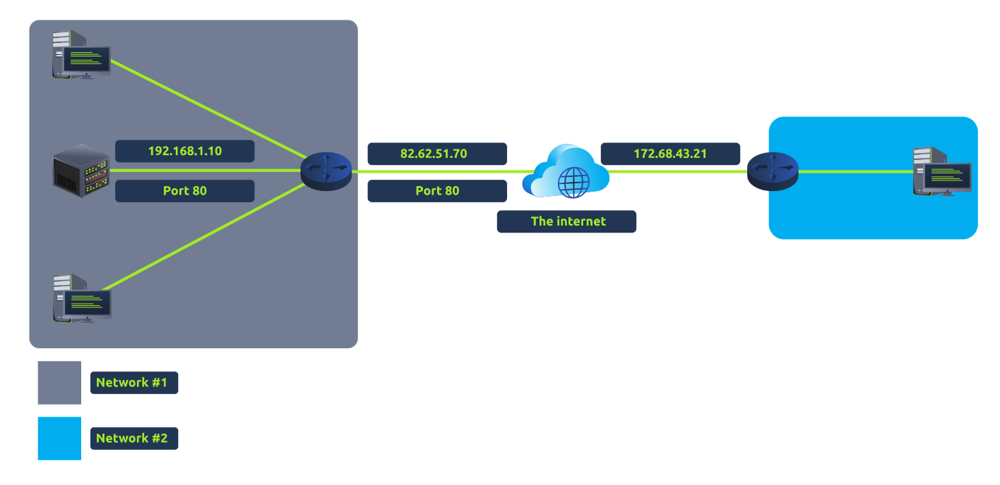<figcaption></figcaption></figure>

通过上图这种设计，网络2现在可以使用网络1的公共IP地址(82.62.51.70)并通过80端口访问运行在网络1上的web服务器。

我们很容易将端口转发行为与防火墙的行为混淆，但是这两者是不一样的；防火墙能够决定流量是否可以通过某些端口(即使这些端口是通过端口转发开放的)。

_tips：端口转发是在网络中的路由器上配置的。_

### **答题**

阅读本小节内容并回答以下问题。

<figure>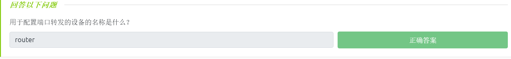<figcaption></figcaption></figure>

## 防火墙简介

<figure><figcaption></figcaption></figure>

防火墙是网络中的一种设备，它负责确定允许哪些流量进入网络和退出网络，防火墙可以被视为网络的边界安全。网络管理员可以根据多种因素将防火墙配置为允许或拒绝某些流量进入或退出网络，例如：

* 流量从哪里来？ （防火墙是否被告知：接受/拒绝来自特定网络的流量？）
* 流量要往哪里去？ （防火墙是否被告知：接受/拒绝发往特定网络的流量？）
* 流量流向哪个端口？ （防火墙是否被告知：仅接受/拒绝发往端口 80 的流量？）
* 流量使用什么协议？ （防火墙是否被告知：接受/拒绝 UDP、TCP 或两者的流量？）

_**tips：防火墙将通过执行数据包检查来确定以上这些问题的答案。**_

防火墙有各种各样的形状和大小：从可以处理大量数据的专用硬件(通常存在于像企业这样的大型网络中)到住宅路由器(通常存在于家庭网络中)或者Snort软件(一种开源入侵防御系统-IPS)，防火墙可以分为2到5类。

我们将在下面介绍两种主要类型的防火墙：

* Stateful（有状态）：这种类型的防火墙将使用来自连接的全部信息，这种防火墙不是基于单个数据包检查，而是_**基于整个连接来确定设备的行为**_；与无状态防火墙相比，有状态防火墙会消耗很多资源，因为相关的流量决策是动态的，例如，有状态防火墙可以让TCP三次握手过程中的第一部分执行失败；如果来自主机的连接不正常，这将阻塞整个设备。
* Stateless（无状态）：这种类型的防火墙将使用一组静态规则来_**确定单个数据包是否可接受**_，例如，某设备发送了一个坏数据包并不意味着此设备随后都将会被阻塞；虽然无状态防火墙比其他防火墙使用更少的资源，但无状态防火墙的表现也更笨，例如，无状态防火墙只有在定义了规则时才有效，如果规则没有完全匹配，那么此规则实际上将是无用的；当从一组主机接收大量流量时(例如发生了分布式拒绝服务攻击-DDoS攻击)，无状态防火墙将变得非常有用。

### **答题**

阅读本小节内容并回答以下问题。

<figure>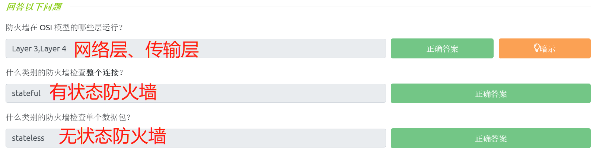<figcaption></figcaption></figure>

## 防火墙模拟示例

在和本文相关的TryHackMe实验房间中部署实验环境并回答问题。

### **答题**

_tips：正确配置防火墙规则以防止设备超载——示例中的203.0.110.1网站正在遭到攻击，请快速添加一些防火墙规则来阻止服务器崩溃（红色的数据包来自于攻击者的机器）。_

添加规则：

<figure>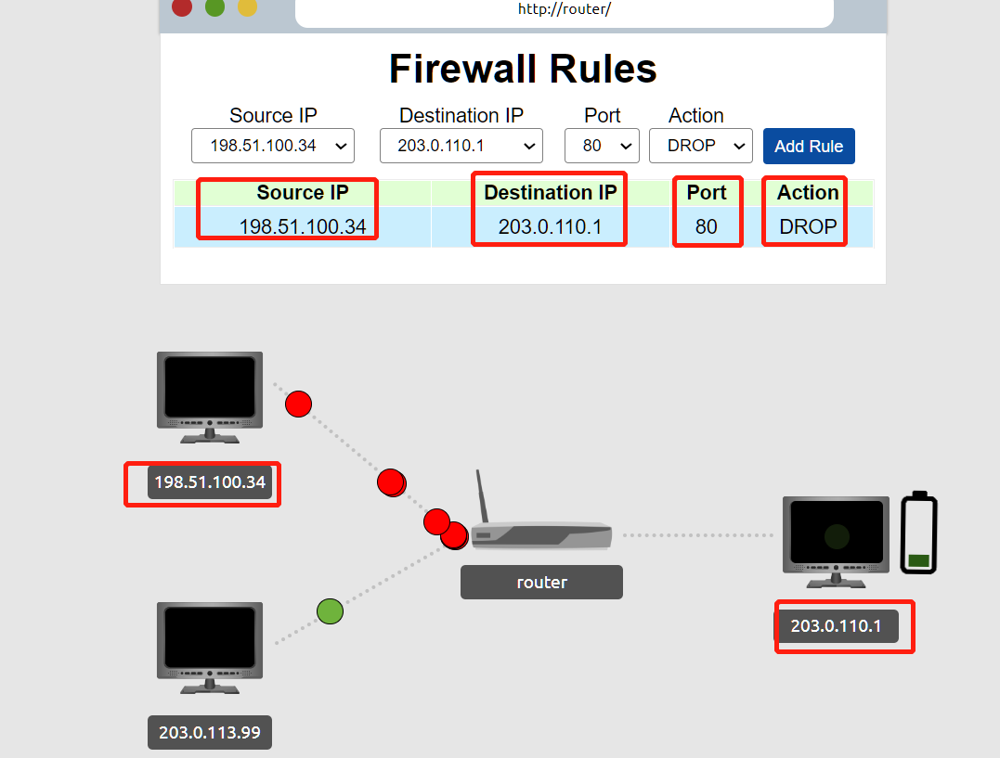<figcaption></figcaption></figure>

得到flag：

<figure>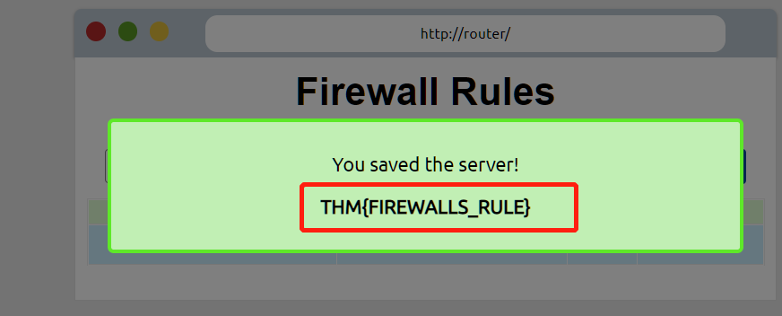<figcaption></figcaption></figure>

> 最后得到的flag是：THM{FIREWALLS\_RULE} 。

<figure><figcaption></figcaption></figure>

## VPN基础

虚拟专用网络(VPN-Virtual Private Network)是一种允许不同网络上的设备通过在Internet(互联网公网)上彼此之间创建专用路径(称为隧道)进行安全通信的技术，在此隧道内连接的多个设备将形成它们自己的专用网络。

只有同一网络中的设备(如企业的内部网络)可以直接通信，而VPN允许两个局点相连，让我们看看下图，其中有三个网络：

1. Network #1 (Office #1)
2. Network #2 (Office #2)
3. Network #3 (两个设备通过VPN连接)

<figure>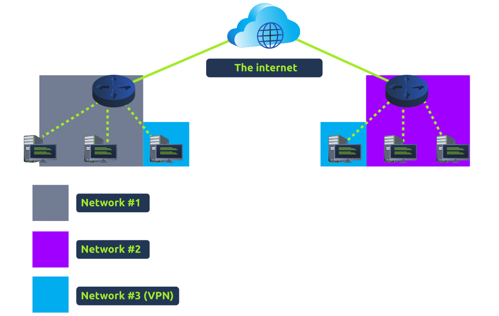<figcaption></figcaption></figure>

连接在Network#3上的设备仍然是Network#1和Network#2的一部分，但这些设备同时也形成了一个私有网络(Network#3)，只有通过相关的VPN连接的设备才能在这个专用网络(Network#3)上进行通信。

让我们介绍VPN提供的一些其他好处:

* 允许不同地理位置的网络进行连接：例如，拥有多个办公室网络的企业会发现VPN是有益的，因为这意味着可以从办公室网络 直接访问远程服务器或基础设施等资源。
* 提供隐秘性：VPN使用了加密技术来保护数据，这意味着数据包只能在发送它的设备和目的地之间被理解，这些数据不容易被嗅探；VPN加密技术在有公共WiFi的地方可能很有用处，因为普通的公共WiFi网络并不提供加密；你可以使用VPN来保护你所使用的流量不被其他人查看。
* 提供匿名性：记者和其他活动人士可以依靠VPN技术 在言论自由受到控制的国家安全地报道全球问题；通常，你所使用的流量可以被你的ISP和其他中介机构查看，并能因此被跟踪，而VPN所提供的匿名级别也仅仅与网络上的其他设备如何尊重隐私有关，例如，使用一个会记录所有数据或者历史的VPN 本质上与不使用VPN的效果是一样的。

例如TryHackMe网站可以使用VPN技术 将你的本地机和一些易受攻击的机器连接起来，并且不允许那些易受攻击的机器能被公众直接在互联网上访问，这意味着:

* 你可以安全地与 TryHackMe网站所提供的那些易受攻击的机器 进行交互，从而进行攻击模拟；
* 服务提供商如ISP不会认为你在使用本地机攻击互联网上的正常机器(因为攻击正常机器可能违反了ISP的服务条款)；
* 使用VPN也为TryHackMe网站提供了安全性，因为 TryHackMe所提供的易受攻击的机器 无法直接通过Internet被公众访问。

多年以来，VPN技术经过了不断改进，下面让我们来探讨一些现有的VPN技术：

* PPP：PPP是指点对点协议，它能提供加密以及数字验证功能，使用了PPP技术的VPN会通过私钥和公共证书(类似于SSH)来工作，如果要成功建立VPN连接，那么私钥和证书就必须完成匹配，但是，基于PPP技术进行传输的数据 并不能单独离开网络(即不可路由)；此外，PPTP将使用PPP技术来进行身份验证并提供数据加密。
* PPTP：点对点隧道协议(PPTP-**P**oint-to-**P**oint **T**unneling **P**rotocol)是一种“允许PPP数据在网络中传输并离开网络”的技术，PPTP协议非常容易设置，大多数设备都支持它，然而，与其他VPN方案相比，PPTP是弱加密的。
* IPSec：IPsec (Internet Protocol Security)将使用现有的IP (Internet Protocol)框架对数据进行加密，与其他VPN方案相比，IPSec更难建立，但只要建立完成，IPSec就能使用强大的加密功能，并且IPSec技术在许多设备上都能得到支持。

### **答题**

阅读本小节内容并回答以下问题。

<figure>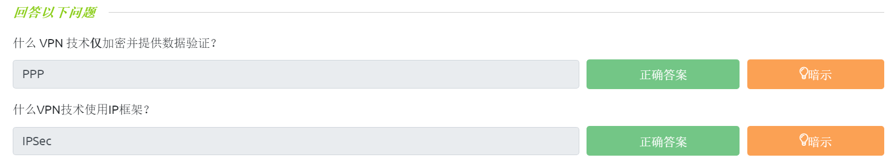<figcaption></figcaption></figure>

## 局域网(LAN)网络设备

**路由器（Router）**

路由器的工作是连接网络并在网络之间传递数据，它是通过使用路由来做到这一点的(因此得名路由器)。

路由是给“数据在网络中传输的过程”的标签，路由涉及在网络之间创建一条路径，以便能够成功地传递数据；路由器运行在OSI模型的第3层(网络层)，它通常具有交互式界面(如网页界面或控制台界面)，这能够允许管理员配置各种规则，如配置端口转发规则或配置防火墙规则。

当设备由多条路径连接时，如下面的示例图所示，路由就能发挥作用以采用最优路径：

<figure>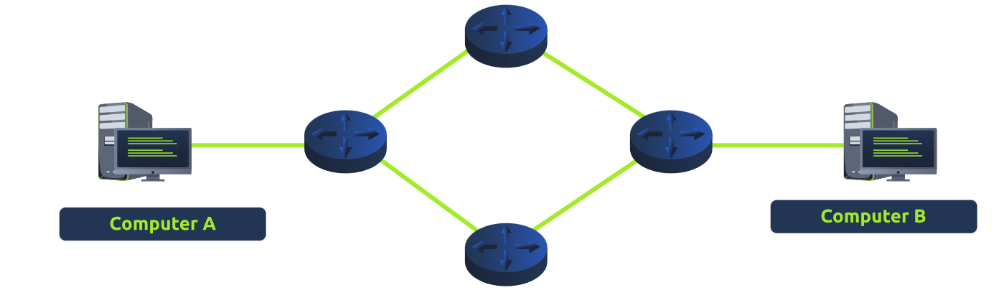<figcaption></figcaption></figure>

_tips：路由器是专用设备，它的功能与交换机不同。_

从上图的例子中，我们可以看到计算机A的网络通过中间的路由器连接到计算机B的网络——共有两条路由路径可供选择，接下来的问题是：我们将采取什么路由路径？

使用不同的协议将决定采取不同的路由路径，此外，路径的选择还包括以下因素：

* 哪条路径最短？（数据包需要通过的设备最少）
* 哪条路径最可靠？（之前在该路径上是否丢失过数据包）
* 哪条路径有更快的物理传输介质(铜缆线或光纤)？

**交换机（Switch）**

交换机是一种专用的网络设备，它负责在网络上提供连接到多个设备的方法——一个交换机可以通过以太网电缆连接多个设备(从3到63个)。

交换机可以在OSI模型的第二层(数据链路层)和第三层(网络层)同时工作，然而，这是具有排他性的——第二层交换机不能在第三层运行。

以下图中的第二层交换机为例，交换机将通过MAC地址把帧(此处不是数据包，因为IP协议已被剥离)转发到它所连接的设备上。

<figure><figcaption></figcaption></figure>

_**tips：上图中的交换机是第二层交换机，OSI模型的第二层是数据链路层，所以上图中的交换机只负责将帧(数据帧)发送到正确的设备上。**_

第三层交换机能够在OSI模型的第三层（网络层）工作，第三层交换机比第二层交换机更复杂，因为它还可以执行路由器的一些职责；也就是说，第三层交换机能向设备发送帧(就像第二层交换机一样)，并能使用IP协议将数据包路由到其他设备。

第三层交换机的使用还涉及到了VLAN(虚拟局域网)技术，我们稍后将介绍VLAN，先假设我们有以下IP地址备用：

* 192.168.1.1
* 192.168.2.1

虚拟局域网(**V**irtual **L**ocal **A**rea **N**etwork)技术 能够允许网络中的特定设备被虚拟分割，这种分割意味着相关的网络设备可以在互联网连接等方面受益，同时相关的网络设备也将被分区处理；由VLAN技术所形成的网络隔离能够提供安全性，因为这意味着将由适当的规则来决定特定设备如何相互通信，这种网络隔离如下图所示：

_tips：下图中的交换机是第三层交换机，下图示例将使用交换机划分VLAN，然后给VLAN分配IP。_

<figure>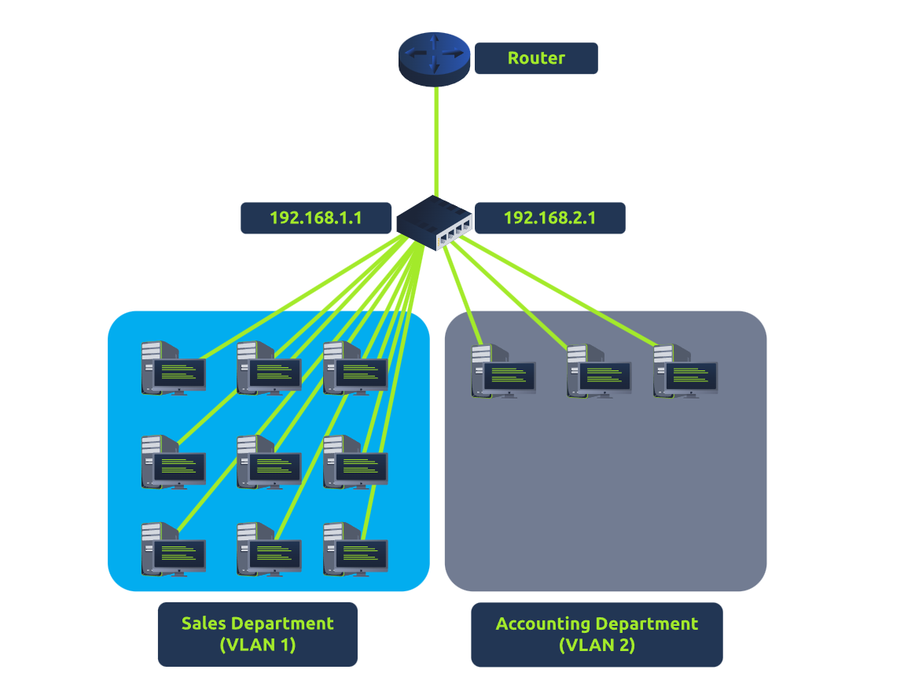<figcaption></figcaption></figure>

如上图所示：“销售部门”和“会计部门”都能够访问Internet(互联网公网)，但这两个部门网络之间并不能实现相互通信(尽管这两个部门都连接到同一个交换机)。

### **答题**

阅读本小节内容并回答以下问题。

<figure>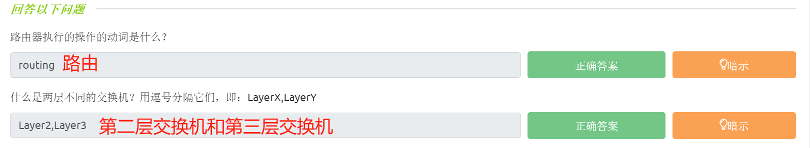<figcaption></figcaption></figure>

## 网络模拟器示例

部署附加到此示例的静态站点，用一个简单的网络模拟器进行实验。此模拟器将分解 数据包从点A传输到点B所需要的每一步，请尝试从computer1发送一个TCP包到computer3并得到一个flag。

注意：请使用Chrome或Firefox浏览器完成此练习。

### **答题**

从 computer1 发送TCP包到 computer3 ：

<figure>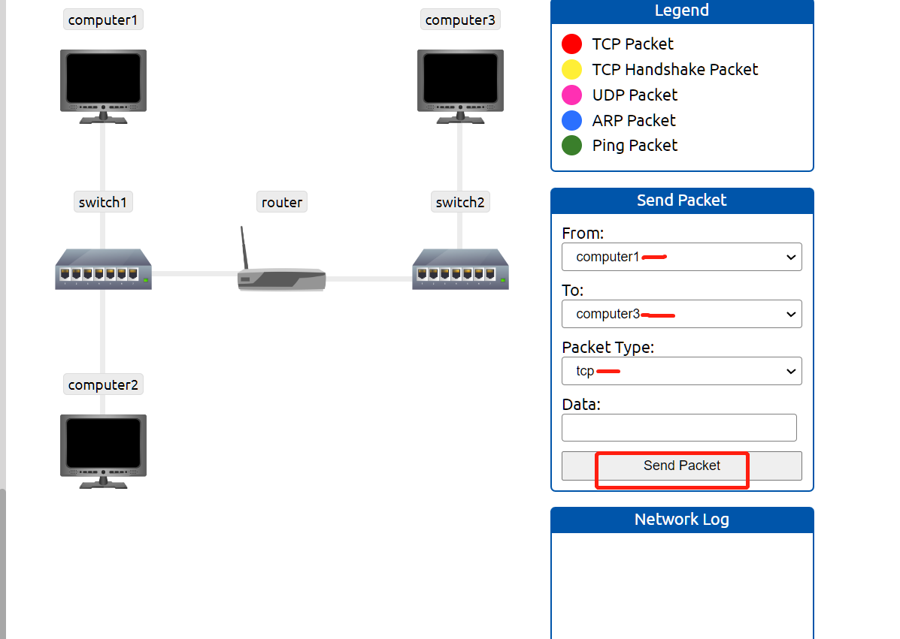<figcaption></figcaption></figure>

得到的flag结果：

<figure>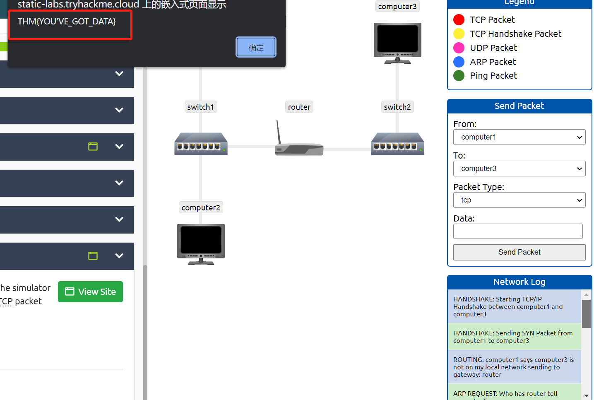<figcaption></figcaption></figure>

> 得到的flag为：THM{YOU'VE\_GOT\_DATA} 。

对应的网络日志的内容（在TCP连接全过程中 所记录的日志如下）：

```shell
#HANDSHAKE: Starting TCP/IP Handshake between computer1 and computer3
#HANDSHAKE: Sending SYN Packet from computer1 to computer3
ROUTING: computer1 says computer3 is not on my local network sending to gateway: router
ARP REQUEST: Who has router tell computer1
ARP RESPONSE: Hey computer1, I am router
ARP REQUEST: Who has computer3 tell router
ARP RESPONSE: Hey router, I am computer3
#HANDSHAKE: computer3 received SYN Packet from computer1, sending SYN/ACK Packet to computer1
#HANDSHAKE: computer1 received SYN/ACK Packet from computer3, sending ACK packet to computer3
#HANDSHAKE: computer3 received ACK packet from computer1, Handshake Complete
TCP: Sending TCP packet from computer1 to computer3
TCP: computer3 received TCP Packet from computer1, sending ACK Packet to computer1
```

> 网络日志中共有 5 个HANDSHAKE条目。

<figure><figcaption></figcaption></figure>
