# How websites work(网站运行基础)

TryHackMe实验房间链接：[https://tryhackme.com/room/howwebsiteswork](https://tryhackme.com/room/howwebsiteswork)

## 网站是如何运行的？

本文将介绍如何创建网站，并介绍关于网站的一些基本的安全问题。

当你访问一个网站时，你的浏览器(如Safari或谷歌Chrome)会向web服务器发出请求，这将询问有关你正在访问的页面的信息，然后web服务器将以“用来显示页面的数据”响应你的浏览器；web服务器是一些位置在世界上其他地方的 并且 能够处理你的请求的专用计算机。

<figure>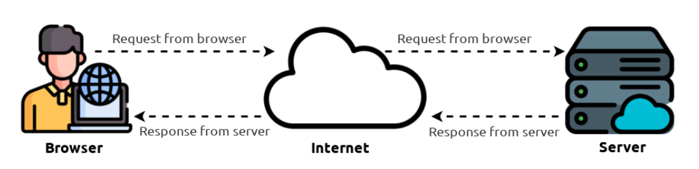<figcaption></figcaption></figure>

一个网站有两个主要组成部分：

1. 前端(客户端)-你的浏览器呈现(渲染)网站的方式。
2. 后端(服务器端)-处理你的请求消息并返回响应消息的服务器。

在你的浏览器向web服务器发出请求的过程中 还涉及许多其他过程，但现在，我们只需要了解：我们能够向web服务器发出请求，web服务器将响应我们的浏览器以提供一些用于向我们呈现信息的数据。

### **答题**

阅读本小节内容，并回答以下问题。

<figure>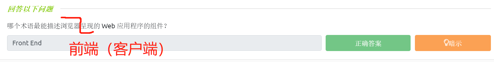<figcaption></figcaption></figure>

## 用于网站运行的HTML

网站的网页内容主要使用以下内容创建：

* HTML：用于构建网站并定义其结构；
* CSS：通过添加样式选项使网站看起来更漂亮；
* JavaScript： 使用交互性脚本在网站页面上实现复杂的功能。

超文本标记语言(HTML-HyperText Markup Language)是专门用于编写网站的网页内容的语言，元素-Elements (也被称为标签-Tags)是HTML页面的构建模块，它能告诉浏览器如何显示网页内容。下面的代码片段显示了一个简单的HTML文档，HTML的结构对于每个网站来说都是一样的：

<figure>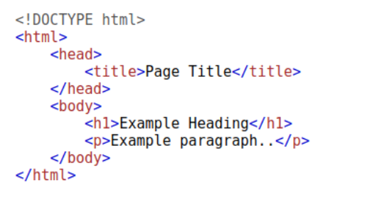<figcaption></figcaption></figure>

示例中的HTML结构(如上图所示)包含了以下组件:

* `<!DOCTYPE html>`定义了此页面是HTML5文档，这有助于在不同浏览器之间实现标准化，并告诉浏览器使用HTML5来解释页面。
* `<html>`元素是是HTML页面的根元素——所有其他元素都在这个元素之后。
* `<head>`元素包含了关于页面的信息(例如页面标题)。
* `<body>`元素定义了HTML文档的正文，浏览器中只显示body(主体)内部的内容。
* `<h1>`元素定义了一个大标题（heading）。
* `<p>`元素定义了一个段落（paragraph）。

还有许多可用于不同目的的其他HTML元素(标签)，例如，按钮(`<button>`)、图像(``)、列表等标签。

元素(标签)可以包含一些属性，比如class属性可以用来设置一个元素的样式(例如设置段落标签的颜色)--`<p class="bold-text">`，还有src属性可用于在图像标签中指定图像的位置--``。

一个元素(标签)可以有多个属性，并且每个属性都有自己独特的用途，例如`<p attribute1="value1" attribute2="value2">`

元素可以有id属性(例如`<p id="example">`)，id在元素的属性中具有唯一性。id属性不同于class属性(多个元素可以使用同一个class属性)，不同的元素会有不同的id来唯一地标识它们，元素的id属性主要用于样式化以及提供给JavaScript脚本识别。

你可以通过右键单击网页并选择“查看页面源代码”(Chrome)选项 或者选择“显示页面源代码”(Safari)选项，以此来查看任何网站网页的HTML页面。

tips：本小节只是简单介绍一下用于网站运行的HTML，关于HTML的更多教程请参考——[https://www.runoob.com/html/html-tutorial.html](https://www.runoob.com/html/html-tutorial.html) 。

### **答题**

使用和本文相关的TryHackMe实验房间中的模拟界面，并回答问题。

补充图像文件的扩展名：``

<figure>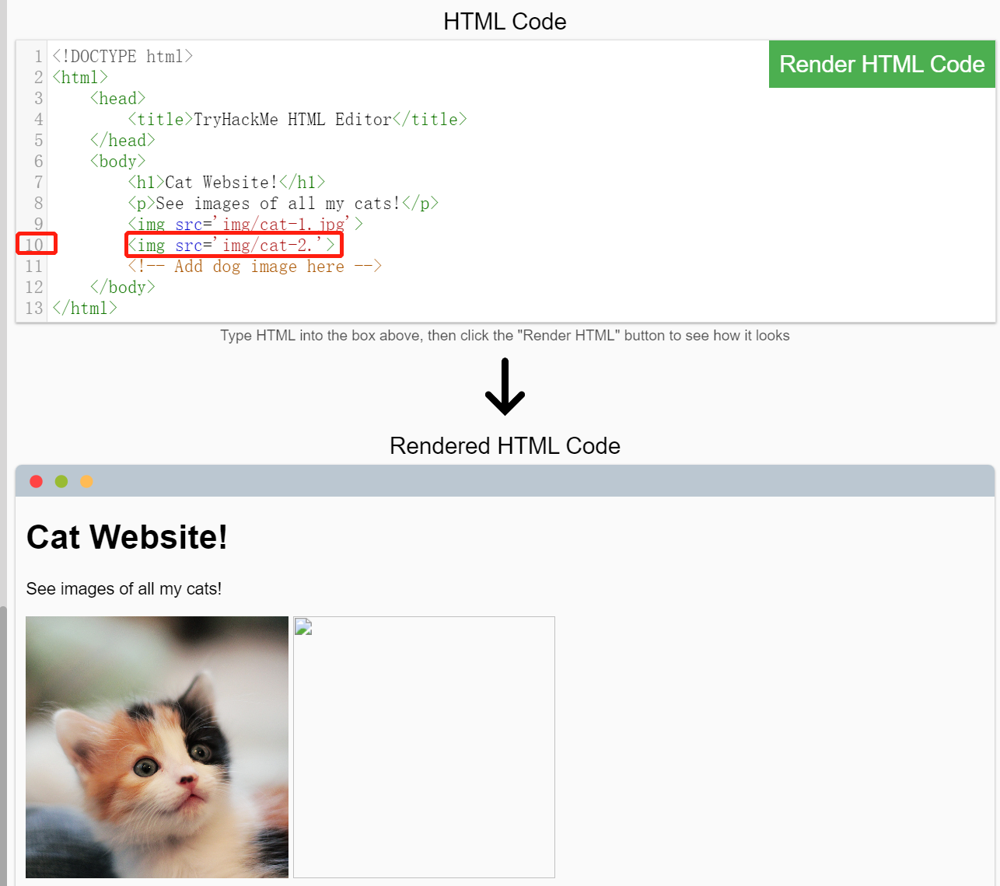<figcaption></figcaption></figure>

修复图像显示后，在网页中会显示一张带有字符内容的图像：

<figure>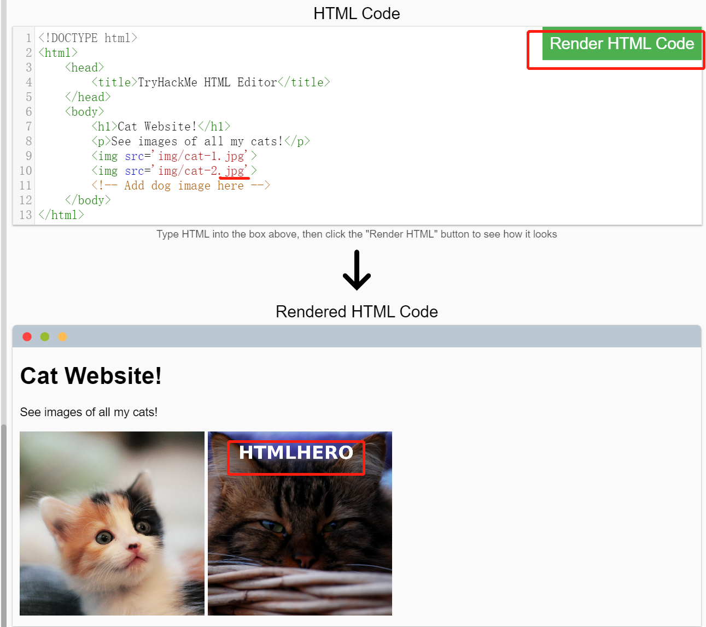<figcaption></figcaption></figure>

> 修复显示的图像内容中的字符为：HTMLHERO

在网页中添加一张新图片：``

<figure>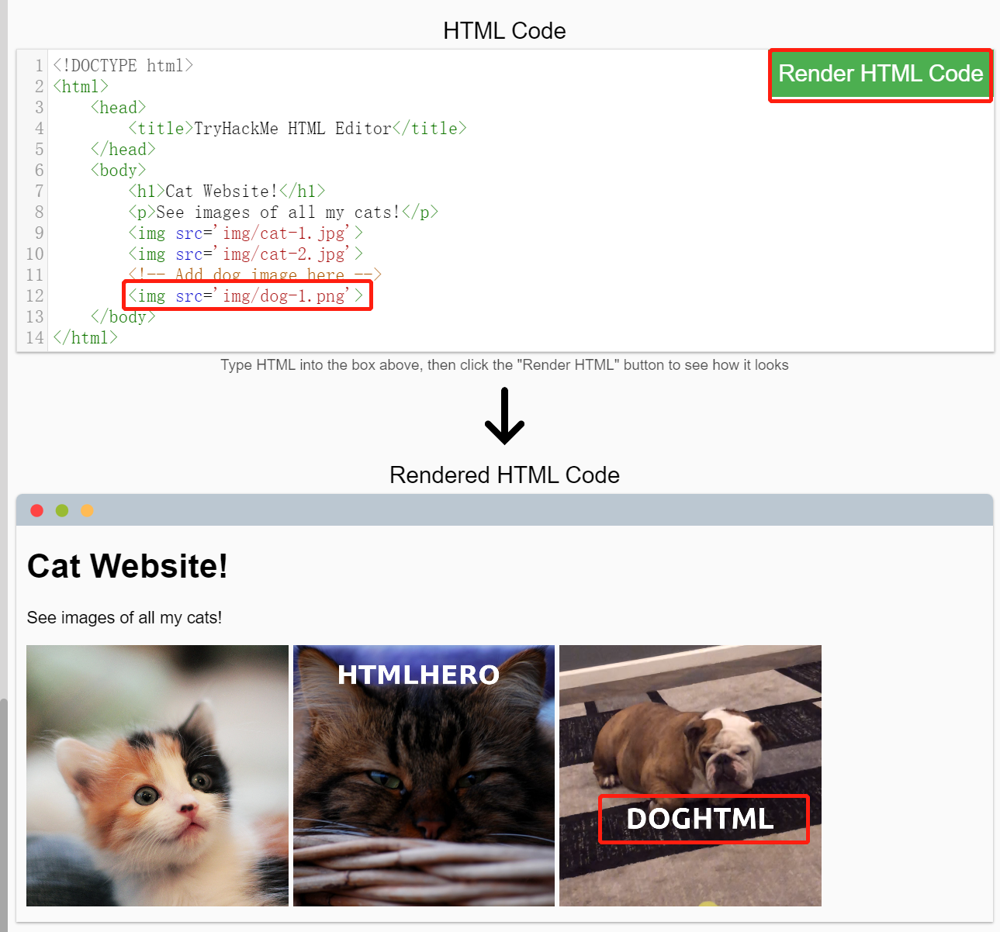<figcaption></figcaption></figure>

> 新添加的图像中的字符内容为：DOGHTML

<figure><figcaption></figcaption></figure>

## 用于网站运行的JS

JavaScript (JS)是世界上最流行的编码语言之一，它允许网站的页面变得具有交互性。HTML用于创建网站的结构和内容，而JavaScript用于控制网页的功能——没有JavaScript，页面就不会有交互元素，将永远是静态的；在网站页面上发生特定事件时，JS可以对应地实时动态更新网站页面，比如我们可以使用JS来设置——每当用户单击按钮，则动态改变按钮的样式或者动态显示移动动画等等。

JavaScript可以被添加到网站的页面源代码中，JS代码可以通过以下两种方式进行加载：

* 可以通过`<script></script>`标签直接进行加载，将具体的JS代码包含在`script`标签之间即可；
* 通过src属性远程包含js脚本文件：`<script src="/location/of/javascript_file.js"></script>`。

下面的JavaScript代码能够在网站的页面上找到id为“demo”的HTML元素，并能将元素内容更改为“Hack The Planet”：

`document.getElementById("demo").innerHTML = "Hack the Planet";`

通过HTML元素也可以设置事件，如“onclick”或“onhover”，当事件发生时则会自动执行和事件对应的JS代码；例如，下面的代码能够将带有“demo”ID的元素的文本内容更改为“Button Clicked”:

`<button onclick='document.getElementById("demo").innerHTML = "Button Clicked";'>Click Me!</button>`

在实际情况中，“onclick”事件一般会在JavaScript脚本标签中定义，而不是直接通过HTML元素定义。

tips：本小节只是简单介绍一下用于网站运行的JS，关于JavaScript的更多教程请参考——[https://www.runoob.com/js/js-tutorial.html](https://www.runoob.com/js/js-tutorial.html) 。

### **答题**

使用和本文相关的TryHackMe实验房间中的模拟界面，并回答问题。

将以下内容添加到模拟编辑器界面的第 9 行，然后单击“渲染 HTML+JS 代码”按钮：

```js
document.getElementById("demo").innerHTML = "Hack the Planet";
```

添加代码前：

<figure>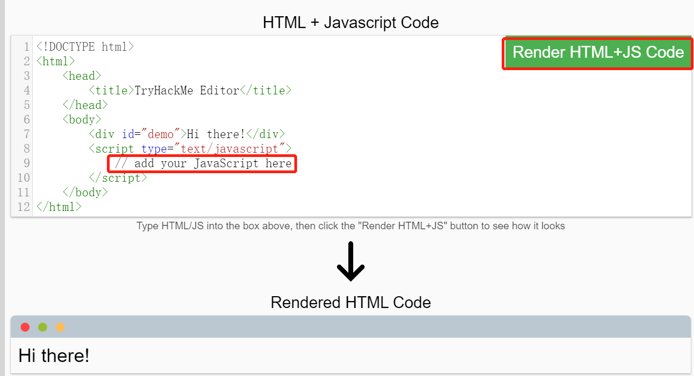<figcaption></figcaption></figure>

添加代码并渲染后：

<figure>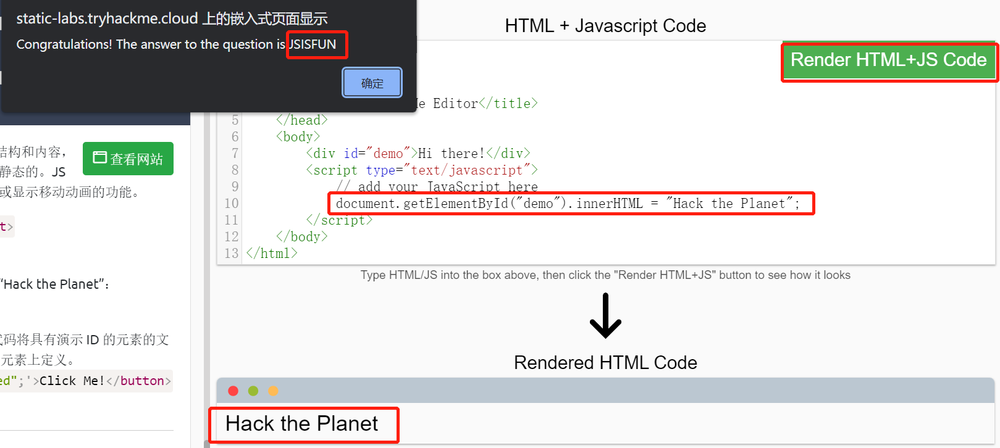<figcaption></figcaption></figure>

将以下内容放在 HTML 编辑器中（第 7 行和第 8 行之间）：

```html
<button onclick='document.getElementById("demo").innerHTML = "Hack the Planet";'>Click Me!</button>
```

<figure>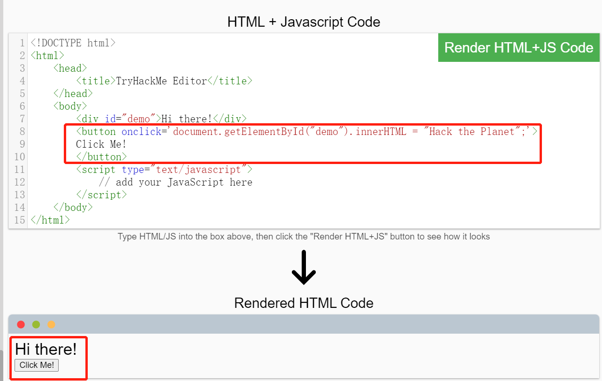<figcaption></figcaption></figure>

<figure><figcaption></figcaption></figure>

<figure>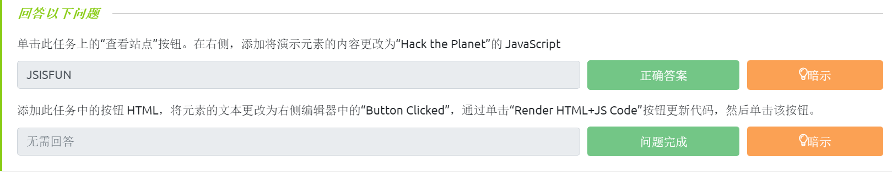<figcaption></figcaption></figure>

## 敏感数据泄露介绍

敏感数据泄露是指网站没有正确保护(或删除)用户的敏感明文信息（通常是在站点的前端源代码中找到一些敏感数据）。

我们知道，网站是用许多HTML元素(标签)构建的，所有这些元素我们都可以通过浏览器中的“viewing the page source”选项来查看，而网站开发人员可能会忘记删除登录凭据、网站隐私部分的隐藏链接或其他以HTML/JavaScript形式显示的敏感数据——也就是说，我们可以尝试通过浏览器的“viewing the page source”选项来发现一些敏感数据。

敏感信息可能会被潜在地利用，从而进一步扩大攻击者对web应用程序不同部分的访问权限；例如，网站的页面源代码中可能存在带有临时登录凭据的HTML注释，当你查看页面的源代码时就可能发现这一点，这使得你可以使用所发现的凭据在应用程序的其他地方实现登录(或者更糟，将凭据用于访问站点的其他后端组件)。

<figure>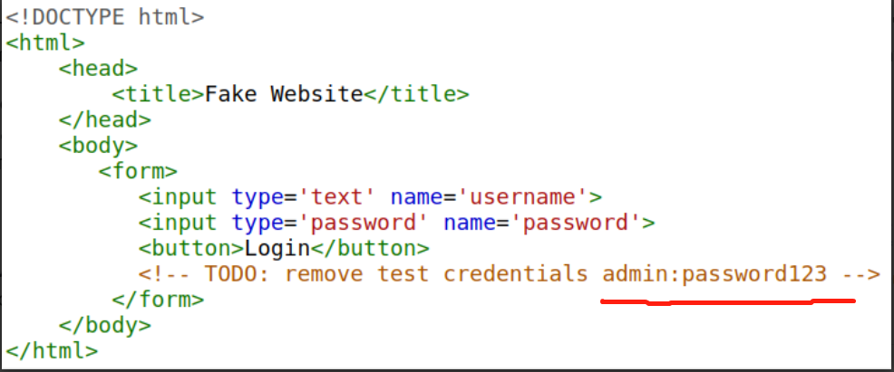<figcaption></figcaption></figure>

无论何时评估web应用程序的安全性问题，首先应该做的事情之一就是检查网站的页面源代码，看看是否可以找到任何暴露的登录凭据或隐藏的链接。

### **答题**

使用和本文相关的TryHackMe实验房间中的模拟界面 并回答问题。

通过查看页面源代码发现以及泄露的敏感信息（右键单击以下页面并选择查看框架的源代码）：

<figure>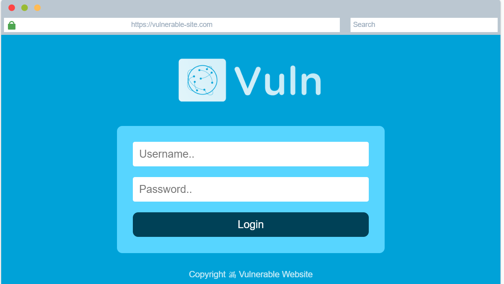<figcaption></figcaption></figure>

<figure>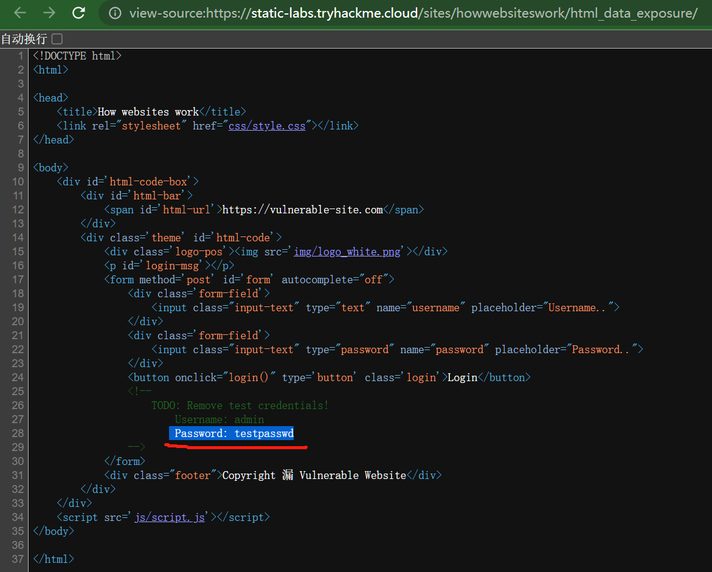<figcaption></figcaption></figure>

> 隐藏在源代码中的密码是：testpasswd 。

<figure>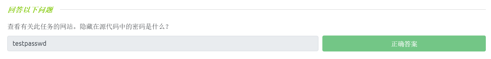<figcaption></figcaption></figure>

## HTML注入介绍

HTML注入是一种漏洞(发生在客户端侧)，这会将未经过滤的用户输入直接显示在网站页面上。如果一个网站未能过滤用户输入(过滤用户输入到网站的任何“恶意”文本)，并且该输入能被显示在网站页面上，那么攻击者就可以针对易受攻击的网站实现HTML代码注入操作。

输入消毒(即过滤恶意输入)对于保持网站安全性非常重要，因为用户输入到网站的信息通常会用于其他前端或者后端的功能实现；比如，有一类漏洞是数据库注入漏洞，如果存在这种漏洞——你就可以通过控制SQL查询的输入来操作数据库并查找其中的数据，从而实现以另一个用户的身份登录网站。

当用户可以控制如何显示他们的输入内容时，用户就可以向网站提交HTML(或JavaScript)代码，而浏览器就可能在网站页面中使用这些代码，从而允许用户能够控制网站页面的外观和功能。

<figure>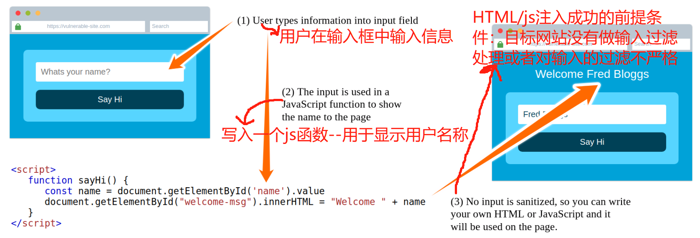<figcaption></figcaption></figure>

上图显示了表单如何将文本输出到网站页面：无论用户在“What's your name”的输入框中输入什么，用户所输入的内容都将传递给网站的JavaScript函数，然后输出结果将被显示在网站页面上；这意味着用户能够在输入框中添加自己构造的HTML或JavaScript代码，而这些代码将生效并能附加相关结果以显示在网站页面上。

一般的安全规则是“永远不要相信用户输入”。为了防止用户的恶意输入影响网站的正常功能，网站开发人员应该在使用JavaScript函数之前对用户所输入的所有内容进行消毒（即过滤），在这种情况下，网站开发人员应该删除“用户输入内容”中的HTML标签。

### **答题**

使用和本文相关的TryHackMe实验房间中的模拟界面 并回答问题。

利用模拟页面注入HTML，让页面显示一个恶意链接：`<a href="http://hacker.com">hacker link</a>`

<figure>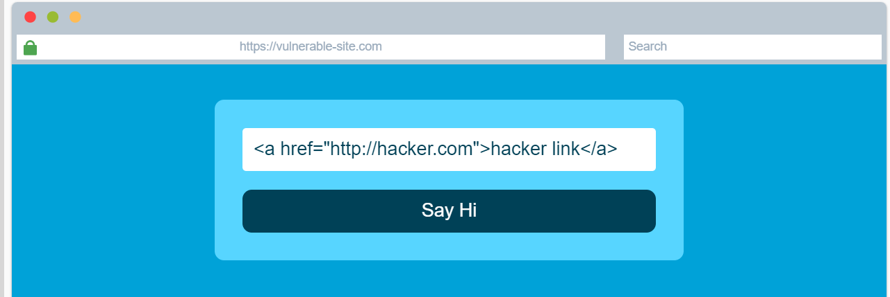<figcaption></figcaption></figure>

<figure>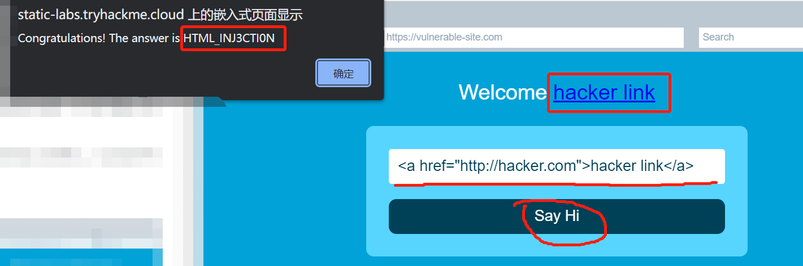<figcaption></figcaption></figure>

> 得到的answer为：HTML\_INJ3CTI0N 。

<figure>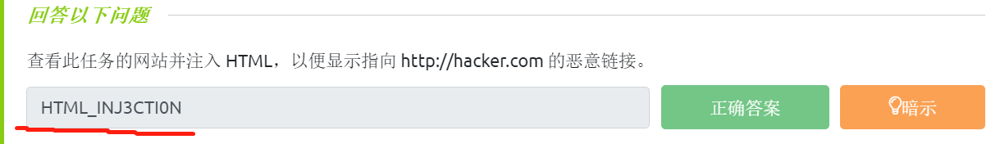<figcaption></figcaption></figure>
