# Linux Fundamentals Part2(Linux基础知识2)

TryHackMe实验房间链接：[https://tryhackme.com/room/linuxfundamentalspart2](https://tryhackme.com/room/linuxfundamentalspart2)

## 简介

欢迎来到“Linux基础”系列的第二部分，在本文中我们将开始了解能够登录和控制远程Linux机器终端的基本技能，并且，我们还将学习以下内容：

* 介绍参数标志和参数开关以便我们更高效地使用Linux命令；
* 通过学习更多命令，如复制文件和移动文件等，加强我们对Linux文件系统的了解；
* 介绍访问权限控制机制，并且了解如何识别当前用户是否具有相关的访问权限，以确保文件和文件夹的安全；
* 介绍一些Linux中的常见目录。

## 使用 SSH 访问 Linux 机器

SSH协议是Secure Shell的简称，使用该协议是连接到远程Linux机器的常用方法，通过SSH我们可以使用命令行来与远程Linux机器进行交互。

我们将部署两台机器：

* TryHackMe所提供的Linux目标虚拟机
* TryHackMe所提供的攻击机或者你的本地Kali虚拟机

**什么是SSH &它是如何工作的?（简单了解）**

Secure Shell或SSH 是一种能够对计算机设备之间的通信数据进行加密的协议。使用了SSH协议之后，计算机设备之间需要通过网络传输的数据将被加密处理，一旦加密数据到达远程机器，就会开始解密过程，如下图所示：

<figure>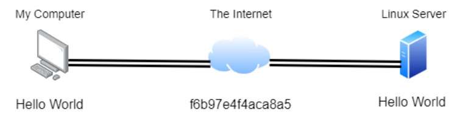<figcaption></figcaption></figure>

在本文中我们只需要对SSH有一个基础了解即可：

* SSH能够允许我们通过本地设备上针对另一个设备远程执行命令。
* 使用了SSH协议之后，设备之间所发送的任何数据 在通过网络传输时都会经过加密处理。

**使用SSH登录Linux机器**

SSH的语法非常简单，我们只需要提供以下内容：

1. 远程计算机的IP地址；
2. 远程计算机上可用于登录的有效帐户及凭据。

在本文中，我们将以"tryhackme"用户帐户登录到远程Linux机器，相关的登录密码是"tryhackme"。

首先，我们需要在TryHackMe攻击机（或者你的本地Kali虚拟机）上打开一个终端；我们要在攻击机终端输入的SSH命令类似于`ssh tryhackme@MACHINE_IP`，在实际执行SSH命令时，我们需要将示例中的`MACHINE_IP`替换为Linux目标机的实际IP地址；当输入SSH命令并按下回车键之后，我们会被询问是否信任主机（输入"yes"即可），然后还要为"tryhackme"帐户提供密码（输入"tryhackme"即可）。

<figure><figcaption></figcaption></figure>

现在我们应该成功通过SSH连接到远程Linux机器，我们接下来所输入的任何命令都将在远程机器上执行——而不会在我们自己的机器上执行。

注意：当你在ssh登录提示中输入密码时，并没有可见的反馈——你将无法在键入密码时看到任何文本或符号出现，我们只需输入密码并按enter即可。

### **实践操作**

输入命令：

```shell
ssh tryhackme@10.10.241.39
```

<figure>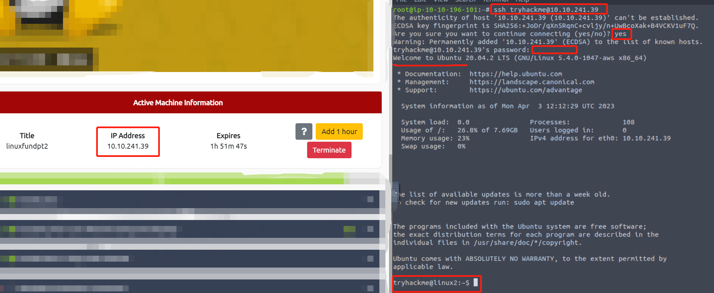<figcaption></figcaption></figure>

## Linux命令的参数标志和参数开关

大多数Linux命令都允许提供参数，这些参数将由连字符以及被称为标志或开关的特定关键字标识。

接下来我们将讨论如何识别哪些命令允许提供参数，以及如何理解这些命令的具体功能。

在使用Linux命令时，除非另有指定，否则它将执行默认行为；例如，`ls`命令能够列出工作目录下的内容，但是，这并不会显示隐藏文件；所以，我们有时候需要使用参数标志和参数开关来扩展命令的行为。

以`ls`为例，`ls`能够告诉我们当前目录下只有一个名为“folder1”的文件夹（请注意，下面截图中的内容仅为示例）：

<figure>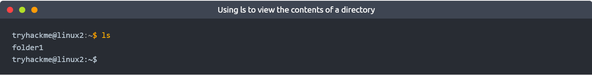<figcaption></figcaption></figure>

然而，在使用`-a`参数(`--all`的缩写)对`ls`命令进行扩展之后，我们会得到一个包含更多文件和文件夹内容的输出结果，例如下图中的"`.hiddenfolder`"。

<figure>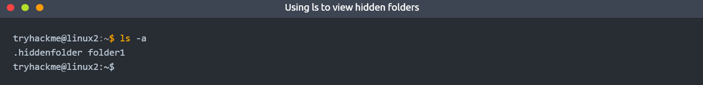<figcaption></figcaption></figure>

tips：名称中带"`.`"表示隐藏文件或者隐藏文件夹，带"`.`"的文件、文件夹无法通过简单的`ls`命令被列出。

允许提供参数的命令还可以使用`--help`选项，该选项会列出此Linux命令能够使用的参数信息（并会提供相关的简要描述和示例）：

<figure>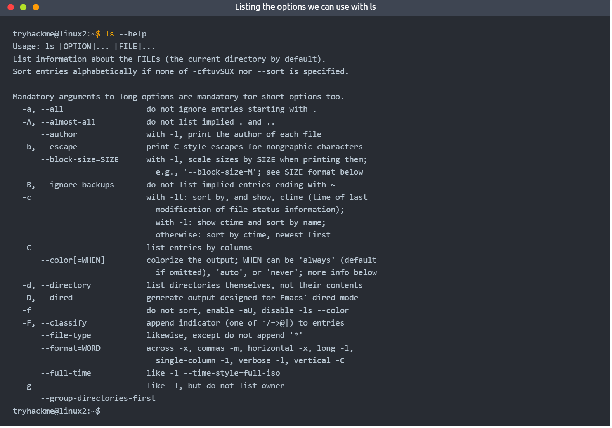<figcaption></figcaption></figure>

事实上，`--help`选项也是man page (manual page的缩写)的格式化输出，man page是关于Linux系统命令和应用程序的使用文档。

**The Man(ual) Page**

man page(手册页)是了解Linux机器上可用的系统命令和应用程序的重要信息来源，我们可以在Linux上访问man page，也可以通过网络[在线访问man page](https://linux.die.net/man/)。

如果要在Linux上访问man page文档，我们可以使用`man`并将其与具体的Linux命令组合，以`ls`为例，我们可以使用`man ls`来查看`ls`命令的手册页：

<figure>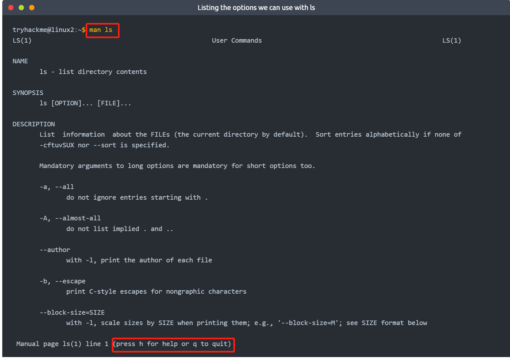<figcaption></figcaption></figure>

### **答题**

通过SSH会话对目标Linux虚拟机进行操作：

<figure>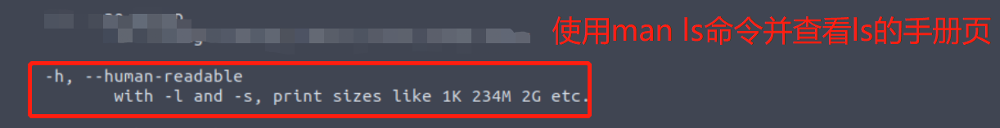<figcaption></figcaption></figure>

<figure>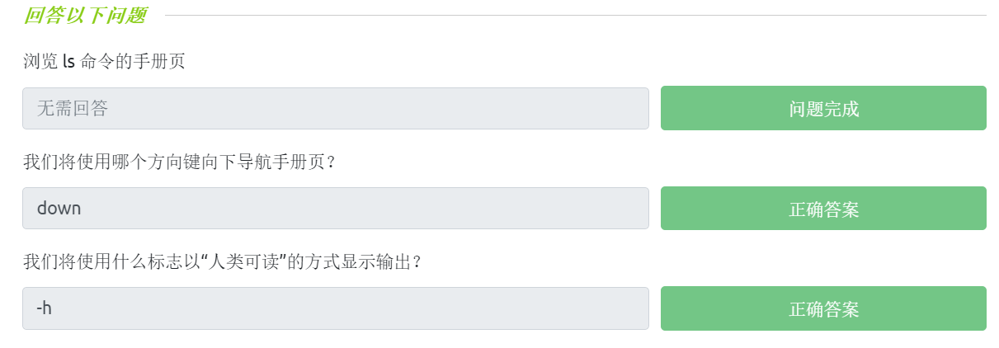<figcaption></figcaption></figure>

## 可与文件系统交互的更多命令

在“Linux基础”系列的第一部分，我们介绍了与Linux机器上的文件系统进行交互的一些基本命令。

在本小节中，我们将学习更多可以与文件系统交互的命令，以允许我们：

* 创建文件和文件夹
* 移动文件和文件夹
* 删除文件和文件夹

更具体地说，我们将学习以下命令：

* touch（全称为-touch）：创建文件；
* mkdir（全称为-make directory）：创建目录，即创建文件夹；
* cp（全称为-copy）：复制文件或者文件夹；
* mv（全称为-move）：移动文件或者文件夹；
* rm（全称为-remove）：移除文件或者文件夹，即删除文件或者文件夹；
* file（全称为-file）：确定文件类型。

tips：与使用`cat`命令类似，我们可以为以上这些命令指定一个完整的文件路径，比如，directory1/directory2/note 。

**创建文件和文件夹(touch, mkdir)**

在Linux上创建文件和文件夹是一个简单的过程。首先，我们将介绍如何创建一个文件，`touch`命令只接受一个参数——我们想要给我们创建的文件所赋予的名称；例如，我们可以使用`touch note`创建“note”文件。值得注意的是，使用`touch`只会创建一个空白文件，你还需要使用`echo`之类的命令或`nano`之类的文本编辑器来向空白文件添加内容。

<figure>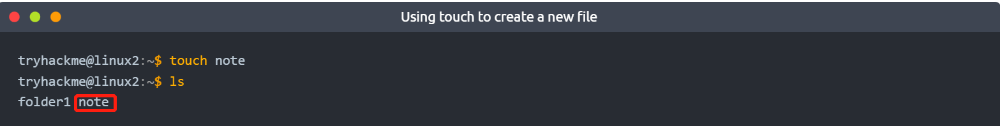<figcaption></figcaption></figure>

创建文件夹与创建文件的过程类似，我们只需要使用`mkdir`命令并提供我们想要赋予给目录的名称即可；例如，我们可以使用`mkdir mydirectory`创建一个目录“mydirectory”。

<figure>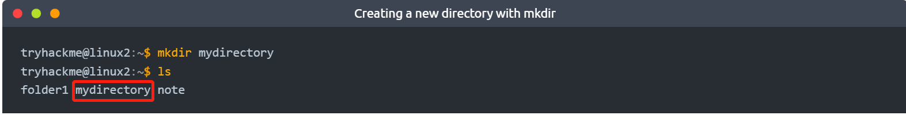<figcaption></figcaption></figure>

**删除文件和文件夹(rm)**

我们可以使用`rm`命令简单地删除文件，但是，如果我们希望删除一个文件夹（目录）的话，我们就需要使用`-R`参数开关。

<figure>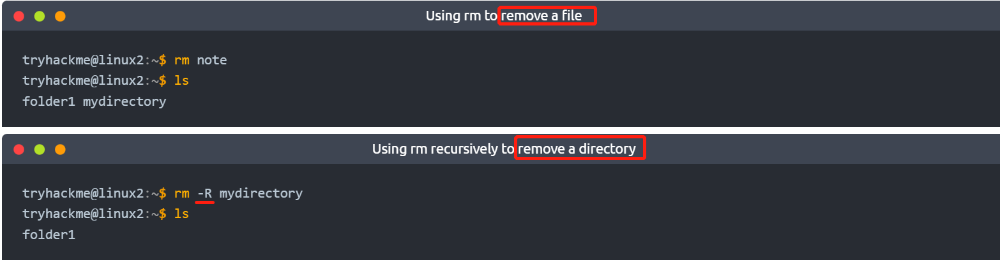<figcaption></figcaption></figure>

**复制和移动文件、文件夹(cp, mv)**

复制和移动文件是Linux机器上的重要功能，`cp`命令可以结合以下两个参数使用：

1. 现有文件的名称；
2. 复制时希望分配给新文件的名称。

使用`cp`命令能够将现有文件的全部内容复制到新文件中，在下图的示例中，我们将“note”文件复制到“note2”文件。

<figure>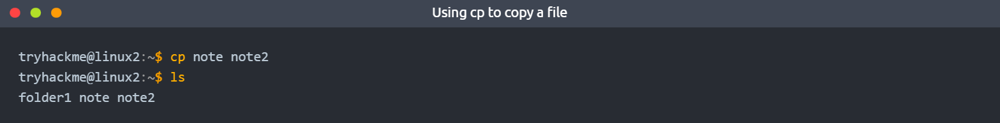<figcaption></figcaption></figure>

移动文件所使用的`mv`命令也需要两个参数，就像`cp`命令一样；然而，`mv`命令不会复制并创建一个新文件，而是合并或修改我们作为参数提供的第二个文件。

我们不仅可以使用`mv`命令将文件移动到新文件夹下，还可以使用`mv`命令重命名文件或文件夹；例如，在下图的示例中，我们使用`mv`将文件“note2”重命名为“note3”，现在“note3”文件将拥有“note2”文件的全部内容（“note2”文件会消失）。

<figure><figcaption></figcaption></figure>

**确定文件类型(file)**

一个文件通常会有所谓的扩展名，例如，文本文件的扩展名通常是“.txt”，但是文件扩展名并不是文件所必要的（一个文本文件的名称也可以不带.txt）。

我们可以使用`file`命令来确定一个文件的类型，例如，我们可以使用`file`来确认“note”文件是否确实是一个文本文件：`file note`

<figure>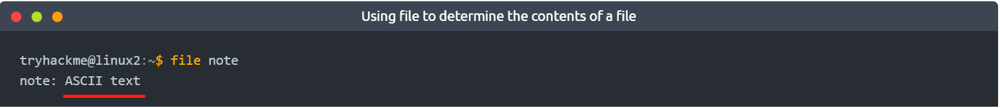<figcaption></figcaption></figure>

### **答题**

通过SSH会话对目标Linux虚拟机进行操作：

<figure>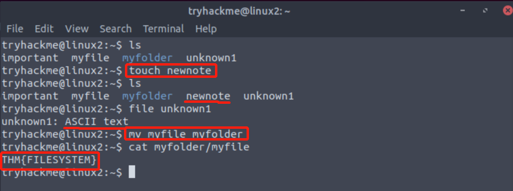<figcaption></figcaption></figure>

<figure>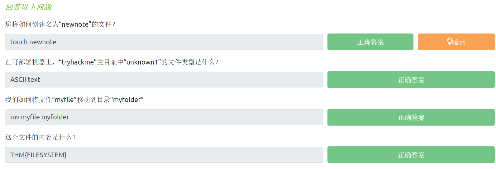<figcaption></figcaption></figure>

## 访问权限介绍

在Linux机器上，某些用户可能无权访问一些文件或文件夹，我们之前已经探讨了一些命令，这些命令可用于确定与文件或文件夹相关的访问权限。

在前面的知识点小节中，我们已经学习了如何通过参数标志和参数开关来扩展命令的使用；当我们使用`ls`命令结合`-lh`参数开关时，我们可以看到如下示例内容：

<figure>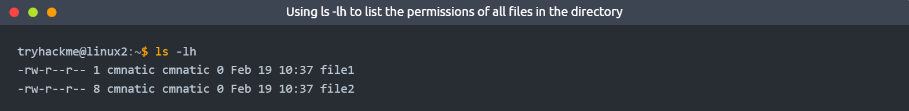<figcaption></figcaption></figure>

如上图所示，我们使用`ls -lh`命令列出了当前目录下的文件和文件夹的权限分配情况。

tips：`-l` 使用长列表格式列出内容；`-h` 全称为--human-readable(顾名思义，以可读形式列出内容) 。

以上输出结果对于确定文件或文件夹的某些特征以及我们是否有权访问它们非常重要，一个文件或文件夹可以有几个特征，这些特征决定了允许执行哪些操作以及哪些用户或组有能力执行给定的操作，例如：

* Read（读取）：对应的权限标志为“r”；
* Write（写入）：对应的权限标志为“w”；
* Execute（执行）：对应的权限标志为“x”。

假设现在有一个文件名称为“cmnatic. pem”，它的文件权限分配情况如下是"-rw-------"，我们对“cmnatic. pem”文件进行分析：

* “-”表示“cmnatic. pem”的类型是一个文件；
* “rw-------”表示只有“cmnatic.pem”文件的所有者才能读写该文件，并且此文件所有者无权执行该文件。

关于权限分配指示符的说明：

```shell
例子：-rwxrwxrwx

0-9位指示符的说明

#第0位 用于确定文件类型(-,l,d,c,b)
- 是文件
l 是链接（link），相当于windows 的快捷方式
d 是目录，相当于windows的文件夹
c 是字符设备文件，鼠标，键盘
b 是块设备，比如硬盘

#第1-3位 用于确定文件所有者（该文件的所有者）拥有该文件的权限情况 —User
#第4-6位 用于确定文件所在组（同用户组的用户）拥有该文件的权限情况 —Group
#第7-9位 用于确定其他用户拥有该文件的权限情况 —Other
rwx分别代表的是可读、可写、可执行（如果没有取得对应权限，则会使用"-"符号表示没有该权限）

#rwx作用到文件和rwx作用到目录（权限作用到文件和作用到目录有所不同）
r: 如果对一个文件有r权限但对其所在文件夹没有r权限，那么使用ls和ll命令则会提示权限不足，但是可以通过cat来读取该文件内容
w：对一个文件有w权限代表可以对该文件进行修改，但不可以删除该文件，删除一个文件的前提是对该文件所在的目录有w权限
x：x作用到文件表示可以执行，x作用到目录表示可以进入该目录，如果对一个目录没有x权限，使用cd命令想进入该目录时则会提示权限不足
```

修改权限：

```shell
chmod(修改文件权限)

u=user,g=group,o=other
#chmod u=rwx,g=r-x,o=--x 文件名
#chmod g+w 文件名
#chmod o-x 文件名

r=4,w=2,x=1
#chmod 751 文件名

chown(修改所有者)

chgrp(修改所在组)
```

**简述用户和组之间的区别**

我们在Linux基础知识第一部分(即普通用户和系统用户之间的区别)中简要地探讨了这一点。Linux的伟大之处在于，Linux系统中的权限可以划分得很细致，从技术上讲，在一个用户拥有一个文件的同时，如果对权限进行设置，那么另一组用户也可以对同一文件拥有相同或不同的权限集，而不会影响文件所有者本身。

让我们把权限划分的概念放到现实世界中，我们知道运行web服务器的系统用户必须具有有效的针对web应用程序的文件读写权限；然而，类似于提供网络托管服务的公司 将不得不允许他们的客户在不成为web服务器系统用户的情况下 就能为他们的网站上传自己的文件——而这可能会危及所有其他客户的安全。

下面我们将学习在用户之间进行切换所需的命令。

**切换用户**

由于有`su`命令，所以在Linux中切换用户变得非常简单。除非你是root用户(或者通过sudo使用root权限)，否则你需要知道以下内容来完成用户帐户的切换：

1. 我们希望切换到的有效用户名称；
2. 有效用户的密码。

在实际使用`su`命令时，我们可以将其与参数开关相结合以扩展命令的使用，例如，我们可以指定用户切换后执行命令或指定用户切换后要使用的特定shell。你可以通过阅读`su`的手册页（`man su`）以了解更多信息。

简单地说，通过向`su`命令提供`-l`（或者`--login`）参数开关，我们可以启动一个更类似于实际用户登录系统的shell——我们可以继承新用户的更多属性，如环境变量等。

我们可以使用简单的`su`命令切换到user2用户：`su user2`，此时我们得到的新会话会将我们放置到前一个用户的主目录中。

<figure>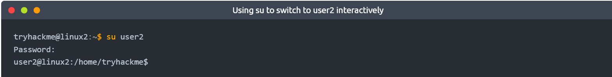<figcaption></figcaption></figure>

我们也可以使用`su`命令结合参数开关`-l`切换到user2用户：`su -l user2`，此时我们的新会话会自动将我们放到新用户的主目录中。

<figure><figcaption></figcaption></figure>

### **答题**

通过SSH会话对目标Linux虚拟机进行操作：

<figure>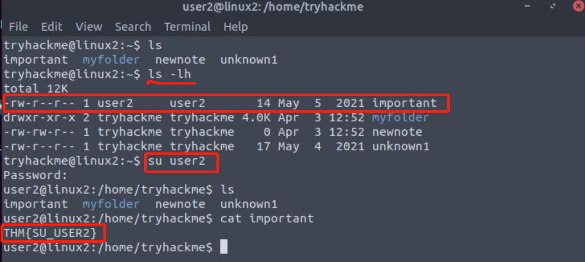<figcaption></figcaption></figure>

<figure><figcaption></figcaption></figure>

## Linux中的常用目录

**/etc目录**

这个目录是Linux系统上最重要的目录之一，"/etc"文件夹(目录)是存储操作系统所使用的系统文件的常见位置。

例如，下图显示的etc/sudoers文件包含了 能够以root用户权限运行`sudo`命令或其他Linux命令的用户和组的列表；下图还显示了etc/passwd和etc/shadow文件，这两个文件对于Linux也是特殊的，因为它们显示了系统如何以被称为sha512的加密格式存储每个用户的密码。

<figure>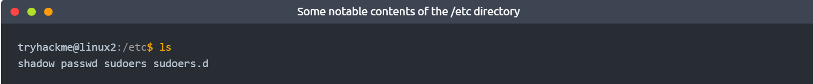<figcaption></figcaption></figure>

tips：etc是etcetera的缩写，etcetera的意思是——“等等；附加物”。

**/var目录**

接下来我们要介绍的是"/var"目录，其中"var"是" variable data"（可变数据）的缩写，此目录是Linux系统中的主要目录之一，存储着在系统中运行的服务、应用程序所频繁访问或写入的数据；例如，来自于服务和应用程序运行时的日志文件将被写入到此目录下(`/var/log`)，其他不一定与特定用户相关联的数据(如数据库等)也会被存储到"/var"目录下。

<figure>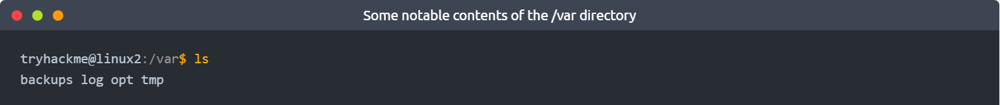<figcaption></figcaption></figure>

/**root目录**

与"/home"目录不同，"/root"文件夹实际上是"root"系统用户的主目录；除了理解这是"root"用户的主目录之外，这个文件夹没有其他内容。基于逻辑上的假设，用户会将其数据默认保存在"/home/root"目录中。

<figure>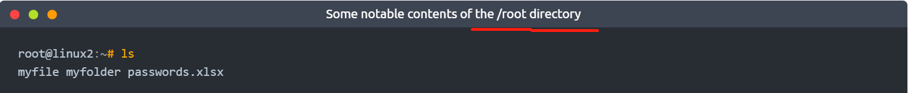<figcaption></figcaption></figure>

**/tmp目录**

该目录是Linux中的唯一目录，"/tmp"目录中的"tmp"是"temporary"（临时）的缩写，它是不稳定的，可用于存储只需要被访问一次或两次的数据；"/tmp"在存储数据时与计算机上的内存类似，一旦计算机重新启动，"/tmp"文件夹中的内容则将会被自动清除。

我们要知道的是：在默认情况下，任何用户都可以写入内容到这个"/tmp"文件夹，这意味着一旦我们访问了一台机器，"/tmp"就可以作为存储脚本等内容的极佳选择。

<figure>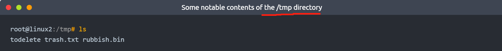<figcaption></figcaption></figure>

### **答题**

阅读本小节内容并回答以下问题。

<figure>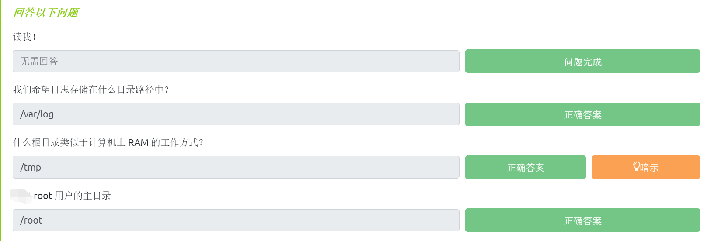<figcaption></figcaption></figure>

## 小结

本文涵盖了相当多的Linux基础知识，让我们简单回顾一下本文所包含的学习内容：

* 学习使用SSH远程连接到Linux机器；
* 通过了解参数标志、参数开关以及每个命令的相关信息(手册页)来加强对Linux命令的使用；
* 学习使用一些常用命令与文件系统及其内容进行交互；
* 简要介绍了文件权限和怎样切换当前用户；
* 介绍Ubuntu Linux在默认情况下的常用目录，了解我们应该如何使用存储在这些常用目录中的数据。
