# ☑ Linux Fundamentals Part3(Linux基础知识3)

TryHackMe实验房间链接：[https://tryhackme.com/room/linuxfundamentalspart3](https://tryhackme.com/room/linuxfundamentalspart3)

## 简介

欢迎来到“Linux基础”系列的第三部分(也是最后一部分)。到目前为止，在本系列文章中，你已经学习了一些基本概念并使用了一些重要的命令；接下来，本文将展示一些你可能经常会用到的实用工具和应用程序，你还将通过了解Linux中的自动化任务、包管理、服务日志及应用程序日志来提高你的Linux技能。

**环境准备**

在TryHackMe攻击机或者你的本地Kali机上，使用以下凭据 通过SSH远程访问TryHackMe实验房间所提供的Linux目标机器：

* IP Address：MACHINE\_IP（在与本文相关的TryHackMe实验房间中部署目标机器，即可得到一个对应的目标IP地址）
* Username：tryhackme
* Password：tryhackme

tips：语法示例——`ssh tryhackme@MACHINE_IP`。

## 终端文本编辑器

到目前为止（在本系列的文章中），我们使用过`echo`命令与操作符(`>`和`>>`)的组合，实现了写入文本内容到指定文件中；但是当我们处理具有多行内容的文件时，前述写入方式并不是一种有效的处理数据的方法，此时我们就需要使用文本编辑器来处理文件内容。

有很多文本编辑器可供Linux终端使用，它们都有各种各样的友好性和实用性，接下来我们将简单介绍以下两种终端文本编辑器：

* nano编辑器
* vim编辑器

**Nano编辑器简介**

Nano很容易上手，如果要使用nano创建或编辑文件，我们只需输入`nano filename`命令（在实际执行时，将"filename"替换为你所希望编辑的文件名即可）。

```shell
#Introducing Nano 终端界面示例
tryhackme@linux3:/tmp# nano myfile
  GNU nano 4.8                                             myfile                                                       

^G Get Help    ^O Write Out   ^W Where Is    ^K Cut Text    ^J Justify     ^C Cur Pos     M-U Undo       M-A Mark Text
^X Exit        ^R Read File   ^\ Replace     ^U Paste Text  ^T To Spell    ^_ Go To Line  M-E Redo       M-6 Copy Text
```

一旦我们按下回车键执行nano命令，nano编辑器将会被启动，然后我们就可以开始输入或修改文件的文本内容；我们可以使用“向上”和“向下”方向键浏览文本的每一行，也可以使用键盘上的“Enter”键开始新的一行。

```shell
#Using Nano to write text 终端界面示例
tryhackme@linux3:/tmp# nano myfile
  GNU nano 4.8                                             myfile                                             Modified  

Hello TryHackMe
I can write things into "myfile"


^G Get Help    ^O Write Out   ^W Where Is    ^K Cut Text    ^J Justify     ^C Cur Pos     M-U Undo       M-A Mark Text
^X Exit        ^R Read File   ^\ Replace     ^U Paste Text  ^T To Spell    ^_ Go To Line  M-E Redo       M-6 Copy Text
```

Nano编辑器有一些很容易记住的功能，包括以下内容：

* 搜索文本
* 复制和粘贴
* 跳转到某行号对应的行
* 找出你当前所在行的行号

你可以通过按“Ctrl”键(在Linux上会被表示为`^`)并结合相应的字母来使用nano编辑器的功能；例如，如果我们要退出编辑器界面，我们可以按“Ctrl”+“X”退出Nano编辑器。

**VIM编辑器简介**

VIM是一个更高级的文本编辑器，虽然你不需要知道VIM的所有高级特性，但是使用VIM编辑器特性对于提高你的Linux技能有很大帮助。

<figure>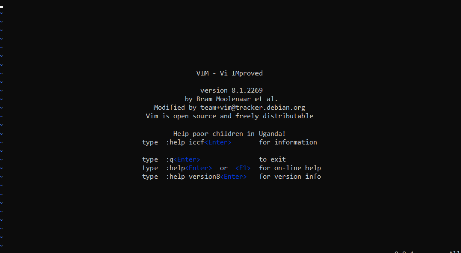<figcaption></figcaption></figure>

尽管需要更长的时间来熟悉，但是VIM编辑器有很多优点，包括以下内容：

* 可自定义——你可以自主选择修改键盘快捷键；
* 语法高亮显示——如果你正在编写或维护代码，这可能非常有用，VIM编辑器是软件开发人员的流行选择之一；
* VIM编辑器可以在没有安装nano的所有终端上工作（VIM编辑器可以完全替代nano编辑器）；
* 有很多VIM资源可供你使用，如[VIM备忘单](https://vim.rtorr.com/)、[VIM教程](https://www.runoob.com/linux/linux-vim.html)等。

### **答题**

通过SSH会话对目标Linux虚拟机进行操作：

<figure><figcaption></figcaption></figure>

<figure><figcaption></figcaption></figure>

<figure>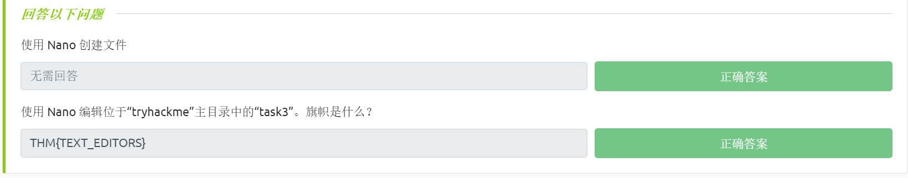<figcaption></figcaption></figure>

## Linux常见实用程序介绍

**下载文件-wget**

计算机设备的一个相当基本的特征是具有传输文件的能力，例如，你可能想要从网上下载一个程序、一个脚本或者一张图片。

在本小节我们将介绍`wget`命令的使用，这个命令允许我们通过HTTP从网络上下载文件——就像你在浏览器中访问文件一样；在使用`wget`命令下载文件时，我们还需要提供所希望下载的资源的地址，例如，如果我们想下载一个名为“myfile.txt”的文件到本地Linux机器上，假设我们已经知道了目标资源文件的网址，我们所使用的命令看起来会是下面这样：

```shell
wget https://assets.tryhackme.com/additional/linux-fundamentals/part3/myfile.txt
```

**传输文件-scp**

SCP（secure copy）是一种能够安全复制文件的方法，与常规的`cp`复制命令不同，使用`scp`命令可以在两台计算机之间传输文件，并且该命令将使用SSH协议来提供身份验证和数据加密功能。

基于SOURCE（源）和DESTINATION（目的地），SCP能够允许你：

* 将文件和目录从当前系统中复制到远程系统；
* 从远程系统中复制文件和目录到当前系统。

使用`scp`命令的前提是：我们已经知道当前的本地系统和远程系统上有效用户的名称及其密码。

接下来我们要将一个示例文件从我们的本地机器复制到远程机器，假设我们已经知道如下信息：

* 远程系统的IP地址——192.168.1.30；
* 远程系统上的有效用户名称——ubuntu；
* 本地系统上的文件名——important.txt；
* 我们希望将文件存储在远程系统上所使用的新文件名称——transferred.txt。

有了以上这些信息，我们就可以编写`scp`命令将文件从本地系统中复制到远程系统：

```shell
#在本地系统的终端界面输入以下命令
#在需要提供密码的时候：请输入密码进行身份验证
scp important.txt ubuntu@192.168.1.30:/home/ubuntu/transferred.txt
```

现在，让我们颠倒过来，让我们使用`scp`命令从远程计算机上复制文件到本地计算机。

同样，我们需要事先知道以下信息：

* 远程系统的IP地址——192.168.1.30；
* 远程系统上的有效用户名称——ubuntu；
* 远程系统上的文件名——documents.txt；
* 我们希望将文件存储在本地系统上所使用的新文件名称——notes.txt

有了以上这些信息，我们就可以编写`scp`命令从远程系统上复制文件到本地计算机：

```shell
#在本地系统的终端界面输入以下命令
#在需要提供密码的时候：请输入密码进行身份验证
scp ubuntu@192.168.1.30:/home/ubuntu/documents.txt notes.txt 
```

**托管文件到web服务器**

Ubuntu机器预先打包了python3，而Python能够提供了一个轻量级且易于使用的web模块，称为“HTTPServer”；该模块能够将你的计算机变成一个快捷和简易的web服务器，你可以使用它来托管你本地计算机上的文件，然后就可以通过其他计算机设备使用`curl`和`wget`等命令进行文件下载操作。

Python3的“HTTPServer”默认将托管你当前运行命令时所在的目录中的文件，但这可以通过添加在手册页中找到的参数选项来更改。

我们可以直接在本地计算机的终端中运行`python3 -m http.server`命令以启动“HTTPServer”模块，如下例所示（没有指定端口则会使用8000端口）：

```shell
#Using Python to start a web server 终端界面示例
tryhackme@linux3:/tmp# python3 -m http.server
Serving HTTP on 0.0.0.0 port 8000 (http://0.0.0.0:8000/) ...
```

tips：如果需要指定该简易web服务器所绑定的端口，则可以使用像 `python3 -m http.server 1234`这样的命令（其中的1234为指定的端口号）。

现在，我们就可以在其他计算机设备上使用`wget`并通过指定本地计算机的IP地址和文件名来下载文件。Python3所提供的这个“HTTPServer”模块的一个缺陷是无法编制索引，因此必须知道我们所希望下载的文件的确切名称和位置。

除了Python3所提供的“HTTPServer”模块之外，你还可以使用Updog来托管文件，Updog能提供一个更高级但仍属于轻量级的web服务器以便你托管本地计算机上的文件。

Updog的GitHub项目链接：[https://github.com/sc0tfree/updog](https://github.com/sc0tfree/updog)

下面是通过Python3的"HTTPServer"模块下载所托管的文件的示例（承接前面的本地文件托管示例）：

```shell
#Downloading a file from our webserver using wget 终端界面示例
tryhackme@linux3:/tmp# wget http://127.0.0.1:8000/file

2021-05-04 14:26:16  http://127.0.0.1:8000/file
Connecting to http://127.0.0.1:8000... connected.
HTTP request sent, awaiting response... 200 OK
Length: 51095 (50K) [text]
Saving to: ‘file’

file                    100%[=================================================>]  49.90K  --.-KB/s    in 0.04s

2021-05-04 14:26:16 (1.31 MB/s) - ‘file’ saved [51095/51095]
```

在上面的示例中，我们可以看到`wget`命令成功地将名为“file”的文件下载到我们的机器上，这个http请求会被HTTPServer记录(就像任何web服务器一样)：

```shell
#Using Python to start a web server 终端界面示例
tryhackme@linux3:/tmp# python3 -m http.server
Serving HTTP on 0.0.0.0 port 8000 (http://0.0.0.0:8000/) ...
127.0.0.1 - - [04/May/2021/14:26:09] "GET /file HTTP/1.1" 200 -
```

tips： 关于Python3"HTTPServer"模块的文档—— [https://docs.python.org/3/library/http.server.html](https://docs.python.org/3/library/http.server.html) 。

### **答题**

通过SSH会话对目标Linux虚拟机进行操作：

使用 Python3 的“HTTPServer”模块在目标机器的“tryhackme”用户的主目录中启动 Web 服务器。

```shell
python3 -m http.server
```

<figure>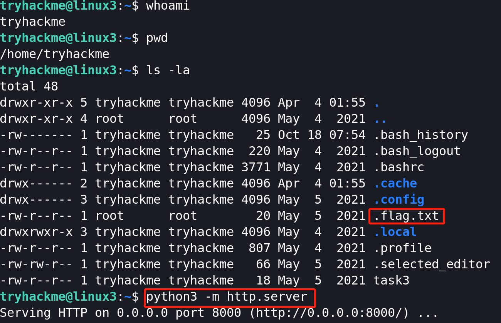<figcaption></figcaption></figure>

在本地攻击机上下载刚才启动的简易web服务器所托管的文件。

```shell
#wget http://MACHINE_IP:8000/.flag.txt 
wget http://10.10.85.109:8000/.flag.txt 
```

<figure>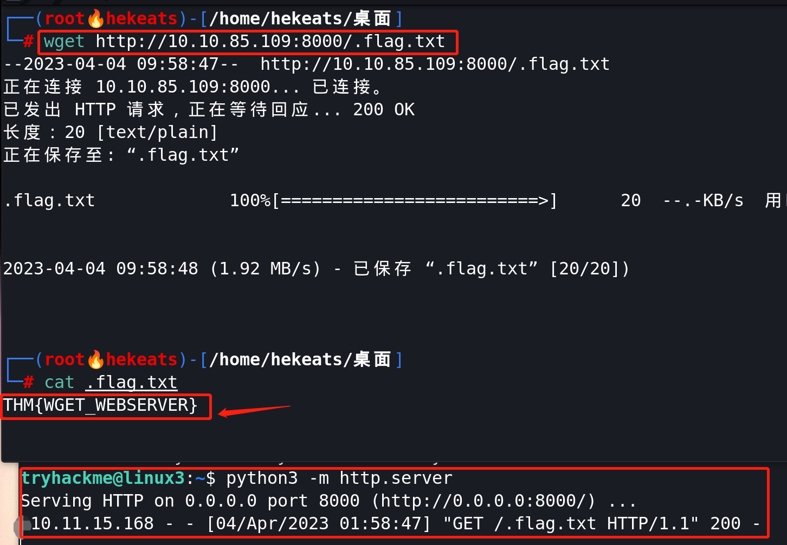<figcaption></figcaption></figure>

> flag为：THM{WGET\_WEBSERVER} 。

<figure>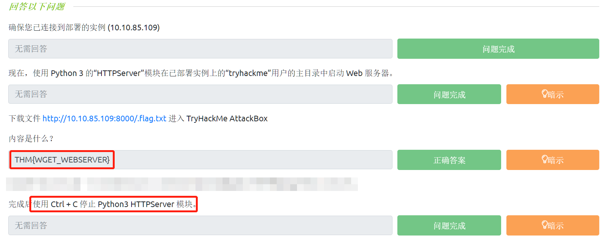<figcaption></figcaption></figure>

## Linux进程基础

进程（Process）是指在你的计算机中正在运行的程序，它们由操作系统内核进行管理，并且每个进程都会有一个与之关联的ID，这个ID被称为PID。PID会根据进程启动的顺序而递增，也就是说，第60个进程的PID即为60。

**查看进程(Viewing Processes)**

Linux `ps`（英文全拼：process status）命令用于显示当前进程的状态，类似于 windows 的任务管理器。

我们可以使用`ps`命令来列出正在运行的进程的一个列表，该列表将提供一些附加信息，如进程的PID、进程的状态码、进程相关的CPU占用情况、正在执行的实际程序或命令的名称等。

<figure>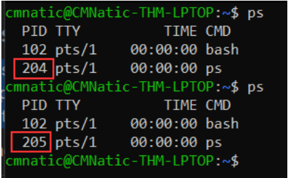<figcaption></figcaption></figure>

从上图中我们可以看到：我们第一次执行`ps`命令时，`ps`本身的进程PID是204，然后当我们再次执行`ps`命令时，`ps`本身的进程PID增加到了205（这说明PID确实会根据进程启动的顺序而递增）。

如果我们要查看由其他用户运行的进程和那些不在会话中运行的进程(即系统进程)，我们需要为`ps`命令提供`aux`参数：`ps aux`

<figure>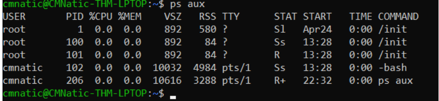<figcaption></figcaption></figure>

从上图中我们可以看到现在总共有5个进程，相关的用户名称为“root”和“cmnatic”。

另一个非常有用的命令是`top`命令，此命令能为你提供有关系统上正在运行的进程的实时统计信息，而不仅是一次性视图；`top`命令所提供的统计信息将每几秒钟刷新一次，但是每当你使用方向键浏览各行信息时也会进行刷新。

<figure>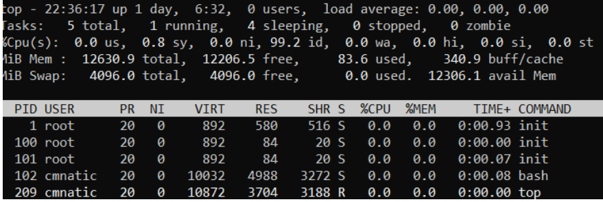<figcaption></figcaption></figure>

关于ps命令的使用参考：[https://www.runoob.com/linux/linux-comm-ps.html](https://www.runoob.com/linux/linux-comm-ps.html)

**终止进程(Managing Processes)**

我们可以通过发送一些信号来终止进程，这些终止进程的信号有多种类型，这主要与系统内核如何“干净”地处理进程有关。

如果我们要终止一个命令(在Linux中，我们可以把进程理解为正在运行的命令)，我们可以使用适当命名的`kill`命令与我们所希望kill的相关PID组合在一起；例如，我们想要kill一个PID为1337的进程，我们可以使用以下命令：`kill 1337`

下面是当进程被杀死时我们可以发送给进程的一些信号（使用`kill -l`可列出当前所支持的所有信号类型）：

* SIGTERM（`kill -15`）：终止进程，但允许它事先执行一些清理任务；
* SIGKILL（`kill -9`）：默认信号，`-9`参数可以省略，表示终止进程并且不做任何事后清理；
* SIGSTOP（`kill -19`）：停止或者挂起进程；
* SIGHUP（`kill -1`）：重启进程；
* SIGCONT（`kill -18`）：继续进程。

**进程如何启动**

操作系统(OS)使用名称空间并最终能将计算机上的可用资源分配给(如CPU、RAM和高优先级)进程，你可以把这个过程想象成将你的计算机资源分成几片——类似于切割一块蛋糕；在切片内的进程将拥有一定的计算机资源，然而，这部分资源也只是所有进程实际可用的一小部分。

名称空间对于安全性非常重要，因为它是将一个进程与其他进程隔离的方式——只有相同名称空间中的进程才能相互看到。

我们之前讨论过PID是如何工作的，这就是名称空间可发挥作用的地方；PID为1的进程为系统启动时会自动运行的进程，这个进程在Ubuntu中是系统的初始化(init)进程，比如`systemd`，它能够用于提供一种在操作系统和用户之间管理用户进程的方法。

一旦系统启动并初始化，`systemd`就会成为首先自动运行的进程之一，而我们想要运行的任何程序或软件都将作为`systemd`进程的子进程启动；虽然这些子进程由`systemd`控制，但仍将作为单独的进程运行(尽管会共享来自`systemd`的资源)，这能使我们更容易识别各个进程。

<figure>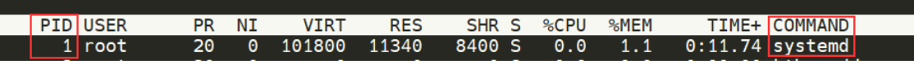<figcaption></figcaption></figure>

**在系统启动时启动进程/服务**

一些应用程序可以在我们的计算机系统启动时启动，例如，web服务器、数据库服务器或文件传输服务器等，这些软件通常很关键，因而经常被管理员告知在系统启动期间启动。

为了在系统启动时启动进程/服务，我们可以使用`systemctl`命令，该命令允许我们与`systemd` 进程（守护进程）交互；`systemctl`是一个易于使用的命令，它采用以下语法格式：`systemctl [option] [service]`

如果我们要让apache服务启动，我们可以使用`systemctl start apache2`，如果想让apache服务停止，我们只需将`[option]`替换成`stop`即可。

我们可以为`systemctl`命令设置以下四个选项：

* Start
* Stop
* Enable
* Disable

**Linux前台和后台介绍**

进程可以以两种状态运行：在前台运行、在后台运行。

你在Linux终端中运行的命令，如“echo”将在终端的前台运行，`echo`命令是一个很好的例子，因为`echo`命令的输出将在前台返回，并且无法在后台返回：

<figure>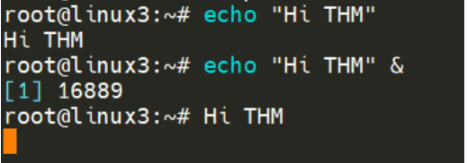<figcaption></figcaption></figure>

如上图所示：当我们运行`echo "Hi THM"`命令时，我们能在终端前台看到命令的输出；但当我们在`echo "Hi THM"`之后添加`&`操作符之后，我们只能在终端前台看到`echo`进程的ID（而不是命令的输出）——因为此时`echo`命令正在后台运行。

前后台机制对于复制文件之类的命令非常有用，因为这将允许我们同时在终端前台和终端后台执行不同的命令；以使用复制文件命令为例，后台化此命令意味着——我们不必等待文件复制命令执行完成，就能同时执行其他命令。

当我们在执行脚本之类的程序文件时，我们也可以让这个进程后台化，此处不依赖于`&`操作符，而是需要我们在键盘上使用`Ctrl + Z`来设置进程的后台化，这也是一种“暂停”脚本运行或命令执行的有效方法，如下图所示：

<figure>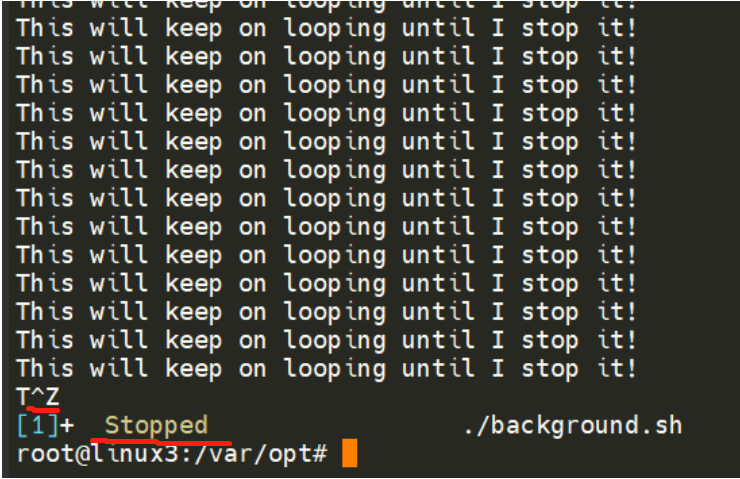<figcaption></figcaption></figure>

由上图可知：示例脚本会持续输出内容 "This will keep on looping until I stop!"，直到我们停止或者挂起与该脚本对应的进程，我们可以通过在键盘上使用Ctrl + Z(在终端界面由T^Z表示)来停止示例脚本的运行。

**前台化进程**

假设现在有一个进程（"background.sh"脚本）在后台运行，我们可以通过使用`ps aux`命令来确认这一点：

<figure>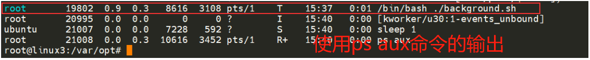<figcaption></figcaption></figure>

我们已经知道，在键盘上使用`Ctrl + Z`或者在命令中添加`&`操作符能够使进程后台化；同样，我们还可以通过使用`fg`命令将后台进程重新前台化。

如下所示：在我们使用`fg`命令之后，"background.sh"脚本所对应的进程能够重新回到终端前台（此时的"background.sh"脚本仍将处于运行状态）。

<figure>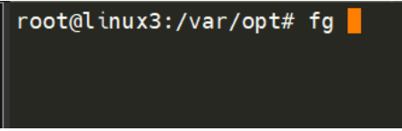<figcaption></figcaption></figure>

<figure>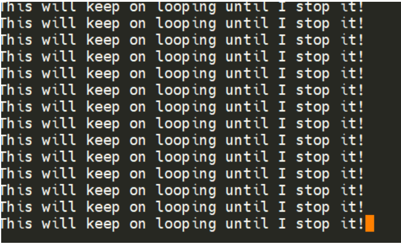<figcaption></figcaption></figure>

### **答题**

_tips：阅读本小节的内容以帮助回答以下问题_

通过SSH会话对目标Linux虚拟机进行操作：

```shell
ps aux 
```

<figure><figcaption></figcaption></figure>

<figure><figcaption></figcaption></figure>

<figure>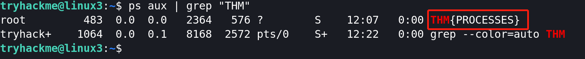<figcaption></figcaption></figure>

> 隐藏的flag为：THM{PROCESSES} 。

<figure>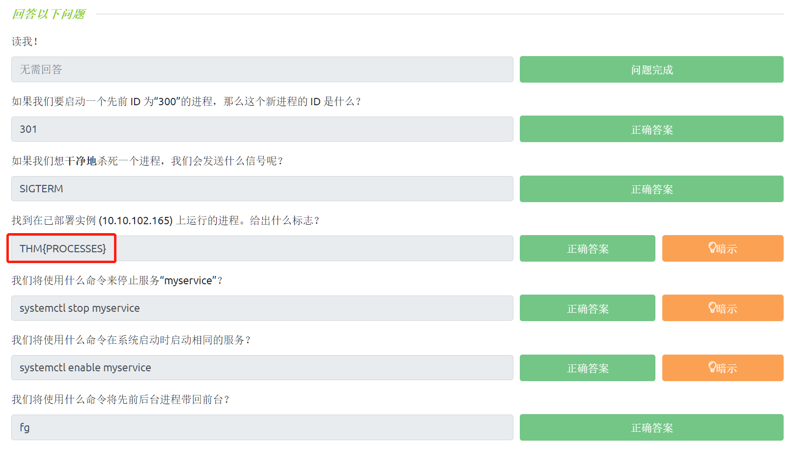<figcaption></figcaption></figure>

<figure><figcaption></figcaption></figure>

## Linux定时任务

用户可能希望设置某个操作或任务在系统启动后得到执行，例如：运行一些命令、备份指定文件、启动某个程序等等。

为了对操作或任务的执行进行定时设置，我们接下来将讨论`cron`进程，更具体地说：我们将学习如何通过`crontab`与`cron`进程进行交互，`crontab`是在系统引导期间所启动的进程之一，它负责促进和管理cron jobs（定时任务）。

<figure>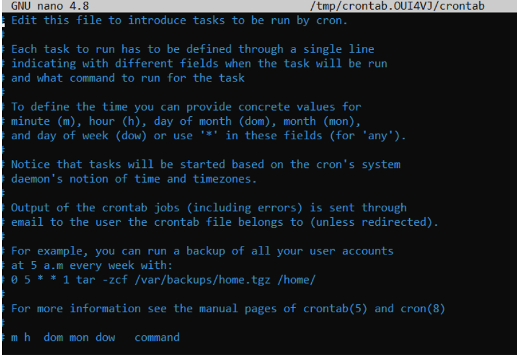<figcaption></figcaption></figure>

crontab是一个特殊的文件，其格式可被`cron`进程识别以逐步执行crontab的每一行，crontab需要具有以下 6 个特定字段值：

* MIN：每多少分钟（minute ）执行；
* HOUR：每多少小时（hour）执行 ；
* DOM：在一个月的每哪一天（Day Of the Month）执行 ；
* MON：在一年的每哪个月（Month of the year）执行；
* DOW：在一个星期的每哪一天（Day Of the Week）执行；
* CMD：实际上将被执行的命令（command）。

以备份文件为例，你可能希望每12小时备份一次"cmnatic"用户的"Documents"，我们将为此使用以下格式命令：

```shell
0 *12 * * * cp -R /home/cmnatic/Documents /var/backups/
```

crontab的一个有趣特性是支持通配符(`*`)，如果我们不希望为某个特定的字段提供一个值，我们就可以用`*`代替；如上面的定时任务示例（备份文件），我们不关心这个任务执行的月份、日期以及年份——我们只关心它做到每12小时执行一次，所以我们只需放置星号来代替我们所不关心的值。

我们可以使用在线的“[Crontab Generator](https://crontab-generator.org/)”工具，它可以帮助生成符合格式的crontab命令；我们还可以使用“[Cron Guru](https://crontab.guru/)”工具，它会分析crontab执行的时间点。

我们可以通过使用`crontab -e`命令并且选择一个编辑器(比如Nano)来编辑crontab文件的内容：

<figure>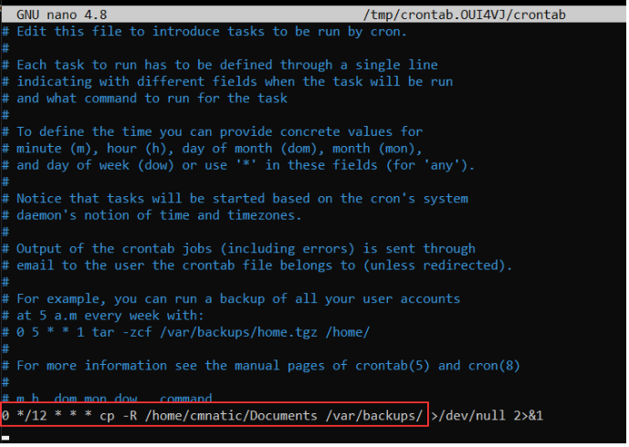<figcaption></figcaption></figure>

tips：我们通过`crontab`命令可以添加、删除、编辑自动化任务（定时任务）。

### **答题**

通过SSH会话对目标Linux虚拟机进行操作：

```shell
crontab -e
```

<figure><figcaption></figcaption></figure>

<figure>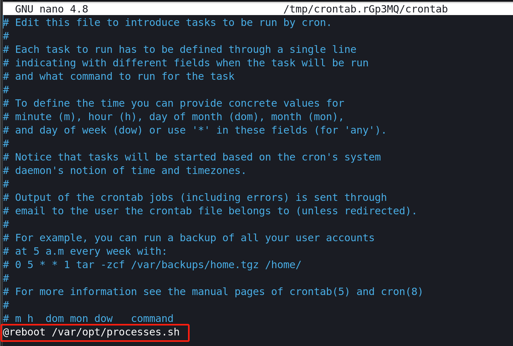<figcaption></figcaption></figure>

<figure>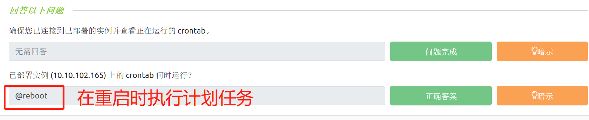<figcaption></figcaption></figure>

## Linux软件包管理

**介绍软件包和软件存储库**

当开发人员希望向Linux社区提交软件时，他们会将其提交到“apt”存储库，如果获得Linux官方批准，那么他们所提交的程序和工具将被发布到公共区域。

Linux最可取的两个特性在这里脱颖而出：具有用户可访问性、能够发挥开源工具的优点。

当我们在 Ubuntu 20.04 Linux 机器上的/etc/apt目录中使用 `ls` 命令时，能够看到以下文件，这些文件可用作网关/注册表。

<figure>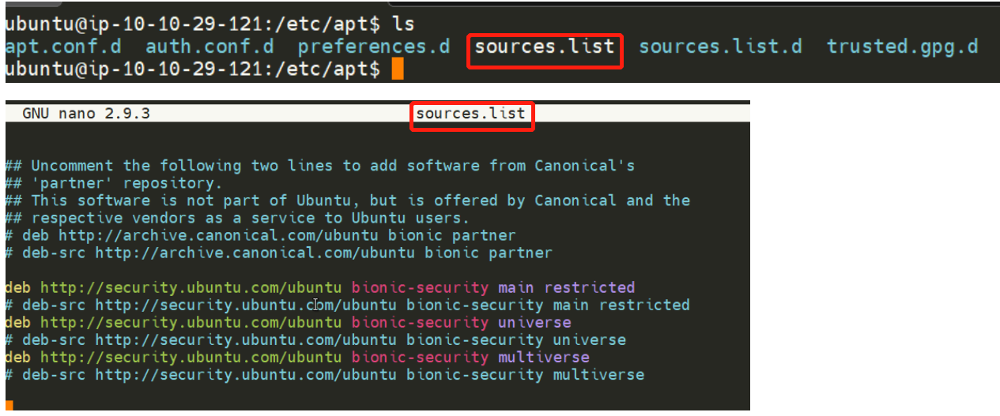<figcaption></figcaption></figure>

虽然操作系统供应商将维护他们自己的存储库，但你也可以选择将一些社区存储库添加到你的源列表中，这将允许你扩展Linux操作系统的功能。

例如：我们可以使用`add-apt-repository`命令添加其他存储库到我们的系统，在实际使用这个命令时，我们可以择优添加系统资源供应商所提供的存储库（一些系统资源供应商会拥有一个更接近我们机器的地理位置的存储库）。

**管理存储库(添加和删除)**

通常我们可以使用`apt`命令将软件安装到我们的Linux系统中，`apt`命令是apt包管理软件的一部分；apt包管理软件（即包管理器）包含了一整套工具，这些工具允许我们管理软件包和软件源，同时还能帮助我们安装软件或者删除软件。

添加存储库的一种方法是使用我们上面提到的`add-apt-repository`命令，但是我们也可以手动添加和删除存储库。

虽然你也可以选择使用其他包安装程序(如`dpkg`)来安装软件，但是使用apt包管理器的好处是：每当我们更新系统时，它都会检查包含我们添加的软件的存储库是否有更新。

在接下来的示例中，我们将把Sublime text文本编辑器作为一个存储库添加到Ubuntu机器中(这个文本编辑器并不是默认的Ubuntu存储库的一部分)；在我们添加软件时，我们所下载的软件的完整性是通过使用所谓的GPG (Gnu Privacy Guard)密钥来保证的，这些密钥本质上是开发人员所提供的安全检查，能够表明“这是我们的软件”，如果当前密钥与操作系统所信任的密钥（即开发人员使用的密钥）不匹配，那么计算机就不会执行下载软件的操作。

因此，我们首先需要添加Sublime Text 3开发人员所使用的GPG密钥。(此过程需要访问互联网)

添加存储库的示例：

1.下载GPG密钥并使用apt-key信任这个密钥：`wget -qO - https://download.sublimetext.com/sublimehq-pub.gpg | sudo apt-key add -`

2.现在我们已经将密钥添加到我们的可信列表中，我们可以开始将Sublime Text 3的存储库添加到我们的apt源列表中；一个好的做法是为我们添加的每个不同的社区/第三方存储库都分配一个单独的文件。

2.1让我们在 /etc/apt/sources.list.d目录中创建一个名为sublime-text.list的文件：

<figure>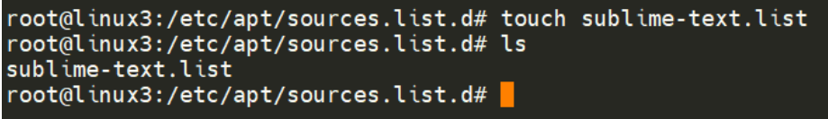<figcaption></figcaption></figure>

2.2使用Nano或其他文本编辑器，添加并保存Sublime text 3存储库到刚才新创建的文件中：

<figure>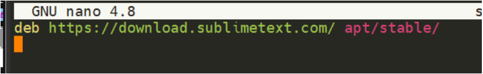<figcaption></figcaption></figure>

2.3在我们添加了以上条目之后，我们需要更新apt包以识别这个新条目——这是通过使用`apt update`命令完成的。

2.4成功更新apt包之后，我们现在可以继续安装我们所信任的并且已经添加到apt包中的软件——`apt install sublime-text`

删除软件包的方法很简单，我们可以使用`add-apt-repository --remove ppa:PPA_Name/ppa`命令来完成，也可以通过手动删除之前添加的文件来完成。

当我们成功删除了软件包之后，我们还需要使用`apt remove [software-name-here]`来清理apt包，例如：`apt remove sublime-text` 。

tips：在删除软件包时，我们要将上述示例命令中的`PPA_Name`替换为我们期望删掉的`PPA`的名称（该名称在以上示例中为“sublime-text”）。

## Linux日志

我们在 Linux 基础知识第一部分中简要介绍了日志文件以及它们所在的位置，现在，让我们快速回顾一下：这些包含日志信息的文件和文件夹位于`/var/log`目录中，主要包含了在系统上所运行的应用程序、服务的日志记录信息。

操作系统 (OS) 擅长通过一个被称为“轮换-rotating”的过程来自动管理日志信息。

以下是Linux机器上正在运行的三个服务以及和这些服务相关的日志信息（此处仅为示例）：

* Apache2 web服务器；
* fail2ban服务（此服务的日志信息可用于监视攻击者所尝试的暴力操作）；
* UFW服务，用作防火墙；

<figure>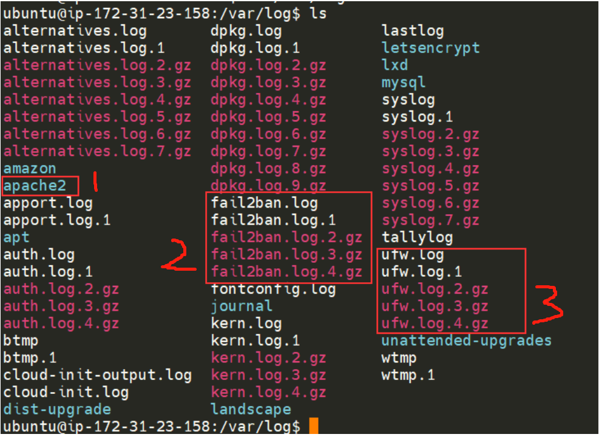<figcaption></figcaption></figure>

通过查看这些服务日志，能够很好地监视系统运行状况以及保护系统的安全；而且，像web server这样的服务所对应的日志文件，还包含了关于每个请求的信息——这将允许网站开发人员或网站管理员诊断web服务的性能，并且有助于调查网络入侵者的活动。

关于web服务，下面两种类型的日志文件是值得我们注意的：

* access log
* error log

<figure>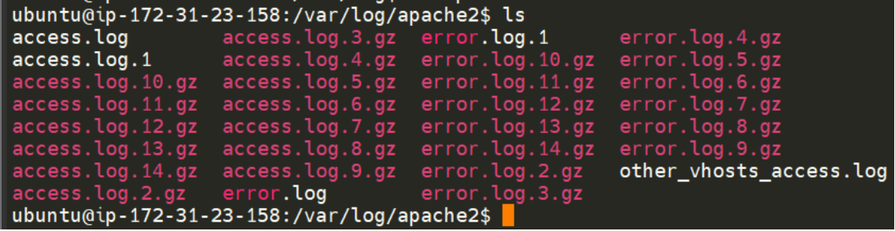<figcaption></figcaption></figure>

tips：日志文件会存储关于操作系统如何运行的信息，还会存储用户所执行的操作，例如身份验证尝试。

### **答题**

通过SSH会话对目标Linux虚拟机进行操作：

<figure>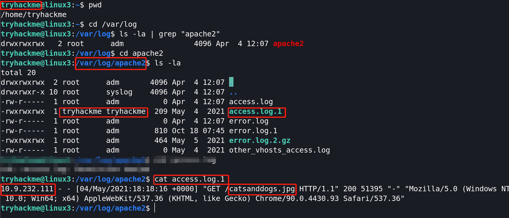<figcaption></figcaption></figure>

<figure>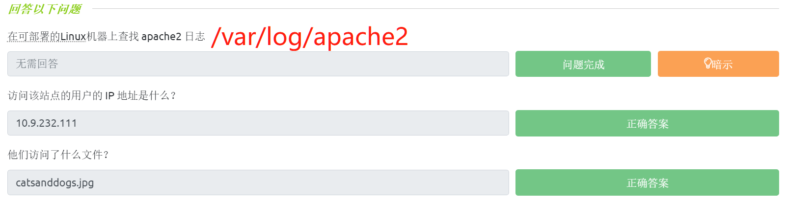<figcaption></figcaption></figure>

## 小结

欢迎来到Linux基础模块的末尾，随着你与Linux交互时间的增加，你对Linux的熟悉程度也将会得到提高。

本文主要介绍了以下内容：

* 关于两种终端文本编辑器（nano和vim）的简介；
* 了解Linux中的一般实用程序，如下载文件、传输文件、使用python web服务器托管本地内容；
* 了解Linux中的进程；
* 通过学习crontab定时任务、软件包管理和日志检查来维护和自动化你的Linux系统。

可参考的Linux中文学习资源：

* Linux中文教程：[https://www.runoob.com/linux/linux-tutorial.html](https://www.runoob.com/linux/linux-tutorial.html)
* Linux 命令大全：[https://www.runoob.com/linux/linux-command-manual.html](https://www.runoob.com/linux/linux-command-manual.html)
* Linux 常用命令英文全拼：[https://www.runoob.com/w3cnote/linux-command-full-fight.html](https://www.runoob.com/w3cnote/linux-command-full-fight.html)

你可以通过以下TryHackMe实验房间继续扩展你的Linux基础学习：

* Bash Scripting（Bash脚本基础） - [https://tryhackme.com/room/bashscripting](https://tryhackme.com/room/bashscripting)
* Regular Expressions（正则表达式基础） - [https://tryhackme.com/room/catregex](https://tryhackme.com/room/catregex)
