# ☑ OSI Model(OSI模型介绍)

TryHackMe实验房间链接：[https://tryhackme.com/room/osimodelzi](https://tryhackme.com/room/osimodelzi)

## 什么是OSI模型？

OSI模型(开放系统互连模型-Open Systems Interconnection Model)是网络中使用的绝对基本模型，这个关键模型提供了一个框架，规定了所有联网设备将如何发送、接收和解释数据。

OSI模型的主要好处之一是：当与其他设备进行通信时，网络上的设备可以具有不同的功能和设计，而且在遵循OSI模型一致性的网络上发送的数据也可以被其他设备理解。

OSI模型由七层组成，从第7层到第1层，每一层都有不同的职责。

数据传递在OSI的每一层都会发生特定的过程，OSI的每一层都会将部分信息添加到原数据中，这个过程被称为封装，下图为OSI模型示意图：

<figure>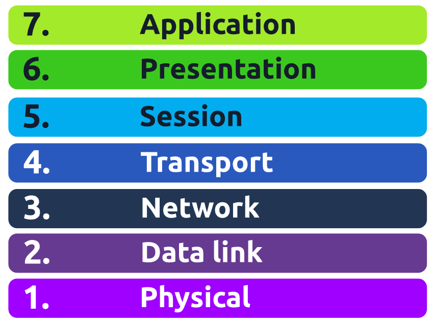<figcaption></figcaption></figure>

**答题**

阅读本小节内容，并回答以下内容。

<figure>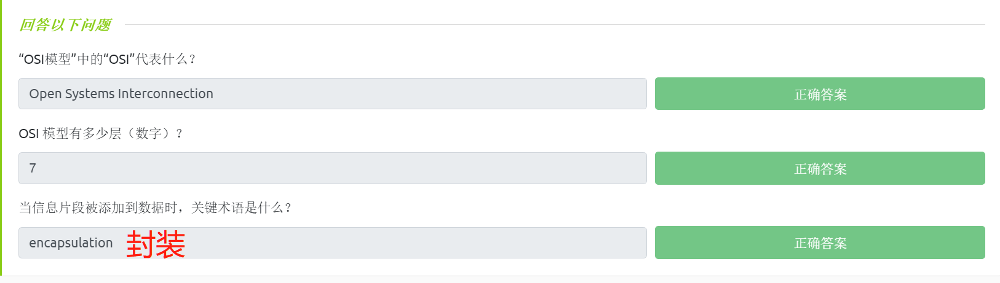<figcaption></figcaption></figure>

## Layer 7 - 应用层(Application)

<figure><figcaption></figcaption></figure>

OSI模型的应用层是你最熟悉的一层，这种熟悉程度是因为应用程序层是协议和规则所在的层，应用层用于确定用户应该如何与发送或接收的数据进行交互。

日常的应用程序，如电子邮件客户端、浏览器或文件服务器浏览软件(如FileZilla) 等，它们能够为用户提供一个友好的图形用户界面(GUI)，这个GUI可用于用户与数据（发送的数据或接收的数据）进行交互；应用层中还包括了DNS协议(域名系统)，DNS能将网站地址转换为IP地址。

<figure>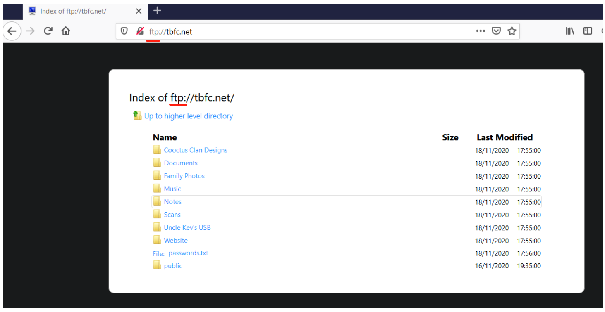<figcaption></figcaption></figure>

**答题**

阅读本小节内容，并回答以下内容。

<figure>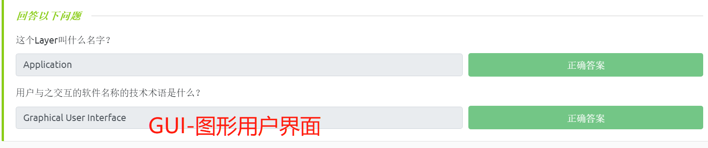<figcaption></figcaption></figure>

## Layer 6 - 表示层(Presentation)

<figure><figcaption></figcaption></figure>

OSI模型的第6层是标准化开始发生的层。软件开发人员可以以不同的方式开发应用程序，例如电子邮件客户端等，而无论应用程序如何工作，数据仍然需要以相同的方式进行处理。

这一层能够充当数据与应用层(第7层)之间的翻译器。接收信息的计算机也能理解以一种格式发送到计算机的数据以另一种格式发送，例如：当你通过某种类型的电子邮件客户端发送电子邮件时，其他用户可能使用的是另一种电子邮件客户端来接收信息，但是电子邮件的内容仍然能够正常显示。

数据加密（如访问安全站点时使用HTTPS协议）等安全特性也将在表示层得到应用。

**答题**

<figure><figcaption></figcaption></figure>

## Layer 5 - 会话层(Session)

<figure><figcaption></figcaption></figure>

一旦数据从表示层(第6层)正确地转换或格式化，会话层(第5层)将开始创建到数据目的地(另一台计算机)的连接。当连接建立后，将同时创建一个会话，并且当该连接处于活动状态时，对应的会话也将处于活动状态。

会话层(第5层)将使两台计算机同步，以确保它们在发送数据和接收数据之前处于同一页面上，一旦相关的检查到位，会话层将开始把要发送的数据分成更小的数据块，并开始一次一个地发送这些数据块(Packets-数据包)；这种对数据分块处理的方式是有益的，因为如果连接发生丢失，则仅有尚未发送的部分数据块需要再次发送——而不需要重新发送全部数据块。

值得注意的是，会话是唯一的——这意味着数据不能在不同的会话之间传输，而只能在相同会话之间传输（一个会话将包含两端：发送数据端和接收数据端）。

**答题**

阅读本小节内容，并回答以下内容。

<figure>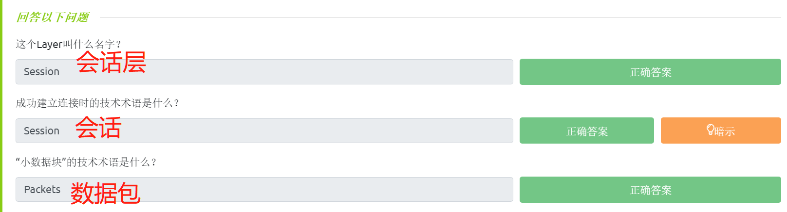<figcaption></figcaption></figure>

## Layer 4 - 传输层(Transport)

<figure><figcaption></figcaption></figure>

OSI模型的第4层在通过网络传输数据方面起着至关重要的作用。当数据在设备之间发送时，它将遵循以下两种不同的协议之一：

* TCP（传输控制协议）
* UDP（用户数据报协议）

**TCP协议**

传输控制协议（TCP-**T**ransmission **C**ontrol **P**rotocol）在设计时考虑到了数据传输的可靠性；并且TCP协议在发送数据和接收数据所需的时间内，将在两个设备之间保持恒定的连接——TCP协议是面向连接的。

不仅如此，TCP还在其设计中加入了错误检查，错误检查能够确认从会话层(第5层)发送的小块数据已经按顺序（按发送数据的顺序）被接收和重新组装。

让我们总结一下TCP的优点和缺点：

* TCP的优点：能够保证数据的准确性；能够同步两个设备，以防止彼此被数据淹没；将执行更多流程，以确保数据传输的可靠性。
* TCP的缺点：要求两台设备之间有可靠的连接，如果没有接收到一小块数据，则无法使用整个数据块；TCP的慢速连接可能会导致其他设备达到数据传输的瓶颈，因为在数据传输完毕之前——相关的TCP连接将一直保留在接收端计算机上；TCP 比 UDP 慢得多，因为使用此协议的设备必须完成更多工作。

TCP主要用于文件共享、互联网浏览或发送电子邮件等情况，因为这些服务要求数据是准确和完整的，而TCP协议的特性能够满足这些要求。

在下图的例子中，我们可以看到一张照片是如何被分解成来自“网络服务器”的小数据块(称为数据包)，而接收数据的计算机会将照片重新按正确的顺序完成构建。

<figure>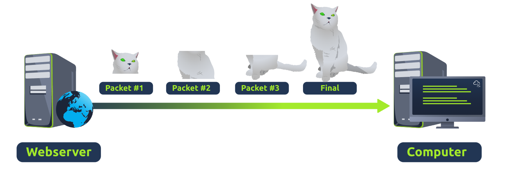<figcaption></figcaption></figure>

**UDP协议**

现在让我们介绍用户数据报协议(UDP-**U**ser **D**atagram **P**rotocol)。UDP协议远不如TCP协议先进，它没有TCP所提供的多种特性，如错误检查和数据传输的可靠性。任何基于UDP协议发送的数据都无法确保不会发生数据丢失，UDP协议在进行数据传输时并没有实现设备的同步过程，UDP的特性是：无连接、不可靠、快速传输。

让我们总结一下UDP的优点和缺点：

* UDP的优点：UDP比TCP快得多；UDP让应用层(用户软件)决定是否控制数据包的发送速度；UDP不像TCP那样在设备上保留连续连接。
* UDP的缺点：UDP不关心发送的数据是否成功被接收，容易发生数据丢失；UDP这种不稳定的数据传输方式可能会给用户糟糕的体验。

我们使用与上面相同的例子，假设我们基于UDP协议传输数据，我们现在可以看到“接收数据的计算机”仅接收到数据包 #1 和 #3，这意味着图像发生了丢失。

<figure>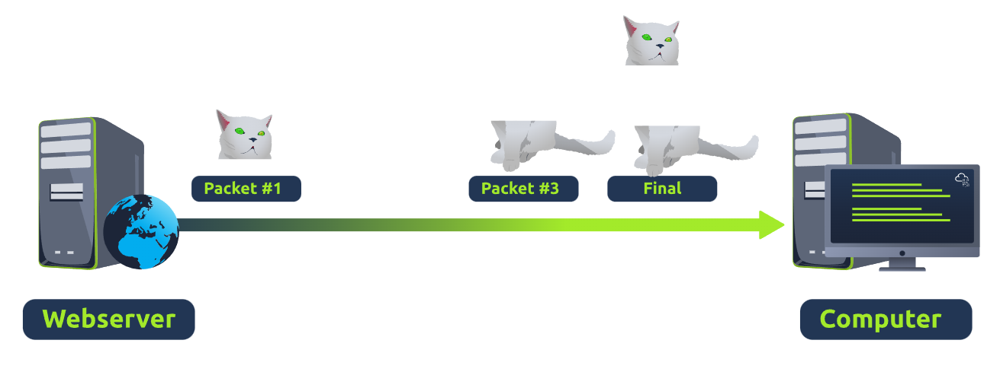<figcaption></figcaption></figure>

UDP协议在需要发送小块数据的情况下很有用，例如，用于发现设备的协议(ARP协议和DHCP协议)或者视频流等更大的文件(视频的某些部分出现像素化是可允许的，像素化部分代表了对应数据的丢失)。

**答题**

阅读本小节内容，并回答以下内容。

<figure>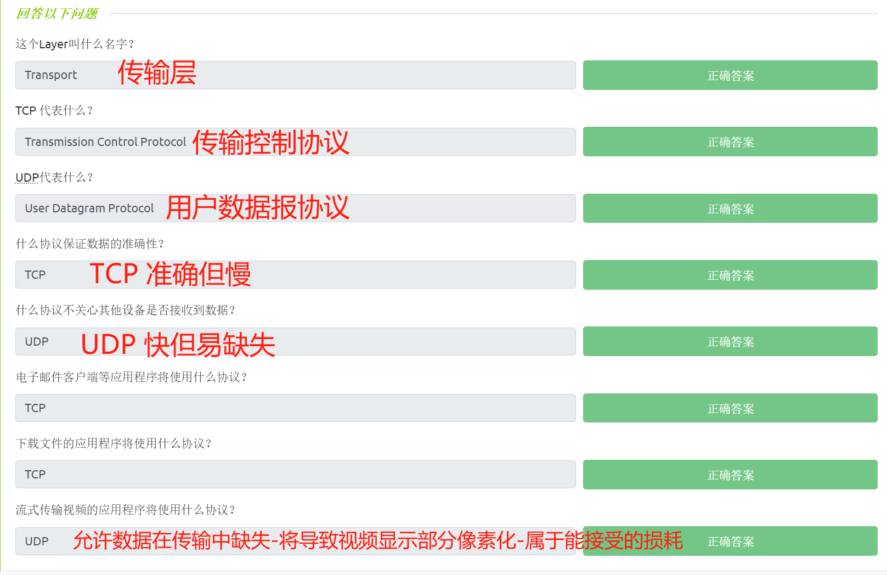<figcaption></figcaption></figure>

## Layer 3 - 网络层(Network)

<figure><figcaption></figcaption></figure>

OSI模型的第三层(网络层)是路由和重新组装数据之处，而路由能够确定发送数据块时应该选择的最优路径。

网络层的一些协议确切地确定了数据到达设备的“最佳”路径，这些协议包括了开放最短路径优先协议(OSPF-Open Shortest Path First)和路由信息协议(RIP-Routing Information Protocol)；此外，路径的选择还由以下因素决定：

* 哪条路径最短?也就是说，数据包需要通过的设备最少。
* 哪条路径最可靠?例如，之前在该路径上丢失过数据包吗?
* 哪条路径的物理连接更快?例如，一条路径是使用铜缆线连接(较慢)还是光纤连接(相当快)?

在这一层，一切都是通过IP地址(如192.168.1.100)进行处理的，能够使用IP地址发送数据包的路由器等设备也被称为第三层设备，因为它们能够在OSI模型的第三层工作。

<figure>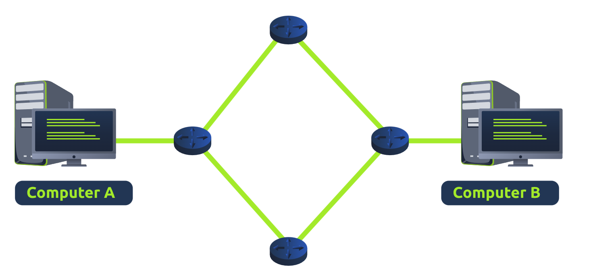<figcaption></figcaption></figure>

**答题**

阅读本小节内容，并回答以下内容。

<figure>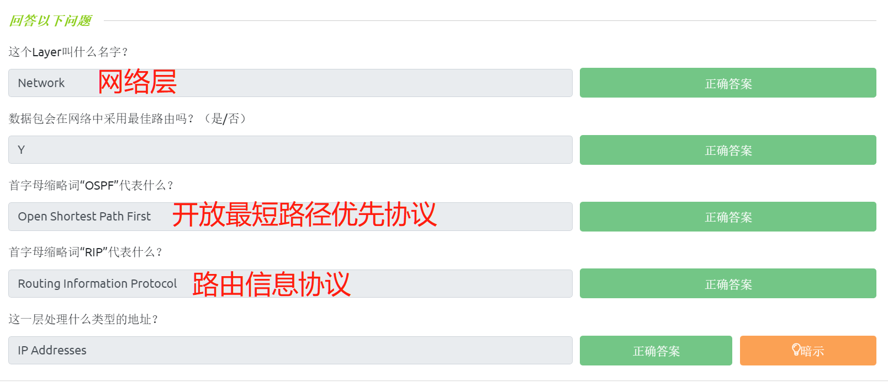<figcaption></figcaption></figure>

## Layer 2 - 数据链路层(Data Link)

<figure><figcaption></figcaption></figure>

数据链路层着重于数据传输过程中的物理寻址。该层级将接收来自网络层的数据包(包括远程计算机的IP地址)，并会在数据包中添加接收端点的物理MAC(媒体访问控制)地址。

在每一台联网计算机内部都有一个网络接口卡(NIC- Network Interface Card)，它带有一个唯一的MAC(Media Access Control)地址作为标识；MAC地址由制造商设置，并刻入网络接口卡中，MAC地址不能被改变——尽管MAC地址可以被欺骗；当信息通过网络发送时，实际上是使用物理地址来确定将信息发送到哪里。此外，以适合传输的格式表示数据也是数据链路层的工作之一。

**答题**

阅读本小节内容，并回答以下内容。

<figure>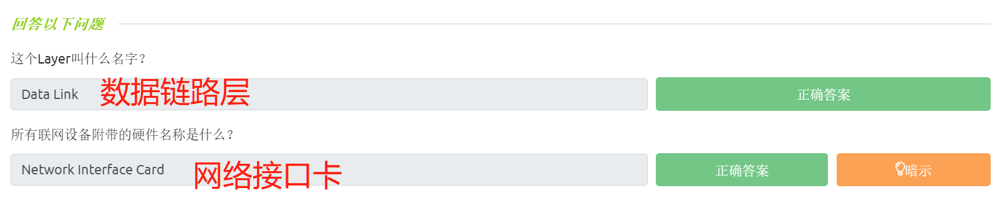<figcaption></figcaption></figure>

## Layer 1 - 物理层(Physical)

<figure><figcaption></figcaption></figure>

物理层包括了在网络中所使用的硬件的物理组件，是OSI模型的最低层，这些设备将使用电信号在二进制编号系统( 0 和 1 )中相互传输数据。

例如，以太网电缆连接设备：

<figure><figcaption></figcaption></figure>

**答题**

阅读本小节内容，并回答以下内容。

<figure>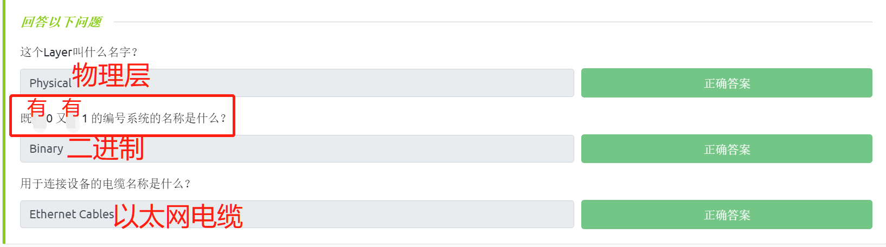<figcaption></figcaption></figure>

## OSI实例练习

在和本文相关的TryHackMe实验房间中部署实验环境并回答问题。

**答题**

根据数据发送时在OSI七层中所经过的顺序完成模拟实验，并得到最后的flag。

_tips：使用左、右方向键控制移动，使用空格键进行爬楼。_

<figure>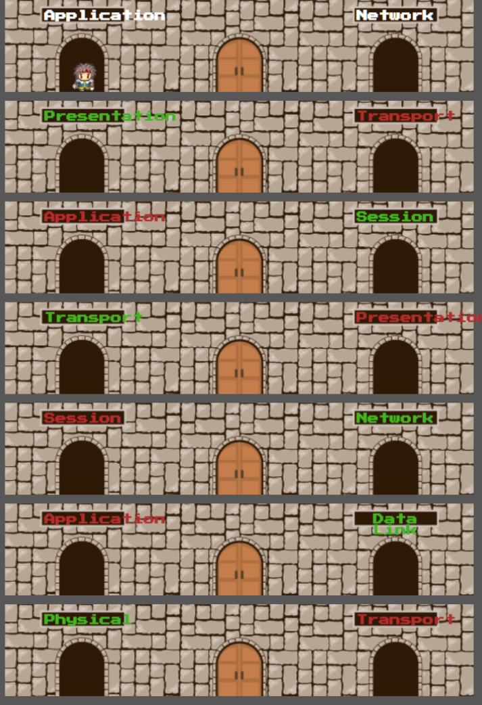<figcaption></figcaption></figure>

<figure><figcaption></figcaption></figure>

> 最后得到的flag是：THM{OSI\_DUNGEON\_ESCAPED} 。

<figure>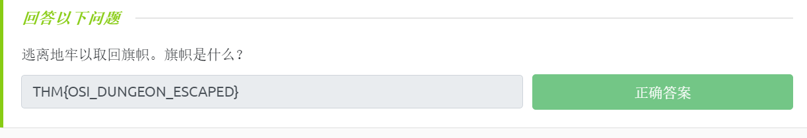<figcaption></figcaption></figure>
