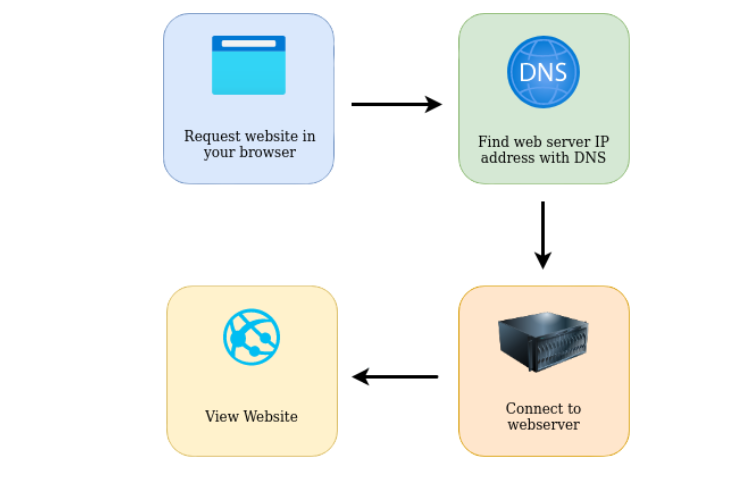
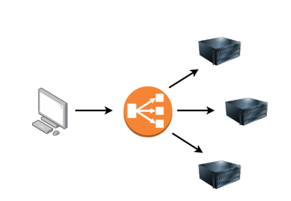
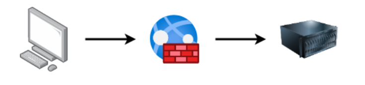
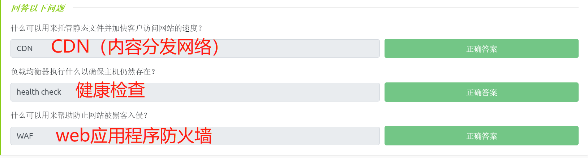
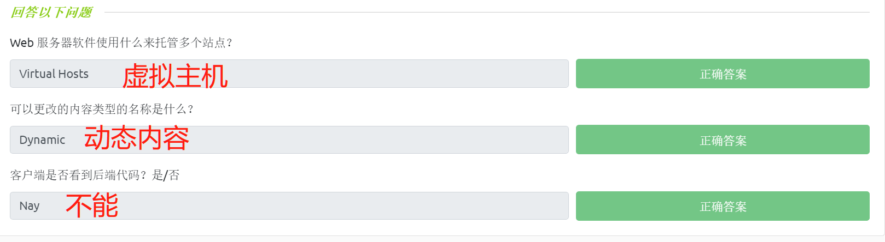
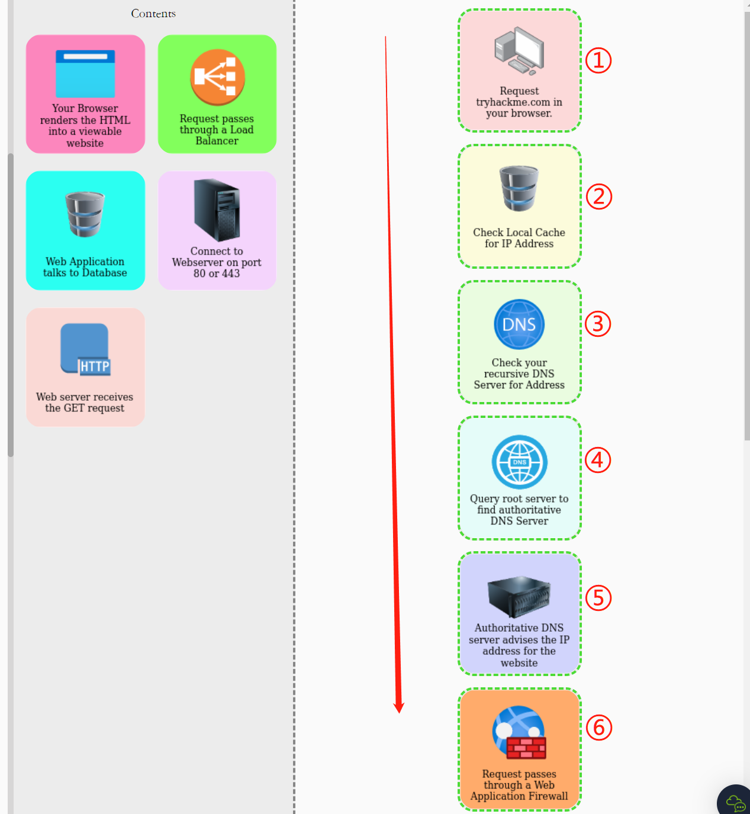
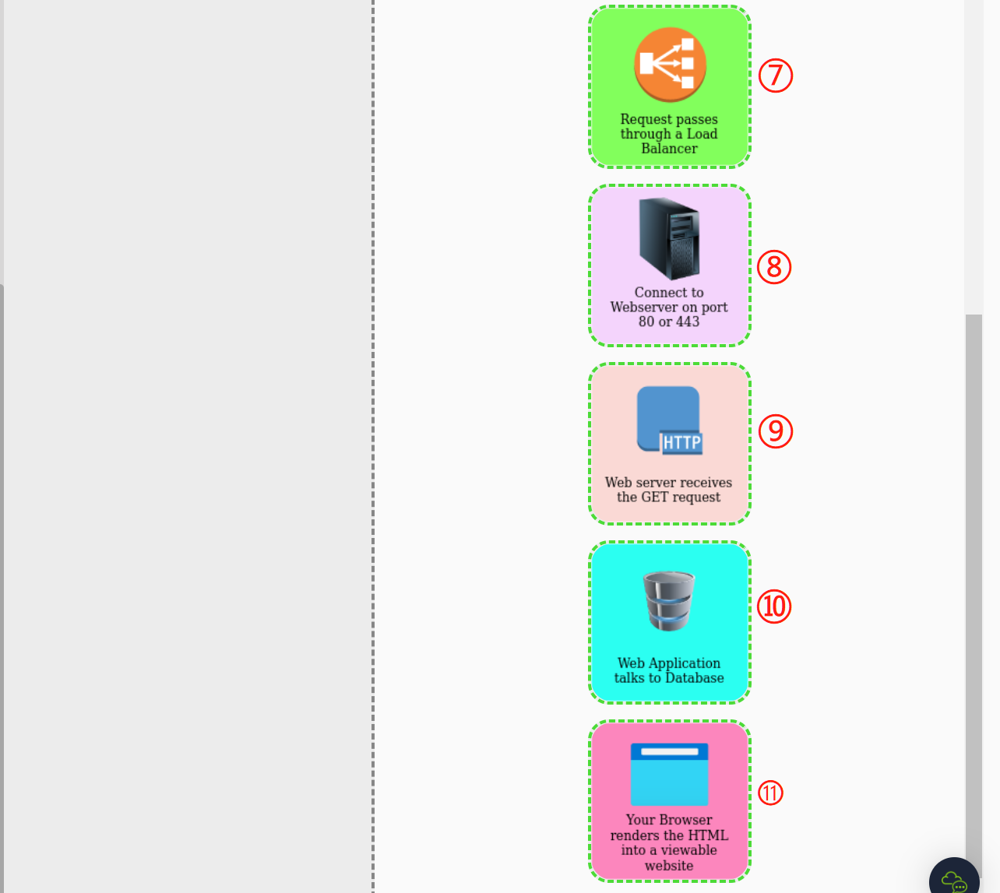
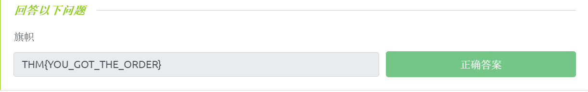

# ☑ Putting it all together(网站组件协同工作介绍)

TryHackMe实验房间链接：[https://tryhackme.com/room/puttingitalltogether](https://tryhackme.com/room/puttingitalltogether)

## 简介

当我们在浏览器中请求网页信息时，幕后还发生了很多事情。在请求一个网站时，我们的计算机需要知道它需要与之通信的Web服务器的 IP 地址，为此，本地计算机需要使用DNS，然后，我们的计算机将使用一组被称为 HTTP 协议的特殊命令与 Web 服务器进行通信， Web 服务器随后将返回 HTML 、JavaScript 、CSS、图像文件等资源，最后，我们本地计算机的浏览器将使用这些资源 并通过正确格式化来向我们呈现网站的相关网页内容。

<figure><figcaption></figcaption></figure>

此外，还有一些其他组件可以帮助web服务更有效地运行，并提供额外的功能。

## Web服务的其他组件

**负载均衡器（Load Balancers）**

当一个网站的流量开始变得相当大，或者正在运行一个需要高可用性的应用程序时，一个web服务器也许不再能够胜任工作——此时我们就需要使用负载均衡器。

负载均衡器能提供两个主要功能：确保高流量网站可以处理负载(load)；在服务器变得无响应时提供故障转移功能。

当你请求一个使用了负载均衡器的网站时，负载均衡器将首先接收到你的请求，然后它会将请求转发到它后面的多个服务器之一；在此过程中，负载均衡器会使用不同的算法来帮助决定哪台服务器最适合处理请求消息，这些算法的两个例子是：轮询(round-robin)和加权(weighted)——前者会依次将请求发送到每个服务器，后者会检查服务器当前正在处理多少请求，再将请求发送到最不繁忙的服务器。

负载均衡器还会对每个服务器执行定期检查，以确保它们能够正常运行，这被称为health check；如果服务器没有正确响应或无响应，负载均衡器将停止向服务器发送流量，直到服务器再次正确响应为止。

<figure><figcaption></figcaption></figure>

**CDN (Content Delivery Networks)**

CDN是一个很好的资源，它可以帮助降低“繁忙网站”的流量压力。CND允许网站管理者托管网站的一些静态文件，如JavaScript, CSS，图像，视频等，使用CDN能将网站静态文件托管在世界各地的数千台服务器上。每当用户请求一个被托管的文件时，CDN就会计算出最近的服务器的物理位置，并将用户的请求发送到那里，而不是发送到遥远的世界另一端。

**数据库（Databases）**

每个网站通常都需要一种为用户存储信息的方法，这就需要使用数据库。

web服务器可以与数据库进行通信，从而能将数据存储到数据库中以及能从数据库中提取数据。数据库可以是简单的纯文本文件，也可以是 由能够提供速度和弹性的多台服务器组成的复杂集群，一些常见的数据库有：MySQL，MSSQL，MongoDB，GraphQL，Postgres等，每一种数据库都有其具体的特性。

**WAF (Web Application Firewall)**

Web应用程序防火墙(WAF-Web Application Firewall)位于你的web请求和web服务器之间，它的主要目的是保护web服务器免受黑客攻击或拒绝服务(DoS)攻击。

WAF能够分析带有常见攻击技术的恶意web请求，无论这些恶意请求是来自何处；WAF还会利用速率限制来检查是否有过多的网络请求正在被发送，这将只允许一个IP每秒发送一定数量的请求消息。

如果一个请求被认为是潜在的攻击载荷，那么此请求将被WAF拦截以及丢弃，这意味着此请求将永远不会被发送到web服务器。

<figure><figcaption></figcaption></figure>

### **答题**

阅读本小节内容，并回答以下问题。

<figure><figcaption></figcaption></figure>

## Web服务器如何工作

**什么是Web服务器?**

web服务器是一种软件，它会监听传入的请求连接，然后利用HTTP协议将web内容传递给客户端浏览器。

常见的web服务器软件有：Apache，Nginx，IIS，NodeJS等。Web服务器将从根目录下(在服务器软件的设置中定义)开始传输文件，例如，Nginx和Apache在Linux操作系统中有相同的默认根目录路径`/var/www/html`，而IIS在Windows操作系统中的默认根目录路径是`C:\inetpub\wwwroot`。

如果你向web服务器请求文件- http://www.example.com/picture.jpg ，web服务器将从它的本地硬盘驱动器中发送文件`/var/www/html/picture.jpg`。

**Virtual Hosts（虚拟主机）**

Web服务器可以托管多个具有不同域名的网站，为了实现这一点，Web服务器需要使用虚拟主机。web服务器软件会检查HTTP请求头中的主机名，并将其与虚拟主机进行匹配(虚拟主机只是基于文本的配置文件)。如果HTTP请求中的主机名和虚拟主机成功匹配，web服务器就会向浏览器用户提供一个正确的网站；如果没有找到匹配项，则将提供一个默认网站给浏览器用户。

虚拟主机可以将其根目录映射到web服务器的硬盘驱动器上的不同位置：

* `one.com`可能被映射到web服务器中的`/var/www/website_one` ；
* `two.com`可能被映射到web服务器中的`/var/www/website_two` 。

你能在一个web服务器上托管不同网站的数量没有限制。

**Static Vs Dynamic Content（静态与动态内容）**

静态内容，顾名思义，是网站中永不改变的内容，常见的例子是网站的图片、javascript代码、CSS代码等，也可以包括永不更改的HTML内容。此外，静态内容文件是直接由web服务器所提供的文件，web服务器在提供这些静态文件时，无需对这些文件的内容进行任何更改。

另一方面，动态内容是网站中可以随不同的HTTP请求而发生变化的内容。以博客为例，在你的博客主页上会展示文章条目，如果你创建了一个新条目，那么博客主页就会向你显示最新的文章条目，或者以博客上的搜索页面为例，根据你搜索的单词不同，博客网站将会向你显示不同的搜索结果。

你最终看到的网站动态内容都是在所谓的后端中使用编程和脚本语言来完成的，之所以被称为后端，是因为它们所做的一切都是在幕后完成的。你不能查看网站的全部HTML源代码，也不能看到网站的后端具体发生了什么（HTML是后端处理的结果）；你在浏览器中能看到的所有东西都被称为前端。

**脚本和后端语言**

服务器对后端语言所能实现的功能并没有多少限制，而这些功能的实现正是使网站与用户能够互动的原因。

常见的后端语言包括：PHP，Python，Ruby，NodeJS，Perl等；这些后端语言可以与数据库交互、调用外部服务、处理来自用户的数据......

一个非常基本的PHP示例是：你可以通过访问服务器上的PHP脚本来获得一个网站页面—— http://example.com/index.php?name=adam 。

如果index.php的内容如下：

```php+HTML
<html><body>Hello <?php echo $_GET["name"]; ?></body></html>
```

它将向客户端输出以下内容：

```html
<html><body>Hello adam</body></html>
```

你能注意到在客户端看不到任何PHP代码，因为PHP代码位于后端，而后端代码所提供的交互性功能 将为(未安全创建的)web应用程序带来更多的安全问题。

### **答题**

阅读本小节内容，并回答以下问题。

<figure><figcaption></figcaption></figure>

## 示例练习

进入本文相关的TryHackMe实验房间，展开由实验房间所提供的模拟页面，在模拟页面中将磁贴拖放到正确的网站请求顺序中，最后将得到一个flag。

**注意**：当磁贴被放置在正确位置时，它会以绿色标注显示，当磁贴位于错误的位置时，它将以红色标注显示；请**不要**随意刷新模拟页面，因为这将重置模拟环境。

正确的网站请求顺序如下所示：

<figure><figcaption></figcaption></figure>

<figure><figcaption></figcaption></figure>

得到flag：

<figure><figcaption></figcaption></figure>

> 得到的flag内容为：THM{YOU\_GOT\_THE\_ORDER} 。

<figure><figcaption></figcaption></figure>
