# ☑ Windows Fundamentals 3(Windows基础知识3)

TryHackMe实验房间链接：[https://tryhackme.com/room/windowsfundamentals3xzx](https://tryhackme.com/room/windowsfundamentals3xzx)

## 简介

在Windows Fundamentals 1中，我们介绍了Windows的桌面、文件系统、用户帐户控制、控制面板、设置和任务管理器。

在Windows Fundamentals 2中，我们介绍了Windows的各种实用程序，例如系统配置面板、计算机管理界面、资源监视器等。

本文将尝试概述 Windows 操作系统中的一些安全功能。

启动本文相关实验房间中所附加的Windows虚拟机（你可以直接在浏览器中访问），如果你希望通过远程桌面访问虚拟机，请使用以下凭据：

* Machine IP: `MACHINE_IP`（在实验房间中启动Windows虚拟机之后，你将获得一个相关的ip地址）
* User: `administrator`
* Password: `letmein123!`

<figure>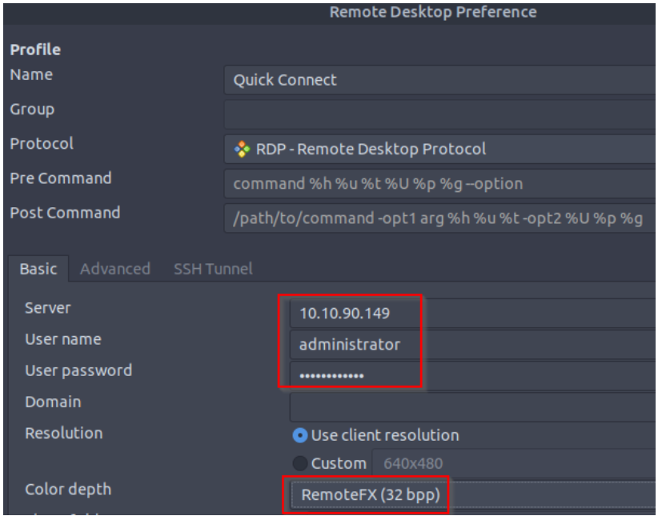<figcaption></figcaption></figure>

当上述界面弹出提示时，点击接受证书，然后你现在应该可以登录到远程系统。

## Windows更新（ Windows Update）

让我们从Windows Update开始。

Windows Update是微软提供的一项服务，可为Windows操作系统和其他微软产品(如Microsoft Defender)提供安全更新、功能增强和补丁。

Windows 更新通常在每个月的第二个星期二发布，这一天被称为补丁星期二，但是这并不一定意味着一个关键的更新/补丁必须等到下一个补丁星期二才会发布；如果某个更新补丁很重要，微软则将通过Windows更新服务向Windows设备推送更新。

Windows更新服务可通过“设置-Settings”面板找到并访问，更多相关信息可查看[微软安全更新指南](https://msrc.microsoft.com/update-guide)。

tips：另一种访问Windows更新服务的方法是使用Run对话框或者使用CMD界面，然后运行以下命令`control /name Microsoft.WindowsUpdate`。

<figure>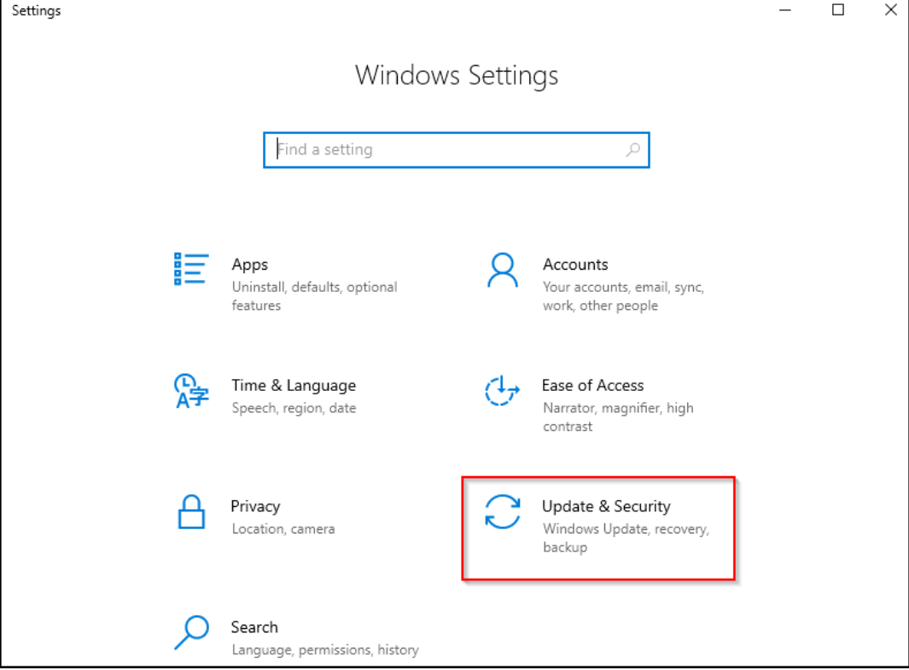<figcaption></figcaption></figure>

Windows更新设置是“受监管的”(通常情况下，家庭用户不会看到这种类型的消息)，如果计算机没有连接到Internet，则无法与Microsoft通信以获取最新的更新信息。

<figure>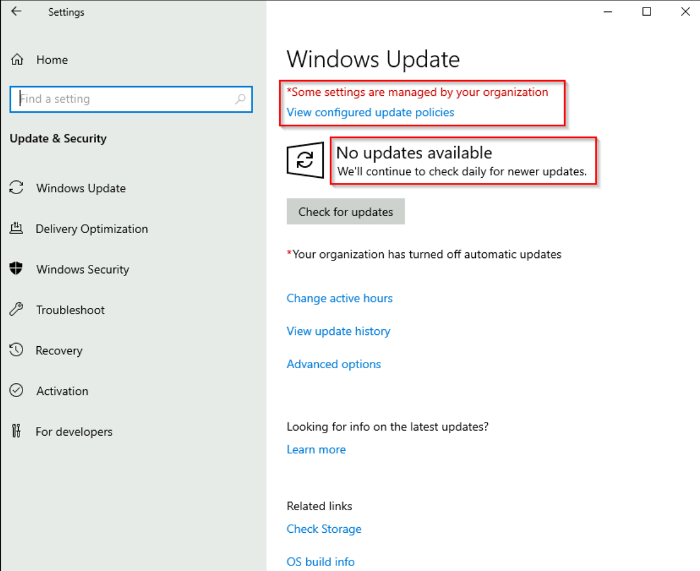<figcaption></figcaption></figure>

多年以来，Windows用户已经习惯于将Windows更新推迟到较晚的日期或者根本不安装更新，导致此类操作的原因有很多，其中一个原因是：Windows在更新之后通常需要重新启动。

微软在Windows 10中尝试解决了用户更新问题，现在的Windows更新不能再被忽视或完全不管不顾，也就是说Windows更新虽然能推迟，但最终还是会发生，更新完成之后你的电脑也会重新启动。微软通过提供此类强制更新服务来尽量保证设备的安全。

如下图所示，在Windows更新界面中可看到此时计算机需要重启，此更新界面还提供了关于安排重启的几个可用选项。

<figure>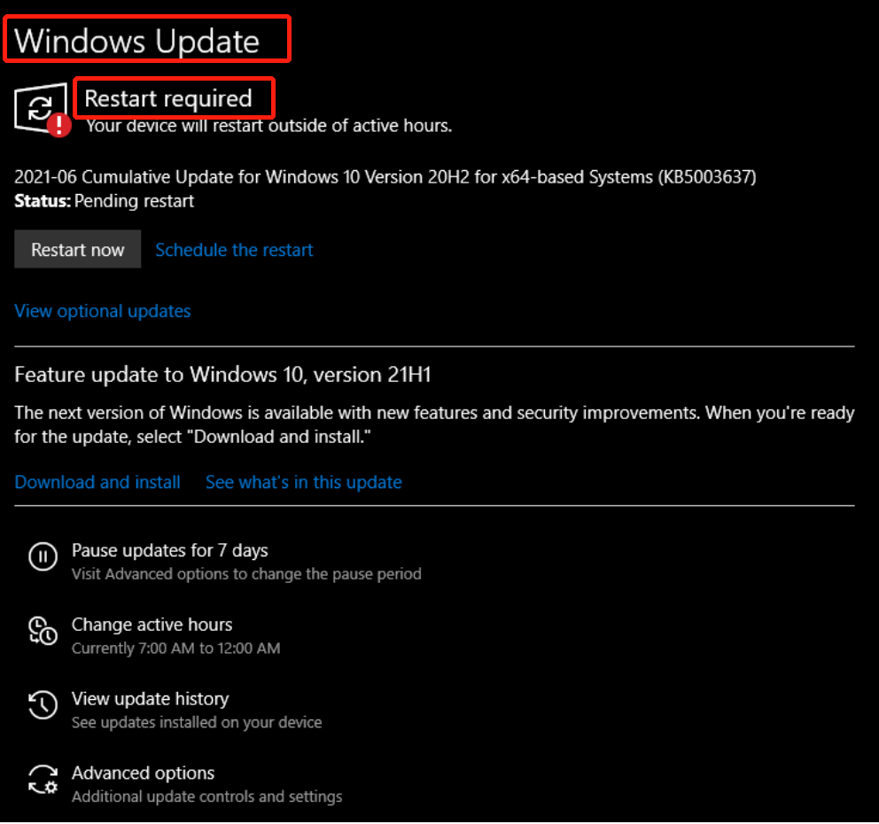<figcaption></figcaption></figure>

更多信息请参考[Windows更新常见问题解答](https://support.microsoft.com/en-us/windows/windows-update-faq-8a903416-6f45-0718-f5c7-375e92dddeb2)。

### **答题**

_tips：阅读本小节内容并且访问Windows虚拟机进行探索，然后回答以下问题。_

访问由实验房间所提供的Windows虚拟机，并进行相关探索。

通过“设置”面板访问Windows更新服务，在Windows更新界面点击“查看更新历史”：

<figure>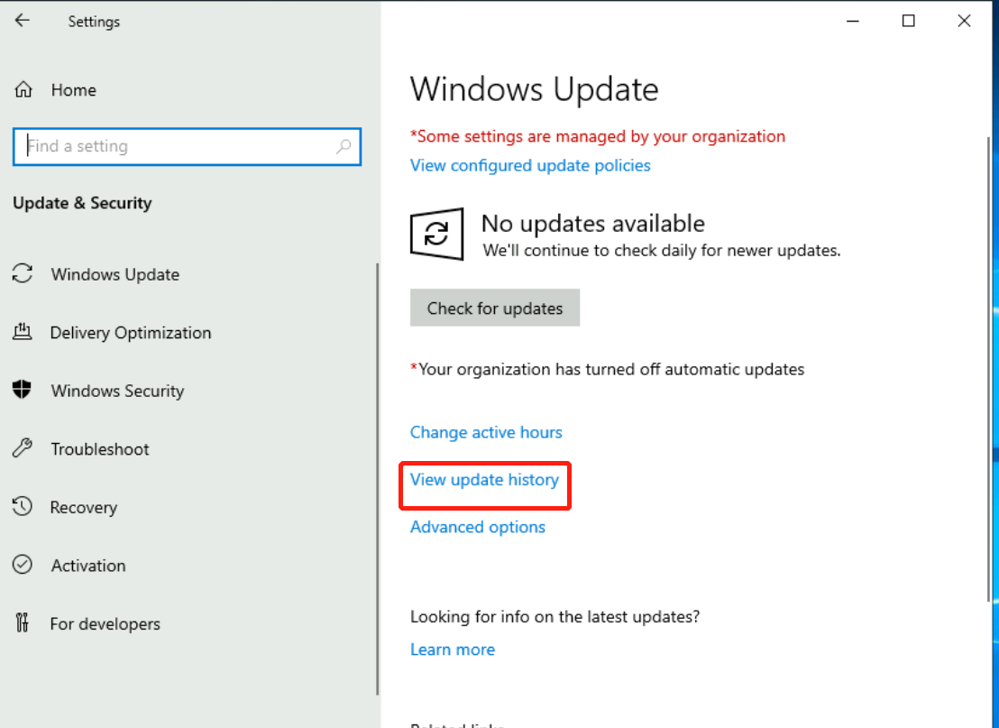<figcaption></figcaption></figure>

<figure>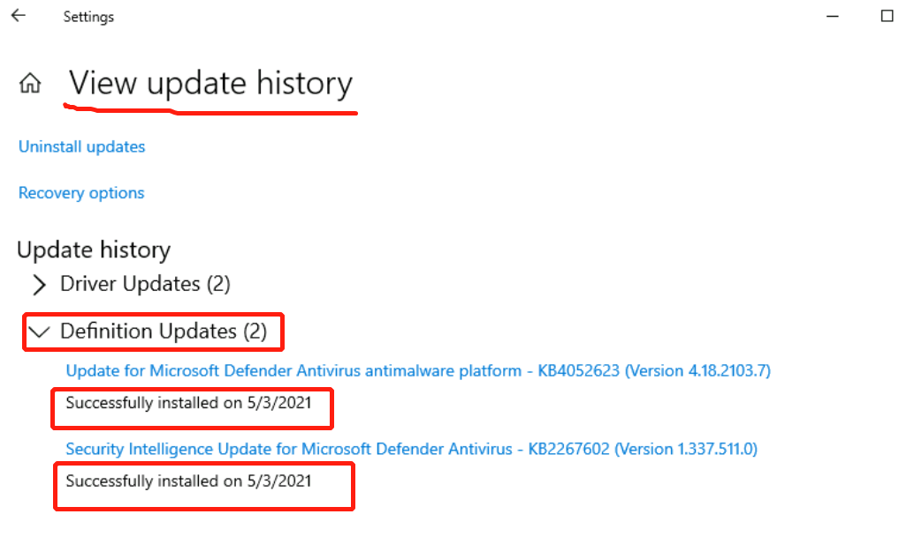<figcaption></figcaption></figure>

> 自定义更新的安装日期是：5/3/2021

<figure>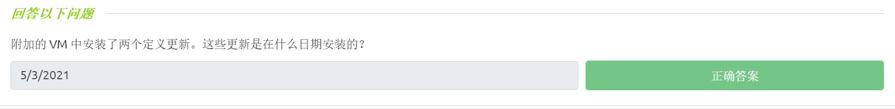<figcaption></figcaption></figure>

## Windows安全（Windows Security）

根据微软的说法，“Windows Security是管理保护你的设备和数据的工具的主界面。”

和Windows更新服务一样，Windows安全服务也可以通过“设置-Settings”面板进行访问。

<figure>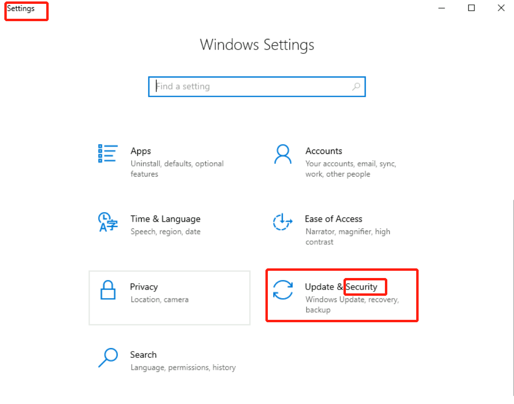<figcaption></figcaption></figure>

<figure><figcaption></figcaption></figure>

请查看上图，并将注意力集中在_**Protection areas**_（保护区域），其中包括：

* Virus & threat protection（病毒和威胁防护）
* Firewall & network protection（防火墙和网络保护）
* App & browser control（应用程序和浏览器控制）
* Device security（设备安全）

tips：在下面几个小节中我们会简要地介绍以上四部分内容（在本小节中我们不展开讲解）。

在继续介绍Windows安全服务之前，让我们快速了解一下状态图标：

* 绿色图标：表示你的设备已得到充分保护，并且没有任何建议操作。
* 黄色图标：表示有安全建议供你查看。
* 红色图标：表示警告，即有某件事情需要你立即关注。

我们点击“设置-Settings”界面中的“Windows Security”下的`Open Windows Security`，将看到如下界面（一个红色图标，三个绿色图标）：

<figure>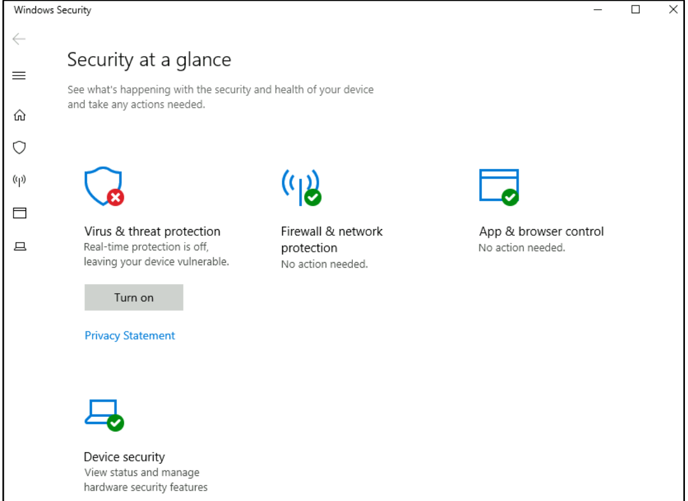<figcaption></figcaption></figure>

注意：由于本文所附的实验机是Windows Server 2019，因此相关页面看起来会与Windows 10家庭版或专业版不同。

下图是来自于Windows 10设备的Windows Security相关页面（点击`Open Windows Security`即可看到具体界面）：

<figure>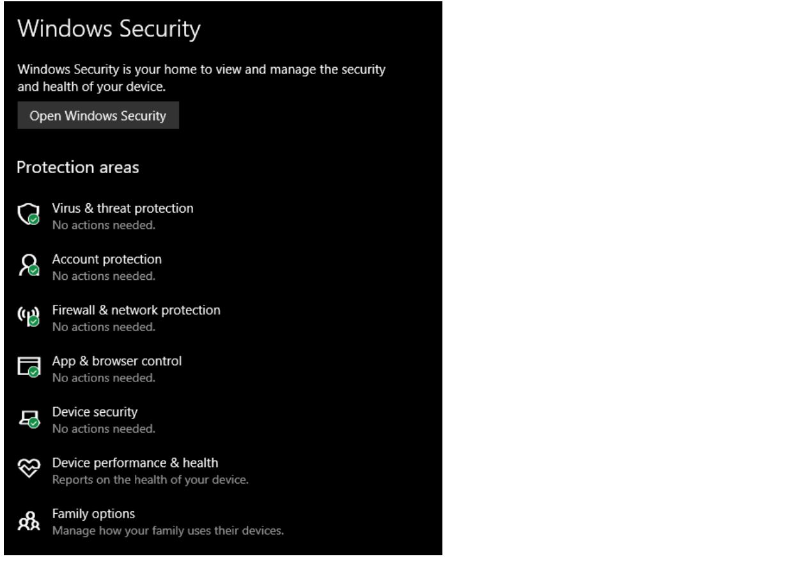<figcaption></figcaption></figure>

在下一小节，我们将继续查看Windows安全服务中的“病毒和威胁防护”部分。

### **答题**

_tips：阅读本小节内容并且访问Windows虚拟机进行探索，然后回答以下问题。_

访问由实验房间所提供的Windows虚拟机，并进行相关探索。

查看“Windows安全”界面，我们可以发现Virus & threat protection（病毒和威胁防护）对应的图标是红色的——红色图标表示警告，所以需要我们立即关注。

<figure>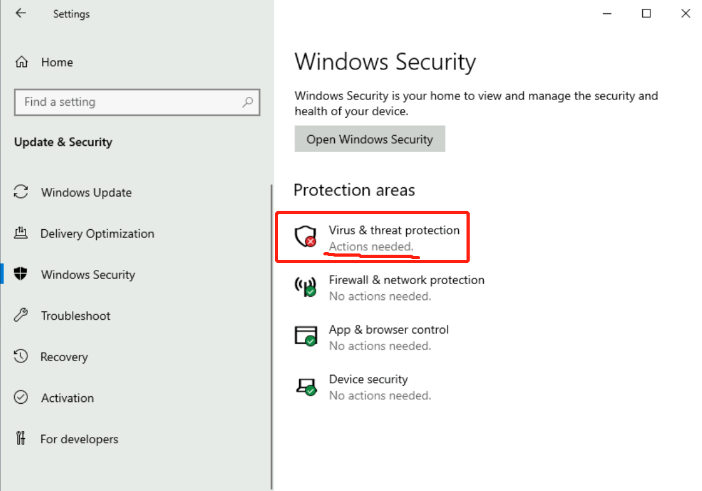<figcaption></figcaption></figure>

<figure>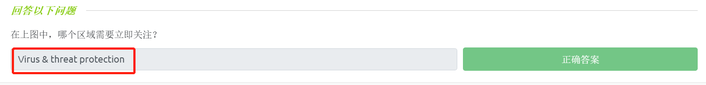<figcaption></figcaption></figure>

## 病毒和威胁防护（Virus & threat protection）

病毒和威胁防护分为以下部分：

* 当前威胁——Current threats
* 病毒和威胁防护设置——Virus & threat protection settings
* 病毒和威胁防护更新——Virus & threat protection updates
* 勒索软件防护——Ransomware protection

<figure>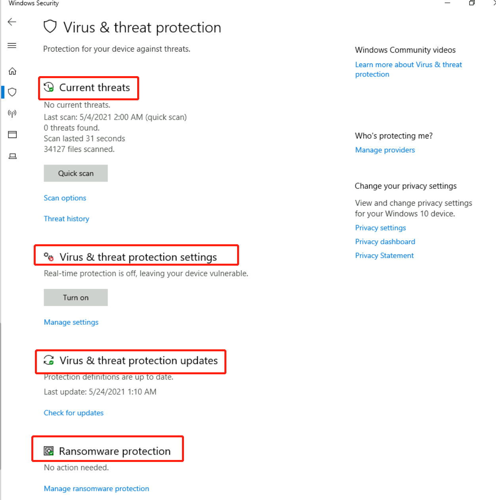<figcaption></figcaption></figure>

**Current threats(当前威胁)**

下图是“当前威胁”部分界面：

<figure>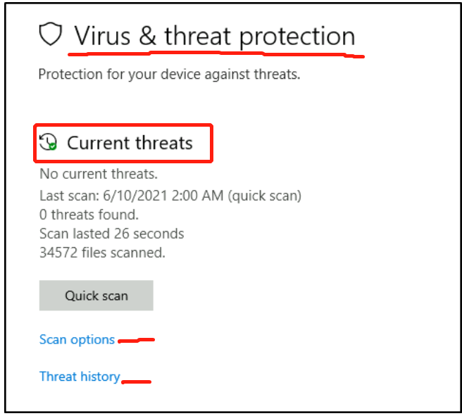<figcaption></figcaption></figure>

我们可以通过Current threats界面点击并选择“扫描选项”（Scan options），相关的内容如下：

* Quick scan（快速扫描）：检查系统中通常可能存在威胁项目的文件夹。
* Full scan（全面扫描）：检查硬盘上的所有文件和正在运行的程序，此扫描可能需要一个多小时。
* Custom scan（自定义扫描）：任意选择你想要检查的文件和位置，然后开始扫描。

我们可以通过Current threats界面点击并查看“威胁历史”（Threat history），相关的内容如下：

* Last scan（上次扫描）：Windows Defender防病毒软件会自动扫描你的设备是否存在病毒和其他威胁，以帮助保护你的设备安全。
* Quarantined threats（隔离的威胁）：是指已被隔离的威胁项目，隔离能有效阻止威胁项目在你的设备上运行，此外，被隔离的威胁项目将会被定期删除。
* Allowed threats（允许的威胁）：是指你允许“已经被识别为威胁的项目”在你的设备上运行。

警告：只有在100%确定自己在做什么时，才允许运行已被识别为威胁的项目。

**Virus & threat protection settings(病毒和威胁防护设置)**

下图是“病毒和威胁防护设置”部分界面：

<figure>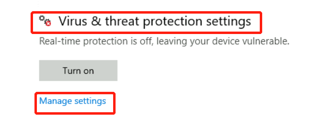<figcaption></figcaption></figure>

在上图中的Virus & threat protection settings界面点击并查看“管理设置”（Manage settings），相关的内容如下：

* Real-time protection（实时保护）：实时定位并阻止恶意软件在你的设备上安装或运行。
* Cloud-delivered protection（云提供的保护）：通过访问云中的最新保护数据以提供增强保护和更快的保护。
* Automatic sample submission（自动提交样本）：将可能具有安全威胁的样本文件发送到 Microsoft，以帮助保护你和其他人免受潜在威胁。
* Controlled folder access（控制文件夹访问权限）：保护你设备上的文件、文件夹和内存区域免受不友好应用程序未经授权的更改。
* Exclusions（排除）：Windows Defender防病毒软件不会扫描你已排除的项目。
* Notifications（通知）：允许Windows Defender防病毒软件发送通知，其中会包含有关设备健康和安全的重要信息。

警告：你所排除的项目也可能会包含一些能让你的设备受到攻击的危险应用程序，所以，只有当你100%确定自己在做什么时才能使用此选项。

**Virus & threat protection updates(病毒和威胁防护更新)**

下图是“病毒和威胁防护更新”部分界面：

<figure>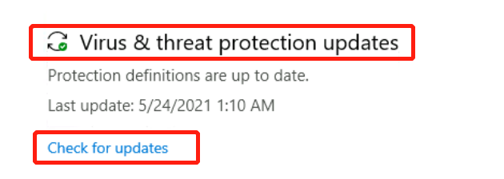<figcaption></figcaption></figure>

查看上图中的“病毒和威胁防护更新”（Virus & threat protection updates）下的“Check for updates”：

* Check for updates（检查更新）： 手动检查更新以更新 Windows Defender防病毒软件的反病毒规则。

<figure>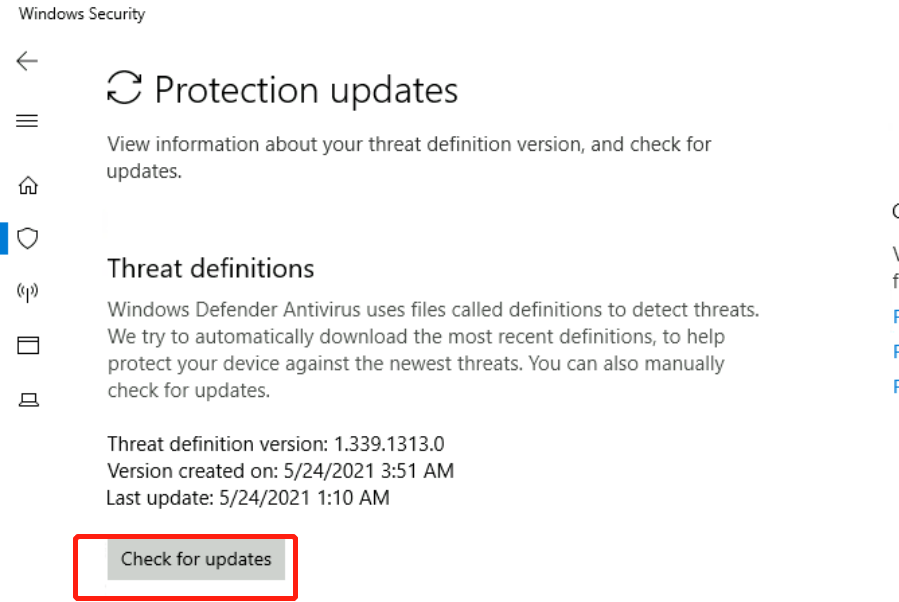<figcaption></figcaption></figure>

**Ransomware protection(勒索软件防护)**

下图是“勒索软件防护”部分界面：

<figure>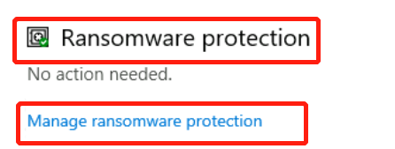<figcaption></figcaption></figure>

查看上图中的“勒索软件防护”（Ransomware protection）下的“Manage ransomware protection”：

* Controlled folder access（控制文件夹访问权限）：勒索软件防护需要启用此功能，但是为了启用此功能你需要首先启用实时保护功能。

<figure>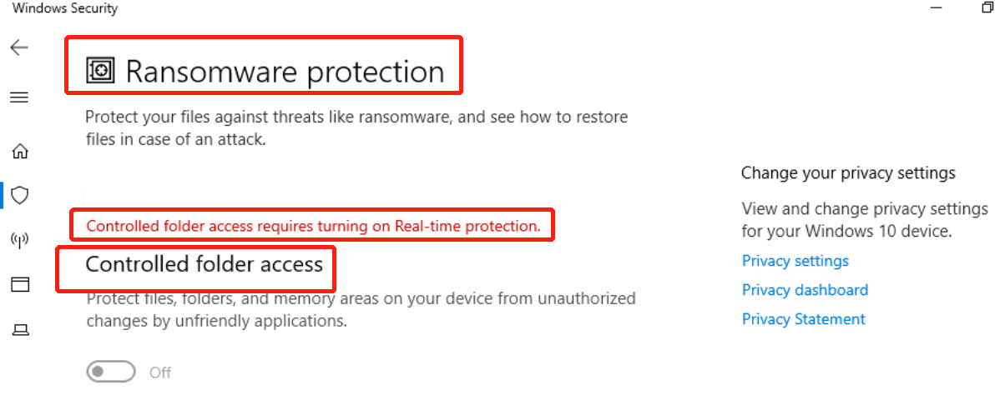<figcaption></figcaption></figure>

_tips：你可以对任何文件/文件夹执行按需安全扫描，只需右键单击项目并选择“使用Microsoft Defender扫描”即可。_

下图是来自于另一个Windows设备，以展示按需扫描功能：

<figure>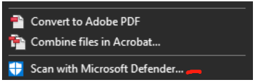<figcaption></figcaption></figure>

### **答题**

_tips：阅读本小节内容并且访问Windows虚拟机进行探索，然后回答以下问题。_

访问由实验房间所提供的Windows虚拟机，并进行相关探索。

基于上一小节的答题任务可知，我们需要关注的内容是“病毒和威胁防护”，因此我们可以查看“病毒和威胁防护”面板以找到更多详细信息：

<figure>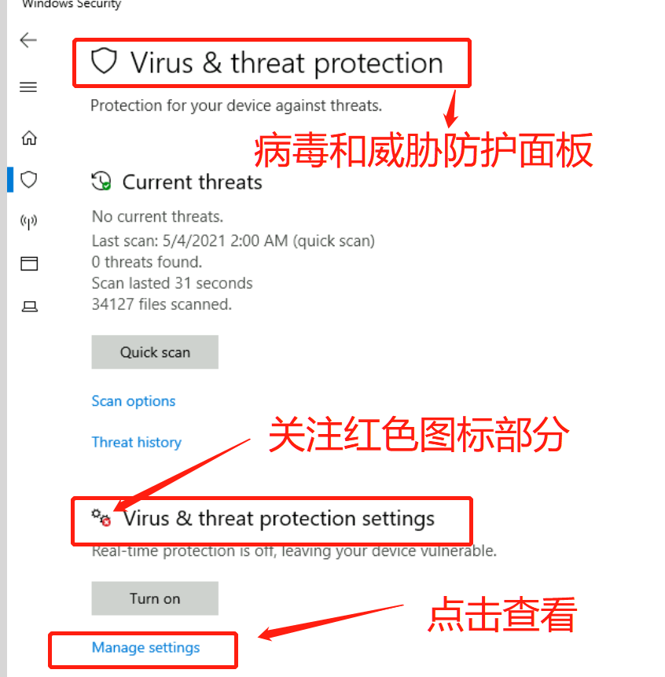<figcaption></figcaption></figure>

<figure>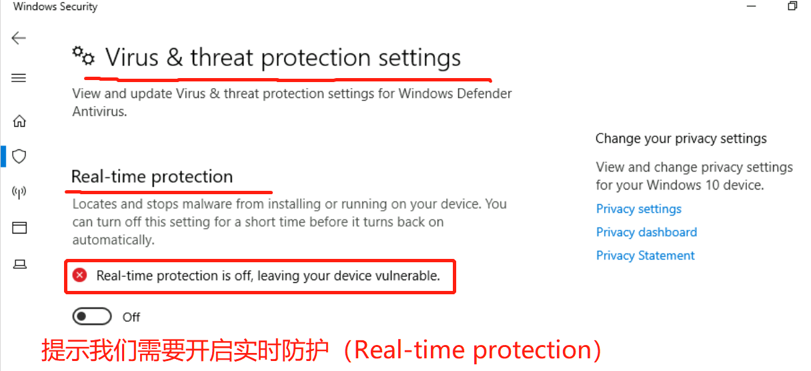<figcaption></figcaption></figure>

<figure>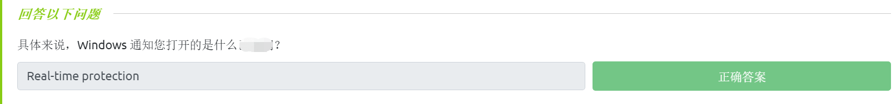<figcaption></figcaption></figure>

## 防火墙和网络保护（Firewall & network protection）

**什么是firewall（防火墙）?**

根据微软的说法，“流量是通过端口流入和流出设备的，而防火墙能够控制什么可以（更重要的是不可以）通过这些端口；你可以把防火墙想象成一个站在门口的保安，它会检查所有试图进出的人的ID信息”。

我们可以导航到“防火墙和网络保护”界面：

<figure>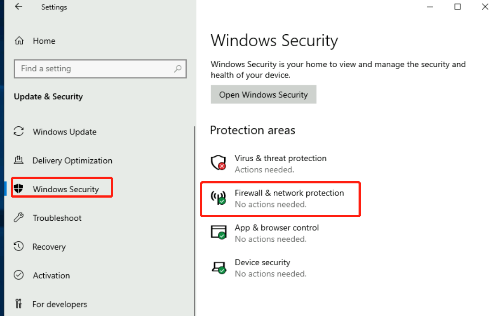<figcaption></figcaption></figure>

<figure>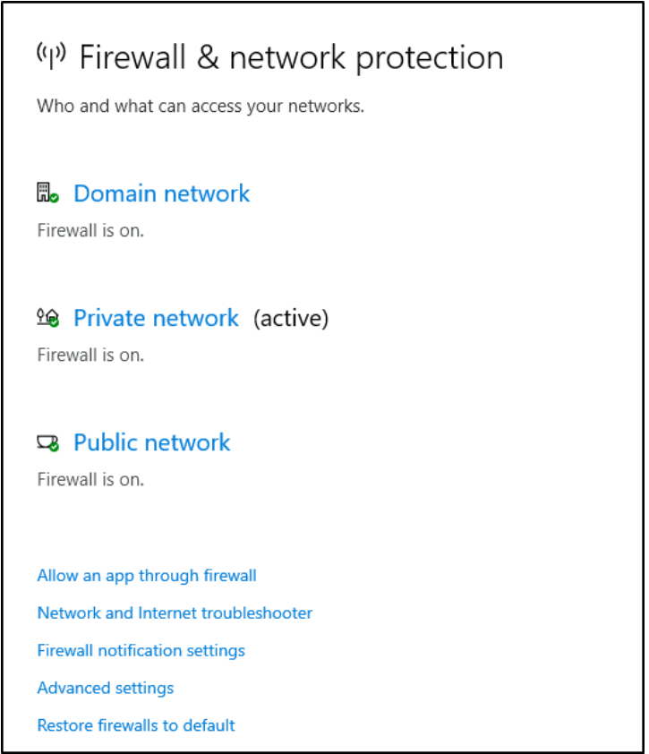<figcaption></figcaption></figure>

注意：上图中的每个选项可能会有不同的状态图标。

我们在“防火墙和网络保护”界面中所看到的“Domain network”、“Private network ”和“Public network ”三者之间有什么区别?

根据微软的说法，“Windows防火墙会提供三种防火墙配置：域、私有和公共”。

* Domain（域）：防火墙的域配置适用于主机系统可以向域控制器进行身份验证的网络。
* Private （私有）：防火墙的私有配置是用户分配的配置，可用于指定私有或家庭网络。
* Public （公共）：防火墙的默认配置为Public，可用于指定公共网络，例如咖啡店、机场和其他地点的Wi-Fi热点。

如果你单击任何一种防火墙配置，则将出现对应的相关配置页面，其中会包含两个选项：打开/关闭防火墙、阻止所有传入连接。

<figure>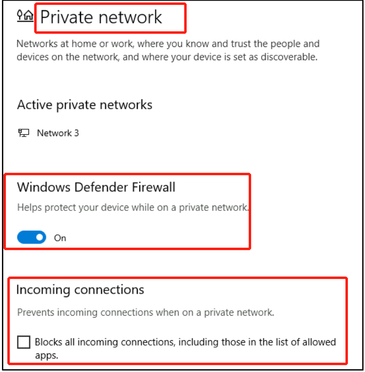<figcaption></figcaption></figure>

警告：除非你对你正在做的事情有100%的信心，否则建议你开启Windows Defender 防火墙。

接下来我们关注“防火墙和网络保护”界面的“Allow an app through firewall”和“Advanced Settings”：

<figure>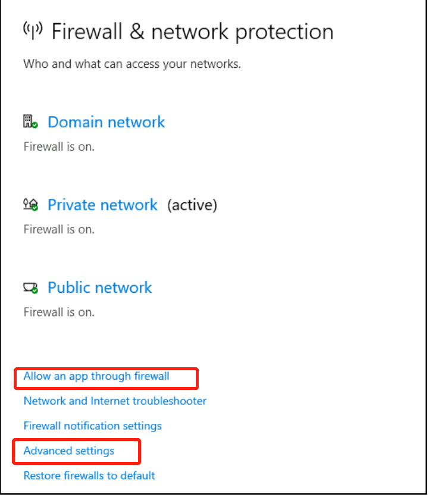<figcaption></figcaption></figure>

**Allow an app through firewall**

<figure>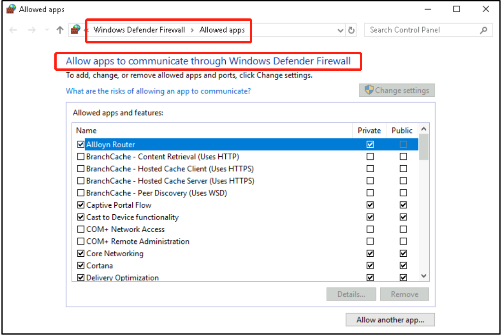<figcaption></figcaption></figure>

你可以查看任何防火墙配置的当前设置，在上图中，我们可以看到有一些应用程序可以访问私有或者公共防火墙配置，如果你点击“详细信息-Details”按钮，则能获取到对应应用程序所提供的一些额外信息。

**Advanced Settings**

<figure>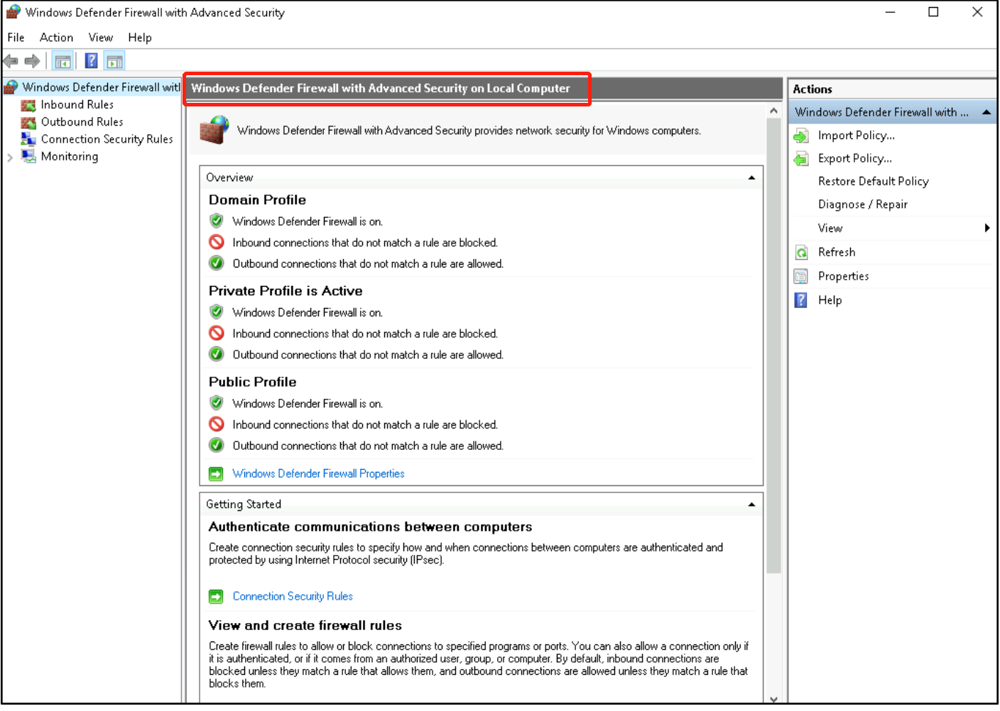<figcaption></figcaption></figure>

配置Windows Defender防火墙的操作适用于Windows高级用户，你可以参考[相关的Microsoft 官方文档](https://docs.microsoft.com/en-us/windows/security/threat-protection/windows-firewall/best-practices-configuring)。

tips：打开Windows Defender防火墙的命令为`WF.msc`。

### **答题**

tips：通过阅读本小节相关内容，可回答以下问题。

<figure><figcaption></figcaption></figure>

## 应用程序和浏览器控制（App & browser control）

在此部分中，你可以更改Microsoft Defender SmartScreen的设置。

根据 Microsoft 的说法，“ Microsoft Defender SmartScreen 可以防止网络钓鱼、恶意软件网站和应用程序以及潜在恶意文件的下载”。

有关 Microsoft Defender SmartScreen 的更多信息，请参阅[相关的Microsoft官方文档](https://docs.microsoft.com/en-us/windows/security/threat-protection/microsoft-defender-smartscreen/microsoft-defender-smartscreen-overview)。

<figure>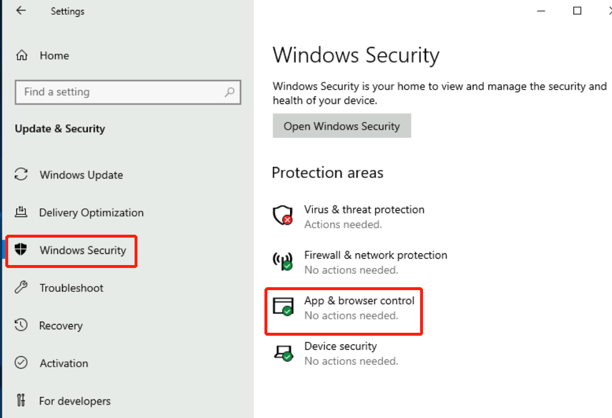<figcaption></figcaption></figure>

<figure>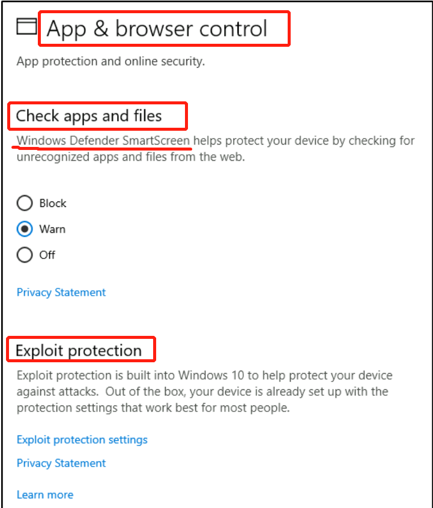<figcaption></figcaption></figure>

**Check apps and files**

Windows Defender SmartScreen 通过检查来自网络的 无法识别的应用程序和文件来帮助保护你的设备。

<figure>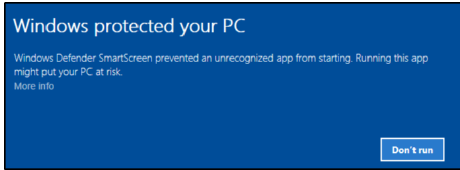<figcaption></figcaption></figure>

**Exploit protection**

Exploit protection 内置在Windows 10操作系统(本文相关的实验机为Windows Server 2019)中，能够帮助保护你的设备免受恶意攻击。

<figure>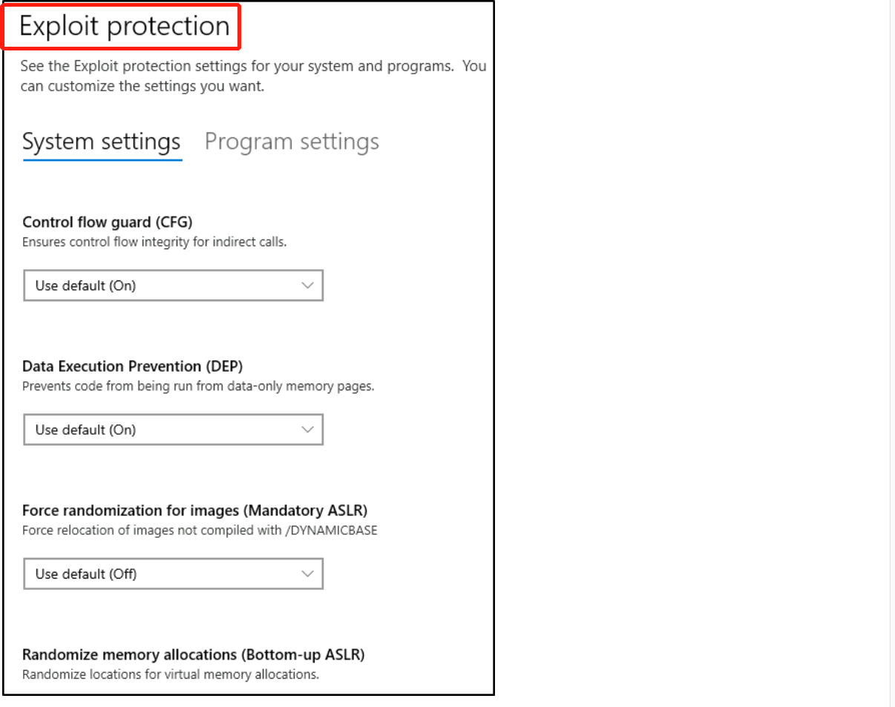<figcaption></figcaption></figure>

警告：除非你对所做的事情有100%的信心，否则建议你保持上图中的默认设置。

## 设备安全（Device security）

尽管你可能永远不会更改以下设置，但我们还是会简要介绍一下。

<figure>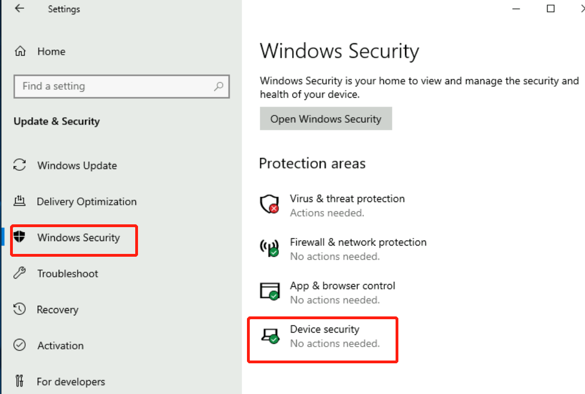<figcaption></figcaption></figure>

<figure>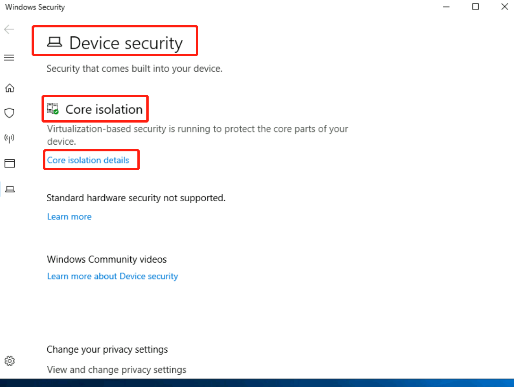<figcaption></figcaption></figure>

**Core isolation（核心隔离）**

* Memory Integrity（内存完整性）：防止攻击者将恶意代码插入高安全性进程。

<figure>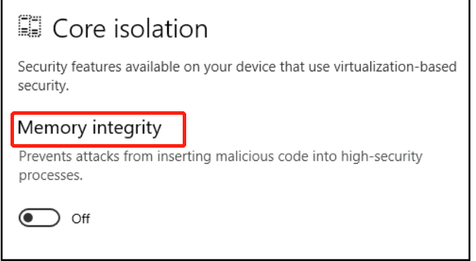<figcaption></figcaption></figure>

警告：除非你对所做的事情有100%的信心，否则建议你保持默认设置。

下面的图片来自于另一台机器，展示了个人Windows 10设备应该具备的另一个安全功能——Security processor。

<figure>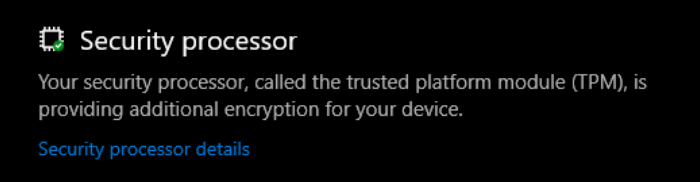<figcaption></figcaption></figure>

下面是Security processor（安全处理器）的详细信息。

<figure>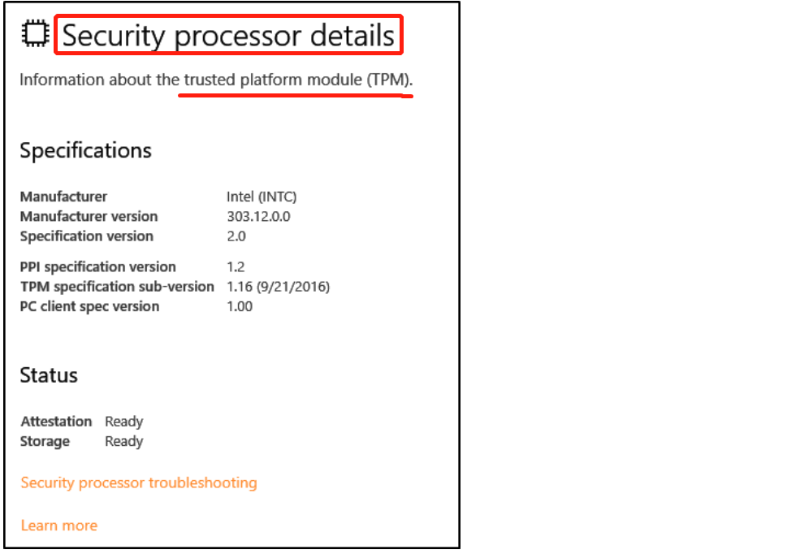<figcaption></figcaption></figure>

上图所提及的可信平台模块(TPM-Trusted Platform Module)是什么？

根据微软的说法，“可信平台模块(TPM)技术旨在提供基于硬件的安全相关功能。TPM芯片是一种安全的加密处理器，被设计用于执行加密操作，该芯片包括多种物理安全机制，使其具有抗篡改性，恶意软件无法篡改TPM的安全功能”。

### **答题**

tips：阅读本小节内容，可回答以下问题。

<figure><figcaption></figcaption></figure>

## BitLocker

什么是**BitLocker**？

根据微软的说法，“ BitLocker驱动器加密是一种数据保护功能，它与操作系统集成在一起，可以解决数据被盗的威胁，数据被盗指的是由于计算机丢失、计算机被盗或者不当停用的旧计算机被利用等因素而导致的数据泄露”。

在安装了 TPM 的设备上，BitLocker 能提供最好的数据保护。

根据 Microsoft 的说法，“ BitLocker 在与可信平台模块 (TPM) 1.2 或更高版本的TPM一起使用时能够提供最大的保护。TPM 是一种计算机制造商安装在许多较新计算机中的硬件组件，它可以与 BitLocker 一起帮助保护用户数据以及能够确保计算机在系统离线时不被篡改数据”。

请参阅[相关的Microsoft官方文档](https://docs.microsoft.com/en-us/windows/security/information-protection/bitlocker/bitlocker-overview)以了解有关 BitLocker 的更多信息。

注意：本文相关的实验房间所附加的虚拟机中不包含 BitLocker 功能。

### **答题**

tips：请参阅有关 BitLocker 的 Microsoft 文档，然后回答以下问题。

<figure>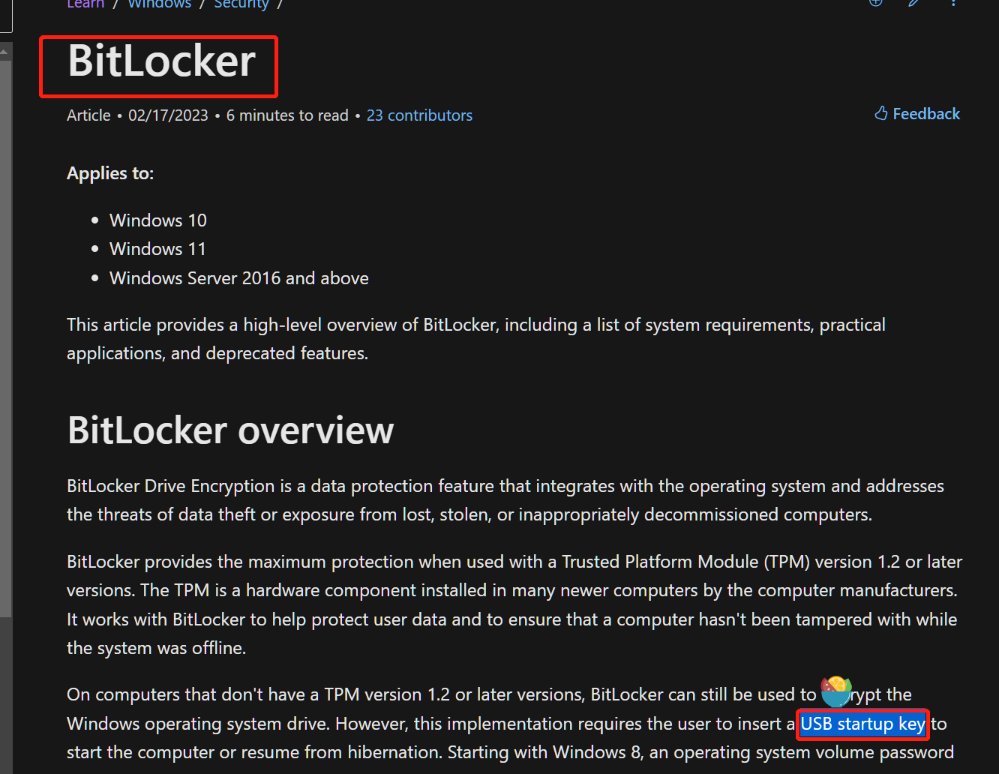<figcaption></figcaption></figure>

翻译页面：

<figure>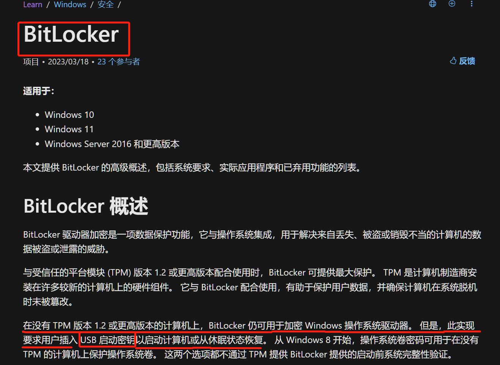<figcaption></figcaption></figure>

<figure><figcaption></figcaption></figure>

## 卷影复制服务（Volume Shadow Copy Service）

根据[微软官方相关文档](https://learn.microsoft.com/en-us/windows-server/storage/file-server/volume-shadow-copy-service)的说法：卷影复制服务(VSS-Volume Shadow Copy Service)能够协调所需的操作 以创建与要备份的数据一致的影子副本(也被称为快照或时间点拷贝)。

卷影副本会存储在每个启用了保护功能的驱动器上的“系统卷信息”文件夹中。

如果启用了VSS(这需要先启动系统保护)，你就可以在“高级系统设置”页面中执行以下任务：

* 创建还原点
* 执行系统恢复（还原）
* 配置还原设置
* 删除还原点

从安全的角度来看，恶意软件编写者可能知道这个Windows特性（此处指的是VSS），并会在恶意软件中编写代码 以便查找备份文件并删除它们；这样攻击者这样做，那么我们就不可能从勒索软件攻击中恢复数据，除非我们另有离线/异地备份。

如果你希望配置影子副本，请参考以下图片：

<figure>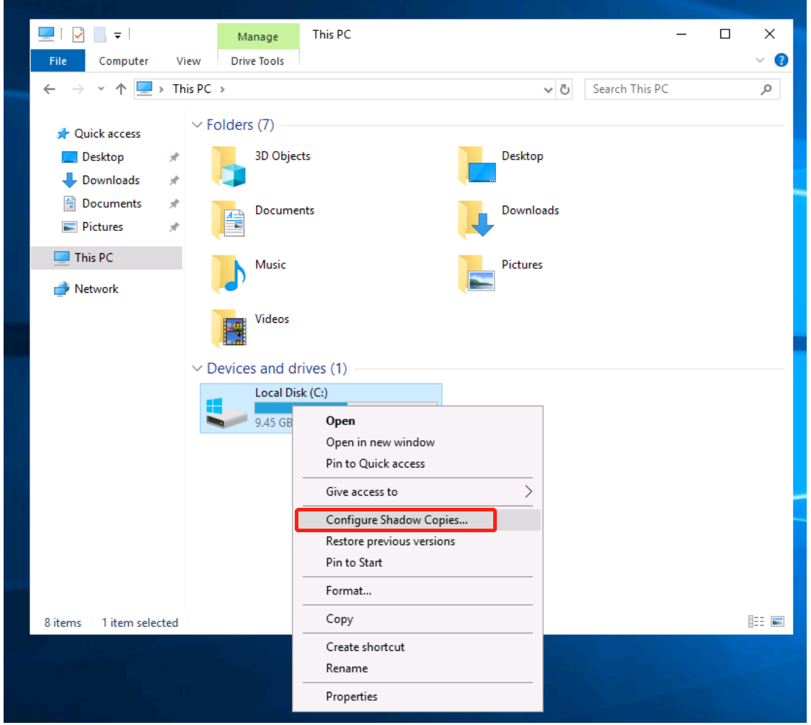<figcaption></figcaption></figure>

<figure>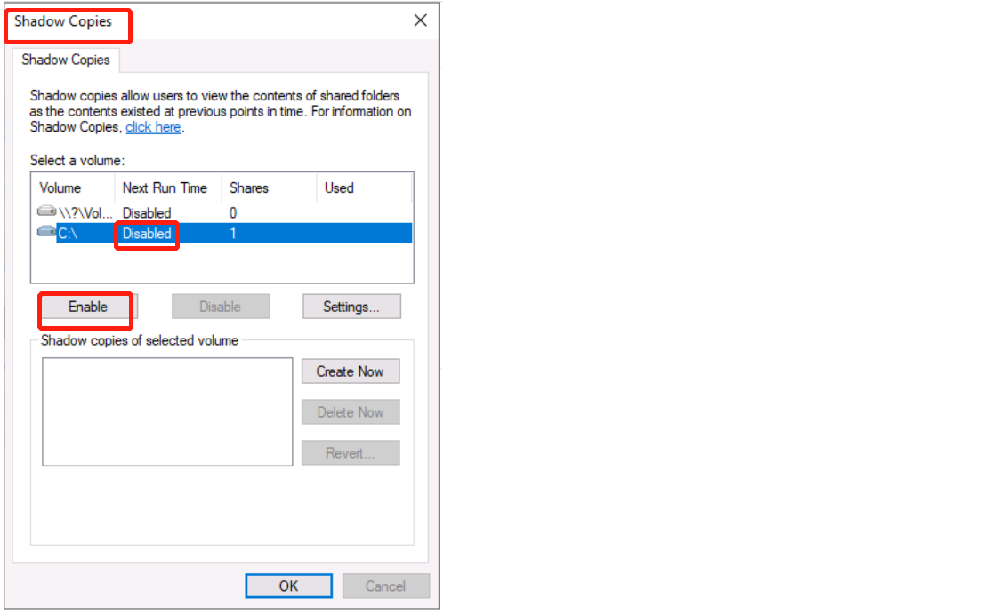<figcaption></figcaption></figure>

注意：选中系统卷（如c:\）并点击上图中的“Enable”，即可成功创建一个卷影副本。

<figure>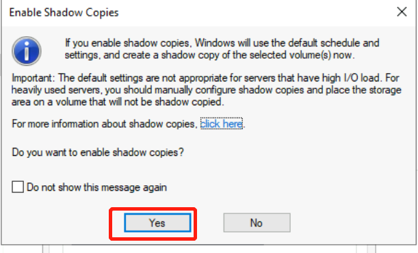<figcaption></figcaption></figure>

<figure>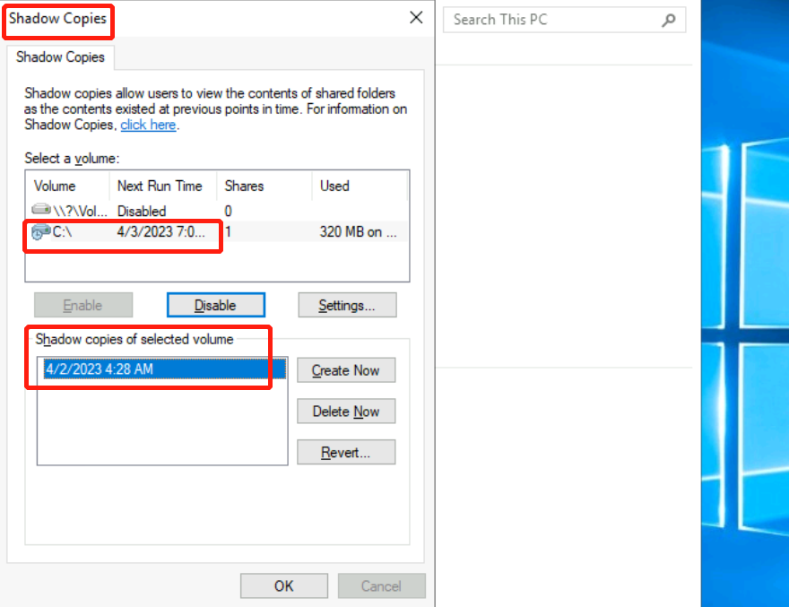<figcaption></figcaption></figure>

### **答题**

tips：阅读本小节内容，可回答以下问题。

<figure><figcaption></figcaption></figure>

## 小结

在本文中，我们介绍了几个内置的 Windows 安全工具，这些工具会随 Windows 操作系统一起被提供给用户，以帮助我们更好地保护计算机设备。

关于 Windows 操作系统，还有很多内容需要解释和涵盖。本文包括前两篇系列文章都只是对Windows操作系统进行了一些基础介绍，如果想了解有关 Windows 操作系统的更多信息，你还需要自己继续开展相关的学习。

延伸阅读材料：

* [Antimalware Scan Interface](https://docs.microsoft.com/en-us/windows/win32/amsi/antimalware-scan-interface-portal)
* [Credential Guard](https://docs.microsoft.com/en-us/windows/security/identity-protection/credential-guard/credential-guard-manage)
* [Windows 10 Hello](https://support.microsoft.com/en-us/windows/learn-about-windows-hello-and-set-it-up-dae28983-8242-bb2a-d3d1-87c9d265a5f0)
* [CSO Online - The best new Windows 10 security features](https://www.csoonline.com/article/3253899/the-best-new-windows-10-security-features.html)

**注意：**

攻击者可以使用内置的 Windows 工具和实用程序来完成进一步的攻击操作，这种方式能够试图让攻击者在受害者环境中不被轻易发现；此策略被称为 Living Off The Land（LotL策略），你可以参阅以下链接以了解更多相关信息。

LOLBAS：[https://lolbas-project.github.io/](https://lolbas-project.github.io/)
